# KH 정보교육원 훈련

## 0. 목차
**[1. 개요](#1-개요)**  
**[2. 교육 일정](#2-교육-일정)**  
**[3. 이클립스 기능](#3-이클립스-기능)**  
**[4. Java](#4-Java)**  
**[5. DB 명령어](#5-db-명령어)**  
**[6. 테이블 설계](#6-테이블-설계)**  
**[7. DB 연결 단계](#7-DB-연결-단계)**  
**[8. 사이트](#8-사이트)**  

<details>
<summary>교육 일정 상세보기</summary>
<div markdown="1">
	
| 1 | 2 | 3 | 4 | 5 | 6 | 7 | 8 | 9 | 10 |  
| :-----: | :-----: | :-----: | :-----: | :-----: | :-----: | :-----: | :-----: | :-----: | :-----: |  
| [2.1](#21-1일차2020-01-28) | [2.2](#22-2일차2020-01-29) | [2.3](#23-3일차2020-01-30) | [2.4](#24-4일차2020-01-31) | [2.5](#25-5일차2020-02-03) | [2.6](#26-6일차2020-02-04) | [2.7](#27-7일차2020-02-05) | [2.8](#28-8일차2020-02-06) | [2.9](#29-9일차2020-02-07) | [2.10](#210-10일차2020-02-10) |
| [2.11](#211-11일차2020-02-11) | [2.12](#212-12일차2020-02-12) | [2.13](#213-13일차2020-02-13) | [2.14](#214-14일차2020-02-14) | [2.15](#215-15일차2020-02-17) | [2.16](#216-16일차2020-02-18) | [2.17](#217-17일차2020-02-19) | [2.18](#218-18일차2020-02-20) | [2.19](#219-19일차2020-02-21) | [2.20](#220-20일차2020-02-24) |
| [2.21](#221-21일차2020-02-25) | [2.22](#222-22일차2020-03-09) | [2.23](#223-23일차2020-03-10) | [2.24](#224-24일차2020-03-11) | [2.25](#225-25일차2020-03-12) | [2.26](#226-26일차2020-03-13) | [2.27](#227-27일차2020-03-16) | [2.28](#228-28일차2020-03-17) | [2.29](#229-29일차2020-03-18) | [2.30](#230-30일차2020-03-19) |
| [2.31](#231-31일차2020-03-20) | [2.32](#232-32일차2020-03-23) | [2.33](#233-33일차2020-03-24) | [2.34](#234-34일차2020-03-25) | [2.35](#235-35일차2020-03-26) | [2.36](#236-36일차2020-03-27) | [2.37](#237-37일차2020-03-30) | [2.38](#238-38일차2020-03-31) | [2.39](#239-39일차2020-04-01) | [2.40](#240-40일차2020-04-02) |
| [2.41](#241-41일차2020-04-03) | [2.42](#242-42일차2020-04-06) | [2.43](#243-43일차2020-04-07) | [2.44](#244-44일차2020-04-08) | [2.45](#245-45일차2020-04-09) | [2.46](#246-46일차2020-04-10) | [2.47](#247-47일차2020-04-13) | [2.48](#248-48일차2020-04-14) | [2.49](#249-49일차2020-04-16) | [2.50](#250-50일차2020-04-17) |
| [2.51](#251-51일차2020-04-20) | [2.52](#252-52일차2020-04-21) | [2.53](#253-53일차2020-04-22) | [2.54](#254-54일차2020-04-23) | [2.55](#255-55일차2020-04-24) | [2.56](#256-56일차2020-04-27) | [2.57](#257-57일차2020-04-28) | [2.58](#258-58일차2020-04-29) | [2.59](#259-59일차2020-04-30) | [2.60](#260-60일차2020-05-01) |
| [2.61](#261-61일차2020-05-04) | [2.62](#262-62일차2020-05-06) | [2.63](#263-63일차2020-05-07) | [2.64](#264-64일차2020-05-08) | [2.65](#265-65일차2020-05-11) | [2.66](#265-65일차2020-05-11) | [2.67](#265-65일차2020-05-11) | [2.68](#265-65일차2020-05-11) | [2.69](#265-65일차2020-05-11) | [2.70](#265-65일차2020-05-11) |
| [2.71](#265-65일차2020-05-11) | [2.72](#265-65일차2020-05-11) | [2.73](#265-65일차2020-05-11) | [2.74](#265-65일차2020-05-11) | [2.75](#275-75일차2020-05-25) | [2.76](#276-76일차2020-05-26) | [2.77](#277-77일차2020-05-27) | [2.78](#278-78일차2020-05-28) | [2.79](#279-79일차2020-05-29) | [2.80](#280-80일차2020-06-01) |
| [2.81](#281-81일차2020-06-02) | [2.82](#282-82일차2020-06-03) | [2.83](#283-83일차2020-06-04) | [2.84](#284-84일차2020-06-05) | [2.85](#285-85일차2020-06-08) | [2.86](#286-86일차2020-06-09) | [2.87](#287-87일차2020-06-10) | [2.88](#288-88일차2020-06-11) | [2.89](#289-89일차2020-06-12) | [2.90](#290-90일차2020-06-15) |
| [2.91](#291-91일차2020-06-16) | [2.92](#292-92일차2020-06-17) | [2.93](#293-93일차2020-06-18) | [2.94](#294-94일차2020-06-19) | [2.95](#295-95일차2020-06-22) | [2.96](#296-96일차2020-06-23) | [2.97](#297-97일차2020-06-24) | [2.98](#297-97일차2020-06-24) | [2.99](#297-97일차2020-06-24) | [2.100](#297-97일차2020-06-24) |
| [2.101](#297-97일차2020-06-24) | [2.102](#297-97일차2020-06-24) | [2.103](#) | [2.104](#) | [2.105](#) | [2.106](#) | [2.107](#) | [2.108](#) | [2.109](#) | [2.110](#) |

</div>
</details>  

<details>
<summary>교육 내용 시작점 상세보기</summary>
<div markdown="1">

**[1. JAVA](#21-1일차2020-01-28)**  
**[2. DB](#220-20일차2020-02-24)**  
**[3. JDBC](#228-28일차2020-03-17)**  
**[4. HTML](#232-32일차2020-03-23)**  
**[5. CSS](#234-34일차2020-03-25)**  
**[6. javscript](#241-41일차2020-04-03)**  
**[7. jQuery](#245-45일차2020-04-09)**  
**[8. Server](#252-52일차2020-04-21)**  
**[9. UML](#264-64일차2020-05-08)**  
**[10. Framework](#275-75일차2020-05-25)**  

</div>
</details>  

## 1. 개요
- 이 문서는 KH 정보교육원 교육 중 만들어지는 문서들을 저장하기 위한 Repository입니다.
- 교육명은 「디바이스&웹 콘텐츠 융합 디지털 컨버전스 양성과정」입니다.
- 이번 교육의 Java 버전은 1.8.0_144입니다.
- 이번 교육에서 사용하는 ojdbc 버전은 ojdbc6입니다.
- 이번 교육에서 사용하는 jQuery 버전은 3.3.1입니다.
- 이번 교육에서 사용하는 Apache Tomcat 버전은 8입니다.
- 교육 내용
  1. 운영체제
  2. 프로그래밍 언어
  3. DB
  4. Front-End
  5. Server
  6. Framwork

## 2. 교육 일정

### 2.1 1일차(2020-01-28)
- 교육 오리엔테이션(학원 소개, 제한 사항, 자기 소개 등)
- 4차 산업이란
- 용량 단위(bit, byte, Kbyte 등)
- 2진수, 8진수, 10진수, 16진수
- ASCII 코드, 유니코드
- 프로그램이란?
- JAVA의 특징 및 설치, 테스트 프로그램
- 제작 프로그램 
  - Java : firstProject

### 2.2 2일차(2020-01-29)
- 표기법
  - 카멜 표기법 : 낙타의 혹이 튀어 나온것처럼 소문자로 시작하여 단어와 단어가 만날 때 뒷 단어의 첫글자를 대문자로 작성하는 방식  
  ex) phoneNumber
  - 파스칼 표기법 : 카멜 표기법과 유사하지만 첫 글자까지 대문자로 작성  
  ex) PhoneNumber
  - 프로젝트명, 변수, 메소드 : 카멜 표기법
  - 패키지명 : 모두 소문자
  - 클래스명 : 파스칼 표기법
- 들여쓰기
  - GUN
    - 블록을 아래에서 들여쓰기 해서 작성
    - 블록의 표시가 분명하여 구조가 절 보임
    - 들여쓰기를 많이 해서 수평으로 많은 코드 작성 불가
  - K&R
    - 여는 블록을 같은 행에 배치
    - 코드 줄 수를 절약하여 한눈에 많은 코드를 볼 수 있고 수평으로 많은 코드 작성 가능
    - 일반적으로 가장 많이 사용됨
  - BSD
    - GUN의 블록표시가 분명한 장점과 K&R의 수평으로 많은 코드를 작성가능한 장점을 가져와 결합한 배치
- 주석
  - 컴파일 시 소스코드를 분석하지 않는 부분
  - 소스 코드의 내용을 설명하기 위한 문구를 넣을 때 사용
  - 한 줄 주석(//)
  - 범위 주석(/**/)
- 실행 클래스와 기능제공 클래스
  - 실행 클래스
    - 메인 메소드(실행 메소드)를 가지고 있는 클래스
    - 메인 메소드가 프로젝트당 1개이기 때문에 실행클래스도 프로젝트당 1개 존재
    - 실행 클래스의 메인 메소드에서는 기능제공 클래스에 작성한 기능을 실행하는 용도로만 사용하며, 기능을 구현하지 않는다.
  - 기능제공 클래스
    - 실제 기능이 구현되어 있는 메소드를 가지고있는 클래스
    - 기능용 메소드는 제한이 없기 때문에 여러 개의 클래스 및 메소드를 작성해도 상관없음
    - 일반적으로 비슷한 기능들을 하나의 기능제공 클래스로 작성
    - 유사한 기능제공 클래스들은 같은 패키지 내부 존재
- 자료형
  - 기본형(Primitive Type)
    - 실제 데이터(값)를 저장
    - 논리형, 문자형, 정수형, 실수형으로 나눠지고, 8개의 자료형이 있음
    - 각 자료형별 데이터의 저장 크기가 다름
    - 종류
      1. 정수 : byte, short, int(기본형), long(초기화 시 뒤에 L을 붙인다)
      2. 실수 : float(초기화 때 뒤에 f를 붙인다), double(기본형)
      3. 문자 : char
      4. 논리형 : boolean
  - 참조형(Reference Type)
    - 데이터가 저장되어 있는 주소를 저장(객체의 주소)
    - 기본형을 제외한 나머지, 사용자 정의 자료형
    - 주소값만 저장하기 때문에 4byte로 저장크기가 일정함
    - 종류
      1. 문자열 : String
      2. 사용자 정의 클래스 타입
      3. 배열
- 변수
  - 정의
    - 메모리 공간(RAM)에 한 개의 값을 기록하기 위한 장소(공간)
  - 변수의 선언
    - 메모리 공간(RAM)에 데이터를 저장할 수 있는 공간을 할당하는 것
    - (저장할 데이터 타입) (변수명);  
    ex) int number;
  - 변수 명명규칙
    1. 대소문자가 구분되며 길이제한이 없다.
    2. 예약어를 사용하면 안된다.
    3. 숫자로 시작하면 안된다.
    4. 특수문자는 '_'와 '$'만을 허용한다.
    5. 카멜 표기법을 사용한다.
    6. 한글입력이 가능하지만 사용을 지양한다.
    7. 의미있는 변수명을 사용하는 것을 권고한다.
- 상수
  - 정의
    - 수학에서 변하지 않는 값, 프로그래밍에서는 한번만 저장할 수 있는 공간으로 다른 변수와의 차이점은 초기화 이후 다른 값을 대입할 수 없음.
  - 상수 선언
    - final double PI = 3.14
    - final : 해당 변수가 상수임을 선언하기 위한 시스템 예약어
    - PI : 변수명은 카멜표기법을 사용하는 것을 규약으로 하지만 상수형 변수는 모두 대문자로 표기한다.
- 형번환
  - 묵시적(자동) 형변환(Promotion)
  - 명시적(강제) 형변환(Casting)
  - 형변환이 필요한 경우
    - 데이터 크기가 작은 자료형에서 큰 자료형으로 바뀔 때는 문제가 없지만 큰 자료형에서 작은 자료형으로 바뀔 때는 에러가 생김.
    - 자바에서 사용하는 정수형 기본 자료형이 int이므로 byte, short로만 연산하게 되면 모두 int로 변환하여 연산하고 int로 반환을 하게 됨.
    - 이 때 결과 값을 byte나 short로 처리하기 위해서는 강제로 형변환을 해줘야 함.
- 입·출력 메소드
  - 출력 메소드
    - System.out.println() : 줄 바꿈 출력.
    - System.out.print() : 줄 바꿈 없는 출력.
    - System.out.printf() : C언어와 마찬가지로 정해져있는 형식에 맞춰서 그 형식에 맞는 값(변수)를 줄바꿈 하지 않고 출력.
  - 입력 메소드
    - Scanner Class를 사용하여 입력.
    - Scanner sc = new Scanner(System.in);
      1. 정수형 : sc.nextByte(), sc.nextShort(), sc.nextInt(), sc.nextLong()
      2. 실수형 : sc.nextFloat(), sc.nextDouble()
      3. 문자열 : sc.next(), sc.nextLine()
      4. 문자 : sc.next().charAt(0), sc.nextLine().charAt(0)
- 제작 프로그램
  - Java : testPjt, printInfomationPjt, shoppingPjt, variable, printQue1, printQue2, printScanQue1, printScanQue2, printScanQue3

### 2.3 3일차(2020-01-30)
- 연산자
  - 연산자 종류 및 우선순위
    - 1순위 : (), [], ., ->
    - 2순위 : 증감(++, --), 부호(+, -), 비트반전(~), 논리부정(!), (자료형)
      - 증감 연산자 
        1. 전위 연산과 후위 연산의 차이
        2. Java에서 연산은 앞에 2개만 먼저 계산을 하기에 앞쪽에 증감 연산자가 후위에 있더라도 앞에 2개가 계산이 끝나면 증감 연산자가 계산이 됨.   
        ex) a = 10, b = 10, c = (a++) + (++b) + a이면 c는 32
      - 비트반전
        1. 각 비트에서 0을 1로, 1을 0으로 반전한다.  
        ex) 1011 -> 0100
    - 3순위 : 산술 연산자(*, /, %)
    - 4순위 : 산술 연산자(+, -)
    - 5순위 : 시프트(>>, <<, >>>)
      - 왼쪽 시프트 연산(<<) : 1칸 옮길 때 마다 2배로 늘어남.  
      ex) 1011 << 1 = 10110 => 11 -> 22
      - 오른쪽 시프트 연산(>>) : 1칸 옮길 때 마다 반으로 줄어듬. 가장 오른쪽 비트는 버림.  
      ex) 1010 >> 1 = 0101 => 10 -> 5
    - 6순위 : 관계(>, <, >=, <=, instanceof : 클래스 동일 여부)
    - 7순위 : 관계(==, !=)
    - 8순위 : 비트논리 AND(&)
    - 9순위 : 비트논리 XOR(^)
      - 영어 소문자 <-> 대문자 변환이 편함.  
      ex) a ^ 32 = A, A ^ 32 = a
    - 10순위 : 비트논리 OR(|)
    - 11순위 : 일반논리(&&)
    - 12순위 : 일반논리(||)
    - 13순위 : 삼항((조건문) ? (true문) : (false문)) - if문
      - if문을 단축하여 사용 가능함.  
      ex) result = a<b ? a : b => a가 b보다 작으면 조건문이 true이므로 result에 a가 들어가고, a가 b보다 크면 조건문이 false이므로 result에 들어가게 된다.
    - 14순위 : 대입(=, +=, -=, *=, /=, %=, ^=, |=, <<=, >>=, >>>=) - 연산 속도가 빨라짐
- 제어문
  - 조건문
    - 조건에 따라서 수행되는 코드가 달라지는 구문
    - 조건문의 종류
      1. if
      2. switch
- 제작 프로그램
  - Java : operatorTest, operatorQue1, operatorQue2, ifTest, switchTest, switchQue1

### 2.4 4일차(2020-01-31)
- 제어문
  - 반복문
    - 반복문의 종류
      1. for
          - 가장 보편적인 반복문으로 가독성이 높고, 초기, 조건, 증감문을 한번에 선언해서 사용
      2. while
          - 특정 조건이 만족되는 동안 명령을 계속해서 반복적으로 수행함
          - for문과 다르게 초기식을 미리 작성하고, 증감문도 실행코드 내부에 직접 작성해야 함
      3. do~while
          - while문과 유사하지만 조건문이 뒤에 위치하기 때문에 조건문에 맞지 않더라도 1번은 무조건 실행
    - 무한 루프
      1. for(;;) { 실행문 }
      2. while(true) { 실행문 }
  - 분기문
    - 분기문의 종류
      1. break
          - 반복문을 빠져 나가는 구문
          - 반복문 수행 중 break;구문을 만나는 경우 곧장 반복문을 빠져 나옴
      2. continue
          - 반복문 수행 중 continue;를 만나는 경우 아래를 실행하지 않고 반복문을 다시 실행
          - for문의 경우 증감식으로 이동
- 제작 프로그램
  - Java : loopTest, loopQue1, loopQue2, loopQue3

### 2.5 5일차(2020-02-03)
- 난수
  - 임의의 값, 무작위로 만들어지는 알 수 없는 값
  - Random rand = new Random(); rand.nextInt();로 사용 가능
  - rand.nextInt(10);으로 0~9 범위의 숫자를 랜덤으로 추출 가능
- 제작 프로그램
  - Java : randomPjt, randomQue

### 2.6 6일차(2020-02-04)
- 배열
  - 정의
    - 동일한 자료형을 가지는 변수들의 집합
  - 사용 방법
    - 자료형[] 변수명 => int[] arr;
    - 자료형 변수명[] => int arr[];
  - 배열의 할당
    - 변수명 = new 자료형[저장할 데이터 개수]; => arr = new int[5]; : 정수 5개를 저장할 수 있는 배열
  - 배열의 초기화
    - 배열을 선언 후 할당하게 되면 각 자료형 별 기본값이 들어감.
    - 숫자형 변수는 0, boolean은 false, char는 ' '
    - 선언과 동시에 값을 기록할 수 있음
      1. int[] arr = {1, 2, 3, 4, 5}; : 길이가 5인 정수형 배열을 생성하면서 각 인덱스에 1, 2, 3, 4, 5 순서대로 저장
      2. String[] arr = {"hi", "hello", "bye"}; : 길이가 3인 문자열 배열을 생성하면서 각 인덱스에 "hi", "hello", "bye"를 순서대로 저장
    - 기본형 변수 8개에 대해서는 자동으로 초기화가 가능하지만 참조형 변수는 자동 초기화가 불가능함
  - 배열의 복사
    1. 얕은 복사
        - 객체의 주소 값만 가져와 참조형 변수에 저장하고 하나의 객체를 두 변수가 참조하고 있는 것  
          ex)   
          int arr1[] = new int[4];  
          int arr2[] = arr1;
    2. 깊은 복사
        - 다른 객체를 생성하여 새로운 객체에 데이터 내용을 복사하는 것
        - 복사 방법
          1. for문을 이용한 깊은 복사
          2. System.arraycopy를 이용한 깊은 복사
          3. clone을 이용한 깊은 복사
- 참조형 변수의 주소값 확인
  - hashcode() 메소드 사용
- 제작 프로그램
  - Java : arrayPjt, arrayQue1, arrayQue2, arrayQue3, arrayQue4, arrayQue5

### 2.7 7일차(2020-02-05)
- 이차원 배열
  - 1차원 배열 안에 다른 배열을 넣는 것
  - 배열은 저장된 값마다  인덱스 번호 두개로 설정되고 앞번호는 행, 뒷번호는 열
  - 선언 방법
    - 자료형[][] 변수명 => int[][] arr;
    - 자료형 변수명[][] => int arr[][];
  - 배열의 할당
    - 변수명 = new 자료형[행의 크기][열의 크기]; => arr = new int[5][6]; : 5X6의 2차원 배열 할당
  - 사용법  
    int arr[][] = new int[5][4];  
    arr.length; => 행의 크기 : 5  
    arr[i].length; => 열의 크기 : 4  
- 제작 프로그램
  - Java : arrayQue6, kakaoQue

### 2.8 8일차(2020-02-06)
- 메소드
  - 정의
    - 수학의 함수와 비슷하며 호출을 통해 사용
    - 타언어에서 함수와 동일한 기능
    - 메소드 호출 시 전달 값이 있거나 없을 수 있으며, 호출하게 되면 내부에 작성된 연산을 수행하게 되며, 연산 후 결과값은 있거나 없을 수 있다.
  - 메소드의 형태
    ```
    [접근제어 지시자] 반환형 메소드명 (매개변수) {  
    　　실행코드;  
    }  
    ```
    ex) public void exam() {}
  - 접근제어 지시자  
  
  |구분|해당 클래스 내부|같은 패키지|후손 클래스|전체(프로젝트 단위)|
  | :-----: | :-----: | :-----: | :-----: | :-----: |
  |public|O|O|O|O|
  |protected|O|O|O|X|
  |default|O|O|X|X|
  |private|O|X|X|X|

  - 반환형
    1. void : 반환 값이 없을 경우
    2. 기본자료형 : 반환 값이 8가지 기본 자료형일 경우
    3. 참조자료형 : 반환 값이 참조형 자료형일 경우(String, 사용자 정의)
    4. 배열 : 기본형 배열, 참조형 배열 모두 가능
  - 메소드의 매개변수
    1. () : 매개변수가 없는 것을 의미함
    2. 기본자료형 : 기본형 매개변수 사용 시 값을 복사하여 전달. 메소드에서 해당 값을 변경해도 원래 값은 변경 X => call by value
    3. 참조자료형, 배열 : 참조자료형, 배열을 매개변수로 전달 시에는 데이터의 주소값이 전달. 메소드에서 해당 값을 변경하면 원래 값도 같이 변경 => call by reference
  - 메소드의 오버로딩
    1. 매개변수의 갯수가 다른 메소드는 동일한 이름으로 선언 가능.
    2. 서로 다른 타입의 매개변수로 가진 메소드는 동일한 이름으로 선언 가능.
    3. 매개변수가 동일한 타입이라면 리턴 타입이 다르더라도 동일한 이름으로 선언 불가능.
- 객체지향 프로그래밍
  - 객체지향 언어
    - 현실 세계는 사물이나 개념처럼 독립되고 구분되는 각각의 객체로 이루어져 있으며, 발생하는 모든 사건들은 객체 간의 상호 작용으로 이루어지며, 이 개념을 컴퓨터로 옮겨 놓아 만들어낸 것
- 객체
  - 사전적 의미 : 실체하는 모든 사물
  - 객체지향 언어에서 객체의 개념은 new 연산자를 통해 클래스의 설계대로 데이터를 메모리에 할당한 결과물(instance)
  - 클래스
    - 객체를 정의해 놓은 것. 객체의 설계도, 틀
    - 사물이나 개념의 공통 요소(속성-변수-, 기능-메소드-)를 용도에 맞게 추상화
  - 추상화
    - 사전적 의미 : 구체적 사물들의 공통된 특징
    - 프로그램에서 필요한 기능/속성을 추출하고, 불필요한 것을 제거하는 과정
- 변수의 종류
  1. 지역변수
      - 해당 지역(메소드)에서만 사용 가능한 변수
  2. 전역변수(멤버변수, 인스턴스변수)
      - 해당 클래스 내부에서만 사용이 가능한 변수
      - 객체 생성 시 해당 객체에서만 사용이 가능
      - 값이 자동으로 초기화 됨
  3. 정적변수(클래스 변수)
      - 클래스와 관계없이 사용 가능한 변수
      - static 키워드를 이용해서 선언
- 제작 프로그램
  - Java : methodPjt, OOP, animalAdoption

### 2.9 9일차(2020-02-07)
- 객체지향 3대 원칙
  1. 캡슐화
  2. 상속
  3. 다형성
- 캡슐화
  - 추상화를 통해 정의된 데이터들과 기능을 하나로 묶어 관리하는 기법
  - 클래스의 가장 중요한 목적인 데이터의 접근제한을 원칙으로 하여, 클래스 외부에서 데이터의 직접 접근을 막고, 대신 데이터를 처리하는 함수(메소드)들을 클래스 내부에 작성하여 데이터에 접근하는 방식(getter, setter)
- 생성자
  - 클래스 작성 시 생성자를 작성하지 않는 경우 JVM이 기본 생성자를 자동으로 생성
  - 매개변수가 있는 생성자를 작성하는 경우 JVM이 기본 생성자를 자동으로 생성하지 않음
  - 메소드 오버로딩을 이용하여 여러 개의 생성자 사용 가능
  - 일반적으로 기본생성자, 모든 멤버 변수를 초기화 하는 매개변수가 있는 생성자를 작성하고, 필요에 따라서 추가로 생성자를 작성.
- 소멸자
  - 생성자와 반대로 객체가 소멸할 때 자동으로 호출되는 메소드
  - 타언어에 존재하지만 자바는 언어 특성상 소멸자가 존재하지 않음
- 객체의 할당
  - new 생성자();를 사용하여 객체를 생성하면 heap 메모리 공간에 서로 다른 자료형의 데이터가 연속으로 나열 할당된 객체공간이 만들어지는데 이를 인스턴스라고 한다.
- 클래스 분류
  - 종류
    1. 데이터가 되는 클래스  
      ex) Entity, VO, DTO, Ean Class
    2. 데이터를 운영하는 클래스
      ex) Control Class
- 데이터의 CRUD
  - Create
  - Read
  - Update
  - Delete
  - 데이터의 생성, 읽기, 갱신, 삭제
- 제작 프로그램
  - Java : studnetMgr1, OOP(추가), studnetMgr2

### 2.10 10일차(2020-02-10)
- 상속
  - 정의
    - 다른 클래스가 가지고 있는 멤버(변수와 메소드)들을 새로 작성할 클래스에서 직접 만들지 않고, 상속받음으로써 새 클래스가 자신의 멤버처럼 사용할 수 있는 기능
  - 상속의 목적
    - 클래스의 재사용
    - 연관된 일련 클래스들에 대해 공통적인 규약을 정의
  - 상속의 장점
    - 보다 적은 양의 코드로 새로은 클래스를 작성 가능
    - 코드를 공통적으로 관리하기 때문에 코드의 추가 및 변경 용이
    - 코드 중복을 제거하여 프로그램의 생산성과 유지보수에 크게 기여
  - 상속 방법
    - 클래스간 상속식 extends 키워드 사용
    - [접근제어지시지] class 클래스명B extends 클래스명A {}
  - 단일상속(Single inheritance)
    - 클래스 작성시 한 개 의 클래스만 상속하는 것
    - 명확하고 신뢰성 있는 코드 작성가능
    - 자바에서는 단일상속만 가능(다중상속 지원X)
  - 다중상속(Multiple inheritance)
    - 클래스 작성 시 여러 클래스로부터 상속을 받는것
    - 복합적인 기능을 가진 클래스를 쉽게 작성 가능
    - 서로 다른 클래스로 상속받는 멤버간의 이름이 같을 경우 문제가 생김
  - 상속의 특징
      1. 부모 클래스의 생성자는 상속 안됨  
        - 자식클래스 객체 생성 시, 부모클래스 생성자가 먼저 실행(자동)  
        - 자식클래스 생성자 안에서 부모클래스 생성자 호출을 명시하기 위해서는 super() 활용  
      2. 부모의 private 멤버는 상속은 되지만 직접 접근 불가  
        - 접근제어지시자 private는 해당 클래스에서만 접근이 가능하므로, 자식클래스에서도 변수에 접근이 불가능  
        - private변수의 초기화는 super()를 이용하여 부모생성자를 통해진행  
        - getter, setter 메소드를 이용하여서 접근 가능  
      3. 모든 클래스는 Object클래스의 후손  
        - 클래스 작성 시 아무 클래스도 상속하지 않으면 자동으로 Object클래스를 상속함  
        - 다른 클래스를 상속했더라도 이미 부모클래스가 Object클래스를 상속했기 때문에 모든 클래스는 Object클래스의 후손  
  - super()
    - 부모 객체의 생성자를 호출하는 메소드
    - 자식 객체의 생성자에는 자동으로 부모객체 생성자를 호출하는 코드가 포함되어 있으며, 이를 명시적으로 표현할 때 사용
    - 자식 객체의 생성자보다 먼저 실행되야 하기 때문에 자식객체 생성자의 가장 첫 줄에만 사용이 가능
    - 매개변수가 있는 부모생성자를 호출하는 경우 super(매개변수)를 이용 
  - 오버라이딩(overriding)
    - 자식 클래스가 상속받은 부모 메소드를 재작성하는 것
    - 부모가 제공하는 기능을 후손이 일부 고쳐서 사용하겠다는 의미
    - 자식 객체를 통해 실행 시 후손의 것이 우선권을 가짐(동적 바인딩)
  - Annotation
    - 자바 컴파일러에게 알리는 주석문
    - @Override -> 컴파일러에게 미리 이 메소드는 오버라이딩하는 것을 알려줌.
    - @Override를 붙이면 메소드를 잘못 입력하면 상위 클래스에 해당 메소드가 없다면 에러를 출력해줌.
  - 오버라이딩 성립 조건
    1. 메소드의 이름이 동일해야 한다.
    2. 매개변수의 개수와 타입이 동일해야 한다.
    3. 리턴 타입이 동일해야 한다.
    4. private 메소드의 오버라이딩이 불가능하다.
    5. 접근제어 지시자는 수정이 가능하지만 부모의 것보다 같거나 넓은 범위로 가능하다.
- 제작 프로그램
  - Java : pointManager1, pointManager2, pointManager3

### 2.11 11일차(2020-02-11)
- 다형성(polymorphism)
  - 정의
    - 여러 개의 형태를 갖는다는 의미로, 객체지향 프로그래밍 3대 특징 중 하나
    - 상속을 이용한 기술로, 자식객체를 부모클래스 타입의 변수로 다룰 수 있는 기술  
      ex) TV 클래스를 상속한 LGTV와 SamsungTV가 있는 경우 TV tv = new LGTV()와 같이 부모 클래스로 다룰 수 있음.
  - 클래스 형변환 - up casting
    - 부모 타입의 참조형 변수로 자식타입의 객체 주소를 받은 경우 해당 객체는 원래 부모타입의 멤버(변수, 메소드)만 참조가 가능  
      ex) TV tv = new LGTV();  
      - 이 경우 LGTV에 추가적인 메소드와 변수가 있더라도 tv 참조형 변수는 TV 타입의 변수이기때문에 LGTV에 추가로 작성된 메소드와 변수는 사용할 수 없고 TV객체에 있는 변수와 메소드만 사용이 가능함
  - 클래스 형변환 - down casting
    - 자식객체의 주소를 받은 부모 참조형 변수를 가지고 자식객체에만 존재하는 멤버를 참조해야 하는 경우, 자식클래스 타입으로 참조형 변수를 형변환 해야함.
    - 이러한 형변환을 down casting이라고 하며, 자동으로 처리되지 않기 때문에 명시적으로 형변환해야 함  
      ex) TV tv = new LGTV();  ((LGTV)tv).lgFunc();
- 추상 클래스
  - 정의
    - 몸체가 없는 메소드(추상 메소드)를 포함한 클래스 -> 메소드는 존재하지만 작동을 하지 않음.
    - 추상 클래스일 경우 선언부에 abstract 키워드를 사용
  - 추상 메소드
    - 몸체({})가 없는 메소드
    - 메소드의 선언부만 있고 실행코드가 없는 메소드
    - 추상클래스를 상속한 경우 반드시 구현해야하는 메소드(오버라이딩 강제화)
  - 추상 클래스는 객체의 생성이 불가능.
  - 추상 클래스의 특징
    1. 미완성 클래스(abstract 키워드 사용)로 자체적으로 객체 생성 불가 -> 반드시 상속하여 객체를 생성
    2. abstract 메소드가 포함된 클래스 -> 반드시 abstract 클래스. 단, abstract 메소드가 없어도 abstract 클래스 선언이 가능(객체 생성 방지용)
    3. abstract 메소드 외에 일반 메소드와 변수를 포함할 수 있음
    4. 객체 생성은 안되나 참조형 변수 type으로는 사용 가능(다형성으로는 가능)
- 인터페이스
  - 상수와 abstract 메소드만으로 이루어진 추상클래스의 변형체
  - 메소드의 통일성을 부여하기 위해서 abstract 메소드만 따로 모아놓은 것으로, 상속시 인터페이스에 정의된 모든 메소드를 구현해야 함  
    ex) [접근제어 지시자] interface 인터페이스명{}
  - 추상 클래스와 다르게 모든 메소드가 abstract 메소드이므로 abstract 생략 가능
  - 인터페이스의 특징
    - 인터페이스의 모든 메소드는 묵시적으로 public이고 abstract이다.
    - 변수는 public static final이다.
    - 객체 생성은 안되나, 참조형 변수로는 가능하다.(다형성으로는 가능)
  - 인터페이스의 장점
    - 상위타입의 역할로 다형성을 지원하여 연결해주는 역할 수행
    - 해당 객체가 다양한 기능을 제공시에도 인터페이스에만 해당하는 기능만을 사용하도록 제한 가능
    - 공통 기능상의 일관성 제공/공동 작업을 위한 가이드라인 제공
    
  | 구분 | 인터페이스 | 추상 클래스 |
  | :-----: | :-----: | :-----: |
  | 상속 | 다중상속 | 단일상속 |
  | 구현 | implements 사용 | extends 사용 |
  | 추상 메소드 | 모든 메소드 | 추상 메소드 0개 이상 |
  | abstract | 묵시적으로 abstract | 명시적으로 사용 |
  | 객체 | 객체 생성불가 | 객체 생성불가 |

- 제작 프로그램
  - Java : poly, pointManager4, abstractAndInterface, convenience

### 2.12 12일차(2020-02-12)
- Object
  - 정의
    - 자바에서 상속은 필수
    - 아무것도 상속하지 않더라도 암묵적으로 Object 클래스를 상속
    - 결국 모든 클래스는 Object 클래스의 후손 클래스
    - 아무 내용 없이 클래스를 만든 후 객체를 생성해보면, 작성한 적 없는 메소드들이 있는 것이 확인 가능
    - 작성한 적 없는 메소드들은 모두 Object 클래스의 메소드로 기본상속
    - 클래스가 공통적으로 포함하고 있어야 하는 기능을 포함
  - 주요 메소드
    - toString()  
      ex) kh.java.test.Test1@7852e922  
        1. kh.java.test. : 패키지 이름
        2. Test1 : 클래스명
        3. 7852e922 : 인스턴스 식별 값
    - clone()
      - 객체 자체를 복사하여 다른 객체에 사용할 때 사용하는 메소드
      - clone() 메소드의 접근제어 지시자는 protected이므로 다른 패키지에서는 사용 불가
      - 작성한 클래스에서 clone() 메소드를 사용하기 위해서는 overriding이 필요함
		  - 기존의 clone() 메소드는 protected이기 때문에 바로 사용 불가, 생성한 클래스에서 clone() 메소드의 Override가 필요함.
		  - 리턴 타입이 Object인 clone() 메소드는 Override한 클래스가 자식 클래스이기에 부모 클래스인 Object를 받을 수 없기에 명시적 형변환이 필요함.(down-casting)  
        ex) Test t2 = (Test)t1.clone();
      - Cloneable 인터페이스의 구현이 필요
    - equeals()
      - 두 객체 사이의 내부 값을 비교할 때 사용
- API(Application Programming Interface)
  - 정의
    - 프로그래밍을 할 때 어떠한 특정 기능을 처리할 수 있도록 만들어 놓은 클래스나 메소드의 집합
  - JAVA API
    - 자바 언어를 사용하여 기능 구현을 할 수 있도록 미리 여러가지 기능을 정의해 놓은 API
- String 관련 API
  - String 클래스
    - 문자열 값을 수정 못하는 immutable(불변) 성질을 가짐
    - 수정시 수정된 문자열이 새로 할당되어 새 주소를 저장
    - 문자열을 자주 수정하는 경우 메모리 낭비가 심함
  - StringBuffer 클래스
    - 문자열 값을 수정할 수 있는 mutable(가변) 성질을 가짐
    - 수정시 수정된 기존 문자열이 수정
    - 문자열을 자주 수정하는 경우 String보다 유용
    - Thread Safe 기능 제공(성능저하 요인) : 작업이 진행중인 경우 다른 작업이 들어오면 그 접근을 막아줌
    - 메소드
      - stringBuffer.append(문자열) => 문자열을 버퍼의 끝에 추가
      - stringBuffer.insert(정수, 문자열) => 정수 자리에 문자열 삽입
      - stringBuffer.replace(정수1, 정수2, 문자열) => 정수1부터 정수2 앞까지 문자열로 대체
      - stringBuffer.reverse() => 버퍼를 거꾸로
      - stringBuffer.delete(정수1, 정수2) => 정수1부터 정수2 앞까지 삭제
      - stringBuffer.capacity() => 실제 크기를 출력
  - StringBuilder 클래스
    - StringBuffer 클래스와 동일하지만, Thread Safe 기능이 제공되지 않음
  - StringTokenizer 클래스
    - 문자열을 분석하여 토큰으로 분리시켜주는 기능의 클래스
    - 메소드
      - stringTokenizer(문자열1, 문자열2) : 문자열1을 문자열2를 기준으로 자르는 생성자
      - stirngTokenizer.countTokens() : 남아 있는 토큰의 개수를 출력
      - stringTokenizer.nextToken() : 토큰을 가져옴. countTokens를 호출하면 1이 감소 됨
      - stringTokenizer.hasMoreTokens() : 남아있는 토큰이 있는지 확인(true/false)
- Math 클래스
  - Math 클래스의 메소드는 객체를 선언하지 않고 바로 Math 클래스에서 호출 가능.
  - 메소드
    - Math.abs(num) : 절대값 출력
    - Math.ceil(num) : 소수점 아래 올림
    - Math.floor(num) : 소수점 아래 내림
    - Math.round(num) : 소수점 아래 반올림
    - Math.random() : 0.0 ~ 1.0 범위의 임의의 값 추출
    - Math.max(num1, num2) : 두 수를 비교 후 큰 값 리턴
    - Math.min(num1, num2) : 두 수를 비교 후 작은 값 리턴
    - Math.pow(num1, num2) : num1의 값을 num2번 거듭 제곱
- 시간관련 클래스
  - Calendar 클래스
    - 현재 시간과 관련 있는 클래스
    - Calendar 클래스는 추상클래스로, 생성자의 접근제어 지시자가 protected로 new 생성자()를 통해 객체를 생성할 수 없고, getInstance() 메소드를 이용하여 객체를 생성
    - Calendar.getInstance() 메소드는 GregorianCalendar 객체 생성
    - Calendar 클래스의 출력들은 모두 객체가 만들어지는 시간을 기준으로 만들어진다. 시간이 지난 후 출력을 하면 모두 객체를 만들었던 시간이 출력 된다.
    - 메소드
      - calendar.get(Calendar.YEAR) : 연도 출력
      - calendar.get(Calendar.MONTH) : 월 출력(0월부터 출력한다)
      - calendar.get(Calendar.DATE) : 일 출력
      - calendar.get(Calendar.AM_PM) : 오전 오후 출력(오전 : 0, 오후 : 1)
      - calendar.get(Calendar.HOUR) : 시 출력
      - calendar.get(Calendar.MINUTE) : 분 출력
      - calendar.get(Calendar.SECOND) : 초 출력
      - calendar.get(Calendar.DAY_OF_WEEK) : 일주일의 몇번째 요일인지 출력(1 : 일요일, 7 : 토요일)
      - calendar.set(Calendar.YEAR, 2050) : set 메소드를 통해 날짜를 편집하여 사용 가능
      - calendar.getTimeInMillis() : 현재 시간, 기준점 : 1970년 1월 1일 9시 0분 00초부터 지금까지 지난 시간을 ms단위로 계산
- 제작 프로그램 
  - Java : ObjectTest, APIPjt

### 2.13 13일차(2020-02-13)
- Date 클래스
  - 정의
    - Java.util의 Date 클래스
    - 시스템으로부터 현재 날짜, 시간정보를 가져와서 다룰 수 있게 만들어진 클래스로, 생성자 2개만 사용 가능하고 나머지는 deprecated(삭제 예정)
    - Calendar 또는 GregorianCalendar 클래스 사용을 권장
  - 생성자
    - new Date() : 현재 시간을 기준으로 날짜를 나타내는 생성자
    - new Date(long num) : num을 기준으로 날짜를 나타내는 생성자
- SimpleDateFormat 클래스
  - 보기 힘든 Date 클래스를 쉽게 보기 위해 원하는 format으로 출력 방법을 바꿔주는 클래스
  - 생성자
    - new SimpleDateFormat(String str) : str로 데이터 형식을 바꿔주게 하는 생성자
  - 메소드
    - simple.format(Date date) : date 클래스의 시간을 생성자에서 선언한 방식으로 문자열을 리턴함
- Wrapper Class
  - 정의
    - 기본 자료형을 객체화 해주는 클래스
    - 기본 자료형 데이터를 포장하여 표현하기 때문에 Wrapper라고 부름
    - 객체지향 프로그래밍의 경우 기본 자료형을 객체로 처리해야 하는 상황이 존재하는데 그러한 상황에서 사용하는 클래스  
  
  | 기본 자료형 | Wrapper Class | Wrapper Class로 기본자료형 변환 |  
  | :-----: | :-----: | :-----: |  
  | boolean | Boolean | Boolean wb = new Boolean(true) |  
  | char | Character | Character wc = new Character('A') |  
  | byte | Byte | Byte wb = new Byte((byte)1) |  
  | short | Short | Short ws = new Short((short)2) |  
  | int | Integer | Integer wi = new Integer(4) |  
  | long | Long | Long wl = new Long(8) |  
  | float | Float | Float wf = new Float(0.5f) |  
  | double | Double | Double wd = new Double(0.77) |  
  
  - Integer 클래스
    - 기본 자료형인 int에 매칭되는 클래스
    - 메소드
      - Integer.parsInt(str) : 문자열을 숫자로 변환해 줘서 리턴함
  - Boxing : Wrapper 클래스에 기본 자료형을 넣는 것  
    ```  
    Integer num = new Integer(10);
    Double dd = new Double(3.14);
    ```
  - UnBoxing : Wrapper 클래스에 있는 기본 자료형을 꺼내는 것  
    ```  
    int n = num.intValue();
    double d = dd.doubleValue();
    ```
  - Auto Boxing : Boxing을 생성자를 이용하지 않고 바로 사용 가능  
    ```
    Integer num = 10;
    Double dd = 3.14;
    ```
  - Auto UnBoxing : UnBoxing을 value 메소드를 사용하지 않고 바로 가져오는 것  
    ```  
    int n = num;
    double d = dd;
    ```
  - Wrapper Class를 이용한 문자열 처리
    - Wrapper 클래스를 이용하면 문자열 -> 기본 자료형, 기본 자료형 -> 문자열의 변환이 쉬움  
      1. Wrapper.parseInt(str), parseDouble(str) 등 : 문자열을 각 타입의 기본 자료형으로 변환, char 제외(charAt 메소드 사용)
      2. Wrapper.valueOf(num).toString : 각 기본 자료형을 문자열로 변환
      3. String.valueOf(num) : String 클래스의 valueOf 메소드로 사용하여 기본 자료형을 문자열로 변환
- 제네릭(Generics)
  - 정의
    - JDK 1.5부터 제공되는 기능으로, 클래스 내부에서 사용할 데이터 타입을 객체 생성 시 지정하는 기법
  - Generics Type
    - 클래스의 객체 생성시 "<>"안에 내부에서 사용할 클래스명을 기입 -> 기본 자료형을 사용할 수 없음
    - 클래스명<타입> 레퍼런스 = new 생성자<타입>();  
  - 제네릭 제한
    - 제네릭은 해당 클래스의 객체가 만들어질 때 내부에서 데이터 타입 지정
    - 이 경우 의도치 않은 데이터 타입이 들어올 수 있음
    - 제네릭 사용시의 데이터 타입을 제한할 수 있음
- Collection
  - 정의
    - 메모리상에서 자료를 구조적으로 처리하는 방법을 자료구조라 함
    - Collection은 자바에서 제공하는 자료구조를 담당하는 Framework
    - 추가, 삭제, 정렬 등의 기능 처리가 간단하게 해결되어 자료구조적 알고리즘을 사용자가 별도로 구현할 필요가 없음
  - 배열의 문제점
    1. 한번 크기를 지정하면 변경할 수 없다.
    2. 배열에 기록된 데이터에 대한 중간 위치의 추가, 삭제가 불편하다.
    3. 한 타입의 데이터만 저장이 가능하다.
  - Collection의 장점
    1. 저장하는 크기의 제약이 없다.
    2. 추가, 삭제, 정렬등의 기능처리가 간단하게 해결된다
    3. 여러 타입을 저장할 수 있다.
  - Collections.sort(List list) 메소드를 사용해 list의 오름차순 정렬
  - Collections.reverse(List list) 메소드를 사용해 list를 반대로 저장
- List
  - 정의
    - 자료들을 순차적으로 나열한 자료구조
    - 인덱스로 관리되며, 중복해서 객체 저장이 가능
    - 배열과 가장 유사한 형태를 띄고 있다.
    - 구현클래스 ArrayList, Vector, LinkedList가 존재
  - 메소드
    - add(T t) 메소드를 사용해 삽입
    - add(int index, T t) 메소드를 사용해 원하는 인덱스에 삽입
    - get(int num) 메소드를 사용해 num번째를 출력
    - size() 메소드를 사용해 인덱스 값 출력
    - remove(int num) 메소드를 사용해 삭제
    - set(int index, T t) 메소드를 사용해 원하는 인덱스의 내용을 수정
    - clear() 메소드를 사용해 ArrayList 내용 전체 삭제  
    - isEmpty() 메소드를 사용해 현재 리스트가 비어있는지 파악 가능
    - for-each문을 이용해 코드를 단축해 for문 내에서 get 메소드를 호출할 필요 없이 알아서 원하는 객체를 순회가 가능하다
      ```
      for (T t : list) {  
      　　control문  
      }
      ```
    - ArrayList가 가지고 있는 forEach() 메소드를 이용해 람다식으로 객체의 순회가 가능하다
      ```
      list.forEach(t -> {  
      　　control문  
      });
      ```
    - Iterator를 이용한 반복문 순회가 가능하다
      ```
      Iterator iter = list.iterator();  
      while(iter.hasNext()) {  
      　　control문  
      　　iter.next();  
      }
      ```
- 제작 프로그램  
  - Java : APIQue, wrapperClass, generics, collection

### 2.14 14일차(2020-02-14)
- Set
  - 정의
    - 저장 순서가 유지되지 않고, 중복 객체도 저장하지 못하는 자료구조
    - 수학으로 비유하자면 집합
    - null도 중복을 허용하지 않기 때문에 1개의 null만 저장이 가능
    - 구현클래스 HashSet, TreeSet, LinkedSet이 존재
  - 메소드
    - add(T t) 메소드를 이용해 삽입. 리턴 값은 boolean으로, 삽입에 성공하면 true, 실패하면 false가 리턴된다.
    - size() 메소드를 사용해 Set의 크기를 출력.
    - Iterator를 사용하여 데이터를 순회하여 읽는다.(데이터 소멸 X, 데이터 복사 O)
    - for-each를 사용하여 데이터를 순회하여 읽는다.
    - ArrayList<> al = new ArrayList<>(Set data)를 사용하여 ArrayList로 만든 다음 순회하여 출력 가능하다.
- Map
  - 정의
    - 키(key)와 값(value)으로 구성되어 있으며 키와 값 모두 객체 타입
    - 키는 중복 저장 불가(Set의 특성)
    - 값은 중복 저장 가능(List의 특성)
    - 중복된 키가 들어오는 경우 기존의 키에 해당하는 값에 덮어 쓴다.
    - 구현 클래스는 HashMap, HashTable, LinkedHashMap, Properties, TreMap이 존재
    - 키를 중복해서 넣으면 덮어쓰기가 되므로 이전 데이터가 사라짐.
  - 메소드
    - put(Key k, Value v) 메소드를 이용해 삽입한다.
    - get(Key k) 메소드를 사용해 key에 해당하는 value를 출력하며 key가 없다면 null 리턴.
    - map을 메소드 없이 출력(toString)하면 key=value 쌍으로 전체 테이블이 출력된다.
    - remove(Key k) 메소드를 사용해 key에 해당하는 value가 함께 삭제 된다.
    - containsKey(Key k) 메소드를 사용해 해당 key가 있는지 출력한다.
    - keySet() 메소드를 사용해 key값을 뽑아내 Set으로 출력한다.
- 제작 프로그램
  - Java : pointManager5, kakaoQueLRU
  
### 2.15 15일차(2020-02-17)
- MVC 패턴
  - Model : 데이터가 될 클래스
  - View : 사용자 화면
  - Controller : 사용자가 요청을 받고, 처리 후 다시 사용자에게 화면 전달
- 제작 프로그램
  - Java : ieiQue1, studentMgr, pointManager6

### 2.16 16일차(2020-02-18)
- Exception(예외)
  - 프로그래밍 에러의 종류
    - 컴파일 에러(compile-time error) : 소스상의 문법 에러
    - 런타임 에러(runtime error) : 입력값이 틀렸거나 배열의 인덱스 범위를 벗어났거나, 계산식의 오류 등으로 인해 발생하는 에러
    - 논리 에러(logical error) : 문법상 문제가 없고, 런타임 에러도 발생하지 않지만, 개발자의 의도대로 작동하지 않는 경우
    - 시스템 에러(system error) : 컴퓨터의 오작동으로 인한 에러 -> 소스코드로 해결이 불가능
  - 정의
    - 예외라는 뜻을 가지고 있으며, 예외는 예기치 못한 상황
    - 프로그래밍을 하다 보면 수 많은 오류상황을 직면
    - 자바에서 예외(Exception)란 프록그램을 만든 가발자가 예상한 정상적인 처리에서 벗어나는 경우에 이를 처리하기 위한 방법
    - 예측 가능한 에러를 처리하는 것
    - 모든 예외는 Exception 클래스의 하위 클래스
  - 예외 처리의 목적
    - 프로그램의 비정상적인 종료를 막고, 정상적인 실행상태를 유지하기 위함
    - 어떻게 -> 예외 상황이 발생된 경우 어떻게 처리할지에 대한 로직을 구현
  - Exception 처리 구문
    - try ~ catch 구문 
      ```
      try {  
      　　에러가 발생할 가능성이 있는 소스 코드 작성  
      } catch(Exception e) {  
      　　try 블록의 소스코드를 실행하다 에러가 발생하면 즉시 중단하고 catch 구문이 실행  
      } finally {  
      　　정상 실행이 되던지, 예외가 발생하던지 무조건 실행해야 하는 코드  
      }
      
      ※ 일반적으로 코드에서 사용한 자원을 반납하는 코드를 finally에 작성
      ```
  - 예외의 종류
    - Checked Exception : 컴파일 에러에 속하며 예외 처리를 강제화 해야 하며, 처리하지 않는 경우 Eclipse로 컴파일 시 에러가 발생
    - Unchecked Exception : 개발자가 소스 코드에서 처리하지 않아도 컴파일에 아무 문제가 없음
  - RuntimeException 클래스
    - RuntimeException은 Unchecked Exception임
    - 주로 개발자의 부주의로 생기는 오류
    - Exception의 예
      1. ArithmeticException : 숫자를 0으로 나눌 때 생기는 오류
      2. ArrayIndexOutOfBoundsException : 배열 크기 오류(5개의 크기로 선언된 배열 num이 num[-1]이나 num[5]와 같이 범위를 넘어선 경우)
      3. NullPointerException : Null인 레퍼런스의 변수나 메소드 참조 시도시 발생
      4. NegativeArraySizeException : 배열의 크기를 음수 또는 0으로 지정하는 경우 발생
      5. ClasscastException : cast 연산자 사용시 타입 오류일 때 발생(up-casting, down-casting)
      6. InputMismatchException : 정수를 입력해야 하는데 문자가 입력된 경우
  - 예외의 처리
    1. try~catch문을 사용하여 발생한 곳에서 직접 처리
    2. throws를 사용하여 예외를 던질 수 있음
        - 예외가 발생한 곳에서 직접 처리하는 것이 아니라 해당 메소드를 호출한 곳에 예외를 떠넘김
  - 사용자 정의 예외
    - 표준 예외 클래스로 많은 예외상황을 표현할 수 있으나 그렇지 않은 경우도 발생 가능하며 그 경구 사용자 정의 예외를 만들어서 사용이 가능
    - Checked Exception은 Exception 클래스를 상속하여 작성
    - Unchecked Exception은 RuntimeException 클래스를 상속하여 작성
  - try with resource
    - Java SE 7부터 추가된 기능  
    ```
    try (FileInputStream fis = new FileInputStream("test.txt")) {
    　　코드  
    } catch (Exception) {  
    　　Exception 처리     
    }
    ```
    - file.close와 같이 기존의 try~catch문에서는 자료의 반환이 필요한데 try with resource를 사용하면 자료의 반환이 필요 없이 자동으로 처리를 해준다.
- 입출력(IO)
  - 정의
    - Input과 Output의 약자로, 컴퓨터 내부 또는 외부 장치와 프로그램 간의 데이터를 주고 받는 것
    - 입출력은 프로그램을 기준으로 한다.
    - 프로그램을 기준으로 데이터가 들어오면 Input, 데이터가 나가면 Output이다.
  - 스트림(stream)
    - 데이터를 입출력하기 위한 통로
    - 외부 자원과 입출력을 하기 위해서는 시스템으로부터 스트림을 얻어와 사용하고 난 다음 반드시 시스템에 반환
    - java.io 패키지의 클래스들로 지원함
    - 스트림은 단방향임 -> 입력과 출력이 동시에 일어나야 하는 경우 입력용 스트림과 출력용 스트림 2개가 필요함
  - 입출력 절차
    1. 외부 자원과 스트림 연결
      - 외부 자원과의 데이터 이동 통로를 생성
      - 스트림 클래스에 대한 객체를 생성
    2. 데이터를 읽고 쓰기
      - 레퍼런스.읽기 메소드(); 또는 레퍼런스.쓰기 메소드(); 호출
    3. 데이터를 읽고 쓰기가 끝나면 OS에 스트림 반납
  - 스트림의 분류
    1. 전송 방향에 따른 분류
        - 입력 스트림 : 디바이스로부터 데이터를 읽어오는 스트림 -> InputStream, Reader
        - 출력 스트림 : 디바이스로 데이터를 출력하는 스트림 -> OutputStream, Writer
    2. 전송 단위에 따른 분류
        - 바이트 스트림 : 1byte 단위로 입력/출력하는 스트림 -> InputStream, OutputStream
        - 문자 스트림 : 한문자(2byte) 단위로 입력/출력하는 스트림 -> Reader, Writer
    3. 보조 스트림
        - 스트림의 기능을 향상시키거나 새로운 기능을 추가 시킴
        - 보조 스트림만 단독적으로 사용할 수 없음
  - 바이트 스트림
    - 바이트 단위로 데이터를 전송
    - 바이트 단위로 구성된 파일(동영상, 이미지, 음악 등)을 전송할 때 사용
    - FileOutputStream
      - 사용법
      ```
      FileOutputStream fos = new FileOutputStream(String filename);
      ```
      - write(byte[] bytes) 메소드를 사용하여 데이터를 전송하며, 데이터를 전송할 때 byte가 매개변수로 입력되므로 문자열을 getBytes() 메소드를 사용해 byte 배열로 만들어 전송한다.
      - \r\n : 윈도우에서 개행을 하기 위해서는 해당 문자열을 입력해야 함(str = sc.readLine() + "\r\n")
    - DataOutputStream
      - 보조 스트림으로 홀로 사용은 불가능하다.
      - 사용법
      ```
      DataOutputStream dos = new DataOutputStream(new FileOutputStream(String filename));
      DataOutputStream dos = new DataOutputStream(OutputStream os);
      ```
      - 데이터를 전송할 때 개행 처리가 필요 없고, write() 메소드가 아닌 writeChars(String str)를 사용하여 byte 배열로 변환이 필요 없다.
      - writeUTF(Sring str) 메소드를 사용하면 byte 배열로 변환이 필요 없이 한글의 깨짐을 방지한 채 데이터를 보낼 수 있다.
    - DataInputStream
      - 사용법
      ```
      DataInputStream dis = new DataInputStream(InputStream is);
      ```
      - readUTF(String str) 메소드를 사용하여 byte 배열로 변환이 필요 없이 한글의 깨짐을 방지한 채 데이터를 보낼 수 있다.
    - ObjectOutputStream
      - 객체를 출력하기 위한 보조 스트림
      - 사용법
      ```
      ObjectOutputStream oos = new ObjectOutputStream(new FileOutputStream(String filename));
      ```
      - writeObejct(Object ojt) 메소드를 통해 객체를 파일로 출력할 수 있다.
      - 17일차에 배우는 직렬화와 함께 사용한다
    - ObjectInputStream
      - 외부로 출력한 객체를 읽어오기 위한 보조 스트림
      - 사용법
      ```
      ObjectInputStream ois = new ObjectInputStream(new FileInputStream(String filename));
      ```
      - readObject() 메소드를 통해 객체를 읽어올 수 있으며 리턴하는 타입이 Object 클래스이므로 down-casting이 필요하다.  
        ex) User user = (User)ois.readObject();
      - 17일차에 배우는 직렬화와 함께 사용한다
  - 문자 스트림
    - FileWriter
      - 사용법
      ```
      FileWriter fw = new FileWriter(String filename);
      ```
      - FileOutputStream과 동일하게 사용 가능하다. 단, FileWrite는 문자 스트림이므로 byte 배열로의 변환이 필요 없다.
    - BufferedWriter
      - 사용법
      ```
      BufferedWriter bw = new BufferedWriter(new FileWriter(String filename));
      ```
      - FileWriter와 마찬가지로 write 메소드를 사용해 출력을 한다.
      - bw.newLine() 메소드를 통해 개행이 가능하다.
    - BufferedReader
      - 사용법
      ```
      BufferedReader br = new BufferedReader(new FileReader(String filename))
      ```
      - readLine() 메소드를 사용해 파일에서 1줄씩 읽어온다.
      - readLine()을 할 때 더 이상 읽어올 문자열이 없으면 null을 리턴한다.
- File Class
  - 사용법
  ```
  File file = new File(String filename);
  ```
  - 메소드
    - file.exists() : 해당 파일의 존재 여부 확인
    - file.getName() : 파일의 이름 확인
    - file.length() : 파일의 크기 확인(byte)
    - file.getPath() : 파일의 상대 경로 확인(프로젝트 폴더 기준으로 보여준다)
    - file.getAbsolutePath() : 파일의 절대 경로 확인(윈도우 시스템 기준으로 보여준다)
- 제작 프로그램
  - Java : exceptionPjt, inputOutput, inputOutputQue

### 2.17 17일차(2020-02-19)
- 직렬화
  - 정의
    - 객체를 스트림으로 전송하기 위해서 진행해야 하는 작업
    - 객체는 큰 덩어리이므로 바이트단위로 잘라주어야 함
    - java.io.Serializable을 implements하여 구현
  - serialVersionUID
    - 직렬화시에 사용되는 객체의 고유번호
    - 명시하지 않아도 Serializable 인터페이스를 implements하면 JVM이 임의의 번호를 붙여 생성하지만 직접 생성하는 것을 권장  
      ex) 
      ```
      private static final long serialVersionUID = 11111111111L;
      ```
  - transient
    - 객체 직렬화 시 제외할 필드 앞에 붙여 해당 필드의 직렬화를 예외하는 키워드  
      ex)
      ```
      private transient String pw; -> 해당 변수를 직렬화에서 예외로 처리하게 한다.
      ```
  - 역직렬화
    - 직렬화의 반대 과정으로 직렬화 된 데이터를 다시 객체로 합치는 과정
    - 클래스의 이름이 같더라도 클래스 내용이 변경된 경우 실패 
  - 외부로 객체를 직렬화할 때 객체 내부에 Serializable을 구현하지 않은 객체가 있다면 에러가 나온다.
  - 이를 해결하는 방법은 해당 클래스도 Serializable을 구현하거나 transient로 직렬화 제외를 시키면 된다.
  - ArrayList는 직렬화가 자동으로 구현되어 있기에 여러명의 회원을 직렬화를 해야 하는 경우 ArrayList에 저장을 하고 한 번에 직렬화를 하면 된다.
- 제작 프로그램
  - Java : inputOutput 업데이트, questionGame

### 2.18 18일차(2020-02-20)
- 네트워크
  - net + work
	- 네트워크의 목적
    - 여러개의 통신기기(컴퓨터, 핸드폰)들을 연결하여 데이터를 손쉽게 주고 받기 위함
    - java.net.패키지의 클래스들로 지원
	- 서버(Server) : 서비스를 제공하는 컴퓨터
	- 클라이언트(Client) : 서비스를 제공받는 컴퓨터
  - IP 주소 : 네트워크 상에서 통신기기를 구별하기 위한 고유 주소  
    ex) 192.168.10.96 - IP 크기는 42억여개에 불과하기에 NAT 기술을 이용하여 동일한 IP를 여러개로 나눠 사용한다.
  - Port 번호 : 서비스 구분번호
    - 잘 알려진 포트 번호(well-known Port Number)의 경우 생략 가능  
      => 0~1000은 well-known Port Number이므로 사용하지 않는다.
  - ServerScoket
    - 서버에서 클라이언트의 요청을 하면 그 요청을 받을 때 까지 기다리는 클래스
    - 사용법 : ServerSocket server = new ServerScoket(int portNumber)
    - 메소드
      - Socket client = server.accept() 메소드를 통해 클라이언트의 연결을 기다리고 연결이 오면 Socket 객체로 반환을 한다.
    - 서버의 연결 순서  
      1. 서버의 소켓 객체 생성
      ```
      - Socket client = server.accept();
      ```
      2. 클라이언트의 접속 요청을 기다림
		  3. 요청이 오면 수락
			4. 클라이언트 정보를 저장 
      ```
      - Socket client = server.accept();
      ```
      5. 클라이언트 정보를 통해서 OutputStream 생성
      ```
      - DataOutputStream dos = new DataOutputStream(client.getOutputStream());
      ```
      6. 클라이언트 정보를 통해서 InputStream 생성
      ```
      - DataInputStream dis = new DataInputStream(client.getInputStream());
      ```
      7. 모든 데이터를 주고 받으면 InputStream과 OutputStream, 그리고 클라이언트와 연결된 Scoket을 close()시켜준다.
  - Socket
    - 클라이언트에서 서버에 요청을 하거나, 서버에서 클라이언트의 요청을 받았을 때 사용하는 클래스
    - 사용법 : Socket socket = new Socket(String IPAddress, int portNumber)
    - 메소드
      - OutputStream out = client.getOutputStream() 메소드를 통해 데이터를 내보낼 수 있는 OutputStream을 생성 가능하다.
      - InputStream in = client.getInputStream() 메소드를 통해 데이터를 읽을 수 있는 InputStream을 생성 가능하다.
  - cmd 창에서 netstat -nao | findstr :PortNumber 명령어를 통해 해당 포트 번호가 사용중인지 확인 가능
  - 127.0.0.1
    - 자기 자신의 IP
- 제작 프로그램
  - Java : questionGame 업데이트, networkPjtServer, networkPjtClient, baseballGameServer, baseballGameClient

### 2.19 19일차(2020-02-21)
- 운영체제
  - GUI(Graphic User Interface) : 사용자가 명령을 내릴 때 그래픽을 통해서 작업할 수 있는 환경 -> 마우스를 통해서 클릭하여 프로그램을 사용하는 방식
  - CLI(Command Line Interface) : 명령어 기반의 인터페이스로 키보드로 명령어를 타이핑해서 프로그램을 사용
- Java
  - JVM(Java Virtual Machine) : 제일 작은 영역. 자바 소스 코드로부터 만들어지는 자바 바이너리 파일을 실행할 수 있는 가상머신.
  - JRE(Java Runtime Environment) : 2번째로 작은 영역. 자바 실행 환경. JVM을 포함하고 있으며 자바 프로그램을 실행하기 위한 도구들을 추가적으로 가지고 있다.
  - JDK(Java Development Kit) : 제일 큰 영역. 자바 개발 도구. JRE를 포함하고 있으며 실행을 할 수 있고, 자바 개발 도구(javac, java)들이 포함되어 있어 컴파일 및 실행이 가능하다.
    1. JAVA SE(Standard Edition) : 자바 표준 라이브러리가 제공되는 버전. 일반적으로 가장 많이 사용된다.
    2. JAVA EE(Enterprise Edition) : 자바를 이용해서 서버 개발을 위한 플랫폼으로, 표준 라이브러리 외 서버 동작을 위한 다양한 라이브러리가 추가 제공된다.
    3. JAVA ME(Micro Editon) : 휴대전화, 셋톰박스와 같이 작은 규모에서 자바를 지원하기 위한 플랫폼
  - 자바 설치 -> 환경 변수 설정
  - 웹 서버 구축
    - 종류
      1. 서버 : 서비스를 제공하는 컴퓨터.
      2. 클라인트 : 서비스를 이용하는 컴퓨터.
    - 클라이언트가 서버를 찾아가는 방법
      1. IP 주소 : 네트워크 상에서 통신 기기들이 통신을 위해 사용하는 고유주소(IPv4, IPv6)
      2. 포트 번호 : 네트워크 상에서 특정 서버 프로그램을 지정
    - 프로토콜 : 컴퓨터와 컴퓨터가 정보를 주고 받을 때 통신 방법에 대한 규약
      1. 웹 서비스 프로토콜 : http://
      2. TCP : 연결지향형 통신으로 데이터 전달의 신뢰성을 최대한 보장하는 프로토콜
      3. UDP : 비연결지향형 통신으로 빠른 데이터 전달을 보장하는 프로토콜
- DB
  - Data : 어떠한 자료 또는 실제 값  
    ex) 에베레스트 산의 높이 : 8848m
  - 정보 : 데이터를 기반으로 의미를 부여한 것(데이터를 가공한 것)  
    ex) 에베레스트 산은 세계에서 가장 높은 산이다.
  - DB(Data Base) : 조직에 필요한 정보를 얻기 위해서 논리적으로 연관된 데이터를 모아서 구조적으로 통합해 놓은 것
  - DBMS(Data Base Management System) : 데이터베이스를 관리하기 위한 시스템
  - DB의 특징
    1. 실시간 서비스
    2. 데이터의 값이 시간에 따라 변화
    3. 서로 다른 업무 또는 여러 사용자에게 동시에 공유가 된다.
    4. 저장된 값에 따라 참조가 된다.
  - DBMS의 특징
    1. 데이터간의 관계를 정리하고 처리를 쉽게 해준다.
    2. 하나의 DB가 여러 사용자가 사용할 수 있도록 다양하고 쉬운 인터페이스를 제공
    3. 중복 데이터를 최소화하고, 유지 보수가 편하다.
    4. 데이터 복제본을 저장하는 기능이 존재
    5. 여러 사람이 사용할 때 데이터간 불일치 방지
    6. 접근 제어 가능
- Front end
  - 사용 언어
    - HTML, CSS, JavaScript, jQuery => 정적인 페이지
  - WEB-Server : http 요청을 받아 정적인 페이지를 제공하는 컴퓨터  
    ex : apache
  - 동적인 페이지를 하기 위해서는 WAS(Web Application Server)가 필요하다.
    - WAS : DB 조회나 다양한 로직 처리를 요구하는 동적인 컨텐츠를 제공하기 위해 만들어진 서버(jsp, asp, php)  
      ex) apache-tomcat
- Famework
  - Spring
  
### 2.20 20일차(2020-02-24)
- DataBase
  - DBMS : 데이터베이스에서 데이터를 추출, 조작, 정의, 제어 등을 할 수 있게 해주는 데이터베이스 전용 관리 프로그램
  - DBMS의 기능
    1. 데이터의 추출(Retrieval)
    2. 데이터 조작(Manipulation)
    3. 데이터 정의(Definition)
    4. 데이터 제어(Controle)
  - DBMS 사용 이점
    1. 데이터 독립화
    2. 데이터 중복 최소화, 데이터 무결성 보장
    3. 데이터 보안 향상
    4. 관리 편의성 향상
  - 객체-관계형 데이터베이스 특징
    1. 사용자 정의 타입을 지원한다.
    2. 참조(reference) 타입을 지원한다.
    3. 중첩 테이블을 지원한다.
    4. 대단위 객체의 저장, 추출이 가능하다.
    5. 객체간 상속관계를 지원한다.
- 개발 환경 구현
  - CMD창에서 sqlplus, 아이디 : system, 비밀번호 입력
  - Oracle SQL Devloper
    - 사용자 이름 : sys as sysdba
- Table
  - 정의
    - 데이터를 담고 있는 객체
    - 테이블은 기본적으로 행과 열을 이용하여 데이터를 표현
  - Table 용어
    1. Relation : 테이블의 이름을 Relation이라고 부름.
    2. Column(Attribute, Domain) : 특정한 단순 자료형과 데이터의 열
    3. Row : 테이블에서 한 객체의 대한 전체 정보를 표현한 행(가로)
    4. Field : 어떠한 단일 값 자체를 의미
  - 데이터 타입
    - 숫자
      1. NUMBER([P, S])  
        - 표현할 수 있는 전체 숫자 자리 수(1 ~ 38)
        - 소수점 이하 자리 수(-84 ~ 127)  
        ex) 1234.678 => NUMBER(7, 3) : 1234.678, NUMBER(7) : 1234, NUMBER : 1234.678, NUMBER(7, 1) : 1234.7, NUMBER(4, -2) : 1200
    - 문자
      1. CHAR(SIZE) : 고정 길이 문자(최대 2000byte) - 데이터의 공백을 빈 칸으로 채워 넣는다. but, 데이터 처리 속도가 빠르다.
          - SIZE : 포함될 문자(열) 크기
          - 지정한 크기보다 작은 문자(열)이 입력되고 남은 공간은 공백으로 채움
          - 데이터는 ''를 이용하여 표기하고 대/소문자를 구분
          - 한글의 경우 무료판에서는 1글자당 3바이트  
          ex) ORACLE => CHAR(3) : 에러, CHAR(6) : ORACLE, CHAR(9) : ORACLE, 공백 3개  
          ex) 오라클 => CHAR(3) : 에러, CHAR(6) : 에러, CHAR(9) : 오라클
      2. VARCHAR2 : 가변 길이 문자(최대 4000byte) - 데이터의 공백은 버린다.
      3. NCHAR : CHAR과 동일하며 유니코드 문자
      4. NVARCHAR2 : VARCHAR2와 동일하며 유니코드 문자
      5. Long : 가변길이 문자(최대 2GB)
    - 날짜
      1. DATE
        - 일자(세기/년/월/일) 및 시간(시/분/초) 정보를 관리
        - 기본적으로 화면에 년/월/일 정보만 표기
        - 날짜의 연산 및 비교가 가능
          1. 날짜 + 숫자 : DATE - 더한 숫자만큼 며칠 후
          2. 날짜 - 숫자 : DATE - 더한 숫자만큼 며칠 전
          3. 날짜 - 날짜 : NUMBER - 두 날짜의 차이(일 수)
          4. 날짜 + 날짜 / 24 : DATE - 날짜 + 시간
    - 데이터
      1. CLOB : 가변길이 문자(최대 4GByte)
      2. BLOB : Binary Data
- DQL(Select)
  - 정의
    - 데이터를 검색(추출)하기 위해 사용되는 언어
    - DQL은 DML에 속해 있으며 DML중 SELECT만을 따로 의미
    - 데이터를 조회한 결과를 ResultSet이라고 함
    - Result Set은 0개 이상의 행을 포함
    - Result Set은 특정한 열을 기준으로 정렬이 가능함
  - 사용법  
  ```
  SELECT 컬럼명[, 컬럼명, ...] FROM 테이블명 WHERE 조건식;
  ```
  - as를 이용해 컬럼명을 변경할 때 특수문자가 들어가면 " "를 사용한다.
  - 리터럴
    - select를 할 때 컬럼명으로 문자열을 넣을 수 있다.
    ```
    SELECT EMP_NAME, SALARY, '원' AS 단위 FROM EMPLOYEE
    ```
  - 현재 시간 출력
  ```
  SELECT SYSDATE FROM DUAL;
  ```
    - DUAL 테이블 : 오라클에서 테스트를 위해 가상으로 만들어진 테이블
  - 중복 제거
  ```
  SELECT DISTINCT 컬럼명[, 컬럼명, ...] FROM 테이블명 WHERE 조건식;
  ```
  - 연산자 - 연결 연산자
    - 연결 연산자인 '||'를 사용하여 여러 컬럼을 하나의 컬럼처럼 합칠 수 있다.
  - 연산자 - 논리 연산자
    - 여러 개의 제한 조건 결과를 하나의 논리 결과로 만들어준다.
    - 종류
      1. AND : 여러 조건이 동시에 TRUE일 경우 TRUE
      2. OR : 여러 조건들 중 하나라도 TRUE일 경우 TRUE
      3. NOT : 조건에 대한 반대로 반환(NULL은 예외)
  - 연산자 - 비교 연산자
    - 표현식 사이의 관계를 비교하기 위해 사용하고, 비교 결과는 논리 결과(TRUE, FALSE, NULL)를 리턴한다.
    - 종류
      1. = : 같다
      2. <, > : 크다, 작다
      3. =<, >= : 크거나 같다, 작거나 같다
      4. <>, != ^= : 다르다
      5. BETWEEN AND : 비교하려는 값이 지정한 범위(경계 포함 -> 이상/이하)에 포함되면 TRUE 리턴
      6. LIKE : 비교하려는 값이 특정 패턴을 만족시키면 TRUE를 리턴하는 연산자 '%'와 '_'를 와일드카드로 사용할 수 있다.
        - %는 글자 길이에 제한이 없고(다른 글자와 동일한 들어가면 무조건 TRUE), _는 제한이 있다.('_'의 칸 수만큼만 임의의 글자가 들어갈 수 있다.)
        - 입력받은 _ 혹은 %가 실제 문자인지 와일드카드인지 알아보기 위해 ESCAPE 기능을 사용한다.
        ```
        SELECT EMP_NAME, EMAIL FROM EMPLOYEE
        WHERE EMAIL LIKE'___#_%' ESCAPE '#';
        ```
        - ESCAPE 문자는 다른 것이 들어와도 상관 없다.
      7. NOT LIKE : 해당 문자가 들어가지 않는 경우에만 TRUE를 리턴한다.
      8. IS NULL/IS NOT NULL : NULL 여부를 비교하는 연산자
      9. IN, NOT IN : 비교하려는 값 목록에 일치하는 값이 있으면 TRUE를 반환하는 연산자
      ```
      SELECT EMP_NAME, DEPT_CODE FROM EMPLOYEE
      WHERE DEPT_CODE IN ('D6', 'D9', 'D1');
      ```
      
      | 우선순위 | 연산자 |  
      | :-----: | :-----: |
      | 1 | 산술 연산자 |
      | 2 | 연결 연산자 |
      | 3 | 비교 연산자 |
      | 4 | IS NULL/IS NOT NULL, LIKE/NOT LIKE, IN/NOT IN |
      | 5 | BETWEEN AND |
      | 6 | 논리 연산자 - NOT |
      | 7 | 논리 연산자 - AND |
      | 8 | 논리 연산자 - OR |
      
  - 정렬
    - ORDER BY
    - SELECT한 컬럼에 대해 정렬할 때 사용
    - SELECT문 가장 마지막에 작성하며, 실행 순서도 가장 마지막
    - 정렬 방법 : 기본적으로 오름차순이다.
      - ASC : 오름차순
        1. NUMBER : 작은수 -> 큰수
        2. CHARCATER : 사전순
        3. DATE : 빠른날 -> 늦은날
        4. NULL이 가장 아래로
      - DESC : 내림차순
        1. NUMBER : 큰수 -> 작은수
        2. CHARACTER : 사전역순
        3. DATE : 늦은날 -> 빠른날
        4. NULL이 가장 위로
      - 숫자로 입력할 경우 해당번째 컬럼을 기준으로 정렬한다.
      ```
      SELECT EMP_NAME, EMAIL, DEPT_CODE, SALARY 급여, SALARY * 12 연봉
      FROM EMPLOYEE ORDER BY 1;
      ```
- 제작 프로그램
  - DB : kh.sql, admin.sql
  
### 2.21 21일차(2020-02-25)
- 함수
  - 함수의 유형
    1. 단일 행 함수 : 각 행마다 반복적으로 적용. 입력받은 행의 개수만큼 결과 반환
    2. 그룹 함수 : 특정한 행들의 집합으로 그룹을 형성. 그룹당 1개의 결과를 반환
  - 문자 처리 함수
    - CHARACTER -> NUMBER
      1. LENGTH : 문자열의 길이를 반환
      2. LENGTHB : 문자열의 바이트 크기를 반환
      3. INSTR : 특정 문자의 위치를 반환
      ```
      INSTR(STRING, STR, [POSITION], [OCCURRENCE])
      
      - STRING 문자열에서 [POSITION]부터 시작해서 [OCCURRENCE]번째에 위치한 문자열의 위치를 찾는 함수
      - POSITION에 -를 붙이면 방향을 반대로 한다. ex) -1이면 가장 뒤에서부터 앞으로 진행한다.
      ```
    - CHARACTER -> CHARACTER
      1. LPAD/RPAD : 주어진 컬럼 문자열에 임의의 문자열을 왼쪽/오른쪽에 덧붙여 길이 N의 문자열을 반환하는 함수
      ```
      LPAD(STRING, NUMBER, STR)
      RPAD(STRING, NUMBER, STR)
      
      - NUMBER 길이의 공간을 확보하고 STRING에서 남은 공간을 STR로 채워 넣는다.
      - 만약 NUMBER의 크기가 STRING의 길이보다 작으면 NUMBER만큼 출력하고 자른다.
      ```
      2. LTRIM/RTRIM : 주어진 문자열의 왼쪽(LTRIM), 오른쪽(RTRIM)부터 시작해서 해당 문자열을 자르고 문자열을 반환한다.
      ```
      LTRIM(STRING, STR)
      RTRIM(STRING, STR)
      
      - LTRIM은 왼쪽에서부터, RTRIM은 오른쪽에서부터 시작해 CHAR을 자르을 자른다.
      - 만약 STR이 여러개의 문자면 해당하는 문자 모두를 제거한다.
      ```
      3. TRIM : 주어진 컬럼 문자열의 앞/뒤/양쪽에 있는 지정한 문자를 제거한 나머지를 반환
      ```
      TRIM(OPTION CHAR FROM STRING)
      
      - STRING에서 CHAR에 해당하는 문자들을 양 옆에서 제거한다.
      - OPTION에 따라 어디부터 제거할지 선택할 수 있다.
      - BOTH는 양끝, LEADING는 왼쪽, TRAILING은 오른쪽의 문자를 제거한다.
      - OPTION이 없으면 기본적으로 BOTH이다.
      - TRIM은 1개의 문자만 제거가 가능하다.
      ```
      4. SUBSTR : 컬럼이나 문자열에서 지정한 위치부터 지정한 개수의 문자열을 잘라내어 리턴
      ```
      SUBSTR(STRIN, POSTION, [LENGTH])
      
      - STRING을 PSTION부터 LENGTH만큼 잘라 리턴한다.
      - LENGTH를 생략하면 POSTION부터 끝까지 잘라낸다.
      - POSTION을 -로 하면 뒤에서부터 POSTION를 계산한다.
      ```
      5. LOWER/UPPER/INITCAP : 해당 문장을 대문자, 소문자, 첫글자만 대문자 변환
      ```
      LOWER(STRING)
      UPPER(STRING)
      INITCAP(STRING)
      
      - LOWER는 STRING의 모든 문자를 소문자로 바꾼다.
      - UPPER는 STRING의 모든 문자를 대문자로 바꾼다.
      - INITCAP은 STRING의 각 단어의 첫글자를 대문자로 바꾼다.
      ```
      6. CONCAT : 컬럼의 문자 혹은 문자열을 두 개 전달받아 하나로 합친 후 리턴
      ```
      CONCAT(STRING, STRING)
      
      - 입력받은 2개의 문자열을 합쳐 리턴한다.
      ```
      7. REPLACE : 전달받은 문자열 중 지정한 문자를 전달받은 문자로 변환하여 리턴
      ```
      REPLACE(STRING, STR1, STR2)
      
      - STRING의 STR1을 STR2로 변환
      ```
  - 숫자 처리 
    - NUMBER -> NUMBER
      1. ABS : 절대값을 구하여 리턴
      ```
      ABS(NUMBER)
      ```
      2. MOD : 입력 받은 수를 나눈 나머지 값을 리턴
      ```
      MOD(NUMBER, DIVISION)
      
      - 나눠지는 수(NUMBER)와 나누는 수(DIVISION)를 입력한다.
      ```
      3. ROUND : 인자로 전달받은 숫자 혹은 컬럼의 소수점 반올림을 한다.
      ```
      ROUND(NUMBER, [POSITION])
      
      - 소수점 반올림을 할 위치를 입력한다. 입력받은 위치만큼 출력한다.
      - 입력을 안할경우 정수로 반올림한다.
      - POSITON이 음수가 되면 소수점 위로 올라간다.
      ```
      4. FLOOR : 인자로 전달받은 숫자 혹은 컬럼의 소수점 아래를 버린다.
      ```
      FLOOR(NUMBER)
      ```
      5. CEIL : 인자로 전달받은 숫자 혹은 컬럼의 소수점 아래를 올린다.
      ```
      CEIL(NUMBER]
      ```
      6. TRUNC : 인자로 전달받은 숫자 혹은 컬럼의 소수점 아래를 버린다.
      ```
      TRUNC(NUMBER, [POSITION])
      
      - 소수점 버림을 할 위치를 입력한다.
      - 입력을 안할경우 정수로 버린다.
      - FLOOR와는 다르게 POSITION에 음수가 올 수 있다.
      - 음수가 오면 1의 자리부터 차례대로 올라간다.
      ```
  - 날짜 처리 함수
    - NULL -> DATE
      1. SYSDATE : 시스템에 저장된 현재 날짜를 리턴
      ```
      SYSDATE
      
      - 매개 변수가 따로 없다.
      ```
    - DATE -> NUMBER
      1. MONTHS_BETWEEN : 두 날짜를 전달받아 몇개월 차이인지 계산하여 리턴
      ```
      MONTHS_BETWEEN(DATE1, DATE2)
      
      - 기준이 되는 날짜와 개월 수를 구하려는 날짜를 입력한다.
      ```
    - DATE -> DATE
      1. ADD_MONTH : 특정 날짜에 개월 수를 더하여 리턴하는 함수
      ```
      ADD_MONTHS(DATE, NUMBER)
      
      - 기준이 되는 날짜에 더하려는 개월 수를 입력하면 해당 개월만큼 더한 날짜가 리턴된다.
      ```
      2. NEXT_DAY : 특정 날짜에서 최초로 다가오는 인자로 받은 요일의 날짜 리턴
      ```
      NEXT_DAY(DATE, STRING|NUMBER)
      
      - 기준이 되는 날짜와 구하려는 요일을 입력한다.
      - 입력받은 요일의 가장 최초로 오는 날짜를 리턴한다.
      - NUMBER로 입력할 경우 1 = 일요일, 2 = 월요일, ... 7 = 토요일이다.
      ```
      3. LAST_DAY : 해당 달의 마지막 날짜를 리턴
      ```
      LAST_DAY(DATE)
      
      - 입력받은 날짜에서 해당 달의 가장 마지막 날짜를 리턴한다.
      ```
      4. EXTRACT : 년, 월, 일 정보를 추출하여 리턴
      ```
      EXTRACT(YEAR FROM DATE)
      EXTRACT(MONTH FROM DATE)
      EXTRACT(DAY FROM DATE)
      
      - 옵션에 따라 각각 년, 월, 일에 해당하는 값이 리턴된다.
      ```
  - 형변환 함수
    - DATE, NUMBER -> CHARACTE
      1. TO_CHAR : 날짜형 데이터 또는 숫자형 데이터를 문자형 데이터로 변환하여 리턴
      ```
      TO_CHAR(DATE, [FORMAT])
      TO_CHAR(NUMBER, [FORMAT])
      
      - 옵션에 따라 문자열로 변환되는 형식이 달라진다. 
      ```  
      - DATE Format  
      
      | 형식 | 설명 | 형식 | 설명 |  
      | :-----: | :-----: | :-----: | :-----: |  
      | YYYY | 년도표현 4자리 | YY | 년도표현 2자리 |  
      | RR | 년도표현 2자리 | MONTH | 월 표시 |  
      | MM | 월을 숫자로 표현 | MON | 월을 알파벳으로 |  
      | DD | 날짜 표현 | DAY | 요일 표현 |  
      | DY | 요일을 약어로 | D | 요일을 숫자로 |  
      | HH, HH12 | 시간(12시간) | HH24 | 시간(24시간) |  
      | MI | 분 | SS | 초 |  
      | AM, PM | 오전, 오후 표기 | FM | 앞자리 0을 제거 |  
        
      - RR의 경우 50보다 작은 경우 20xx로 변환하고 50보다 큰 경우 19XX로 변환한다.  
          ex) 20 -> 2020 / 95 -> 1995
      - NUMBER Format  
      
      | 형식 | 예시 | 설명 |  
      | :-----: | :-----: | :-----: |  
      | ,(comma) | 9,999 | 콤마 형식으로 변환 |  
      | .(period) | 99.99 | 소수점 형식으로 변환 |  
      | 0 | 0999 | 왼쪽에 0을 삽입 |  
      | $ | $9999 | $ 통화로 표시 |  
      | L | L9999 | Local 통화로 표시(한국은 ￦) |
      | XXXX | XXXX | 16진수로 표시 |
      
      - 숫자 표시 단위는 충분한 크기를 주어야 하며, 변환될 숫자보다 format이 작을 경우 오류가 발생한다.
      - 9와 0으로 최대 개수를 표현해야 한다.
    - CHARACTER -> DATE
      1. TO_DATE : 숫자형 데이터 또는 문자형 데이터를 날짜형 데이터로 변환하여 리턴
      ```
      TO_DATE(CHARCTER, [FORMAT])
      TO_DATE(NUMBER, [FORMAT])
      
      - 옵션은 TO_CHAR의 DATE Format 참조
      ```
    - CHARACTER -> NUMBER
      1. TO_NUMBER : 문자형 데이터를 숫자형 데이터로 변환하여 리턴
      ```
      TO_NUMBER(CHARACTER, [FORMAT])
      
      - 입력받은 문자형 데이터를 옵션에 맞춰 숫자형 데이터로 변환하여 출력한다.
      ```
      - 오라클에서 +는 산술연산이기에 자동 형변환이 이루어진다.
  - NULL 처리 함수
    - NULL -> 다른 타입
      1. NVL : 해당 값이 NULL인 경우 값을 대체한다.
      ```
      NVL(COLUMN, DATA)
      
      - COLUMN의 Field값 중 NULL인 것을 DATA로 바꾼다.
      - 옵션은 TO_CHAR의 NUMBER Format 참조
      ```
  - 선택함수
    - 단일값
      1. DECODE : 여러가지 경우에 선택할 수 있는 기능을 제공(일치하는 값)
      ```
      DECODE(조건식, 조건1, 결과1, 조건2, 결과2)
      ```
    - 범위값
      1. CASE : 여러가지 경우에 선택할 수 있는 기능을 제공(범위 값 가능)
      ```
      CASE WHEN 조건식1 THEN 결과1
      WHEN 조건식2 THEN 결과2
      ELSE 결과3 END
      
      - CASE문이 끝날 때 그것을 알리기 위해 END를 가장 끝에 입력한다.
      ```
  - 그룹함수
    - 하나 이상의 행을 그룹으로 묶어 하나의 값을 출력하는 함수
    - 종류
      1. SUM : 입력한 행의 합계를 리턴한다.
      ```
      SUM(COLUMN)
      ```
      2. AVG : 입력한 행의 평균을 리턴한다.
      ```
      AVG(COLUMN)
      ```
      3. COUNT : 입력한 행의 갯수를 리턴한다.
      ```
      COUNT(COLUMN)
      ```
      4. MAX, MIN : 최대값, 최소값
      ```
      MAX(COLUMN)
      MIN(COLUMN)
      
      - MAX와 MIN의 경우 NUMBER뿐 아니라 DATE도 가능하다.
      ```
    - 그룹 함수의 경우 NULL은 연산에 안들어간다.
    - 그룹 함수의 경우 출력이 1줄인데 만약 서로 다른 ROW 수를 가진 두개의 COLUMN을 출력할 경우 에러가 뜬다.
    ```
    EMP_NAME => 25줄일 때
    SELECT EMP_NAME, COUNT(EMP_NAME) FROM EMPLOYEE
    
    - 에러가 발생한다.
    ```
    
### 2.22 22일차(2020-03-09)
- GROUP BY
  - 정의
    - 그룹함수를 사용하는 경우 일반적인 컬럼과 함께 사용하면 에러가 나오는데 이를 방지하기 위해 사용한다.
    - 혹은 한 개의 결과값만을 산출하는 그룹함수에서 여러 개의 결과값을 산출하기 위해서는 그룹함수가 적용될 그룹의 기준을 지정하는데 사용한다.
  - 사용법
    ```
    SELECT 컬럼 FROM 테이블명
    [WHERE 조건문]
    GROUP BY 컬럼;
    ```
- HAVING
  - 정의
    - GROUP BY가 끝난경우 조건을 사용하는 경우 WHERE가 아닌 HAVING으로 사용한다.
    - WEHRE는 GROUP BY가 진행하기 전에 검색하는 경우이기에 연산에 오류가 생긴다.
  - 사용법
    ```
    SELECT 컬럼 FROM 테이블명
    [WHERE 조건문]
    GROUP BY 컬럼
    HAVING 조건문;
    ```
- JOIN
  - 오라클 전용 구문
    - 사용법
    ```
    SELECT 컬럼
    FROM 테이블명1, 테이블명2, ...
    WHERE 조건문;
    ```
  - ANSI JOIN 표준 문법
    - FROM절 이후에 JOIN절을 기입하고 JOIN할 테이블 명 명시
    - 서로 다른 테이블의 서로 다른 컬럼명일 때
      - 사용법
      ```
      SELECT 컬럼 
      FROM 테이블명1
      JOIN 테이블명2 ON (조건문);
      ```
    - 서로 다른 테이블의 동일한 컬럼명일 때
      - 사용법
      ```
      SELECT 컬럼
      FROM 테이블명1
      JOIN 테이블명2 USING(컬럼명);
      
      - 동일한 테이블명인 경우 USING을 사용하여 컬럼명 하나만 입력하면 된다.
      ```
  - INNER JOIN
    - 두 개 이상의 테이블을 조인할 때 일치하는 값이 없는 행이 조인에서 제외되는 것
    - 기본적으로 INNER JOIN이다.
  - OUTER JOIN
    - 두개 이상의 테이블을 조인할 때, 일치하는 값이 없는 행도 조인에 포함시키는 것
    - JOIN 앞에 LEFT, RIGHT, FULL을 붙인다.
      - LEFT는 먼저 온 테이블(FROM)은 출력을 하고, 나중에 온 테이블(JOIN)은 출력하지 않는다.
      - RIGHT는 나중에 온 테이블(JOIN)은 출력을 하고, 먼저 온 테이블(FROM)은 출력하지 않는다.
      - FULL은 양쪽 모두 출력을 한다.
  - CROSS JOIN
    - 카테이션 곱(Ccarensian prjuct)라고도 하며, 조인되는 테이블의 각 행들이 모두 매핑된 데이터가 검색되는 조인
    - 사용법
    ```
    SELECT 컬럼명
    FROM 테이블명1
    CROSS JOIN 테이블명2;
    ```
  - SELF JOIN
    - 같은 테이블 내에서 JOIN이 필요한 경우 사용을 한다.
    - 테이블 이름에 별칭을 입력하여 JOIN을 사용한다.
    - 사용법
    ```
    SELECT 별칭1.컬럼명1, 별칭2.컬럼명2...
    FROM 테이블 별칭1
    JOIN 테이블 별칭2 ON (조건문);
    ```
  - 다중 JOIN
    - 여러개의 테이블을 JOIN을 하고 싶다면 먼저 JOIN을 한 뒤 뒤에 JOIN을 추가로 진행하면 된다.
    - JOIN은 위에서부터 차례대로 진행하게 되므로 JOIN의 순서가 중요하다.
    - 사용법
    ```
    SELECT 컬럼명1, 컬럼명2...
    FROM 테이블1
    JOIN 테이블2 ON (조건문)
    [JOIN 테이블2 USING(컬럼명)]
    JOIN 테이블3 ON (조건문)
    [JOIN 테이블3 USING(컬럼명)]
    ...
    ```
- SET OPERATOR
  - 정의
    - 두개 이상의 테이블에서 조인을 사용하지 않고 연관된 데이터를 조회하는 방법
    - 여러 개의 질의 결과를 연결하여 하나로 결합하는 방식
    - JOIN은 컬럼을 추가하여 추가 데이터를 표현했지만, 집합 연산자는 ROW를 추가하여 추가 데이터 표현
  - 집합 연산자 성립 조건
    1. SELECT 질의 컬럼수가 동일해야
  - UNION
    - 중복된 영역을 제외하고 하나로 합치는 연산(합집합)
    - 정렬까지 자동으로 해준다.
    - 사용법
    ```
    SELECT 컬럼명1, 컬럼명2...
    FROM 테이블
    WHERE 조건문1
    UNION
    SELECT 컬럼명1, 컬럼명2...
    FROM 테이블
    WHERE 조건문2
    ```
  - UNION ALL
    - UNION과 마찬가지로 합집합이지만, 중복된 데이터 모두 포함
    - 정렬은 해주지 않는다.
    - 사용법
    ```
    SELECT 컬럼명1, 컬럼명2...
    FROM 테이블
    WHERE 조건문1
    UNION ALL
    SELECT 컬럼명1, 컬럼명2...
    FROM 테이블
    WHERE 조건문2
    ```
  - INTERSECT
    - 두 SELECT문에서 중복된 데이터만을 출력한다.(교집합)
    - 사용법
    ```
    SELECT 컬럼명1, 컬럼명2...
    FROM 테이블
    WHERE 조건문1
    INTERSECT
    SELECT 컬럼명1, 컬럼명2...
    FROM 테이블
    WHERE 조건문2
    ```
  - MINUS
    - 1번째 SELECT문에서 2번째 SELECT문과 중복된 데이터를 제거하고 출력한다.(차집합)
    - 사용법
    ```
    SELECT 컬럼명1, 컬럼명2...
    FROM 테이블
    WHERE 조건문1
    MINUS
    SELECT 컬럼명1, 컬럼명2...
    FROM 테이블
    WHERE 조건문2
    ```
- SUBQUERY
  - 정의
    - 하나의 SELECT 문장 안에 포함된 또 하나의 SELECT 문장
    - 서브쿼리는 메인쿼리 실행 전 한번만 실행
  - 서브쿼리 조건
    1. 서브쿼리는 반드시 소괄호로 묶어야 함
    2. 서브쿼리는 연산자의 오른쪽에 위치해야 함
    3. 서브쿼리 내에서 ORDER BY 문법은 지원되지 않음
    4. 서브쿼리와 비교할 항목은 서브쿼리의 SELECT한 항목의 개수와 자료형이 일치해야함
  - 서브쿼리 유형
    1. 단일행 서브쿼리
      - 서브쿼리의 SELECT문의 결과가 1행만으로 존재하는 경우(1행 1열)  
      ex)
      ```
      SELECT EMP_NAME
      FROM EMPLOYEE
      WHERE EMP_ID = (SELECT MANAGER_ID FROM EMPLOYEE WHERE EMP_NAME = '전지연');
      ```
    2. 다중행 서브쿼리
      - 서브쿼리의 SELECT문의 결과가 2행 이상으로 존재하는 경우(N행 1열)  
      ex)
      ```
      SELECT * FROM EMPLOYEE
      WHERE DEPT_CODE IN(SELECT DEPT_CODE FROM EMPLOYEE 
      WHERE EMP_NAME IN('박나라', '송종기'));
      ```
      - 다중행 서브쿼리의 경우 비교 연산자(=, !=, >, < 등)의 사용이 불가능하다
      - IN/NOT IN, ANY, ALL, EXIST만 사용 가능하다.
        - ANY 사용법
        ```
        SELECT EMP_ID, EMP_NAME, DEPT_CODE, SALARY
        FROM EMPLOYEE
        WHERE SALARY > ANY(2000000, 5000000);
        [WHERE SALARY > 2000000 OR SALARY > 5000000과 동일하다.]

        SELECT EMP_ID, EMP_NAME, DEPT_CODE, SALARY
        FROM EMPLOYEE
        WHERE SALARY < ANY(2000000, 5000000);
        [WHERE SALARY < 2000000 OR SALARY < 5000000과 동일하다.]

        SELECT EMP_ID, EMP_NAME, DEPT_CODE, SALARY
        FROM EMPLOYEE
        WHERE SALARY = ANY(2000000, 5000000);
        [WHERE SALARY IN(2000000, 5000000)과 동일하다.]
        ```
        - ALL 사용법
        ```
        SELECT EMP_ID, EMP_NAME, DEPT_CODE, SALARY
        FROM EMPLOYEE
        WHERE SALARY > ALL(2000000, 5000000);
        [WHERE SALARY > 2000000 AND SALARY > 5000000과 동일하다.]

        SELECT EMP_ID, EMP_NAME, DEPT_CODE, SALARY
        FROM EMPLOYEE
        WHERE SALARY < ALL(2000000, 5000000);
        [WHERE SALARY < 2000000 AND SALARY < 5000000과 동일하다.]
        ```
        - EXIST 사용법
        ```
        SELECT EMP_NAME, MANAGER_ID, BONUS FROM EMPLOYEE E
        WHERE EXISTS(SELECT EMP_NAME FROM EMPLOYEE M
        WHERE NVL(M.BONUS, 0) >= 0.3);
        
        - EXIST는 괄호 안의 수행 결과의 내용은 중요하지 않다.
        - 해당 결과가 존재하면 TRUE, 없으면 FALSE를 리턴한다.
        ```
    3. 다중열 서브쿼리
      - 서브쿼리의 조회 결과 컬럼의 개수가 여러개인 경우(1행 N열)
      - 다중행과 다르게 일부 등호 계열 비교 연산자(=, !=, <> 등)는 가능하다.
      ex)
      ```
      - 퇴사한 여직원과 같은 부서, 같은 직급에 해당하는 사원의 이름, 직급 부서, 입사일을 조회
      
      SELECT EMP_NAME, JOB_CODE, DEPT_CODE, HIRE_DATE
      FROM EMPLOYEE
      WHERE (DEPT_CODE, JOB_CODE) IN
      (SELECT DEPT_CODE, JOB_CODE FROM EMPLOYEE
      WHERE SUBSTR(EMP_NO, 8, 1) = 2 AND ENT_YN = 'Y');
      
      - 다중열 서브쿼리의 경우 비교하는 컬럼을 괄호로 묶는다.
      - 비교하는 컬럼과 서브쿼리에서 수행한 결과의 컬럼이 동일해야 한다.
      ```
    4. 다중행 다중열 서브쿼리
      - 서브쿼리의 조회 결과 컬럼의 개수와 행의 개수가 여러개인 경우(M행 N열)  
      ex)
      ```
      -직급별로 최소급여를 받는 직원의 사번, 이름, 직급, 급여
      
      SELECT EMP_ID, EMP_NAME, JOB_CODE, SALARY
      FROM EMPLOYEE
      WHERE (JOB_CODE, SALARY) IN(SELECT JOB_CODE, MIN(SALARY) 
      FROM EMPLOYEE GROUP BY JOB_CODE);
      
      - 다중열과 마찬가지로 비교하는 컬럼을 괄호로 묶는다.
      - 다중행과 마찬가지로 비교 연산자의 사용이 블가능하다.
      ```
    5. 상관 서브쿼리(상호연관 서브쿼리)
      - 서브쿼리가 만든 결과 값을 메인쿼리가 비교 연산할 때, 메인 쿼리 테이블의 값이 변경되면 서브쿼리의 결과값도 바뀌는 경우  
      ex)
      ```
      - 관리자가 있는 사원들 중 관리자 사번이 EMPLOYEE 테이블에 존재하는 직원의 사번인  
      직원의 사번, 이름, 소속부소, 관리자 사번을 출력
      
      SELECT EMP_ID, EMP_NAME, DEPT_CODE, MANAGER_ID
      FROM EMPLOYEE E
      WHERE EXISTS (SELECT EMP_ID FROM EMPLOYEE M
      WHERE E.MANAGER_ID = M.EMP_ID);
      
      - 서브쿼리 내에서 메인쿼리의 컬럼(E.MANAGER_ID)을 호출한다.      
      ```
    6. 스칼라 서브쿼리
      - 상관쿼리이면서 결과값이 1개인 경우  
      ex)
      ```
      - 모든 사원의 사번, 이름, 관리자 사번, 관리자 이름
      - 관리자 이름이 없는 경우 없음으로 표현
      
      SELECT E1.EMP_ID, E1.EMP_NAME, E1.MANAGER_ID, 
        NVL((SELECT E2.EMP_NAME FROM EMPLOYEE E2
        WHERE E1.MANAGER_ID = E2.EMP_ID), '없음') AS "관리자 이름"
      FROM EMPLOYEE E1;
      
      --------------------------------------------------
      - 스칼라 서브쿼리 WHERE절
      - 자신이 속한 직급의 평균 급여보다 많이받는 직원의 이름, 직급코드, 급여
      
      SELECT EMP_NAME, JOB_CODE, SALARY
      FROM EMPLOYEE E
      WHERE SALARY >= (
        SELECT AVG(SALARY) 
        FROM EMPLOYEE M
        WHERE E.JOB_CODE = M.JOB_CODE
      )
      ORDER BY 2;
      
      --------------------------------------------------
      - 스칼라 서브쿼리 ORDER BY 절
      - 전 사원의 사원번호, 이름, 부서코드 출력
      - 단, 부서 이름 순으로 정렬
      
      SELECT EMP_ID, EMP_NAME, DEPT_CODE
      FROM EMPLOYEE
      ORDER BY(
        SELECT DEPT_TITLE
        FROM DEPARTMENT
        WHERE DEPT_CODE = DEPT_ID)
      DESC NULLS LAST;
      
      --------------------------------------------------
      - 스칼라 서브쿼리 FROM절(인라인 뷰)
      - 직원들 중 급여를 가장 많이받는 사원을 순서대로 5명

      SELECT ROWNUM, EMP_NAME, SALARY
      FROM (
        SELECT * FROM EMPLOYEE 
        ORDER BY SALARY DESC)
      WHERE ROWNUM <= 5;
      
      - FROM 안에 가상의 테이블을 만들어 외부에서 사용을 한다.
      - 가상 테이블 안에는 해당 컬럼이 존재해야 한다.
      ```
      
### 2.23 23일차(2020-03-10)
- 순번 매기기
  - ROWNUM
    - 각 행에 순서번호를 매겨 출력한다.
    - 사용법
    ```
    SELECT ROWNUM, EMP_NAME FROM EMPLOYEE
    ```
    - ORDERBY와 마찬가지로 계산이 완료된 이후에 순서번호가 매겨진다.
  - RANK() OVER
    - 순위를 매기는데 동일한 값이 존재하면 해당 값을 동순위로 매긴다.
    - 동순위 뒤에 오는 순위는 해당 순위를 건너 뛴 숫자로 계산된다.  
      ex) 3등에 위치한 사람이 2명이면 다음 등수는 5등이다.
    - 사용법
    ```
    SELECT 순위, EMP_NAME, SALARY
    FROM (
      SELECT EMP_NAME, SALARY,
      RANK() OVER(ORDER BY SALARY DESC) AS 순위
      FROM EMPLOYEE
    );
    ```
  - DENSE_RANK() OVER
    - RANK() OVER와 마찬가지로 동일한 값이 존재하면 동순위로 매긴다.
    - 동순위 뒤에 오는 순위는 해당 순위 바로 다음 순위로 계산된다.  
      ex) 3등에 위치한 사람이 2명이면 다음 등수는 4등이다.
    - 사용법
    ```
    SELECT 순위, EMP_NAME, SALARY
    FROM (
      SELECT EMP_NAME, SALARY,
      DENSE_RANK() OVER(ORDER BY SALARY DESC) AS 순위
      FROM EMPLOYEE
    );
    ```
  - ROW_NUMBER() OVER
    - ROWNUM과 마찬가지로 동점자 처리를 안한다.
    - 사용법
    ```
    SELECT 순위, EMP_NAME, SALARY
    FROM (
      SELECT EMP_NAME, SALARY,
      ROW_NUMBER() OVER(ORDER BY SALARY DESC) AS 순위
      FROM EMPLOYEE
    );
    ```
- DDL
  - 데이터 정의 언어
  - 객체를 만들고, 수정하고, 삭제하는 구문
  - CREATE(생성), ALTER(수정), DROP(삭제)
  - 오라클 객체 종류
    - USER, TABLE, VIEW, SEQUENCE, INDEX, PACKAGE, PROCEDUAL, FUNCTION, TRIGGER, SYNONYM
- CREATE
  - DDL의 한 종류로 테이블이나 인덱스, 유저 등 다양한 데이터베이스를 객체를 생성하는 구문
  - 관리자 계정과 사용자 계정
    - 관리자 계정 : 데이터베이스의 생성과 관리를 담당하는 계정이며, 모든 권한과 책임을 가지는 계정
    - 사용자 계정 : 데이터베이스에 대하여 질의, 갱신, 보고서 작성 등을 수행할 수 있는 계정으로 업무에 필요한 최소한의 권한만 가지는 것을 원칙으로 한다.
  - 사용자 만들기
    - USER를 생성하는 것은 관리자 계정으로만 가능
    - 사용법
    ```
    CREATE USER 사용자 이름 IDENTIFIED BY 비밀번호;
    ```
    - 관리자 계정에서 USER를 생성하게 되면 계정은 생성되지만 권한이 없어서 접속이 불가능하므로 권한을 부여해 주어야 함
    - 권한을 부여하거나 회수하는 것을 통해 DATABASE에 접근을 제어함
    - 이 때 사용하는 구문이 DCL(Data Control Language) GRANT(권한부여), REVOKE(권한해제)가 존재
    - 일반적으로 ROLE을 통해서 권한을 부여하고 해제함
    - 오라클 ROLE
      1. CONNECT : 사용자가 데이터베이스 접속 가능하도록 하기 위한 CREATE SESSION 권한이 있는 ROLE
      2. RESOURCE : CREATE 구문을 통해 객체를 생성할 수 있는 권한과 INSERT, UPDATE, DELETE 구문을 사용할 수 있는 권한을 모아둔 ROLE
      3. 사용법
      ```
      GRANT CONNECT, RESOURCE TO 사용자 이름;
      
      REVOKE CONNECT, RESOURCE TO 사용자 이름;
      ```
  - 테이블 만들기
    - 기본 테이블 생성
    - 사용법
    ```
    CREATE TABLE 테이블명(
      컬럼명 자료형(크기),
      컬럼명 자료형(크기)...
    );
    
    CREATE TABLE MEMBER(
      MEMBER_ID VARCHAR2(20),
      MEMBER_PW VARCHAR2(20),
      MEMBER_NAME VARCHAR2(20),
      MEMBER_AGE NUMBER
    );
    ```
    - 테이블에 코멘트 달기
      - 사용법
      ```
      COMMENT ON COLUMN 테이블명.컬럼명 IS '코멘트';
      
      COMMENT ON COLUMN MEMBER.MEMBER_ID IS '회원아이디';
      ```
    - 제약조건
      - 테이블 작성시 각 컬럼에 대한 기록에 대해 제약 조건 설정 가능
      - 데이터 무결성을 지키기 위해 제한된 조건
      - 제약 조건의 종류  
      
      | 제약조건 | 설명 |  
      | :-----: | :-----: |  
      | NOT NULL | 데이터에 NULL을 허용하지 않는다. |  
      | UNIQUE | 중복된 값을 허용하지 않는다. |  
      | PRIMARY KEY | NULL을 허용하지 않고, 중복을 허용하지 않는다.<br>컬럼의 고유 식별자로 사용하기 위함. |  
      | FOREIGN KEY | 참조되는 테이블의 컬럼 값이 존재하면 허용한다. |  
      | CHECK | 저장 가능한 데이터 값의 범위나 조건을 지정하여 설정한 값만 허용한다. |
      
      - 제약조건 입력방법
      ```
      CREATE TABLE 테이블명(
        컬럼명1 자료형(크기) 제약조건,
        컬럼명2 자료형(크기) 제약조건,
        ...,
        제약조건 (컬럼명1, 컬럼명2, ...)
      );
      
      - 제약조건 입력은 컬럼에서 하는 것과 컬럼에서 모두 쓰고 마지막 테이블단에서 쓰는 2가지가 있다.
      - 테이블단의 경우 1가지씩 체크하는 것이 아닌 전체가 동일한 제약조건에 위배할 때만 오류가 발생.
      - PRIMARY KEY의 경우 테이블당 1개만 가능하다.
      ```
      - PRIMARY KEY
        - 테이블에서 한 행의 정보를 구분하기 위한 고유 식별자(Identifier) 역할
        - NOT NULL의 의미와 UNIQUE의 의미를 둘 다 가지고 있음
        - 한 테이블 당 한개만 설정 가능
        - 컬럼 레벨과 테이블 레벨에서 설정 가능
      - FOREIGN KEY
        - 참조 무결성을 유지하기 위한 제약조건
        - 참조된 다른 테이블이 제공하는 값만 사용할 수 있도록 제한하는 것
        - 참조되는 컬럼과 참조된 컬럼을 통해 테이블간 관계가 형성
        - 해당 컬럼은 참조되는 테이블의 컬럼 값 중 하나와 일치하거나 NULL을 가질 수 있음.
        - 참조되는 테이블의 참조되는 컬럼은 PRIMARY KEY 또는 UNIQUE 제약 조건 중에 하나를 가져야 함
        - 외래키를 사용시 부모 테이블에서 삭제를 하는 경우 데이터의 무결성에 위배가 되서 삭제가 되지 않는다.
        - 이를 방지하기 위해 부모 테이블에서 데이터 삭제 시 자식 테이블의 데이터를 어떠한 방식으로 처리할지 결정이 가능하다.
          1. ON DELETE RESTRICTED : 아무것도 지정하지 않는 경우 설정되는 기본 삭제 옵션으로 자식 테이블에서 부모 테이블의 데이터를 참조하고 있는 경우 데이터의 삭제가 불가능하다.
          2. ON DELETE SET NULL : 부모 테이블의 데이터 삭제 시 해당 데이터를 참조하고 있던 자식 테이블의 컬럼 값을 NULL로 변경하는 옵션
          3. ON DELETE CASCADE : 부모 테이블의 데이터 삭제 시 해당 테이터를 참조하고 있던 자식 테이블의 데이터까지 모두 삭제하는 옵션
        - 사용법
        ```
        - 테이블 레벨에서 설정
        
        CREATE TABLE 테이블명1(
          컬럼명1 자료형(크기),
          컬럼명2 자료형(크기),
          ...,
          FOREIGN KEY(컬럼명) REFERCENCES 테이블명2(컬럼명)
          ON DELETE CASCADE
          [ON DELETE SET NULL]
        );
        --------------------------------------------------
        - 컬럼 레벨에서 설정
        
        CREATE TABLE 테이블명1(
          컬럼명1 자료형(크기) REFERCENCES 테이블명2(컬럼명),
          컬럼명2 자료형(크기),
          ...
          ON DELETE CASCADE
          [ON DELETE SET NULL]
        );
        ```
      - CHECK
        - 해당 컬럼에 입력되거나 수정되는 값을 체크하여, 설정된 값 이외의 값이면 에러 발생
        - 비교 연산자를 이용하여 설정하며 비교값은 리터럴만 사용 가능
        - 사용법
        ```
        CREATE TABLE 테이블명(
          컬럼명1 자료형(크기) CHECK (컬럼명1 IN (필드1, 필드2...)
          ...
        );
        ```
      - 제약조건 확인
      ```
      SELECT 
      UC.CONSTRAINT_NAME, -- 제약조건 이름
      UC.CONSTRAINT_TYPE, -- 제약조건 타입
      UC.TABLE_NAME,      -- 테이블 이름
      UCC.COLUMN_NAME,    -- 컬럼 이름
      UC.SEARCH_CONDITION -- 제약조건 설명
      FROM USER_CONSTRAINTS UC
      JOIN USER_CONS_COLUMNS UCC
      ON (UC.CONSTRAINT_NAME = UCC.CONSTRAINT_NAME)
      WHERE UC.TABLE_NAME = 테이블명; -- 테이블명은 반드시 대문자
      
      - CONSTRAINT_TYPE
        1. C : CHECK OR NOT NULL
        2. P : PRIMARY KEY
        3. R : FROEIGN KEY
        4. U : UNIQUE
      ```
    - 테이블 카피
      - 사용법
      ```
      CREATE TABLE 테이블명
      AS
      SELECT 컬럼명1, 컬럼명2... FROM 테이블명2 WHERE 조건문
      
      - SELECT문 결과 그대로를 복사한다.
      ```

### 2.24 24일차(2020-03-11)
- ALTER
  - 컬럼 추가
  ```
  ALTER TABLE 테이블명
  ADD (컬럼명1, 자료형(크기) [DEFAULT 초기값])
  ADD (컬럼명2, 자료형(크기) [DEFAULT 초기값]);
  
  ALTER TABLE DEPT_COPY
  ADD (KNAME VARCHAR2(20));
  
  - 컬럼을 추가할 때 DEFAULT를 추가하지 않으면 모두 NULL로 초기화된다.
  ```
  - 컬럼 수정
  ```
  ALTER TABLE 테이블명
  MODIFY (컬럼명1, 자료형(크기) [DEFAULT 초기값])
  MODIFY (컬럼명2, 자료형(크기) [DEFAULT 초기값])
  ...;
  
  ALTER TABLE DEPT_COPY
  MODIFY DEPT_ID CHAR(3)
  MODIFY DEPT_TITLE VARCHAR2(40);
  ```
  - 제약조건 추가
  ```
  ALTER TABLE 테이블명
  ADD CONSTRAINT 제약조건 이름1 제약조건(컬럼명1)
  ADD CONSTRAINT 제약조건 이름2 제약조건(컬럼명2)
  ...
  MODIFY 컬럼명 제약조건 제약조건 이름 3 NOT NULL;
  
  ALTER TABLE DEPT_COPY
  ADD CONSTRAINT DCOPY_ID_PK PRIMARY KEY(DEPT_ID)
  ADD CONSTRAINT DCOPY_TITLE_UNQ UNIQUE(DEPT_TITLE)
  MODIFY HNAME CONSTRAINT DCOPY_HNAME_NN NOT NULL;
  
  - NOT NULL의 경우는 다른 제약조건과는 다르게 ADD COSNTRAINT가 아닌 MODIFY로 해야 한다.
  - NOT NULL 제약조건을 추가할 때 만약 해당 필드에 이미 NULL이 있다면 제약조건이 추가되지 않는다.
  ```
  - 컬럼 삭제
  ```
  ALTER TABLE 테이블명
  DROP COLUMN 컬럼;
  
  ALTER TABLE DEPT_COPY
  DROP COLUMN KNAME;
  
  - 만약 해당 컬럼이 외래키로 참조가 된 상태면 삭제가 불가능하다.
  ```
  - 제약조건 삭제
  ```
  ALTER TABLE 테이블명
  DROP CONSTRAINT 제약조건 이름1
  DROP CONSTRAINT 제약조건 이름2
  ...
  MODIFY 컬럼명 NULL;
  
  ALTER TABLE DEPT_COPY
  DROP CONSTRAINT DCOPY_ID_PK
  DROP CONSTRAINT DCOPY_TITLE_UNQ
  MODIFY HNAME NULL;
  
  - NOT NULL에 해당하는 제약조건은 삭제 또한 MODIFY로 해야 한다.
  ```
  - 컬럼 이름 변경
  ```
  ALTER TABLE 테이블명
  RENAME COLUMN 기존 컬럼명 TO 수정 컬럼명;
  
  ALTER TABLE DEPT_COPY
  RENAME COLUMN HNAME TO KHNAME;
  ```
  - 제약조건 이름 변경
  ```
  ALTER TABLE 테이블명
  RENAME CONSTRAINT 기존 제약조건명 TO 수정 제약조건명;
  
  ALTER TABLE DEPT_COPY
  RENAME CONSTRAINT SYS_C007059 TO DCOPY_ID_NN;
  ```
  - 테이블 이름 변경
  ```
  ALTER TABLE 테이블명
  RENAME TO 수정할 테이블명;
  
  ALTER TABLE DEPT_COPY
  RENAME TO ALTER_TEST;
  ```
- DROP
  - DDL의 한 종류로 CREATE로 정의 된 객체를 삭제할 때 사용
  - 사용법
  ```
  DROP 객체타입 객체명 [CASCADE CONSTRAINT];
  
  DROP USER ddlexam;
  DROP TABLE ALTER_TEST;
  
  - 만약 삭제하려는 테이블을 참조하는 테이블이 존재한다면 삭제 불가능
  - 해당 테이블을 삭제하기 위해서는 CASCADE CONSTRAINT를 추가하여 강제 삭제를 진행한다.
  - 계정 삭제의 경우 해당 계정에 테이블이 남아 있다면 삭제 불가능
  ```
- DML
  - 데이터 조작 언어
  - 테이블에 값을 삽입, 수정, 삭제하는 역할
  - INSERT(삽입), UPDATE(수정), DELETE(삭제)
- INSERT
  - 테이블에 새로운 행을 추가하는 구문
  - 추가할 때마다 테이블 행 개수가 증가
  - 사용법
  ```
  - 선택적 입력
  
  INSERT INTO 테이블명(컬럼명1, 컬렴명2...) VALUES(값1, 값2...);
  
  - 값을 넣을 컬럼명을 입력하고 입력한 순서에 맞춰서 값을 입력
  - 명시한 컬럼에만 값이 들어가고 명시되지 않은 컬럼은 NULL
  --------------------------------------------------
  - 전체 입력
  
  INSERT INTO 테이블명 VALUES(값1, 값2...);
  
  - 테이블 생성시 만든 컬럼 순서대로 모든 값을 입력(NULL도 값으로 입력)
  - 컬럼 수와 입력한 값의 수가 맞지 않는 경우 에러 발생
  ```
  - INSERT시에 VALUES 대신 서브쿼리로 사용이 가능하다.  
  ex)
  ```
  INSERT INTO EMP_01(
    SELECT EMP_ID, EMP_NAME, DEPT_TITLE
    FROM EMPLOYEE
    LEFT JOIN DEPARTMENT ON (DEPT_CODE = DEPT_ID)
  );
  
  - 사원 번호, 사원 이름, 소속 부서를 서브쿼리로 다중으로 입력한다.
  ```
  - INSERT ALL
    - INSERT시 사용하는 서브쿼리의 테이블이 동일한 경우, 2개 이상의 테이블에 INSERT ALL을 이용하여 한 번에 삽입이 가능하다.
    - 단, 서브쿼리의 조건절이 같아야 한다.
    - 사용법
    ```
    INSERT ALL
    INTO 테이블명1 VALUES(컬럼명1, 컬럼명2...)
    INTO 테이블명2 VALUES(컬럼명3, 컬럼명4...)
    SELECT 컬럼명1, 컬럼명2, 컬럼명3, 컬럼명4
    FROM 테이블명3
    [WHERE 조건문]
    
    INSERT ALL
    WHEN 조건문1 THEN
    INTO 테이블명1 VALUES(컬럼명1, 컬럼명2...)
    WHEN 조건문2 THEN
    INTO 테이블명2 VALUES(컬럼명3, 컬럼명4...)
    SELECT 컬럼명1, 컬럼명2, 컬럼명3, 컬럼명4
    FROM 테이블명3
    [WHERE 조건문]
    ```
- UPDATE
  - 테이블에 기록된 컬럼의 값을 수정하는 구문
  - 테이블의 전체 행 개수 변화 없음
  - 사용법
  ```
  UPDATE 테이블명
  SET 수정할 컬럼 = 수정할 값
  [WHERE 조건문];
  
  - 조건문을 작성하지 않으면 모든 데이터를 일괄 변경한다.
  --------------------------------------------------
  - 서브쿼리를 이용한 UPDATE
  UPDATE 테이블명
  SET 
  컬럼명1 = 서브쿼리1
  컬럼명2 = 서브쿼리2
  [WHERE 조건문];
  ```
- MERGE
  - 구조가 같은 두 개의 테이블을 하나로 합치는 기능
  - 두 테이블에서 지정하는 조건의 값이 존재하면 UPDATE, 조건의 값이 없으면 INSERT가 된다.
  - 사용법
  ```
  MERGE INTO
  ```
- DELETE
  - 테이블의 행을 삭제하는 구문
  - 테이블의 전체 행 개수 감소
  - 사용법
  ```
  DELET FROM 테이블명
  [WHERE 조건문]
  
  - 조건문을 생략하는 경우 테이블 전체가 삭제된다.
  ```
  - DELETE의 경우 제약조건이 설정되어 있는 경우 삭제가 불가능하다.
  - 삭제를 하기 위해서는 ON DELETE CASCADE나 ON DELETE SET NULL을 설정하거나 제약조건을 비활성화 후 삭제가 가능하다.
  - 제약조건 비활성화
  ```
  ALTER TABLE 테이블명
  DISABLE CONSTRAINT 제약조건명 CASCADE;
  ```
  - 제약조건 활성화
  ```
  ALTER TABLE 테이블명
  ENABLE CONSTRAINT 제약조건명;
  ```
- ROLLBACK
  - 이전 상태로 복구한다.
  - 복구 시점은 마지막 COMMIT이 된 시점이다.
- SAVEPOINT
  - 임시 저장 지점을 만든다.
  - 사용법
  ```
  - SAVEPOINT 생성
  
  SAVEPOINT 세이브포인트명

  --------------------------------------------------
  - SAVEPOINT 사용
  
  ROLLBACK TO 
  ```
- TRUNCATE
  - DELETE보다 수행 속도가 빠르다.
  - ROLLBACK을 통한 복구가 불가능하다.
  - DDL이다. 
- TRANSACTION
  - 한꺼번에 수행되어야 할 최소의 작업단위
  - 하나의 트랜잭션으로 이루어진 작업들은 반드시 한꺼번에 완료가 되어야 하며, 그렇지 않은 경우 한꺼번에 취소 되어야 함
  - TRANSACTION - ATM 기기 업무처리
    1. 카드 삽입
    2. 메뉴 선택(인출)
    3. 금액 확인 및 인증
    4. 은행 계좌에서 금액만큼 인출
    5. 실제 현금 인출
    6. 완료
- TCL
  - 트랜잭션 제어 언어
  - 트랜잭션 작업을 적용, 취소할 때 사용하는 SQL
  - TCL 종류  
  
  | 구문 | 설명 |  
  | :-----: | :-----: |  
  | COMMIT | 트랜잭션 작업이 정상 완료되면 변경내용을 저장<br>-> 모든 SAVEPOINT 삭제 |  
  | ROLLBACK | 트랜잭션 작업을 모두 취소하고 최근 COMMIT 시점으로 이동 |  
  | SAVEPOINT | 현재 트랜잭션 작업 시점의 이름을 지정<br>하나의 트랜잭션 안에서 구역을 나눌 수 있음 |  
  | ROLLBACK TO | 트랜잭션 작업을 취소하고 SAVEPOINT 시점으로 이동 |  
  
### 2.25 25일차(2020-03-12)
- VEIW
  - SELECT 쿼리의 실행 결과를 화면에 저장한 논리적인 가상 테이블
  - 테이블과 다르게 실질적으로 데이터를 저장하고 있지 않지만, 사용자는 테이블을 사용하는 것과 동일하게 사용 가능
  - 물리적인 실제 테이블과의 링크 개념
  - 테이블 복사와의 큰 차이점은 VIEW에서 데이터 수정시 실제 테이블에 수정 데이터 반영(테이블 복사 시에는 원본 테이블에 영향 없음)
    - COPY인 경우 값의 테이블을 UPDATE를 하면 원본 테이블에 변화가 없음(VALUE)
    - VIEW인 경우 값의 뷰테이블을 IPDATE를 하면 원본 테이블도 변경이 됨(REFERENCE)
  - VIEW를 만들기 위해서는 추가적인 권한이 필요
  ```
  - 관리자 계정에서 권한 부여
  
  GRANT CREATE VIEW TO 사용자 계정;
  ```
  - 사용법
  ```
  CREATE VIEW 뷰이름
  AS
  SELECT문;
  ```
  - 다른 계정이 VIEW의 접근이 허용되게 할 수 있다.
  ```
  - 관리자 계정에서 권한 부여
  
  GRANT SELECT ON 계정명.뷰이름 TO 타계정명;
  ```
  - DML 명령어 조작이 불가능한 경우
    1. 뷰 정의에 포함되지 않은 컬럼을 조작하는 경우
    2. 뷰에 포함되지 않은 컬럼 중에 베이스가 되는 테이블 컬럼이 NOT NULL 제약조건이 지정된 경우 INSERT가 불가능
    3. 산술 표현식으로 정의된 경우
    4. JOIN을 이용해 여러 테이블을 연결한 경우
    5. DISTINCT를 포함한 경우
    6. 그룹함수나 GROUP BY 절을 포함한 경우
  - 옵션
    1. CREATE OR REPLACE : 생성한 뷰가 없으면 새로 생성하고, 이미 존재하면 갱신
    ```
    CREATE [OR REPLACE] 뷰이름
    AS
    SELECT문;
    ```
    2. FROCE/NOFOCE : FORCE 옵션은 기본 테이블이 존재하지 않더라도 뷰를 생성. 기본값은 NOFORCE로 지정.
    ```
    CREATE 뷰이름
    AS
    SELECT 컬럼명1, 컬럼명2... FORCE FROM 테이블명;
    
    - 테이블을 뷰 생성 이후 생성을 해도 가능하다.
    ```
    3. WITH CHECK OPTION : 옵션을 설정한 컬럼의 값은 수정 불가
    4. WITH READ ONLY : 뷰에 대해 조회만 가능하고 삽입, 수정, 삭제 등을 하지 못하게 함  
    ※ CHECK OPTION과 READONLY의 차이점은 해당 컬럼인지 뷰 전체인지의 차이
- SEQUENCE
  - 순차적으로 정수 값을 자동으로 생성하는 객체로, 자동 번호 발생기의 역할
  - SEQUENCE 생성
  ```
  CREATE SEQUENCE 시퀀스 이름
  ```
  - 옵션
    1. START WITH 숫자 : 처음 발생시킬 시작값(기본 1)
    2. INCREMENT BY 숫자 : 다음 값에 대한 증가치(기본 1)
    3. MAXVALUE 숫자/NOMAXVALUE : 최대값 지정
    4. MINVALUE 숫자/NOMINVALUE : 최소값 지정
    5. CYCLE/NOCYCLE : 시퀀스 최대값 도달 시 CYCLE은 START WITH 값으로 되돌아가고 NOCYCLE은 에러
    6. CAHCE/NOCACHE : 메모리상에서 시퀀스값 관리(기본 20)
  - SEQUENCE 사용법
  ```
  시퀀스명.CURRAVL
  - 시퀀스가 현재 몇번까지 됐는지 확인 가능하다.
  - CURRVAL은 NEXTVAL을 무조건 1번은 실행해야 한다.
  
  시퀀스명.NEXTVAL
  - 시퀀스의 다음 값으로 넘어간다.
  
  --------------------------------------------------
  INSERT INTO 테이블명 VALUES(
  시퀀스명.NEXTVAL, 값1, 값2...);
  
  - INSERT에 실패하더라도 시퀀스 값 자체는 바뀐다.
  ```
  - 시퀀스도 테이블과 마찬가지로 수정이 가능하다.
  ```
  ALTER SEQUENCE 시퀀스명
  옵션1
  옵션2
  
  - SEQUENCE 수정의 경우 초기값(START)은 수정이 불가능하다.
  ```
  - NEXTVAL, CURRAVL 사용 가능 경우
    1. 서브쿼리가 아닌 SELECT문
    2. INSERT문의 SELECT절
    3. INSERT문의 VALUE절
    4. UPDATE문의 SET절
  - NEXTVAL, CURRVAL 사용 불가능한 경우
    1. VIEW의 SELECT절
    2. DISTINCT 키워드가 있는 SELECT절
    3. GROUP BY, HAVING, ORDER BY 절이 있는 SELECT문
    4. SELECT, DELETE, UPDATE의 서브쿼리
    5. CREATE TABLE, ALTER TABLE의 DEFAULT값
- INDEX
  - SQL명령문의 처리 속도를 향상시키기 위해서 컬럼에 대해 생성하는 오라클 객체로 내부구조는 B-트리 형식으로 구성
  - INDEX 장점
    - 검색 속도가 빨라지고 시스템에 걸리는 부하를 줄여서 시스템 전체 성능 향상
  - INDEX 단점
    - 인덱스를 위한 추가 저장공간 필요
    - 인덱스 생성 시간 필요
    - 데이터 변경작업(INSERT, UPDATE, DELETE)이 자주 일어나는 경우 오히려 성능 저하 발생
  - INDEX 효율적인 사용 예
    - 전체 데이터중 10~15% 이내의 데이터를 검색하는 경우
    - 두 개이상의 컬럼이 WHERE절이나 JOIN 조건으로 자주 사용되는 경우
    - 한 번 입력된 데이터의 변경이 자주 일어나지 않는 경우
    - 한 테이블에 저장된 데이터의 용량이 매우 클 경우
  - INDEX 생성
  ```
  CREATE INDEX 인덱스명 ON 테이블명
  (컬럼명1, 컬럼명2, 컬럼명3...);
  ```
- SYNONYM
  - 사용자가 다른 사용자의 객체를 참조할 때 [사용자ID].[테이블명]으로 표기
  - 길게 표현되는 것을 동의어(SYNONYM)으로 설정하고 간단하게 사용 가능
  - 동의어 종류
    1. 비공개 동의어
        - 객체에 대한 접근 권한을 부여받은 사용자가 정의한 동의어
        - 해당 사용자만 사용할 수 있음
        ```
        - 사용자 계정에서 생성
        
        CREATE SYNONYM 동의어 FOR 테이블명;
        ```
    2. 공개 동의어
        - 권한을 주는 사용자(DBA)가 정한 동의어
        - 모든 사용자가 사용할 수 있음
        ```
        - 관리자 계정에서 생성
        
        CREATE PUBLIC SYNONYM 동의어 FOR 테이블명;
        ```
  - SYNONYM을 사용하기 위해서는 관리자 계정에서 권한을 부여해야 함.
  ```
  GRANT CREATE SYNONYM TO 사용자 계정;
  ```
- PL/SQL
  - Procedural Language extension to SQL의 약자
  - 오라클 자체에 내장되어 있는 절차적 언어
  - SQL의 단점을 보완하여 SQL 문장 내에서 변수의 정의, 조건처리, 반복처리 등을 지원
  - 사용법
  ```
  - PL/SQL을 이용한 출력문을 출력하기 위한 설정이 필요함
  SET SERVEROUTPUT ON;
  
  - PL/SQL문
  DECLARE         - 선언부는 선택사항,
    [선언부]       - 변수나 상수를 선언
  BEGIN           - 
    [실행부]       - 
  EXCEPTION       - 
    [예외처리부]   -
  END;
  /
  
  - ORACLE에서는 데이터를 삽입할 때 ':='을 사용한다.
  
  MSG := 'TEST';
  
  - 출력문 사용하는 함수
  DBMS_OUTPUT.PUT_LINE(문자열);
  
  - 키보드로 입력을 하기 위해서는 '&'를 사용한다.
  - &뒤에 온 단어가 입력창에 출력된다.
  
  MSG := '&입력';
  
  - 내부 주석이 제대로 작동을 안함.
  - SELECT문으로 DB에서 읽어올 수 있음
  
  DECLARE
    변수1 타입;
    변수2 타입;
  BEGIN
    SELECT 컬럼1, 컬럼2
    INTO 변수1, 변수2
    FROM 테이블명
    WHERE 조건문;
  ...
  END;
  /
  ```
  - PLSQL 변수의 종류
    1. 일반(스칼라) 변수 : 기존 SQL 자료형과 유사값을 대입(:=)하고 변경하여 사용이 가능
    2. 상수 : 일반변수와 유사하나 CONSTANT 키워드가 자료형 앞에 붙고 선언시 값을 할당해주어야 하며 변경불가
    ```
    DECLARE
      변수 CONSTANT 타입 := 값;
    ...
    END;
    /
    
    - 상수는 DECLARE에서 초기화를 해야 한다.
    - 초기화된 이후에는 변경 불가
    ```
    3. %TYPE : 이전에 선언 된 다른 변수 또는 테이블의 컬럼 자료형에 맞추어
    ```
    DECLARE
      변수 테이블명.컬럼명%TYPE
    ...
    END;
    /
    ```
    4. %ROWTYPE : %TYPE과 유사하게 참조할 테이블의 컬럼데이터 타입을 자동으로 가져오나 1개의 컬럼이 아니라 여러개의 컬럼 값을 자동으로 가져옴
    ```
    DECLARE
      변수 테이블명%ROWTYPE
    ...
    END;
    /
    
    - 참조는 변수.컬럼명으로 참조가 가능하다.
    ```
    5. RECORD : %ROWTYPE이 참조할 테이블의 컬럼 데이터 타입을 자동으로 가져오는 반면 레코드는 직접적으로 컬럼타입 지정
    ```
    DECRALE
      TYPE 레코드타입명 IS RECORD(
        변수명1 타입1,
        변수명2 타입2,
        ...
      )
      레코드변수명 레코드타입명;
    BEGIN
      SELECT 컬럼1, 컬럼2...
      INTO 레코드변수명
      ...
      DBMS_OUTPUT.PUTLINE(레코드변수명.변수명1);
    ...
    END;
    /
    
    - SELECT하는 컬럼의 개수와 레코드 타입의 변수 개수가 같은 경우 INTO를 레코드변수만으로 가능하다.
    ```
- PL/SQL 선택문
  - PL/SQL의 모든 문장들은 기술한 순서대로 순차적으로 수행
  - 문장을 선택적으로 수행하려면 선택문을 사용
  - 종류
    1. IF ~ THEN ~ END IF문(JAVA의 if문)
    ```
    DECLARE
      ...
    BEGIN
    
      ...
      
      IF (조건문) THEN ...
      END IF;
      
      ...
      
    END;
    /
    ```
    2. IF ~ THEN ~ ELSE ~ END IF문(JAVA의 if~else문)
    ```
    DECLARE
      ...
    BEGIN
    
      ...
      
      IF (조건문) THEN ...
      ELSE ...
      END IF;
      
      ...
      
    END;
    /
    ```
    3. IF ~ THEN ~ ELSIF ~ ELSE ~ END IF문(JAVA의 if~else if문)
    ```
    DECLARE
      ...
    BEGIN
    
      ...
      
      IF (조건문1) THEN ...
      ELSIF (조건문2) THEN ...
      ELSIF (조건문3) THEN ...
      ...
      ELSE ...
      END IF;
      
      ...
      
    END;
    /
    ```
    4. CASE
    - JAVA의 switch문(JAVA의 switch)
    ```
    DECLARE
      ...
    BEGIN
    
      ...
      
      CASE 변수
        WHEN 값1 THEN ...;
        WHEN 값2 THEN ...;
        WHEN 값3 THEN ...;
        ...
        ELSE ...;
      END CASE;
      
      ...
      
    END;
    /
    ```
### 2.26 26일차(2020-03-13)
- 반복문
  - BASIC LOOP
    - 조건 없이 무한 반복
    - EXIT문으로 빠져 나온다.
    ```
    DECLARE
      ...
    BEGIN
      ...
      
      LOOP
        루프문;
        IF 조건문 
          THEN EXIT;
        END IF;
      END LOOP;
      
      ...
    END;
    /
    ```
  - FOR LOOP
    - 변수를 DECLARE 안에서 선언을 하지 않아도 된다.
    - 반복문에서 선언된 변수는 자동으로 증가
    ```
    DECLARE
      ...
    BEGIN
      ...
      
      FOR 변수 IN [REVERSE] 범위 LOOP
        루프문;
      END LOOP;
      
      ...
    END;
    /
    
    - REVERSE가 있으면 범위를 반대로 진행한다.
    ```
  - WHILE
    - JAVA와 마찬가지로 조건이 TRUE이면 반복
    ```
    DECLARE
      ...
    BEGIN
      ...
    
      WHILE 조건문 LOOP
        루프문;
      END LOOP;
    END;
    /
    ```
- PL/SQL의 예외처리
  - JAVA의 예외처리와 동일하게 예외상황에 대한 처리
  - 예외의 이름을 아는 경우와 모르는 경우에 대하여 사용 방법이 다름
  - 사용법
  ```
  - 예외 종류를 알 때
  
  DECLARE
    ...
  BEGIN
    ...
  EXCEPTION
    WHEN 예외종류
    THEN 예외처리
  END;
  /
  
  --------------------------------------------------
  - 예외 종류를 모를 때
  
  DECLARE
    ...
  BEGIN
    ...
  EXCEPTION
    WHEN NO_DATA
    THEN 예외처리
  END;
  /
  ```
- TRIGGER
  - 데이터베이스가 미리 정해놓은 조건을 만족하거나 어떠한 동작이 수행되면 자동적으로 수행되는 행동
  - 트리거는 테이블이나 뷰가 INSERT, UPDATE, DELETE 등의 DML문에 의해 데이터가 입력, 수정, 삭제 될 경우 자동으로 실행
  - 사용법
  ```
  CREATE [OR REPLACE] TRIGGER 트리거명
  (AFTER/BEFORE) 동작시점
  ON 트리거와 엮이는 테이블명
  [FOR EACH ROW]
  BEGIN
    [INSERT INTO 테이블명 VALUES(
      :OLD.컬럼명1, :OLD.컬럼명2...
    );]
  END;
  /
  
  - 트리거 동작 시점 : INSERT, UPDATE, DELETE
  - ':OLD.'를 통해 삭제되는 테이블의 정보 혹은 갱신되기 전 테이블의 정보를 가리킨다.
  - ':NEW.'를 통해 삽입혹은 갱신되는 테이블의 정보를 가져올 수 있다.
  - ':OLD.', ':NEW.'를 사용하면 FOR EACH ROW가 필수
  - FOR EACH ROW : TRIGGER를 여러번(행단위로) 동작하게 하는 옵션
  ```
  
### 2.27 27일차(2020-03-16)
- 데이터 딕셔너리
  - 자원을 효율적으로 관리하기 위한 다양한 정보를 저장하는 시스템 테이블
  - 사용자가 테이블을 생성하거나 사용자 변경 등의 작업을 할 때 마다 데이터베이스 서버에 의해 자동으로 갱신되는 테이블
  - 서버가 자동으로 동작하기에 직접적으로 해당 데이터를 변경하는 것은 매우 위험하다.
  - 그렇기에 직접적인 변경이 아닌 VIEW를 이용하여 관리를 한다.
  - 종류
    1. DBA_XXXXX : 데이터베이스 관리자만 접근이 가능한 객체 등의 정보를 조회
    2. ALL_XXXXX : 자신의 계정이 소유하거나 권한을 부여받은 객체 등에 관한 정보 조회
    3. USER_XXXXX : 자신의 계정이 소유한 객체 등에 관한 정보 조회
        - USER_TABLES : 자신의 계정이 소유한 테이블들 목록
        - USER_VIEWS : 자신의 계정이 소유한 뷰들 목록
        - USER_SEQUENCES : 자신의 계정이 소유한 시퀀스들 목록
        - USER_CONS_COLUMNS : 자신의 계정이 소유한 컬럼들의 제약조건들 목록
        - USER_CONSTRAINTS : 자신의 계정이 소유한 제약조건들의 타입 목록
        - USER_COL_COMMENTS : 자신의 계정이 소유한 컬럼에 달린 코멘트 목록
        
### 2.28 28일차(2020-03-17)
- JDBC(Java DataBase Connectivity)
  - 자바 언어에서 DB에 접근할 수 있게 해주는 Programming API
  - Java에서 DBMS 연동에 필요한 메소드를 Connection 인터페이스로 제공
  - 각 DBMS 제조사별 구현하여(jar파일) DBMS 접속
  - java.sql 패키지에서 관리
- ojdbc
  - 오라클에서 제공하는 오라클 DBMS와 자바를 연결하기 위한 라이브러리
  - ojdbc 사용하기 위한 사전 작업
    1. C:\oraclexe\app\oracle\product\11.2.0\server\jdbc\lib 폴더 밑에 ojdbc6 파일 복사
    2. C:\Program Files\Java\jdk1.8.0_144\jre\lib\ext 폴더 밑에 붙여넣기
    3. 이클립스 셋팅 : 문자 set 인코딩
        - 기존 Java : 유니코드, Oracle : UTF-8
        - 프로젝트 생성 -> Properties -> Java Build Path -> Libraries -> Add External JARs -> 위의 경로 따라가 ojdbc6 선택
        - Referenced Libraries에 ojdbc6 추가 확인
        - Windows -> Preferences
          1. General -> Workspace -> Text file Encoding -> Other -> UTF-8
          2. General -> Editors -> Text Editors -> Spelling -> Encoding -> Other -> UTF-8
          3. JSON -> JSON Files -> Encoding -> UTF-8
          4. Web -> CSS Files -> Encoding -> UTF-8
          5. Web -> HTML Files -> Encoding -> UTF-8
          6. Web -> JSP Files -> Encoding -> UTF-8
- JDBC
  - 종류
    1. DriverManager
        - 데이터 원본에 JDBC 드라이버를 통하여 커넥션을 만드는 역할
        - Class.forName() 메소드를 통해 생성되며, 반드시 예외처리를 해야 함
        - 직접 객체 생성이 불가능하고, getConnection() 메소드로 객체 생성
    2. Connecttion
        - 특정 데이터 원본과 연결된 커넥션
        - Statement 객체를 생성할 때도 Connection 객체를 이용해야 함
        - SQL 문장을 실행시키기 전 우선 Connection 객체가 필요
    3. Statement
        - Connection 객체에 의해 프로그램에 리턴되는 객체에 의해 구현되는 일종의 메소드 집합
        - Connection 클래스의 createStatement() 메소드를 호출하여 객체 생성
        - Statement 객체로 SQL문을 String 객체에 담아 인자로 전달하여 질의를 수행
    4. PreferenceStatement
        - Statement 클래스를 상속하여 만들어진 클래스로 기본적인 수행역할은 동일
        - SQL 문장이 미리 컴파일 되고, 실행시간동안 인수값을 위한 공간을 확보할 수 있다는 점에서 Statement와 다름
        - 각각의 인수에 대해 위치홀더를 사용하여 SQL문장을 정의할 수 있음
        - Connection 클래스의 preparedStatement() 메소드를 호출하여 객체 생성
    5. ResultSet
        - SELECT문을 사용한 질의 성공시 반환되는 객체
        - ResultSet은 SQL 질의에 의해 생성된 결과를 담고 있으며 '커서(cursor)'를 이용하여 특정 행에 대한 참조를 조작
  - 사용법
    1. 드라이버 등록
    ```
    Class.forName("oracle.jdbc.driver.OracleDriver");
    
    - 예외처리가 필요하다.
    - ClassNotFoundException
    ```
    2. Connection 객체 생성
    ```
    Connection conn = DriverManager.getConnection("DB주소", "DB 계정명", "DB 패스워드");
    
    Connection conn = DriverManager.getConnection("jdbc:oracle:thin:@127.0.0.1:1521:xe", "kh", "kh");
    conn.setAutoCommit(false);
    
    - 예외처리가 필요하다.
    - SQLException
    - 1521은 ORALE의 기본 포트번호
    - setAutoCommit(false)를 하면 오토 Commit을 해제한다.
    - false로 하지 않으면 자동으로 Commit이 됨.
    ```
    3. Statemnt 객체 생성
    ```
    Statement stmt = conn.createStatement;
    ```
    4. 쿼리문 요청 후 결과 받기
    ```
    - SELECT의 경우
    
    String query = "select * from employee";
    ResultSet rset = stmt.executeQuery(query);
    --------------------------------------------------
    - INSERT, DELETE, UPDATE의 경우
    
    String query = "delete from employee where emp_name = '" + fireName + "'";
    int result = stmt.executUpdate(query);
    
    - DB에서 사용할 때와는 다르게 ;을 입력하지 않는다.
    - SELECT문에서 사용하는 메소드는 executeQuery이다. 리턴 타입은 ResultSet
    - INSERT, DELETE, UPDATE의 경우 삽입, 갱신, 삭제된 행의 개수를 리턴한다.
    ```
    5. 결과처리
    ```
    - SELECT의 경우
    
    while(rset.next()) {
      String name = rset.getString(2);
      int salary = rset.getInt("salary");
      System.out.println(name + " : " + salary);
    }
    
    --------------------------------------------------
    - INSERT, DELETE, UPDATE의 경우
    
    if (result > 0) {
      conn.commit();
      System.out.println("삭제완료");
    } else {
      conn.rollback();
      System.out.println("삭제실패");
    }
    
    - 숫자를 입력하면 해당 숫자번째 컬럼을 가져온다.
    - 쿼리문에서 별칭(as)으로 했다면 꺼내올 때도 별칭으로 가져와야 한다.
    - INSERT, DELETE, UPDATE의 경우 삭제 쿼리 요청 후 ROLLBACK과 COMMIT을 해야 한다.
    - 처리가 제대로 된 경우 Connection 객체에서 commit() 메소드를 호출
    - 처리가 잘못된 경우 Connection 객체에서 rollback() 메소드를 호출
    ```
    6. 자원 반환
    ```
    rset.close();
    stmt.close();
    conn.close();
    
    - 반환은 객체 생성 순서의 반대로 반환한다.
    - ResultSet -> Statement -> Connection
    ```
  - DB에서 Date를 가져올 때는 java.sql 밑에 있는 Date 타입을 가져온다.
  ```
  import java.sql.Date;
  
  Date enrollDate = rset.getDate("enroll_date");
  ```

### 2.29 29일차(2020-03-18)
- Statment
  - 캐시를 사용하지 않음
    1. select * from member where member_id = 'user01'
    2. select * from member where member_id = 'user02'  
    => 구문의 검사를 하기에 검색 시간이 걸림
  - 보안성이 낮다
    - member_id로 ' or '1' = '1'이 들어오면 무조건 true가 되기에 보안성이 낮다.
- PreparedStatement
  - 캐시를 사용한다.
    1. select * from member where member_id = ?를 먼저 검사를 한다.
    2. user01을 검색한다.
    3. 검사를 하지 않고 user02를 바로 검색한다.
    => 캐시를 하기에 검사를 안하고 바로 검색하기에 빠르게 검색이 가능하다.
  - 보안성이 뛰어나다
    - member_id로 무조건 값이 들어와야 하기에 ' or '1' = '1'은 잘못된 정보라 판단하고 막는다.
  - 사용법
  ```
  String query = "update member set member_pw = ?, phone = ?, hobby = ? where member_id = ?";
  
  //1. 드라이버 등록
  //2. Connection 객체 생성
  //3. PreparedStatement 객체 생성
  pstmt = conn.prepareStatement(query);
  
  //위치홀더에 값을 대입하여 쿼리문 완성
  pstmt.setString(1, m.getMemberPw());
  pstmt.setString(2, m.getPhone());
  pstmt.setString(3, m.getHobby());
  pstmt.setStrign(4, m.getMemberId());
  
  //4. 쿼리문 실행 후 결과를 받는다.
  result = pstmt.executeUpdate();
  
  //5. 결과 처리
  //6. 자원 반환
  
  - 값을 넣을 자리에 직접 값을 넣는 것이 아닌 ?를 넣는다.
  - ?를 컬럼 자리에 넣지 못한다.
  ```
- MVC 패턴
  - Model
    - 데이터 형태(Member.java) : VO(Value Object)
    - DAO(Data Access Object)
  - View
    - 사용자 화면
  - Controller
    - 데이터 처리
    
### 2.30 30일차(2020-03-19)
- 싱글톤(SingleTon) 패턴
  - 클래스에 대한 객체가 프로그램 구동 내내 한개만 작성되어 사용되게 하는 디자인 패턴
  - static을 이용하여 유일하게 만든다.
  - 사용법
  ```
  public class 클래스명 {
    public static Connection 함수명() {
    
      Connection conn = null;
      
      try {
        Class.forName("oracle.jdbc.driver.OracleDriver");
			
        conn = DriverManager.getConnection("jdbc:oracle:thin:@127.0.0.1:1521:xe", "jdbc", "1234");
			
        conn.setAutoCommit(false);
			
      } catch (ClassNotFoundException e) {
        e.printStackTrace();
      } catch (SQLException e) {
        e.printStackTrace();
      }
		
      return conn;
    }
    ...
  }
  ```

### 2.31 31일차(2020-03-20)

### 2.32 32일차(2020-03-23)
- 데이터 모델링 정의
  - 정보 구조의 실체(Entity)와 관계(Realtion)를 중심으로 명확하고 체계적으로 표현하여 문서화 하는 기법
  - ERD(Entity Relation Diagram)
    - 논리 데이터 모델링에서 제1정규화로 이루어지는 3가지
      1. 반복되는 속성이나 Group 속성 제거
      2. 새로운 실체와 1: N관계가 이루어짐
      3. 모든 속성은 반드시 하나의 값을 가져야함(원자성)
- 화면구현
  - 종류
    1. HTML5
    2. CSS
    3. JavaScript
    4. jQuery
- HTML5
  - 인터넷(Internet)
    - 전 세계의 커퓨터들이 네트워크를 통해 연결되어 정보를 공유하는데 목적을 두며, 푸로토콜을 이용하여 통신한다.
    - 초기에는 군사용과 민간용으로 구분되었고, 민간용이 지금의 인터넷
  - Web
    - 인터넷에 연결된 컴퓨터를 통해 사람들이 정보를 공유할 수 있는 공간으로 인터넷의 통신망 위에서 작동하는 서비스
  - Web Version
    - Web 1.0
      1. 정적인 검색 서비스 제공(초기 서비스 버전)
      2. 동적인 검색 서비스 제공(현재 가장 많이 사용되는 버전) -> 동적인 검색 및 사용자의 참여, 공유, 개방
    - Web 2.0
      - 지능형 웹서비스
        1. 사용자의 패턴을 분석하여 개인별 맞춤 정보 검색 서비스 제공
        2. youtube, facebook, Instagram 등등
  - Web 처리 과정
    1. Client가 브라우저에 www.google.com을 입력
    2. www.google.com의 IP 주소를 DNS에 질의
    3. DNS는 www.google.com을 IP로 변경
- HTML(Hyper Text Markup Language)
  - 웹에서 정보를 표현할 목적으로 만든 마크업 언어
  - Hyper Text : Hyper Link를 통해 구성된 다른 정보로 쉽게 연결시켜주는 구조화된 문서
  - Markup Text : 태그 등을 이용하여
  - HTML5의 특징
    1. 구조적 설계 지원(시멘틱 태그)
        - tlapsxlr : 이름만 보고도 역할을 짐작할 수 있는 것
    2. 그래픽 및 멀티미디어 기능 강화
    3. CSS3/JavaScript 지원
    4. 다양한 API 제공
    5. 모바일 웹 지원/장치 접근 가능(배터리 정보, 카메라, GPS 등)
    6. 인터넷이 연결되지 않은 상태에서도 애플리케이션 동작
  - HTML의 구성 요서
  
  | 구성 요소 | 설명 |  
  | :-----: | :-----: |  
  | 태그(tag) | '<'와 '>'로 묶인 명령어<br>시작 태그(<태그>)와 종료태그(</태그>)가 한쌍으로 이용 |  
  | 요소(Element) | 시작태그와 종료태그로 이루어진 모든 명령어<br>하나의 HTML문서는 요소들의 집합 |  
  | 속성(Attribute) | 요소의 시작태그에만 사용/명령어 구체화 역할<br>여러개의 속성을 사용할 수 있으며 공백으로 구분 |  
  | 속성 값 | 속성이 가지는 값, 입력 시 "" 또는 ''를 이용 |  
  | 내부문자 | 태그와 속성을 이용하여 표현할 문자 |  
  
  - HTML 주의사항
    1. 태그는 대소문자를 구분하지 않음(소문자 권장)
    2. 시작태그로 시작하면 반드시 종료태그로 종료 -> 종료태그가 없는 일부 태그를 제외하고는 반드시 종료해야 함
    3. 파일 확장자는 반드시 html, htm으로 설정
    4. 문자의 공백은 한 개만 인식 -> 공백을 추가로 더 주기 위해서는 특수기호를 사용해야 한다(&nsbp;)
- HTML 태그
  - meta
    - 헤더 내부에 사용하는 태그로 메타 데이터로 html문서가 가지고 있는 유용한 
    ```
    <meta ~>
    ```
  - title
    - 페이지의 제목을 나타내는 태그
    ```
    <title> 타이틀 내용 </title>
    ```
  - script
    - sda
    ```
    <script> 스크립트 내용 <script>
    ```
  - link
    - 문서를 외부 문서와 연결하기 위해 사용
    - CSS 파일이나 웹 폰트 사용할 때 주로 연결
    ```
    <link rel = "관련속성"/>
    ```
  - base
    - 페이지의 링크가 상대 경로로 되었을 때 그 기준이 될 경로를 지정
    - 링크를 어떻게 오픈할 것인지 결정
    ```
    <base href ="경로" [target = "키워드"]>
    ```
- 글자 태그
  - h 태그
    - 제목을 입력할 때 사용하는 태그, 폰트의 크기가 태그에 따라 정해져 있음
    - h태그 뒤 숫자로 크기 구분
    ```
    <h?> 제목 내용 </h?>
    
    - ? 위치에 숫자가 온다.
    ```
  - 개행
    - 문장의 줄 바꾸기(개행) 할 때 사용
    ```
    <br>
    ```
    - 페이지에서 가로로 밑줄을 만들 때 사용
    ```
    <hr>
    ```
  - p 태그
    - 한개의 단락을 만들 때 사용
    - 자동으로 문장 개행 후 한줄 공백을 만듬
    ```
    <p> 내용 </p>
    ```
  - pre 태그
    - 입력한 그대로 출력할 때 사용
    - 띄어쓰기, 들여쓰기, 줄 바꿈이 입력된 그대로 출력
    ```
    <pre> 내용 </pre>
    ```
  - strong 태그, b 태그
    - 문장에서 문자를 강조하여 굵게 표시할 경우 사용
    ```
    <string> 강조구문 </strong>
    <b> 강조구문 </b>
    ```
  - em 태그, i 태그
    - 문장에서 문자에 기울임을 주는 태그
    ```
    <em> 강조구문 </em>
    <i> 강조구문 </i>
    ```
  - blockquote 태그
    - 다른 블로그나 사이트 글을 인용할 경우 사용
    - 자동 들여쓰기가 되어 다른 텍스트와 구별 가능
    ```
    <blokqoute> 인용문구 </blockqoute>
    ```
  - q 태그
    - 기본적으로 blockquote와 동일
    - 인용 문구에 ""를 표시
    ```
    <q> 인용문구 </q>
    ```
  - mark 태그
    - 배경부분이 노란색이 되며 형광펜 표시가 된듯하게 출력
    ```
    <mark> 강조구문 </mark>
    ```
- 목록 태그
  - ul 태그
    - 순서가 필요하지 않은 목록을 만들 때 사용
    - 리스트 앞에 특정 모양이 출력(기본 모양 : ·)
    - 모양은 CSS를 이용하여 수정 가능
    ```
    <ul>
      <li>내용1</li>
      <li>내용2</li>
      <li>내용3</li>
    </ul>
    ```
  - ol 태그
    - 순서가 있는 목록을 만들 때 사용
    - 속성으로 문자, 숫자, 로마자, 설정이 가능
    - CSS로 순서를 설정 가능
    ```
    <ol type = "문자지정" start = "순서지정">
      <li>내용1</li>
      <li>내용2</li>
      <li>내용3</li>
    </ol>
    ```
  - dl 태그
    - 용어나 문장에 대한 정의(definition) 리스트
    - 자동으로 들여쓰기
    ```
    <dl>
      <dt>정의 제목</dt>
      <dd>정의 내용</dd>
      <dd>정의 내용</dd>
    </
    ```
- 테이블 그리기
  - 웹 문서에서 자료를 정리할 때 자주 사용
  - 행과 열로 이루어져 있고, 행과 열이 만나는 지점을 셀이라고 함
  ```
  <table>
    <tr>
    </tr>
    
    <tr>
      <td> 내용 <td>
      <td> 내용 <td>
      ...
    </tr>
    
    <tr>
      <td> 내용 <td>
      <td> 내용 <td>
      ...
    </tr>
    
    ...
  </table>
  
  - 열에 대한 제목을 표시하는 태그로 <th></th>로 표시 가능하다.
  - 테이블에 대한 이름을 표시하기 위해 <caption></catpion>으로 표현한다.
  ```
  
  | 속성 | 설명 |  
  | :-----: | :-----: |  
  | border | table 태그의 속성으로 표의 테두리 두께를 지정 |  
  | rowspan | td 태그의 속성으로 지정한 행만큼 행을 병합 |  
  | colspan | td 태그의 속성으로 지정한 열만큼 열 병합 |  
  
  ```
  <table border="두께">
    <tr>
      <td colspan = '2'> 내용 </td>
    </tr>
    
    <tr>
      <td> 내용1 </td>
      <td> 내용2 </td>
    </tr>
    
    <tr>
      <td> 내용3 </td>
      <td> 내용4 </td>
    </tr>
  </table>
  
  - column을 2개 합쳐 표현
  ```
  
  ```
  <table>
    <tr>
      <td rowspan = '2'> 내용 </td>
    </tr>
    
    <tr>
      <td> 내용1 </td>
      <td> 내용2 </td>
    </tr>
    
    <tr>
      <td> 내용3 </td>
      <td> 내용4 </td>
    </tr>
  </table>
  
  - row를 2개 합쳐 표현
  ```
  - 테이블의 내용이 길어지면 자동으로 테이블의 크기가 커진다.
  - width와 height를 사용하면 테이블의 크기를 고정시킬 수 있다.
  ```
  <table>
    <tr>
    </tr>
    
    <tr>
      <td width = "100px" height = "30px"> 내용 <td>
      <td> 내용 <td>
      ...
    </tr>
    ...
  </table>
  ```
  
### 2.33 33일차(2020-03-24)
- 영역분할 태그
  - iframe 태그
    - 웹 문서 안에 다른 웹페이지를 추가하는 태그
    ```
    <iframe width = "길이" height = "높이 src = "주소" [seamless]></iframe>
    
    - seamless를 넣으면 윤곽선이 사라진다
    ```
  - 블록요소
    - 한 줄 전체를 차지하는 요소로 한 줄에 여러 요소가 올 수 없음
    - 기본적으로 가로폭 전체의 넓이를 가지는 직사각형 형태의 요소
    - 자동으로 줄이 개행 되며 크기 조절이 가능
    - 블록요소는 모든 인라인 요소를 포함할 수 있고 다른 블록 요소도 포함이 가능
    - 제목태그(h1~h6), 목록 태그, 테이블 태그, body 태그 등
  - 인라인요소
    - 내부의 컨텐츠가 끝나는 지점까지를 넓이로 가지게 되며, 한 줄에 여러 요소가 올 수 있음
    - 자동으로 줄이 개행되지 않으며, 한줄에 여러 요소가 오기 때문에 크기 조절이 불가능
    - 반드시 블록요소 안에 포함되어 있음
    - 글자 형식 태그 등
  - div 태그
    - block 형식의 공간을 분할(수직으로 공간 분할)
    ```
    <div>
      ...
    </div>
    ```
  - span 태그
    - inline 형식의 공간을 분할(수평으로 공간 분할)
    ```
    <span>
    ...
    </span>
    ```
  - html4 페이지 구조
    - div, span 태그를 이용하여 구역을 설정하고 id값을 부여하여 구분
    - 개발자마다 id를 부여하는 방식이 달라 구조를 이해하기 어려움
    - 구조 파악이 어려워 유지보수가 어렵고, 검색 엔진이 확인할 때에도 구별이 어려움
    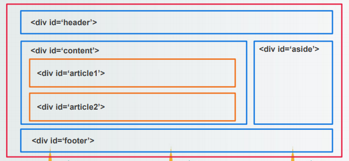
    ```
    <div id = 'header'>
      헤더 내용
    </div>
    <div id = 'content'>
      <div id = 'article1'>
        본문내용1
      </div>
      <div id = 'article2'>
        본문내용2
      </div>
    </div>
    <div id = 'aside'>
      사이드 내용
    </div>
    <div id 'footer'>
      회사 정보
    </div>
    ```
  - html5 페이지 구조
    - 시멘틱 태그를 사용
    - 웹 접근성 용이 -> 장애인, 고령자 등이 웹 사이트에서 제공하는 정보에 비장애인과 동등하게 접근하고 이해할 수 있도록 보장하는 것
- 시멘틱 태그
  - 페이지 구조를 특정 기능에 맞는 태그를 사용하여 구분
  - 페이지 구조를 쉽게 파악하고 좀 더 정확한 정보를 검색할 수 있게 함
  - header
    - 특정 부분의 머리말로 주로 검색어, 메뉴를 넣는다
  - nav
    - 다른 사이트나 페이지로 이동하는 태그를 모아놓은 태그(네비게이션)
    - 특정 태그에 종속되지 않고 어느 곳에서나 사용할 수 있음
    - 주로 메뉴, footer의 사이트 링크 모음에 많이 쓰임
  - section
    - 웹 문서에서 컨텐츠가 들어가는 영역, 컨텐츠를 주제별로 묶을 때 사용
    - section 태그 안에 section 태그를 넣을 수 있음
    - 주제별로 article을 묶어주는 태그
  - article
    - 웹 페이지의 내용이 들어가는 영역
    - 이 태그 영역은 다른 곳으로 배포하거나 재사용 가능
    - 검색 로봇은 이 태그가 사용된 컨텐츠는 배포할 수 있는 컨텐츠로 인식
  - aside
    - 사이드바라고 불림
    - 본문 외의 기타 내용을 담고 있는 영역
    - 주로 광고를 달거나 링크모음 등을 표현
  - footer
    - 웹페이지의 맨 아래쪽에 위치하며, 회사소개, 저작권, 연락처 등의 정보 표시
    - footer에는 header, section, article 등 다른 레이아웃 사용 가능
  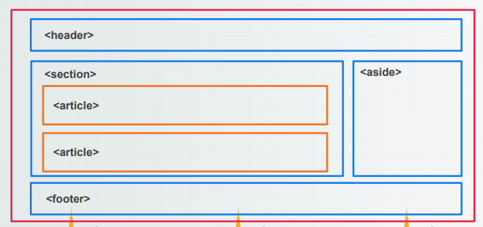
  ```
  <header>
    헤더 내용
  </header>
  <section>
    <article>
      본문내용1
    </article>
    <article>
      본문내용2
    </article>
  </section>
  <aside>
    사이드 내용
  </aside>
  <footer>
    회사 정보
  </footer>
  ```
- 멀티미디어 태그
  - img 태그
    - 웹 페이지에 사진이나 그림을 삽입할 때 사용하는 태그
    - 닫는 태그가 존재하지 않음
    ```
    
    ```
    - img 확장자  
    
    | 이미지 확장자 | 설명 |  
    | :-----: | :-----: |  
    | GIF | 파일 크기가 작아 작은 아이콘이나 블릿 기호에 많이 사용<br>투명한 배경이나 움직이는 이미지를 만들 수 있음 |  
    | JPG/JPEG | 사진을 위해 개발<br>저장을 반복하다 보면 화질이 떨어질 수 있음 |  
    | PNG | 네트워크용으로 개발되어 최근 많이 이용 |  
    | SVG | 벡터 이미지로 최근 활용이 많이 된다. |  
    
  - map, area 태그
    - 이미지를 구역별로 나누어 링크를 걸어주는 태그
    - img 트개에 usemap 속성을 지정해야 사용 가능
    - 사용법
    ```
    
    <map name='tt'>
      <area shape='모양' cords='00,00(시작),00,00(끝)' href='링크경로' target='위치'>
      <area shape='모양' cords='00,00(시작),00,00(끝)' href='링크경로' target='위치'>
    </map>
    ```
  - audio 태그
    - 웹 브라우저에서 플러그인의 도움 없이 음악을 재생할 수 있게 만들어주는 태그
  - video
    - 웹 브라우저에서 플러그인의 도움 없이 미디어를 재생할 수 있게 만들어주는 태그
- 하이퍼링크 태그
  - a 태그
    - 웹 페이지에서 해당 부분을 클릭하면 지정된 페이지로 이동하는 태그
    - 외부 사이트 연결, 문서 내부에서 이동 가능  
    
    | 속성 | 설명 |  
    | :-----: | :-----: |  
    | href | 링크한 페이지의 id값이나 사이트 주소 지정 |  
    | target | 링크 페이지가 표시될 위치 지정(새창, 현재창) |  
    | download | 링크한 페이지를 표시하지 않고 다운로드 하는 것 |  
    | rel | 현재 페이지와의 관계지정 |  
    | hreflang | 링크한 페이지의 언어를 지정 |  
    | type | 페이지의 파일 유형 지정 |  
    
    ```
    <a href = '이동할 페이지 경로'>링크 표시 문구</a>
    
    <a href = '이동할 페이지 경로'></a>
    
    <a href = '#이동할 태그 id'>링크 표시 문구</a>
    
    <a href = '이동할 페이지 경로' target = '창선택 옵션'>링크 표시 문구</a>
    ```
- 폼 태그
  - 사용자가 입력한 data를 보내는 방식과 처리할 프로그램을 정하는 태그
  
  <table>
    <tr align="center">
      <th>속성</th>
      <th>설명</th>
    </tr>
    <tr>
      <th align="center">method</th>
      <td>get : URL 창에 데이터를 보내는 방식. 보내는 데이터 크기에 제한이 있음(256~4096byte) 보내는 데이터가 눈으로 보임.<br>post : http 헤더에 데이터를 넣어 보내는 방식. 보내는 데이터의 크기에 제한이 없음. 보내는 데이터를 볼 수 없음.</td>
    </tr>
    <tr>
      <th align="center">name</th>
      <td>form 태그의 고유 이름 지정</td>
    </tr>
    <tr>
      <th align="center">action</th>
      <td>데이터를 처리할 프로그램(페이지) 지정</td>
    </tr>
    <tr>
      <th align="center">target</th>
      <td>action 속성을 어떻게 열것인지 결정</td>
    </tr>
    <tr>
      <th align="center">autocomplete</th>
      <td>이전 입력내용 출력하는 기능(생략하면 자동으로 on)</td>
    </tr>
  </table>
  
  - 사용법
  ```
  <form action = "보내지는 페이지" method = "메소드 타입" name = "form 이름" target = "창선택 옵션">
    ...
  </form>
  ```
- fieldset, legend 태그
  - 폼 요소를 그룹으로 묶는 태그, 묶은 폼 요소에 명칭을 붙이는 태그
  ```
  <form action='처리할프로그램(페이지)' method='전송방식'>
    <fieldset>
      <legend>명칭</legend>
      <input type……>
      …
    </fieldset>
  </form>
  ```
- input 태그
  - 사용자로부터 데이터를 입력받기 위한 태그
  - form 태그를 통해서 데이터 전송 시 해당 form 태그 내부에 있는 input 태그에 작성된 내용만 전송
  <table>
    <tr>
      <th>속성</th>
      <th>설명</th>
    </tr>
    <tr>
      <th>type</th>
      <td>입력창의 타입을 결정하는 속성(text, checkbox, radio 등)</td>
    </tr>
    <tr>
      <th>value</th>
      <td>input 요소의 기본값 입력(사용자 입력 값이 value가 됨)</td>
    </tr>
    <tr>
      <th>name</th>
      <td>input을 구별 할 수 있는 명칭(데이터를 받는 곳에서 name속성의 값으로 구분)</td>
    </tr>
    <tr>
      <th>min/max/step</th>
      <td>허용하는 범위 최소값/최대값/값의 증감값</td>
    </tr>
    <tr>
      <th>autocomplete</th>
      <td>자동완성기능</td>
    </tr>
    <tr>
      <th>height/width</th>
      <td>입력창의 높이와 넓이</td>
    </tr>
    <tr>
      <th>readonly</th>
      <td>읽기전용필드</td>
    </tr>
    <tr>
      <th>accept</th>
      <td>파일타입에 대해 사용자에게 알려주는 기능</td>
    </tr>
    <tr>
      <th>multiple</th>
      <td>여러 개의 값을 입력 가능</td>
    </tr>
    <tr>
      <th>placeholder</th>
      <td>사용자 입력전 입력창 표시글(사용자 입력 시 사라짐</td>
    </tr>
    <tr>
      <th>autofocus</th>
      <td>입력창 커서 표시</td>
    </tr>
    <tr>
      <th>required</th>
      <td>필수입력 필드 지정</td>
    </tr>
    <tr>
      <th>size</th>
      <td>화면에서 표현하는 글자 수</td>
    </tr>
    <tr>
      <th>maxlength</th>
      <td>사용자가 입력할 수 있는 글자 수의 제한</td>
    </tr>
    <tr>
      <th>minlength</th>
      <td>최소입력 글자 지정</td>
    </tr>
    <tr>
      <th>list</th>
      <td><datalist>의 옵션값을 <input>안에 나열</td>
    </tr>
  </table>
  
  - type 속성의 기본값
  <table>
    <tr align = "center">
      <th>속성</th>
      <th>설명</th>
    </tr>
    <tr>
      <th>text</th>
      <td>한 줄 짜리 텍스트 입력창이 생김</td>
    </tr>
    <tr>
      <th>password</th>
      <td>비밀번호 입력창, 입력 시 •••로 표시됨</td>
    </tr>
    <tr>
      <th>hidden</th>
      <td>사용자에게 보이지는 않지만 값을 넣을 수 있는 창, 데이터를 숨겨서 전송할 때 사용</td>
    </tr>
    <tr>
      <th>button</th>
      <td>버튼 생성, 자체기능은 없고, script를 통해 함수 연결 가능</td>
    </tr>
    <tr>
      <th>checkbox</th>
      <td>체크박스생성(다중 항목 선택)</td>
    </tr>
    <tr>
      <th>radio</th>
      <td>라디오버튼생성(단일 항목 선택)</td>
    </tr>
    <tr>
      <th>file</th>
      <td>파일입력 양식</td>
    </tr>
    <tr>
      <th>submit</th>
      <td>입력한 데이터를 <form>태그의 action의 페이지로 전송</td>
    </tr>
    <tr>
      <th>reset</th>
      <td>입력한 내용을 지우는 기능</td>
    </tr>
    <tr>
      <th>image</th>
      <td>이미지 형태 생성</td>
    </tr>
    <tr>
      <th>name</th>
      <td>input의 구분자/명칭</td>
    </tr>
    <tr>
      <th>size</th>
      <td>사용자 화면에 보여줄 문자 수</td>
    </tr>
    <tr>
      <th>value</th>
      <td>input요소에 들어가 값(설정하지 않으면 빈값)</td>
    </tr>
    <tr>
      <th>maxlength</th>
      <td>최대 입력 갯수</td>
    </tr>
    <tr>
      <th>minlength</th>
      <td>최소 입력 갯수</td>
    </tr>
  </table>
  
### 2.34 34일차(2020-03-25)
- CSS
  - 웹페이지 구성
    - 문서 내용 작성과 꾸미는 부분을 분리하여 내용과 디자인 수정 시 서로 영향을 최소화
    - 다양한 기기에서도 디자인만 따로 적용하여 구동 가능
  - style과 stylesheet
    - style은 정해진 속성을 입력하여 웹페이지를 꾸미는 것
    - stylesheet는 웹페이지에서 반복적으로 쓰는 stle을 모아놓은 것
    ```
    선택자 { 
      속성1 : 값1; 
      속성2 : 값2;
    }
    
    p {
      color : red;
    }
    
    - p 태그의 색을 모두 red로 변경
    ```
  - stylesheet 종류
    1. 내부 스타일 시트
        - html문서 내부의 <style></style>에 스타일 정보를 저장하는 방법
    2. 외부 스타일 시트
        - html문서 외부에 css 파일을 작성하고 link 태그를 이용하여 읽어와서 스타일 적용
        ```
        <link href="css 파일" rel="stylesheet" type="text/css">
        ```
    3. 인라인 스타일 시트
        - 태그 내부에 스타일 정보를 지정하는 방법
        ```
        <p style="color:red">test</p>
        ```
- CSS 선택자
  - 선택자
    - html 문서 내부에서 스타일을 적용하기 위한 요소를 선택하는 것
    - html 문서를 꾸미기 위해서는 각 요소별로 스타일을 적용하기 위해 선택자를 이용하여 요소를 선택
  - 선택자의 종류
  <table>
    <tr alight="center">
      <th>구분</th>
      <th>내용</th>
    </tr>
    <tr>
      <th alight="center">전체 선택자</th>
      <td>*</td>
    </tr>
    <tr>
      <th alight="center">태그 선택자</th>
      <td>태그 이름(h1, p1, li 등등)</td>
    </tr>
    <tr>
      <th alight="center">아이디 선택자</th>
      <td>#아이디명</td>
    </tr>
    <tr>
      <th alight="center">클래스 선택자</th>
      <td>.클래스명</td>
    </tr>
    <tr>
      <th alight="center">후손 선택자</th>
      <td>선택자 선택자</td>
    </tr>
    <tr>
      <th alight="center">자손 선택자</th>
      <td>선택자 > 선택자</td>
    </tr>
    <tr>
      <th rowspan = "3" alight="center">속성 선택자</th>
      <td>선택자[속성=값] / 선택자[속성~=값]</td>
    </tr>
    <tr>
      <td>선택자[속성|=값] / 선택자[속성^=값]</td>
    </tr>
    <tr>
      <td>선택자[속성$=값] / 선택자[속성*=값]</td>
    </tr>
    <tr>
      <th alight="center">동위 선택자</th>
      <td>선택자 + 선택자 / 선택자 ~ 선택자</td>
    </tr>
    <tr>
      <th rowspan="4" alight="center">구조 선택자</th>
      <td>선택자:first-child / 선택자:last-child</td>
    </tr>
    <tr>
      <td>선택자:nht-child(수열) / 선택자:nth-last-child(수열)</td>
    </tr>
    <tr>
      <td>선택자:first-of-type / 선택자:last-of-type</td>
    </tr>
    <tr>
      <td>선택자:nth-of-type(수열) / 선택자:nth-last-of-type(수열)</td>
    </tr>
    <tr>
      <th alight="center">반응 선택자</th>
      <td>선택자:active / 선택자:hover</td>
    </tr>
    <tr>
      <th alight="center">상태 선택자</th>
      <td>:checked / :focus</td>
    </tr>
    <tr>
      <th alight="center">속성 선택자</th>
      <td>:enabled / :disbled</td>
    </tr>
    <tr>
      <th alight="center">링크 선택자</th>
      <td>:link / :vis</td>
    </tr>
    <tr>
      <th rowspan="2" alight="center">문자 선택자</th>
      <td>::first-letter / ::first-line</td>
    </tr>
    <tr>
      <td>::after / ::before / ::selection</td>
    </tr>
    <tr>
      <th alight="center">부정 선택자</th>
      <td>선택자:not(선택자)</td>
    </tr>
  </table>
  
  - 전체 선택자
    ```
    * { 
      속성1 : 값1;
      속성2 : 값2;
    }
    ```
  - 태그 선택자
    ```
    태그 { 
      속성1 : 값1;
      속성2 : 값2;
    }
    ```
  - 아이디 선택자
    ```
    #아이디{ 
      속성1 : 값1;
      속성2 : 값2;
    }

    <태그 id="아이디">내용</태그>
    ```
  - 클래스 선택자
    ```
    .클래스명{ 
      속성1 : 값1;
      속성2 : 값2;
    }

    <태그 class="클래스명">내용</태그>

    - 클래스명 여러개를 적을 수 있다.
    ```
  - 문자열 속성 선택자
    - 특정 문자열을 확인하여 스타일을 적용하는 방식으로 특별한 경우에만 사용
    ```
    태그[속성=값]{ 
      속성1 : 값1;
      속성2 : 값2;
    }

    <태그 속성=값>내용</태그>
    ```
  - 자손 선택자
    ```
    태그1>태그2{ 
      속성1 : 값1;
      속성2 : 값2;
    }

    <태그2>내용1</태그2>
    <태그1>
      <태그2>내용2</태그2>
    </태그1>

    - 자손 선택자는 태그1에 대하여 자손만이 선택되기에 내용1은 선택되지 않는다.
    ```
  - 후손 선택자
    ```
    태그1 태그3{ 
      속성1 : 값1;
      속성2 : 값2;
    }

    <태그3>내용1</태그3>
    <태그1>
      <태그2>
        <태그3>내용2</태그3>
      </태그2>
      <태그3>내용3</태그3>
    </태그1>

    - 후손 선택자는 태그1에 대하여 몇개의 후대에 있는지 상관 없이 후손 전부 선택된다.
    - 내용2, 내용3이 후손관계
    ```
  - 형제 선택자
    ```
    태그1>태그2 +(~) 태그3{ 
      속성1 : 값1;
      속성2 : 값2;
    }

    <태그3>내용1</태그3>
    <태그1>
      <태그2>
        <태그3>내용2</태그3>
      </태그2>
      <태그3>내용3</태그3>
    </태그1>

    - +는 형제 1개만, ~는 형제 전체를 포함한다.
    ```
  - 반응형 선택자
    - hover : 마우스를 해당 영역에 올리면 반응
    - active : 마우스를 해당 영역을 클릭하고 있는 동안 반응
    ```
    속성:반응타입{ 
      속성1 : 값1;
      속성2 : 값2;
    }
    ```
  - 상태 선택자
    - input:focus : input 타입에서 선택이 된 경우 반응
    - input:checked : 라디오버튼처럼 선택이 된 경우 반응
    - input:enabled : 활성화된 input들을 변경
    - input:disabled : 비활성화된 input들을 변경
    ```
    input:상태{ 
      속성1 : 값1;
      속성2 : 값2;
    }
    ```
  - 일반구조 선택자
    - 특정한 위치에 있는 태그 선택(위치구분)
    - 서로 다른 태그의 형제더라도 전부 체크한다.
    - first-child : 형제 관계 태그 중 첫번째 태그 선택
    - last-child : 형제 관계 태그 중 마지막 태그 선택
    - nth-child(수식) : 앞에서부터 수열번째 태그
    - nth-last-child(수식) : 뒤에서부터 수열번째 태그
    ```
    태그1 태그2:일반구조타입 {
      속성1 : 값1;
      속성2 : 값2;
    }
    ```
  - 형태구조 선택자
    - 특정한 위치에 있는 태그 선택(태그별로 구분)
    - first-of-type : 형제 관계 태그 중 관련된 첫번째 태그 선택
    - last-of-type : 형제 관계 태그 중 관련된 마지막 태그 선택
    - nth-of-type(수식) : 형제 관계 태그 중 앞에서부터 관련된 수열번째 태그 선택
    - nth-last-of-type(수식) : 형제 관계 태그 중 뒤에서부터 관련된 수열번째 태그 선택
    ```
    태그1 태그2:형태구조타입 {
      속성1 : 값1;
      속성2 : 값2;
    }
    ```
  - 문자 선택자
    - 특정한 글자를 선택
    - first-letter : 첫번째 글자 선택
    - first-line : 첫번째 줄 선택을 하며 웹 페이지의 크기에 맞춰 1줄로 고정된다.
    - after : 앞에 '::'가 입력이 되며 뒤에 추가가 된다.
    - selection : 앞에 '::'가 입력이 되며 드래그를 했을 때 반응한다.
  - 부정 선택자
    - 선택자의 반대
    ```
    태그1 태그2:not(:구조타입) {
      속성1 : 값1;
      속성2 : 값2;
    }
    ```

### 2.35 35일차(2020-03-26)
- CSS 단위 구성
  <table>
    <tr>
      <th>구분</th>
      <th>단위</th>
      <th>내용</th>
    </tr>
    <tr>
      <th rowspan="3">상대 크기</th>
      <th>em</th>
      <td>부모 요소의 크기가 기준<br>배수를 의미<br>1배 = 1em = 100%(부모요소 크기 기준)</td>
    </tr>
    <tr>
      <th>rem</th>
      <td>최상이 부모 요소의 크기가 기준으로 배수</td>
    </tr>
    <tr>
      <th>%</th>
      <td>기본 설정된 크기에서 상대적으로 크기 설정<br>초기 설정 100%</td>
    </tr>
    <tr>
      <th rowspan="2">절대 크기</th>
      <th>px</th>
      <td rowspan="2">기본 지정된 크기</td>
    </tr>
    <tr>
      <th>pt</th>
    </tr>
  </table>  
- CSS 색상 표현
  <table>
    <tr>
      <th>표현방법</th>
      <th>내용</th>
    </tr>
    <tr>
      <th>영문색 이름</th>
      <td>영문으로 색 이름 작성<br>red, blue, white...</td>
    </tr>
    <tr>
      <th>16진수</th>
      <td>rgb값을 기준으로 16진수로 작성<br>#ff0000(빨간색), #000000(흰색), #0000ff(파란색)...</td>
    </tr>
    <tr>
      <th>rgb</th>
      <td>rgb값을 0~255의 숫자로 표현<br>rgb(255, 0, 0), rgb(0, 0, 0), rgb(0, 0, 255)...</td>
    </tr>
    <tr>
      <th>rgba</th>
      <td>rgb 방식과 동일하며 맨 마지막에 투명도를 0~1로 표현<br>rgba(255, 0, 0, 0.5)<br>0~1로 갈수록 투명->불투명</td>
    </tr>
  </table>  
- 텍스트 스타일
  - front-family
    - 폰트의 글꼴을 설정해주는 속성
    - 글꼴 이름1이 없으면 글꼴2, 글꼴 3으로 선택되어 설정
    - 글꼴이 모두 없으면 브라우저 기본 글꼴로 적용
    ```
    선택자 {
      font-family : 글꼴1[, 글꼴2, 글꼴3];
    }
    ```
  - font-size
    - 글자의 크기를 조절하는 속성
    - 단위 : em, px, pt, ex  
      ※ex : 현재 소문자 x의 크기의 배수(잘 사용하지 않음)
    ```
    선택자 {
      font-size : 숫자단위;
    }
    ```
  - font-weight
    - 글자의 굵기를 설정  
    ```
    선택자 {
      font-weight : 속성 값;
    }
    ```
    <table>
      <tr align="center">
        <th>속성 값</th>
        <th>내용</th>
      </tr>
      <tr>
        <th align="center">normal</th>
        <td>기본형태</td>
      </tr>
      <tr>
        <th align="center">bold</th>
        <td>굵게 표시</td>
      </tr>
      <tr>
        <th align="center">bolder</th>
        <td>더 굵게 표시</td>
      </tr>
      <tr>
        <th align="center">lighter</th>
        <td>더 가늘게 표시</td>
      </tr>
      <tr>
        <th align="center">100~900</th>
        <td>400:normal / 700:bold / 세밀한 조절 가능</td>
      </tr>
    </table>  
  - font-variant
    - 영어를 작은 대문자로 표시해주는 속성
    ```
    선택자 {
      font-variant : normal 또는 small-caps;
    }
    ```
  - font-style
    - 글자를 이텔릭체로 표시하는 속성
    ```
    선택자 {
      font-style : normal 또는 italic 또는 oblique;
    }
    
    - italic : 처음부터 기울어진 글자가 존재
    - oblique : 기본 글자를 기울여서 표시
    - italic을 주로 사용
    ```
  - font
    - 글꼴 속성을 모아서 표현할 수 있는 스타일 속성
    ```
    선택자 {
      font : font-style font-variant font-weight font-size/line-height font-family;
    }
    ```
  - color
    - 글자색을 정하는 속서
    - 색 지정방법(영문명, rgb, rgba, 16진수 모두 가능)
    ```
    선택자 {
      color : 색상;
    }
    ```
  - text-decoration
    - 글자에 밑줄을 긋거나, 취소선을 긋거나, 윗선을 긋거나 밑줄을 표시하지 는 속성
    ```
    선택자 {
      text-decoration : 속성;
    }
    
    - none : 줄 삭제
    - underline : 밑줄 표시
    - overline : 윗줄 표시
    - line-through : 취소선 표시
    ```
  - text-trnasform
    - 영문자를 표시할 때 대소문자를 바꿀 수 있는 속성
    ```
    선택자 {
      text-transfrom: 속성값;
    }
    
    - none : 변환 없이 표시
    - capitalize : 시작하는 첫번째 글자를 대문자로 변환
    - uppercase : 모든 글자를 대문자로 변환
    - lowercase : 모든 글자를 소문자로 변환
    ```
  - text-shadow
    - 텍스트에 그림자 효과를 주는 속성
    ```
    선택자 {
      text-shadow: non 또는 (가로 세로 번짐 색상);
    }
    
    - 인자를 여러개 사용하여 콤마로 구분하여 여러 개의 그림자 효과 활용 가능
    ```
  - white-space
    - 공백을 처리해 주는 속성  
    <table>
      <tr align="center">
        <th>속성 값</th>
        <th>공백 여러개</th>
        <th>개행 처리</th>
        <th>영역 이탈</th>
      </tr>
      <tr align="center">
        <th>normal</th>
        <td>하나로 처리</td>
        <td>개행하지 않음</td>
        <td>자동 줄 바꿈</td>
      </tr>
      <tr align="center">
        <th>nowrap</th>
        <td>하나로 처리</td>
        <td>개행하지 않음</td>
        <td>한줄로 표시</td>
      </tr>
      <tr align="center">
        <th>pre</th>
        <td>여러 개로 처리</td>
        <td>개행 처리 함</td>
        <td>한줄로 바꿈</td>
      </tr>
      <tr align="center">
        <th>pre-line</th>
        <td>하나로 처리</td>
        <td>개행 처리 함</td>
        <td>자동 줄 바꿈</td>
      </tr>
      <tr align="center">
        <th>pre-wrap</th>
        <td>여러 개로 처리</td>
        <td>개행 처리 함</td>
        <td>자동 줄 바꿈</td>
      </tr>
    </table>  
  - letter-spacing / word-spacing
    - letter-spacing : 낱개 글자의 간격을 조정하는 속성
    - word-spacing : 단어와 단어 사이 간격을 조정하는 속성
    ```
    선택자 {
      letter-spacing : 숫자(단위);
      word-spacing : 숫자(단위);
    }
    ```
- 문단 스타일
  - direction
    - 글자 쓰기의 방향 지속 속성
    ```
    선택자 {
      direction : ltr 또는 rtl;
    }
    
    - ltr : 왼쪽에서 오른쪽으로 텍스트 표시
    - rtl : 오른쪽에서 왼족으로 텍스트 표시
    ```
  - text-align
    - 문자 위치를 조정(정렬)하는 속성
    - 참고 : https://www.w3schools.com/cssref/playit.asp?filename=playcss_text-align&preval=histify
    <table>
      <tr align="center">
        <th>속성 값</th>
        <th>내용</th>
      </tr>
      <tr>
        <th align="center">left</th>
        <td>왼쪽에 맞추어 정렬</td>
      </tr>
      <tr>
        <th align="center">right</th>
        <td>오른쪽에 맞추어 정렬</td>
      </tr>
      <tr>
        <th align="center">center</th>
        <td>가운데 맞추어 정렬</td>
      </tr>
      <tr>
        <th align="center">justify</th>
        <td>양쪽에 맞추어 정렬</td>
      </tr>
    </table>  
  - text-indent
    - 문장을 들여쓰기 하는 속성
    ```
    선택자 {
      text-indent : 숫자(단위);
    }
    ```
  - text-height
    - 문장끼리의 줄 간격을 조정하는 속성
    ```
    선택자 {
      line-height: 숫자(단위);
    }
    
    - 글자의 상하 가운데 정렬을 할 때 사용(요소의 높이만큼 line-height를 주면 상하 가운데 정렬
    ```
  - text-overflow
    - 영역을 벗어나는 텍스트 표시 속성
    ```
    선택자 {
      text-overflow : clip 또는 eclipsis;
    }
    
    - clip : 넘어가는 부분은 잘림
    - eclipsis : 넘어가는 부분은 ...으로 표시
    ```
- 목록/링크 스타일
  - list-style-type
    - 목록의 기호의 스타일을 지정하는 속성  
    <table>
      <tr align="center">
        <th colspan="2">속성 값</th>
        <th>내용</th>
      </tr>
      <tr>
        <th rowspan="4" align="center">ul</th>
        <th align="center">disc</th>
        <td>흑색 원형</td>
      </tr>
      <tr>
        <th align="center">circle</th>
        <td>흰색 원형</td>
      </tr>
      <tr>
        <th align="center">square</th>
        <td>흑색 사각형</td>
      </tr>
      <tr>
        <th align="center">none</th>
        <td>기호 표시 안함</td>
      </tr>
      <tr>
        <th rowspan="5" align="center">ol</th>
        <th align="center">decimal</th>
        <td>1로 시작하는 십진수</td>
      </tr>
      <tr>
        <th align="center">decimal-leading-zero</th>
        <td>앞에 0이 붙은 십진수</td>
      </tr>
      <tr>
        <th align="center">lower-roman/upper-roman</th>
        <td>로마자 소문자 / 로마자 대문자</td>
      </tr>
      <tr>
        <th align="center">lower-alpha/lower-latin</th>
        <td>알파벳 소문자</td>
      </tr>
      <tr>
        <th align="center">upper-alpha/upper-latin</th>
        <td>알파벳 대문자</td>
      </tr>
    </table>  
  - list-style-image
    - 기호 대신 이미지 삽입
    ```
    선택자 {
      list-style-image: url(이미지 경로);
    }
    ```
  - list-style-position
    - 목록 기호 들여쓰기
    ```
    선택자 {
      list-style-position: inside 또는 outside;
    }
    
    - inside : 블릿이나 숫자를 안쪽으로 들여 씀
    - outside : 블릿이나 숫자를 밖으로 내어 씀(default)
    ```
  - list-style
    - 목록 스타일을 한번에 지정하는 속성
    ```
    선택자 {
      list-style: type값 position값 image값;
    }
    ```
- 배경 스타일
  - background-color
    - 배경색을 지정하는 속성
    ```
    선택자 {
      background-color: 색상표현;
    }
    ```
  - background-clip
    - 배경 범위 조절
    <table>
      <tr>
        <th align="center">속성 값</th>
        <th align="center">내용</th>
      </tr>
      <tr>
        <th align="center">border-box</th>
        <td>박스 모델의 가장 외곽이 테두리까지 적용</th>
      </tr>
      <tr>
        <th align="center">padding-box</th>
        <td>테두리를 제외한 패딩범위까지 적용</th>
      </tr>
      <tr>
        <th align="center">content-box</th>
        <td>내용 부분만 적용</th>
      </tr>
    </table>  
  - background-img
    - 요소에 배경을 이미지로 지정
    ```
    선택자 {
      background-img : url(경로);
    }
    ```
  - background-repeat
    - 배경 이미지 반복 출력
    <table>
      <tr>
        <th align="center">속성 값</th>
        <th align="center">내용</th>
      </tr>
      <tr>
        <th align="center">repeat</th>
        <td>브라우저에 가득 찰 때까지 가로/세로 반복</th>
      </tr>
      <tr>
        <th align="center">repeat-x</th>
        <td>넓이만큼 반복(가로)</th>
      </tr>
      <tr>
        <th align="center">repeat-y</th>
        <td>높이만큼 반복(세로)</th>
      </tr>
      <tr>
        <th align="center">no-repeat</th>
        <td>이미지 한번만 출력</th>
      </tr>
    </table>  
  - background-size
    - 배경 이미지의 크기를 조절하는 속성
    <table>
      <tr>
        <th align="center">속성 값</th>
        <th align="center">내용</th>
      </tr>
      <tr>
        <th align="center">auto</th>
        <td>원래 배경이미지 크기만큼 표시</th>
      </tr>
      <tr>
        <th align="center">contain</th>
        <td>요소 안으로 이미지가 들어올 수 있게 확대/축소</th>
      </tr>
      <tr>
        <th align="center">cover</th>
        <td>요소의 범위를 이미지가 덮을 수 있도록 확대/축소</th>
      </tr>
      <tr>
        <th align="center">크기값(px)/백분율</th>
        <td>수치화된 값으로 표현</th>
      </tr>
    </table>  
  - background-position
    - 배경 이미지의 위치를 조정하는 속성
    ```
    선택자 {
      background-position : 수평위치 수직위치;
      background-position : left center;
      background-position : 50% 50%;
    ```
    <table>
      <tr>
        <th align="center">속성 값</th>
        <th align="center">내용</th>
      </tr>
      <tr>
        <th align="center">수평위치</th>
        <td>left / center / right</th>
      </tr>
      <tr>
        <th align="center">수직위치</th>
        <td>top / center / bottom</th>
      </tr>
      <tr>
        <th align="center">크기값(px) / 백분율</th>
        <td>수치화된 값으로 표현(가로,세로) -> 왼쪽 모서리 좌표</th>
      </tr>
    </table>  
  - background-origin
    - 배경 이미지 배치할 때 기준을 지정하는 속성
    <table>
      <tr>
        <th align="center">속성 값</th>
        <th align="center">내용</th>
      </tr>
      <tr>
        <th align="center">border-box</th>
        <td>테두리가 기준</th>
      </tr>
      <tr>
        <th align="center">padding-box</th>
        <td>테두리를 뺀 패딩이 기준</th>
      </tr>
      <tr>
        <th align="center">content-box</th>
        <td>내용부분이 기준</th>
      </tr>
    </table>  
  - background-attachment
    - 웹페이지가 위아래로 움직여도 배경이미지는 움직이지 않게 고정하는 속성
    <table>
      <tr>
        <th align="center">속성 값</th>
        <th align="center">내용</th>
      </tr>
      <tr>
        <th align="center">scroll</th>
        <td>배경이미지가 움직이게 설정(default)</th>
      </tr>
      <tr>
        <th align="center">fixed</th>
        <td>배경이미지가 움직이지 않게 설정</th>
      </tr>
    </table>  
  - background
    - 배경이미지 한번에 설정하는 속성
    ```
    선택자 {
      background : image값 repeat값 attachment값 position값 clip값 origin값 size값;
    }
    ```
  - linear-gradient
    - 직선 방향으로 그라데이션 색상
    ```
    선택자 {
      background: linear-gradient(방향, 색상1, 색상2[, 색상3, 색상4...]);
    }
    
    - 방향은 to를 써서 bottom, top, left, right로 지정할 수 있다.
    - 숫자deg를 하면 각도로 지정이 된다.
    ```
  - radial-gradient
    - 타원 방향으로 그라데이션 색상
    - 중심을 기준으로 그려진다.
    ```
    선택자 [
      bacground: radial-gradient(색상1, 색상2[, 색상3, 색상4...]);
    }
    ```
    
### 2.36 36일차(2020-03-27)
- 기본 스타일
  - height / wegiht
    - 콘텐츠(내용)이 차지하고 있는 공간을
  - display
    - 화면 배치 방법 변경 속성
    - 블록요소와 인라인 요소를 변경 가능(블록->인라인, 인라인->블록)
    <table>
      <tr>
        <th align="center">속성 값</th>
        <th align="center">내용</th>
      </tr>
      <tr>
        <th align="center">none</th>
        <td>화면에서 표현되지 않고 공간도 차지하지 않음</th>
      </tr>
      <tr>
        <th align="center">inline</th>
        <td>인라인 요소로 변경</th>
      </tr>
      <tr>
        <th align="center">block</th>
        <td>블록 요소로 변경</th>
      </tr>
      <tr>
        <th align="center">inline-block</th>
        <td>블록 요소와 같이 너비, 높이 지정 등은 가능하나, 배치는 인라인 요소처럼 나란히 배치되는 속성</th>
      </tr>
    </table>  
- 테두리 스타일
  - border-style
    - 테두리 스타일 지정(테두리에 사용할 선의 종류)
    <table>
      <tr>
        <th align="center">속성 값</th>
        <th align="center">내용</th>
      </tr>
      <tr>
        <th align="center">none</th>
        <td>테두리가 나타나지 않음(기본 값)</th>
      </tr>
      <tr>
        <th align="center">hidden</th>
        <td>테두리가 나타나지 않음</th>
      </tr>
      <tr>
        <th align="center">dashed</th>
        <td>짧은 선으로 표시</th>
      </tr>
      <tr>
        <th align="center">dotted</th>
        <td>점선으로 표시</th>
      </tr>
      <tr>
        <th align="center">double</th>
        <td>이중선으로 표시</th>
      </tr>
      <tr>
        <th align="center">groove</th>
        <td>테두리가 안으로 파진것 처럼 보임</th>
      </tr>
      <tr>
        <th align="center">inset</th>
        <td>테두리를 포함한 컨텐츠 영역이 안으로 들어간 것처럼 보임</th>
      </tr>
      <tr>
        <th align="center">outset</th>
        <td>테두리를 포함한 컨텐츠 영역이 밖으로 튀어나온 것 처럼 보임</th>
      </tr>
      <tr>
        <th align="center">ridge</th>
        <td>테두리가 밖으로 튀어나온것처럼 보임</th>
      </tr>
      <tr>
        <th align="center">solid</th>
        <td>실선으로 지정</th>
      </tr>
    </table>  
  - border-width
    - 테두리의 두께를 지정하는 속성
    ```
    선택자 {
      border[위치]-width : 숫자 또는 속성값;
    }
    ```
  - border-radius
    - 테두리의 색상을 정하는 속성
    ```
    선택자 {
      border-[위치]-color : 색상값;
    }
    
    - 각 테두리별 설정을 하려면 위치(top, right, bottom, left)에 값을 넣는다.
    - 전체를 한번에 하려는 경우에는 위치를 생략
    ```
  - border
    - 테두리 두께, 스타일, 색상을 한번에 지정할 수 있는 속성
    ```
    선택자 {
      border-[위치] : 두께 스타일 색상값;
    }
    ```
  - border-radius
    - 박스의 모서리를 둥글게 하는 속성
    - 위치 : top-left, top-right, bottom left, bottom right
    - 각 테두리의 변에서부터 설정한 값만큼의 반지름을 가지는 원이 모서리에 그려지고 그 외곽부분이 그 원을 따라 둥글게 변하게 됨
    ```
    선택자 {
      border-[위치]-radisu : 숫자;
    }
    ```
  - box-shadow
    - box 영역에 그림자 효과를 주는 속성
    ```
    선택자 {
      box-shadow : 수평거리 수직거리 흐림정도 번짐정도 색상 [inset];
    }
    
    - insert은 안쪽으로 그림자를 그리는 옵션
    ```
- 여백 스타일
  - 박스 모델 구조  
  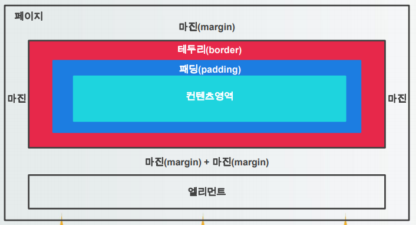  
  - padding
    - 테두리와 컨텐츠 영역 사이의 거리를 조절하는 속성
    ```
    선택자 {
      padding-[위치] : 숫자;
    }
    ```
  - margin
    - margin 크기를 0 auto로 하면 자동으로 가운데 정렬이 된다.
- 포지셔닝
  - box-sizing
    - 모든 요소들은 content, padding, margin 영역으로 나눠져 있는데 이 요소들의 크기를 어떠한 영역까지 포함할 것인지 결정하는 속성
    <table>
      <tr>
        <th align="center">속성 값</th>
        <th align="center">내용</th>
      </tr>
      <tr>
        <th align="center">content-box</th>
        <td>default값으로 컨텐츠까지 영역으로 설정</th>
      </tr>
      <tr>
        <th align="center">border-box</th>
        <td>border까지 영역으로 설정</th>
      </tr>
    </table>  
  - position
    - 페이지의 요소들을 자유롭게 배치해주는 속성
    - top, left, right, bottm으로 위치 지정
    <table>
      <tr>
        <th align="center">속성 값</th>
        <th align="center">내용</th>
      </tr>
      <tr>
        <th align="center">static</th>
        <td>요소를 문서의 흐름에 맞춰 배치(default)</th>
      </tr>
      <tr>
        <th align="center">relative</th>
        <td>이전 요소와 자연스럽게 연결해 배치, 위치 지정 가능</th>
      </tr>
      <tr>
        <th align="center">absolute</th>
        <td>원하는 위치를 지정해 배치<br>-> 부모/조상 요소의 position 속성이 반드시 relative<br>-> 가까운 relative 속성인 부모나 조상 요소가 기준점</th>
      </tr>
      <tr>
        <th align="center">fixed</th>
        <td>지정한 위치에 고정 배치</th>
      </tr>
    </table>  
  - visibility
    - 페이지에 특정 속성을 보이거나 보이지 않게 하는 속성
    <table>
      <tr>
        <th align="center">속성 값</th>
        <th align="center">내용</th>
      </tr>
      <tr>
        <th align="center">visible</th>
        <td>요소가 화면에 보임(default)</th>
      </tr>
      <tr>
        <th align="center">hidden</th>
        <td>요소가 화면에서 안보임<단, 보이지만 않을 뿐 공간은 차지</th>
      </tr>
    </table>  
  - z-index
    - 페이지 안에 요소들을 순서대로 위로 쌓는 속성
    - 속성값이 크면 가장 위에 있는 요소, 작으면 밑에 있는 속성
    - 항상 가장 위에 요소가 위치해야 한다면 값을 999, 1000 등의 큰 값으로 설정  
    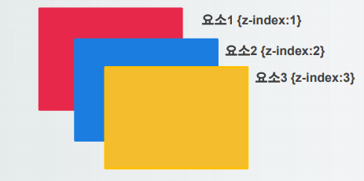  
  - float
    - 페이지의 요소의 위치를 왼쪽이나 오른쪽으로 지정하는 속성
    <table>
      <tr>
        <th align="center">속성 값</th>
        <th align="center">내용</th>
      </tr>
      <tr>
        <th align="center">left</th>
        <td>요소를 왼쪽으로 배치</th>
      </tr>
      <tr>
        <th align="center">right</th>
        <td>요소를 오른쪽으로 배치</th>
      </tr>
      <tr>
        <th align="center">none</th>
        <td>배치 값을 설정하지 않음</th>
      </tr>
    </table>  
  - clear
    - 페이지에 float 설정이 되어 있으면 그 속성이 그대로 다음 요소에 영향을 미치는데 이를 초기화하는 속성   
    <table>
      <tr>
        <th align="center">속성 값</th>
        <th align="center">내용</th>
      </tr>
      <tr>
        <th align="center">left</th>
        <td>왼쪽 배치 취소</th>
      </tr>
      <tr>
        <th align="center">right</th>
        <td>오른쪽 배치 취소</th>
      </tr>
      <tr>
        <th align="center">none</th>
        <td>설정하지 않음(앞에 내용 그대로 적용)</th>
      </tr>
      <tr>
        <th align="center">both</th>
        <td>두 개 다 취소</th>
      </tr>
    </table>  
  - overflow
    - 표현하는 컨텐츠가 넘쳤을 때 표현하는 기법
    <table>
      <tr>
        <th align="center">속성 값</th>
        <th align="center">내용</th>
      </tr>
      <tr>
        <th align="center">scroll</th>
        <td>가로, 세로 스크롤이 무조건 생김</th>
      </tr>
      <tr>
        <th align="center">auto</th>
        <td>스크롤이 내용에 따라 생김</th>
      </tr>
      <tr>
        <th align="center">hidden</th>
        <td>넘치는 것은 보여주지 않음</th>
      </tr>
      <tr>
        <th align="center">visible</th>
        <td>넘치더라도 그냥 보여줌(default)</th>
      </tr>
    </table>  
- 애니메이션
  - 애니메이션은 속성을 점차적으로 변화시켜 움직이는 효과를 내는 기법
  - transform 속성
    - 페이지에서 요소들을 변경시키려면 transform 속성과 변형 함수를 이용
    ```
    선택자 {
      transform:변형함수;
    }
    ```
    - transform 변형함수  
    <table>
      <tr>
        <th align="center">속성 값</th>
        <th align="center">내용</th>
      </tr>
      <tr>
        <th align="center">translate(x,y)</th>
        <td>지정한 크기만큼 x축, y축으로 이동</th>
      </tr>
      <tr>
        <th align="center">translate(x)</th>
        <td>지정한 크기만큼 x축으로 이동</th>
      </tr>
      <tr>
        <th align="center">translate(y)</th>
        <td>지정한 크기만큼 y축으로 이동</th>
      </tr>
      <tr>
        <th align="center">scale(x,y)</th>
        <td>지정한 크기만큼 x,y축으로 확대</th>
      </tr>
      <tr>
        <th align="center">scale(x)</th>
        <td>지정한 크기만큼 x축으로 확대</th>
      </tr>
      <tr>
        <th align="center">scale(y)</th>
        <td>지정한 크기만큼 y축으로 확대</th>
      </tr>
      <tr>
        <th align="center">rotate(각도)</th>
        <td>지정한 각도만큼 회전</th>
      </tr>
    </table>  
  - 트랜지션
    - 웹 요소의 스타일이 바뀌는 것
    - 애니메이션과 같은 효과를 나타낼 수 있음  
    <table>
      <tr>
        <th align="center">속성 값</th>
        <th align="center">내용</th>
      </tr>
      <tr>
        <th align="center">transition-property</th>
        <td>적용 할 속성 선택</th>
      </tr>
      <tr>
        <th align="center">transition-duration</th>
        <td>진행시간 선택</th>
      </tr>
      <tr>
        <th align="center">transition-timing-function</th>
        <td>순차적인 속도 선택</th>
      </tr>
      <tr>
        <th align="center">transition-delay</th>
        <td>트랜지션 시간지연 선택</th>
      </tr>
      <tr>
        <th align="center">transition</th>
        <td>속성값을 한번에 설정</th>
      </tr>
    </table>  
  - 애니메이션
    - 시작 스타일과 끝스타일을 부드럽게 이어주는 기능을 하는 것은 같지만 애니메이션은 중간에 원하는 위치에서 keyframe을 이용하여 중간스타일 지정 가능  
    <table>
      <tr>
        <th align="center">속성 값</th>
        <th align="center">내용</th>
      </tr>
      <tr>
        <th align="center">animation-delay</th>
        <td>지연시간 선택</th>
      </tr>
      <tr>
        <th align="center">animation-direction</th>
        <td>종료 후 처음부터 시작 또는 반대로 시작 선택</th>
      </tr>
      <tr>
        <th align="center">animation-duration</th>
        <td>실행시간을 선택</th>
      </tr>
      <tr>
        <th align="center">animation-fill-mode</th>
        <td>종료되었거나 실행되지 않을 때 스타일 선택</th>
      </tr>
      <tr>
        <th align="center">animation-iteration-count</th>
        <td>반복횟수 선택</th>
      </tr>
      <tr>
        <th align="center">animation-name</th>
        <td>중간상태의 이름 지정</th>
      </tr>
      <tr>
        <th align="center">animation-play-state</th>
        <td>멈추었다가 다시 시작</th>
      </tr>
      <tr>
        <th align="center">animation-timing-function</th>
        <td>순차적인 진행시간 선택</th>
      </tr>
      <tr>
        <th align="center">animation</th>
        <td>속성을 한번에 모두 지정</th>
      </tr>
    </table>  
  - @keyframes
    - 애니메이션 시작지점과 끝지점의 스타일을 정하고 key frames의 이름을 지정
    - 시작 지점과 끝 지점 두개만 설정할 경우 from to로 설정
    - 중간에 작업이 있으면 %로 구분하여 설정
    ```
    @keyframes 이름 {
      선택자 { 스타일; }
    }
    
    @keyframes ani1 {
      from {
        background-color: green;
        border: 1px solid black;
      }
      to {
        background-color: yellow;
        border-radius: 50%;
        transform: rotate(720deg);
        border: 3px solid red;
      }
    }
    
    @keyframes ani2 {
      0% {
        background-color: green;
        border: 3px soid black;
      }
      
      30% {
        transform: translate(100px, 100px);
      }
            
      50% {
        background-color: hotpink;
        transform: scale(1.2);
        border: 3px solid yellow;
      }

      100% {
        background-color: blue;
        transform: rotate(45deg);
        border: 3px solid red;
      }
    }
    ```

### 2.37 37일차(2020-03-30)

### 2.38 38일차(2020-03-31)
- 페이지 분할
  - 자식의 높이가 다르기 때문에 부모가 높이를 가지지 못함.
  - 이문제를 해결하기 위해서는 부모에 overflow를 hidden으로 줘야 함
  
### 2.39 39일차(2020-04-01)

### 2.40 40일차(2020-04-02)

### 2.41 41일차(2020-04-03)
- 클라이언트 주요언어
  - HTML : 웹페이지에 콘텐츠를 표현하는 기본언어로 웹페이지나 사이트를 제작할 때 사용하는 언어
  - CSS : 마크업 언어 사용시 작성한 웹 페이지 문서에 대한 스타일을 적용한 언어
  - javascript : 로컬의 브라우저에서 실행되는 인터프리터 방식의 프로그래밍 언어-> 하이퍼텍스트의 기능을 담당
  - jQuery : 자바스크립트의 코드가 길어지면 사용하기가 복잡해지는 단점을 파격적으로 개선한, 존 레식(John Resig)이 창안한 자바스크립트 기반의 라이브러리 중 하나
- javascript
  - 웹브라우저에서 많이 사용하는 인터프리터 방식의 객체지향 프로그래밍 언어
  - 자바스크립트는 ECMA Scropt 표준을 따르는 대표적인 웹기술
    - ECMA(European Computer Manufacturers Association) : 표준화 기구
    - ECMA Script : : ECMA 표준화 단체에서 javascript를 기초하여 구성한 스크립트 표준
- 작성 및 실행
  - 브라우저 개발자 도구
    - 브라우저별 개발자 도구가 있음
    - 크롬/IE 브라우저 F12 키를 눌러서 실행
    - 자바스크립트 소스코드 중 console.log()는 브라우저에 출력하는 것이 아니라 개발자도구의 console 패널에 출력하는 것이며
  - 자바스크립트 선언
    - script 태그 사이에 자바스크립트 코드 문장을 작성
    - HTML에서 제공하는 <script></script>태그를 사용하여, 자바 스크립트 작성 영역을 설정
    - type속성이 브라우저 호환성을 위해 사용되나 default값으로 생략이 가능  
    ```
    <script type="text/javascript">
      자바스크립트 내용
    <script>

    - type은 생략 가능
    ```
  - 자바스크립트 위치
    - script는 head와 body 안 어느 영역에서나 작성 가능
    - html 태그 영역 밖에서 작성 가능
    - 웹 표준과 웹 접근성, 웹 호환성을 고려해서 head나 body에 작성
  - 자바 스크립트 작성 방식
    - inline 방식 : 자바스크립트 양이 소량일 때 사용하며, 태그에 이벤트 핸들러 속성을 이용하여 직접 실행코드를 작성
    - internal 방식 : 가장 일반적인 방식으로 html파일내 script 태그 내부에 실행코드를 작성
    - external 방식 : 자바스크립트의 양이 많은 경우 자바스크립트 코드 부분을 외부 파일로 저장하여 작성  
    ```
    <script src=“파일경로”>
    ```
- 데이터 입출력
  - 데이터 출력 방법  
    <table>
      <tr>
        <th>코드</th>
        <th>설명</th>
      </tr>
      <tr>
        <td>document.write(내용);</td>
        <td>브라우저 화면상의 페이지에 값을 출력</td>
      </tr>
      <tr>
        <td>window.alert(내용);</td>
        <td>내용을 메세지창에 출력(window는 생략 가능)</td>
      </tr>
      <tr>
        <td>innerHTML = 내용;</td>
        <td>태그 엘리먼트의 내용을 변경</td>
      </tr>
      <tr>
        <td>console.log(내용);</td>
        <td>개발자 도구 화면의 콘솔에 출력</td>
      </tr>
    </table>  
  - 데이터 입력 방법
    - 자바스크립트 내장 객체인 window 객체가 제공하는 confirm(), prompt() 메소드를 사용하여 입력받는 방법
    - HTML 태그에 접근하여 대상의 값을 읽는 방법
    - HTML form 태그의 input 입력 양식을 통해 값을 입력받는 방법
    - window.confirm()
      1. 어떤 질문에 대해 "예/아니오"의 결과를 얻을 때 사용
      2. 대화창에 메시지와 확인/취소 버튼 표시
      3. 확인 버튼 선택 시 true, 취소 버튼 선택 시 false 리턴  
      ```
      var 변수 = window.confirm("질문내용");
      ```
    - window.prompt()
      1. 텍스트 필드와 확인/취소 버튼이 있는 대화창 출력
      2. 텍스트필드에 입력한 메시지 내용이 리턴
      ```
      var 변수 = window.prompt("질문내용");
      ```
- HTML 태그 접근
  - document.getElementById("아이디명")
    - 태그의 id 속성의 값을 이용해서 태그 엘리먼트 객체 정보를 가져옴
    - id 속성은 페이지 내에서 태그의 유일한 식별자 역할
    - 리턴은 단일 엘리먼트중복 id를 여러개 사용해도 최상위 1개만 리턴)
  - document.getElementsByClassName("클래스명")
    - 태그의 class 속성의 값을 이용해서 태그 엘리먼트 객체 정보를 가져옴
    - 동일한 class 속성 값을 가진 엘리먼트들을 모두 가져옴
    - 리턴은 엘리먼트 객체 배열(해당 class 속성의 엘리먼트가 1개여도 배열로 리턴)
  - document.getElementsByName("이름")
    - 태그의 name 속성의 값을 이용해서 태그 엘리먼트 객체 정보를 가져옴
    - 동일한 name 속성 값을 가진 엘리먼트들을 모두 가져옴
    - 리턴은 엘리먼트 객체 배열(해당 class 속성의 엘리먼트가 1개여도 배열로 리턴)
  - document.getElementsByTagName("태그이름")
    - 태그의 태그명을 이용해서 태그 엘리먼트 객체 정보를 가져옴
    - 태그 엘리먼트들을 모두 가져옴
    - 리턴은 엘리먼트 객체 배열(해당 태그 엘리먼트가 1개여도 배열로 리턴)
    ```
    var 변수 = document.getElementByTagName("태그이름");
    
    console.log(변수[0].innerHTML);
    ```
- 기본문법
  - 주석처리
    - 자바스크립트의 주석은 자바와 동일
  - 변수 선언  
    <table>
      <tr>
        <th>구분</th>
        <th>설명</th>
        <th>변수 선언</th>
      </tr>
      <tr>
        <td>멤버변수(전역변수)</td>
        <td>페이지 내 여러 함수에서 사용가능한 변수</td>
        <td>변수명 = 값;</td>
      </tr>
      <tr>
        <td>window.alert(내용);</td>
        <td>내용을 메세지창에 출력(window는 생략 가능)</td>
        <td></td>
      </tr>
    </table>  
    - javascript에서는 자료형이 여러 개 존재 하지만 선언 할 때에는 var 로만 선언
    - 대입하는 데이터에 맞춰서 자료형이 생성
- 자료형
  - 문자열
    - "", ''로 묶여있는 리터럴
    - 내장 객체로 String객체며 기본적인 메소드 존재
    <table>
      <tr>
        <th>메소드</th>
        <th>설명</th>
      </tr>
      <tr>
        <td>toUpperCase()</td>
        <td>모든 문자 대문자로 변환</td>
      </tr>
      <tr>
        <td>toLowerCase()</td>
        <td>모든 문자 소문자로 변환</td>
      </tr>
      <tr>
        <td>length</td>
        <td>글자 개수 조회용 멤버변수</td>
      </tr>
      <tr>
        <td>indexOf()</td>
        <td>찾는 문자의 위치 리턴</td>
      </tr>
      <tr>
        <td>lastIndexOf()</td>
        <td>뒤에서 부터 찾는 문자의 순번 리턴</td>
      </tr>
      <tr>
        <td>charAt()</td>
        <td>찾는 위치의 문자 리턴</td>
      </tr>
      <tr>
        <td>subString() </td>
        <td>값의 일부분만 리턴</td>
      </tr>
      <tr>
        <td>split()</td>
        <td>토큰 문자로 분리한 문자열 배열 리턴</td>
      </tr>
    </table>  
  - 숫자
    - 정수형 숫자와 부동소수점 구분
    - 내장 객체로 Math 객체 제공, 기본 메소드 존재  
    <table>
      <tr>
        <th>메소드</th>
        <th>설명</th>
      </tr>
      <tr>
        <td>Math.abs()</td>
        <td>절대값 리턴</td>
      </tr>
      <tr>
        <td>Math.random()</td>
        <td>임의의 난수 발생 리턴</td>
      </tr>
      <tr>
        <td>Math.round()</td>
        <td>반올림처리 후 리턴</td>
      </tr>
      <tr>
        <td>Math.floor()</td>
        <td>부동소수점 숫자를 정수로 리턴(버림)</td>
      </tr>
      <tr>
        <td>Math.ceil()</td>
        <td>소수점 자리에서 무조건 올림</td>
      </tr>
    </table> 
  - 기타 자료형  
    <table>
      <tr>
        <th>자료형</th>
        <th>설명</th>
      </tr>
      <tr>
        <td>논리값(boolean)</td>
        <td>true, false 두가지 값을 가짐</td>
      </tr>
      <tr>
        <td>객체(Object)</td>
        <td>new로 선언된 사용자 객체와 자바스크립트 내장 객체</td>
      </tr>
      <tr>
        <td>undefined</td>
        <td>변수명이나 함수명으로 선언되지 않은 식별자일때 지정</td>
      </tr>
      <tr>
        <td>함수(function)</td>
        <td>함수(메소드)를 가지는 자료형</td>
      </tr>
    </table>  
  - typeof()
    - 값의 자료형을 확인하는 연산자
    - 선언 시 자료형을 지정하지 않아 자료형 확인 시 사용
  - 데이터 형변환
    1. 숫자 -> 문자열
        - 숫자와 문자를 +연산하게 되면 문자가 우선되어 숫자를 문자로 변환
        - 강제 형변환 : String(숫자) 함수 사용
    2. 문자열 -> 숫자
        - 숫자, 문자 +이외의 사칙연산 시 숫자가 우선되어 문자를 숫자로 변환
        - 강제 형변환 : Number(문자열), parseInt(문자열), parseFloat(문자열) 함수 사용
  - 연산자
    - 기본적으로 Java와 동일
    - === : 데이터 타입까지 같은지 비교하는 연산자
    - !== : 데이터 타입은 같은데 값이 다른지 비교하는 연산자
  
### 2.42 42일차(2020-04-06)
- 배열
  - 다양한 타입의 데이터를 보관하는 변수의 모음
  - 자료형 지정이 없어 모든 자료형이 다 데이터로 저장이 가능
  - 대괄호를 통해 생성과 초기화를 동시에 처리 가능
  - 선언 방법
  ```
  1. 대괄호를 이용한 선언
  var 변수명 = [값1, 값2, 값3, ...];
  
  2. new 연산자와 Array객체를 통한 배열 선언
  var 변수명 = new Array(길이);
  - 길이를 넣지 않으면 초기 상태
  ```
  
  - Array 객체 메소드
    - Array도 하나의 객체이기 때문에 배열에서 활용할 수 있는 메소드가 존재
    <table>
      <tr>
        <th>메소드</th>
        <th>설명</th>
      </tr>
      <tr>
        <td>indexOf(값)</td>
        <td>배열에서 요소가 위치한 인덱스 리턴</td>
      </tr>
      <tr>
        <td>concat(배열명)</td>
        <td>두개 또는 세개의 배열을 결합</td>
      </tr>
      <tr>
        <td>join()</td>
        <td>배열을 결합하고 문자열로 반환</td>
      </tr>
      <tr>
        <td>reverse()</td>
        <td>배열의 순서를 반전</td>
      </tr>
      <tr>
        <td>sort()</td>
        <td>배열을 정렬</td>
      </tr>
      <tr>
        <td>push(값)</td>
        <td>배열의 맨 뒤에 요소 추가</td>
      </tr>
      <tr>
        <td>pop()</td>
        <td>배열의 맨 뒤 요소 제거</td>
      </tr>
      <tr>
        <td>shift()</td>
        <td>배열에서 첫번째 요소 제거</td>
      </tr>
      <tr>
        <td>unshift()</td>
        <td>배열의 앞에 새로운 요소 추가</td>
      </tr>
      <tr>
        <td>toString()</td>
        <td>배열을 문자열로 반환</td>
      </tr>
      <tr>
        <td>slice(숫자, 숫자)</td>
        <td>배열의 요소 선택하여 잘라 내기(원본배열 데이터 유지)</td>
      </tr>
      <tr>
        <td>splice(index, 제거 수, 추가 값)</td>
        <td>배열의 index 위치의 요소 제거, 추가</td>
      </tr>
    </table>  
    
      - slice
      ```
      var arr=["Hello", "World", "Hi", "Stack", "Que", "Deque"];
            
      var sl1 = arr.slice(2);
      console.log(sl1);
      console.log(arr);
            
      var sl2 = arr.slice(1, 3);
      
      - 숫자를 1개만 입력하면 시작점부터 입력한 숫자만큼 잘라냄.
      - 2개를 입력하면 1번째 숫자 앞과 2번째 숫자 뒤를 잘라냄.
      ```
      - splice
      ```
      var arr=["Hello", "World", "Hi", "Stack", "Que", "Deque"];
            
      var result = arr.splice(1, 2, "DB공부");
      
      - slice와 다르게 실제 배열에서 데이터가 잘라내진다.
      - 옵션을 넣으면 그 자리에 데이터가 추가된다.
      - 데이터를 삽입만 하고 싶다면 2번째 자리에 0을 넣는다.
      ```
- 함수
  - 정의
    - 소스 코드의 집합으로 메소드, 모듈, 기능, 프로시져 등을 말함
    - 자바스크립트에서는 함수 또한 하나의 자료형
    - 함수는 인자, 매개변수, 리턴값을 가질 수 있음
    - 매개변수가 초과되거나 부족하더라도 에러가 생기지는 않는다.
    - 매개변수를 이용한 연산이 존재하는 경우에만 에러가 발생한다.
  - 함수 선언
    - 반환값 선언 없이 function 키워드만 이용하여 사용
    - function 키워드에 함수명을 작성하여 사용하는 방법(선언적 함수)
    - function 키워드에 함수명을 작성하지 않고 변수에 대입하는 방법(익명 함수)
    - 스스로 동작하는 함수(익명 함수)
  - 선언적 함수
    ```
    function 함수명([매개변수]) {
      처리로직;
      [return 되돌려줄 값;]
    }
    ```
    - 함수가 필요한 곳에서 함수명([매개변수]);를 통해 호출함
  - 익명함수
    ```
    var 변수명 = function([매개변수]) {
      처리로직;
      [return 되돌려줄 값;]
    }
    ```
    - 함수가 필요한 곳에서 변수명([매개변수]);를 통해 호출함
  - 스스로 동작하는 함수(호출 없이 바로 실행)
    ```
    (function() {
      처리로직;
    })();
    ```
    - 프로그램 실행시 1번 작동함
  - 가변인자 함수
    - 매개변수의 개수가 변하는 함수
    - 모든 함수의 내부에 arguments라는 배열이 자동으로 생성되어 매개변수를 저장 -> 매개변수가 지정되지 않은 값이 넘어오면 arguments 배열에 순서대로 저장
    - 매개변수의 개수에 따라 함수처리를 달리하려면 조건문을 사용하여 다르게 적용 가능
  - 함수 리턴(클로저)
    - 함수 내부에서 사용했 지역변수를 외부에서 사용하기 위해 사용하며 클로저라고 불림
  - 내장함수(인코딩, 디코딩)
    - 웹상에서 통힌 시 유니코드 문자는 오작동을 일으킬 수 있어 인코딩이 필요
    <table>
      <tr>
        <th>메소드</th>
        <th>설명</th>
        <th>비고</th>
      </tr>
      <tr>
        <td>escape()</td>
        <td>적절한 정도로 인코딩</td>
        <td rowspan="2">알파벳, 숫자, @, *, -, /, .를 제외한 모든 문자</td>
      </tr>
      <tr>
        <td>unescape()</td>
        <td>escape()로 인코딩 된 값을 디코딩</td>
      </tr>
      <tr>
        <td>encodeURI()</td>
        <td>최소한의 문자만 인코딩</td>
        <td rowspan="2">인터넷 주소에 사용되는(:,;,/,=,?,&) 변환 제외</td>
      </tr>
      <tr>
        <td>decodeURI()</td>
        <td>encodeURI()로 인코딩 된 값을 디코딩</td>
      </tr>
      <tr>
        <td>encodeURIComponent()</td>
        <td>대부분의 문자 인코딩</td>
        <td rowspan="2">알파벳과 숫자를 제외한 모든 문자 인코딩</td>
      </tr>
      <tr>
        <td>decodeURIComponent()</td>
        <td>encodeURIComponent()로 인코딩 된 값을 디코딩</td>
      </tr>
    </table>
  - 내장함수
    <table>
      <tr>
        <th>메소드</th>
        <th>설명</th>
      </tr>
      <tr>
        <td>eval(String)</td>
        <td>String을 자바스크립트 코드로 실행</td>
      </tr>
      <tr>
        <td>isFinite(number)</td>
        <td>매개변수가 숫자인지 확인(숫자면 true)</td>
      </tr>
      <tr>
        <td>isNaN(number)</td>
        <td>number가 NaN인지 확인(숫자가 아닌지 확인)</td>
      </tr>
    </table>
  
### 2.43 43일차(2020-04-07)
- 객체
  - 객체 선언/호출
    - 객체는 키값을 사용하여 속성(멤버변수) 식별
    - 중괄호를 사용하여 객체 생성
    - 대괄호([]) 또는 점(.)으로 요소의 값에 접근
    - 속성에 모든 자료형이 올 수 있으며, 그 중 함수 자료형인 요소를 메소드라고 함
    - 객체 내에서 자신의 속성을 호출할 때 this 키워드 사용
    - 객체의 모든 속성을 출력하기 위해서는 for in 문을 사용 -> 일반 for문이나 while문으로는 전체 출력 불가
  - 객체 선언
    ```
    var 변수명(객체명) {
      속성1(키값) : 값;
      속성2(키값) : 값;
    }
    ```
  - 객체 접근
    ```
    변수명(객체명)['키값'];
    변수명(객체명).키값;
    ```
  - in/with 키워드
    - in : 객체 내부에 해당 속성이 있는지 확인하는 키워드
    - with : 코드를 줄여주는 키워드, 호출 시 객체명 생략 가능
    ```
    속성명 in 변수명(객체명)
    
    with(변수명(객체명)) {
      속성명;
      속성명;
    }
    ```
  - 객체 속성 추가 및 삭제
    - 이미 생성된 객체에 추가적인 속성 및 메소드를 동적으로 추가 및 삭제가 가능
    - 추가
    ```
    변수명(객체명).추가속성명 = '값;
    ```
    - 삭제
    ```
    delete(변수명(객체명).속성명);
    ```
  - 객체 배열 활용
    - 생성된 객체를 배열에 넣어 활용 가능
    ```
    var 변수명 = new Array();
    변수명.push({속성명:'값', 속성명:'값', 속성명:'값'});
    변수명.push({속성명:'값', 속성명:'값', 속성명:'값'});
    변수명.push({속성명:'값', 속성명:'값', 속성명:'값'});
    ```
  - 함수 활용 객체 생성
    - 함수의 매개변수에 필요한 속성값을 다 받아서 객체를 생성후 리턴
    ```
    function 함수명(값1,값2,값3,…){
      var 변수명(객체명) = {
        속성:값1,
        속성:값2,
        속성:값3
      }
      
      return 변수명(객체명);
    }
    ```
  - 생성자 함수
    - this 키워드를 사용하여 속성을 생성하는 함수
    - new라는 키워드를 사용하여 객체 생성
    - 생성자명의 첫 글자는 대문자로 시작
    ```
    function 생성자명(값1,값2,값3,…){
      this.속성 = 값1;
      this.속성 = 값2;
      this.속성 = 값3;
    }
    ```
- BOM
  - 정의
    - Browser Object Model의 약자로써 브라우저 객체 모델이라고 함
    - 브라우저의 정보나 URL 정보, 모니터화면 정보 등을 취득하거나 제어할 수 있는 객체
    - 브라우저 객체의 최상위 객체는 window 객체
    - window 객체의 하위객체로 document, location, screen, history, navigator가 있으며 계층구조로 접근 가능
  - window
    - 자바스크립트에서 최상위 객체로 생서되는 모든 객체가 window객체 하위에 존재
    - 브라우저 창에 대한 설정을 하는 객체
    <table>
      <tr>
        <th>메소드</th>
        <th>내용</th>
      </tr>
      <tr>
        <td>moveBy(x,y) / moveTo(x,y)</td>
        <td>윈도우 위치 조정(상대 / 절대)</td>
      </tr>
      <tr>
        <td>resizeBy(x,y) / resizeTo(x,y)</td>
        <td>윈도우 크기 조정(상대 / 절대)</td>
      </tr>
      <tr>
        <td>scrollBy(x,y) / scrollTo(x,y)</td>
        <td>스크롤 위치 이동(상대 / 절대)</td>
      </tr>
      <tr>
        <td>focus()</td>
        <td>윈도우에 초첨 맞춤</td>
      </tr>
      <tr>
        <td>blur()</td>
        <td>윈도우에 초점 제거</td>
      </tr>
      <tr>
        <td>close()</td>
        <td>윈도우 닫기</td>
      </tr>
    </table>  
  - window.open()
    - 새 창을 띄우는 메소드
    ```
    window.open('주소', '이름 또는 open방식', '형태');
    ```
    <table>
      <tr>
        <th colspan = "3">형태옵션</th>
      </tr>
      <tr>
        <th>메소드</th>
        <th>내용</th>
        <th>속성 값</th>
      </tr>
      <tr>
        <td>height</td>
        <td>창 높이</td>
        <td>값</td>
      </tr>
      <tr>
        <td>width</td>
        <td>창 너비</td>
        <td>값</td>
      </tr>
      <tr>
        <td>location</td>
        <td>주소 입력 창</td>
        <td rowspan = "5">yes | no | 1 | 0</td>
      </tr>
      <tr>
        <td>menubar</td>
        <td>메뉴 유무</td>
      </tr>
      <tr>
        <td>resizable</td>
        <td>화면크기 조절</td>
      </tr>
      <tr>
        <td>status</td>
        <td>상태 표시줄</td>
      </tr>
      <tr>
        <td>toolbar</td>
        <td>툴바 표시</td>
      </tr>
    </table>  
  - window 함수실행 메소드  
  
    | 메소드 | 예시 |  
    | :-----: | :-----: |  
    | setTimeout(함수,시간(ms)) | 일정시간 후 함수를 한번 실행 / id 값 리턴 |  
    | setInterval(함수,시간(ms)) | 일정시간마다 함수를 반복 실행 / id 값 리턴 |  
    | clearTimeout(id) | setTimeout() 함수 실행 종료 |  
    | clearInterval(id) | setInterval() 함수 종료 |  
    
  - window.onload
    - 윈도우 객체가 로드 완료되면 자동으로 onload에 설정되어 있는 함수를 실행
    - 윈도우 객체 로드 완료 : 모든 태그가 화면에 나타날 때
    ```
    window.onload = function() {
      로직구성 또는 작성된 함수 호출
    }
    ```
  - screen 객체
    - client 운영체제 화면에 대한 속성값을 가지는 객체  
    
    | 속성 | 내용 |  
    | :-----: | :-----: |  
    | height | 화면 높이 |  
    | width | 화면 너비 |  
    | availWidth | 실제 화면에서 사용 가능한 너비 |  
    | availHeight | 실제 화면에서 사용 가능한 높이 |  
    | colorDepth | 사용 가능한 색상 수 |  
    | pixelDepth | 한 픽셀당 비트 수 |  
  - location 객체
    - 브라우저의 주소표시줄(URL)과 관련된 객체
    - 프로토콜 종류, 호스트 이름, 문서 위치 등의 정보를 가짐  
    
    | 속성 | 내용 |  
    | :-----: | :-----: |  
    | hash | 앵커 이름(#~) |  
    | host | 호스트 이름과 포트번호 |  
    | hostname | 호스트이름 |  
    | href | 문서 URL 주소 |  
    | origin | 호스트이름, 프로토콜, 포트번호 |  
    | pathname | 디렉토리 경로 |  
    | port | 포트번호 |  
    | protocol | 프로토콜의 종류 |  
    | search | 요청 매개변수 |  
    
    | 메소드 | 내용 |  
    | :-----: | :-----: |  
    | assign('주소') | 새로운 페이지 로드 → 뒤로가기 가능 |  
    | reload() | 현재 문서 새로고침 |  
    | replace('주소') | 현재페이지를 새 페이지로 교체 → 뒤로가기 불가능 |  
  - navigator 객체
    - 브라우저에 대한 정보를 가지는 객체  
    
    | 속성 | 내용 |  
    | :-----: | :-----: |  
    | appCodeName | 브라우저 코드명 |  
    | appName | 브라우저 이름 |  
    | appVersion | 브라우저 버전 |  
    | platform | 사용중인 운영체제 |  
    | userAgent | 브라우저 전체 정보 |  
    | cookieEnabled | 쿠키 가능성을 확인(true/false) |  
    | geolocation | 위도와 경도 출력 |  
    | language | 위도와 경도 출력 |  
    | online | 브라우저가 온라인/오프라인 환경인지 확인(true/false) |  
    | product | 브라우저 엔진 이름 |  

### 2.44 44일차(2020-04-08)
- DOM
  - 정의
    - Document Object Model
    - HTML에 있는 태그를 객체화하여 자바스크립트에서 다룰 수 있게 한 것
    - 모든 노드 객체에 접근할 수 있는 요소와 메소드를 제공
    - 노드 : HTML에 있는 태그를 구조화하였을 때 각각의 태그
  - 요소노드(elements node)와 텍스트노드(textnode)
    - 요소노드 : 태그 그 자체를 의미
    - 텍스트노드 : 태그에 기록되어 있는 문자
      1. 텍스트 노드를 가지는 태그와 가지지 않는 태그가 있음
      2. 텍스트 노드를 가지는 태그 : h?, p... 등등
      3. 텍스트노드를 가지지 않는 태그 : img, input... 등등
  - 텍스트 노드가 있는 문서객체 생성
    - 요소노드와 텍스트노드를 생성하고 이를 body노트의 자식으로 포함 가능  
    <table>
      <tr>
        <th>메소드</th>
        <th>내용</th>
      </tr>
      <tr>
        <td>document.createElement("태그명")</td>
        <td>요소노드 생성</td>
      </tr>
      <tr>
        <td>document.createTextNode("내용")</td>
        <td>텍스트 노드 생성</td>
      </tr>
      <tr>
        <td>객체명.appendChild(node)</td>
        <td>태그에 자손으로 노드 추가</td>
      </tr>
    </table>  
    - 절차
      1. 요소 노드 생성
      2. 텍스트 노드 생성
      3. 요소 노드에 텍스트 노드 추가
      4. body 내부의 필요한 위치에 요소 노드 추가
  - 텍스트 노드가 없는 문서객체 생성
    - 요소노드를 생성하고 속성을 설정한 후 이를 body노드의 자식으로 포함 가능  
    <table>
      <tr>
        <th>메소드</th>
        <th>내용</th>
      </tr>
      <tr>
        <td>객체명.속성 = 속성값</td>
        <td>태그 속성값 설정</td>
      </tr>
      <tr>
        <td>객체명.setAttribute(속성명,속성값)</td>
        <td>태그 속성값 설정</td>
      </tr>
      <tr>
        <td>객체명.getAttribute(속성명)</td>
        <td>태그 속성값 확인</td>
      </tr>
      <tr>
        <td>객체명.appendChild(node)</td>
        <td>태그에 자손으로 노드 추가</td>
      </tr>
    </table>  
    - 절차
      1. 요소 노드 생성
      2. 생성된 노드 속성 설정
      3. body 내부의 필요한 위치에 요소 노드 추가
  - 문서 객체 스타일 수정
    - style 객체를 이용하여 문서의 스타일을 변경
    ```
    객체명.style.속성명 = 속성값;
    
    - 자바스크립트에서 속성명에 '-'를 사용할 수 없다.
    - CSS 속성중 '-'가 들어가면 카멜표기법으로 변경해서 사용한다.
    - background-color -> backgroundColor
    ```
  - 문서 객체 제거
    - 페이지에 작성되어 있는 문서의 객체(태그)를 제거하는 것
    <table>
      <tr>
        <th>메소드</th>
        <th>내용</th>
      </tr>
      <tr>
        <td>객체명.remove();</td>
        <td>해당 객체 삭제</td>
      </tr>
      <tr>
        <td>doucument.removeChild(객체명);</td>
        <td>부모객체 내부의 자손태그 삭제</td>
      </tr>
    </table> 
- 이벤트
  - 정의
    - 웹 페이지에서 어떠한 행위(사용자의 행동)가 발생한 것이 이벤트
    - 이벤트의 활용 : 이벤트 속성과 이벤트핸들러(함수)를 연동하여 이벤트 발생시 특정 기능을 하도록하는 방법
  - 이벤트 설정 방법
    1. 고전 이벤트 모델
    2. 인라인 이벤트 모델
    3. 표준 이벤트 모델
    4. 마이크로소프트 인터넷 익스플로러 이벤트 모델
  - 고전 이벤트 모델
    - 요소객체가 가지고 있는 이벤트 속성에 이벤트 핸들러를 연결하는 방법
    - 이벤트를 제거할 때는 속성값에 null을 대입
    - 이벤트발생 객체는 핸들러 내부에서 this로 표현
    - 매개변수로 이벤트 정보 전달(window.event)
    ```
    var 변수 = document.getElementById('아이디명');
    변수.onclick = function() {
      수행기능 설정;
    }
    ```
  - 인라인 이벤트 모델
    - 요소 내부에 이벤트를 작성하는 방법
    - 인라인 방식은 script 태그에 있는 함수를 호출하는 방식
    ```
    <div onclick='처리로직'></div>
    <div onclick='스크립트 태그 내 함수 호출'></div>
    ```
  - 표준 이벤트 모델
    - W3C에서 공식적으로 지정한 이벤트 모델
    - 한 번에 여러가지 이벤트 핸들러 설정 가능
    - this 키워드가 이벤트 발생객체 의미
    ```
    var 변수명 = document.getElementById('아이디명');
    변수명.addEventListener('click', fuction() {
      수행기능 설정;
    });
    ```
  - 익스플로러 이벤트 모델
    - 익스플로러 브라우저 적용 모델
    - 한번에 여러가지 이벤트 핸들러 설정 가능
    ```
    var 변수명 = document.getElementById('아이디명');
    변수명.attachEvent('onclick', function(){
      수행기능 설정;
    });
    ```
  - 기본 이벤트 제거
    - 기본이벤트 : 태그 중 이벤트 핸들러를 기본적으로 가지고 있는것
    - a, input type="submit" 태그 등 입력양식에서 많이 사용
    - 이벤트 제거
      1. a 페이지 이동 제거
      ```
      <a href="javascript:void(0)" onclick="함수명"></a>
      ```
      2. submit 이벤트 제거
      ```
      <form onsubmit = false>
        <input type="submit" onclick="func()">
      </form>
      
      - 2가지 방법이 존재한다.
      ```
  - 이벤트 전달
    - 이벤트 버블링 : 자식에게 부모노드로 올라가면서 이벤트가 실행
    - 부모 노드부터 자식노드까지 각각의 다른 onclick이 걸려 있으면 이벤트가 연계되어 동작하기에 이를 막기 위해 이벤트를 차단한다.
    - 이벤트 차단
    ```
    window event.stopPropagtion();
    ```
- 유효성 검사
  - 정의
    - 사용자가 입력한 데이터가 양식에 맞는지 검사하는 것
      1. 비밀번호와 비밀번호 확인의 값이 같은지 확인
      2. 아이디 또는 비밀번호의 복잡도가 만족하는지 확인
    - 유효성 검사를 통해서 맞지 않으면 false를 리턴하여 submit 동작을 하지 않게 처리
- 정규표현식
  - 정의
    - 사전적 의미로 특정한 규칙을 가진 문자열의 집합
    - 주로 프로그래밍 언어나 Text Edito 등에서 문자열의 검색과 치환을 위한 용도로 사용
    - 일반 조건문으로 다소 복잡할 수 있는 패턴을 정규표현식을 이용하면 간단하게 표현 가능
    - 간단하게 표현하는 만큼 가독성이 떨어져 표현식을 숙지해야 함
    - 확장성에 따라 다양한 정규표현식이 존재하지만 기본적인 것은 비슷함
  - Meta문자
    - 정규 표현식에서 사용하는 기호
    - 어떤 의미가 있는 문자  
    <table>
      <tr>
        <th>표현식</th>
        <th>설명</th>
      </tr>
      <tr>
        <td>^X</td>
        <td>문자열의 시작을 표현 -> X로 시작하는 문자</td>
      </tr>
      <tr>
        <td>X$</td>
        <td>문자열의 끝을 표현 -> X로 끝나는 문자</td>
      </tr>
      <tr>
        <td>.</td>
        <td>임의의 한문자->모든 단일문자를 의미</td>
      </tr>
      <tr>
        <td>X+</td>
        <td>앞의 문자 1회 이상 반복 -> X가 1번 이상 반복</td>
      </tr>
      <tr>
        <td>X*</td>
        <td>앞의 문자 0회 이상 반복 -> X가 0번 이상 반복</td>
      </tr>
      <tr>
        <td>X?</td>
        <td>앞의 문재가 존재하거나 존재하지 않을 때 사용</td>
      </tr>
      <tr>
        <td>(xyz)</td>
        <td>() 안의 내용을 그룹화</td>
      </tr>
      <tr>
        <td>[xyz]</td>
        <td>[] 사이에 존재하는 문자들 중 하나에 일치</td>
      </tr>
      <tr>
        <td>[^xyz]</td>
        <td>not을 표현하며 xyz를 제외한 문자를 의미</td>
      </tr>
      <tr>
        <td>[x-z]</td>
        <td>범위를 표현하며 x~z 사이의 문자를 의미</td>
      </tr>
      <tr>
        <td>x{n}</td>
        <td>반복을 표현하며 x문자가 n번 반복</td>
      </tr>
      <tr>
        <td>x{n,}</td>
        <td>반복을 표현하며 X문자가 n번 이상 반복</td>
      </tr>
      <tr>
        <td>x{n,m}</td>
        <td>반복을 표현하며 X문자가 최소 n번 이상 최대 m번 이하</td>
      </tr>
      <tr>
        <td>\d</td>
        <td>숫자를 의미</td>
      </tr>
      <tr>
        <td>\D</td>
        <td>숫자가 아닌 것을 의미</td>
      </tr>
      <tr>
        <td>\s</td>
        <td>공백을 의미</td>
      </tr>
      <tr>
        <td>\S</td>
        <td>공백이 아닌것을 의미</td>
      </tr>
      <tr>
        <td>\w</td>
        <td>word를 표현하며 알파벳+숫자+_인 문자를 의미</td>
      </tr>
      <tr>
        <td>\W</td>
        <td>non word를 표현하며 알파벳+숫자+_가 아닌 문자를 의미</td>
      </tr>
    </table> 
  - Flag
    - 정규표현식을 사용할 때 Flag를 사용하지 않으면 문자열에 대해서 검색을 한번만 처리하고 종료
    - Flag는 사용해도 되고 사용하지 않아도 됨  
    <table>
      <tr>
        <th>표현식</th>
        <th>설명</th>
      </tr>
      <tr>
        <td>g</td>
        <td>Global -> 문자열 내의 모든 패턴을 찾음</td>
      </tr>
      <tr>
        <td>i</td>
        <td>Ignore case -> 대상 문자열에 대해서 대/소문자를 식별하지 않는 것을 의미</td>
      </tr>
      <tr>
        <td>m</td>
        <td>Multi Line -> 대상 문자열이 다중 라인의 문자열인 경우에도 검색하는 것을 의미</td>
      </tr>
    </table> 
  - javascript에서의 정규표현식 사용
    - 정규 표현식 메소드를 이용하여 검사  
    <table>
      <tr>
        <th>메소드</th>
        <th>설명</th>
      </tr>
      <tr>
        <td>test()</td>
        <td>일치하는 문자열을 검사할 때 사용(true/false 반환)</td>
      </tr>
      <tr>
        <td>exec()</td>
        <td>일치하는 문자열을 찾을 때 사용(정보를 가진 배열 반환)</td>
      </tr>
      <tr>
        <td>replace()</td>
        <td>일치하는 문자열을 찾아 대체할 때 사용</td>
      </tr>
    </table>  
    
    ```
    funcution regTest() {
      //id가 input1인 input태그의 value값
      var str = document.getElementById(“input1”).value;
      //정규표현식 작성
      // /정규표현식/flag; 형식으로 작성
      // a로 시작하는지 확인하는 정규표현식 작성
      var regExp = /^a/;
      //test메소드를 사용하여 정규표현식을 검사(true/false 반환)
      regExp.test(str);
    }
    ```
### 2.45 45일차(2020-04-09)
- jQuery
  - 정의
    - 존레식에 이해 개발된 경량 javascript 라이브러리
    - Write Less DO More(보다 간단히 많은 것을) 모토로 복잡했던 코드를 손쉽게 구현
      1. DOM과 관련된 처리 쉽게 구현
      2. 일관된 이벤트 연결 쉽게 구현
      3. 시작적 효과 쉽게 구현
      4. Ajax 애플리케이션 쉽게 개발
    - 애니메이션 기능, Ajax 통신, 이벤트 처리 등 폭넓게 지원
    - jQuery 플러그인을 통해 차트 작성, 슬라이드쇼, 액셀같은 테이블도 간단한 코드로 구현 가능
  - jQuery 연결
    - CDN(Content Delivery Network)을 통한 연결 -> 온라인으로 js 파일을 불러와서 실행
    - 파일 다운로드 연결(오프라인에서 사용) -> jQuery 홈페이지에서 js파일 다운로드
    ```
    <script type='text/javascript' src='http://code.jquery.com/jquery-3.3.1.js'></script>
    <script>
      $(document).ready(function() {
        $("p").css("color", "red");
      });
    </script>
    
    - jQuery를 연결하지 않으면 스크립트 사용 시 에러가 발생
    - jQuery 연결 script 선언과 따로 script를 선언하고 메소드를 작성
    ```
  - jQuery 사용
    - $(선택자).메소드명(속성, 값);이 가장 기본적인 형태
      ```
      $("p").css('color', 'red');
      
      - p태그의 글씨색 모두를 red로 변경
      ```
    - $는 jQuery를 선언하거나 접근할 때 사용하며, 같은 표현으로는 jQuery가 존재
      ```
      jQuery(선택자).메소드명();
      ```
  - jQuery 선택자
    - input:checked : input 태그 중 체크된 객체
    - input:disabled : input 태그 중 비활성화된 객체
    - input:enabled : input 태그 중 활성화된 객체
    - option:selected : select 태그의 option 태그 중 선택된 객체
    - 요소:eq(n) : n번째 위치하는 객체
    - 요소:gt(n) : n번째를 초과하는 객체
    - 요소:lt(n) - n번째 미만에 위치하는 
    - 요소:nth-child(수식) : 수식에 위치하는 객체 선택
    - 요소:not(선택자) : 선택자와 일치하는 객체
  - jQuery 메소드
    - html() : innerHTML과 동일. 매개변수로 값을 넣으면 해당 값이 들어간다.
    - val() : value와 동일. 매개변수로 값을 넣으면 해당 값이 들어간다.
    - eq(숫자) : 해당하는 속성이 여러가지일 때 숫자번째 가져오는 것. 배열의 대괄호와 동일한 역할.
- 객체탐색
  - jQuery Traversing
    - jQuery의 순회(탐색)이라는 의미
    - 특정 요소를 찾거나 필터링하는 작업은 대부분 선택자를 사용하면 되지만, 선
  - filtering 메소드
    - 선택자로 지정한 객체를 기준으로 객체그룹에서 위치를 기준으로 객체를 선택하는 메소드  
    <table>
      <tr>
        <th>메소드</th>
        <th>설명</th>
      </tr>
      <tr>
        <td>$('선택자').first()</td>
        <td>선택된 요소 중 제일 처음 있는 요소 리턴</td>
      </tr>
      <tr>
        <td>$('선택자').last()</td>
        <td>선택된 요소 중 제일 마지막에 있는 요소 리턴</td>
      </tr>
      <tr>
        <td>$('선택자').eq(숫자)</td>
        <td>인덱스 번호와 일치하는 요소 리턴(0부터 시작)</td>
      </tr>
      <tr>
        <td>$('선택자').filter('선택자')</td>
        <td>일치하는 요소만 리턴</td>
      </tr>
      <tr>
        <td>$('선택자').not('선택자')</td>
        <td>인자값과 일치하지 않는 요소만 리턴</td>
      </tr>
    </table> 
  - Ancestors 메소드
    - 선택된 요소의 상위 요소들을 선택할 수 있는 메소드
    <table>
      <tr>
        <th>메소드</th>
        <th>설명</th>
      </tr>
      <tr>
        <td>$('선택자').parent()</td>
        <td>선택된 요소의 바로 위 상위요소만 리턴</td>
      </tr>
      <tr>
        <td>$('선택자').parents([인자])</td>
        <td>선택된 요소의 모든 상위요소 리턴<br>단, 매개변수가 있는 경우 매개변수와 일치하는 부모만 리턴</td>
      </tr>
      <tr>
        <td>$('선택자').parentsUntil([인자])</td>
        <td>선택된 요소부터 인자 요소까지 범위의 요소 리턴<br>단, 인자로 선택된 요소는 제외</td>
      </tr>
    </table> 
  - Descendants 메소드
    - 선택된 요소의 하위 요소들을 선택할 수 있는 메소드
    <table>
      <tr>
        <th>메소드</th>
        <th>설명</th>
      </tr>
      <tr>
        <td>$('선택자').children([인자])</td>
        <td>선택된 요소의 모든 자손(다음레벨) 객체를 리턴<br>인자를 입력하면 선택된 요소의 인자와 일치하는 자손객체 리턴</td>
      </tr>
      <tr>
        <td>$('선택자').find([인자])</td>
        <td>선택된 요소의 인자와 일치하는 모든 후손(모든 레벨) 객체 리턴</td>
      </tr>
    </table> 
  - Sideways 메소드
    - 선택된 요소의 같은 레벨에 있는 요소(형제)를 선택할 수 있는 메소드
    <table>
      <tr>
        <th>메소드</th>
        <th>설명</th>
      </tr>
      <tr>
        <td>$('선택자').siblings([인자])</td>
        <td>선택된 요소의 같은 레벨에 있는 요소 리턴<br>단, 매개변수가 있는 경우 매개변수가 있는 형제 요소 리턴</td>
      </tr>
      <tr>
        <td>$('선택자').next()</td>
        <td>선택된 요소의 같은 레벨 중 바로 다음 한 개의 요소 리턴</td>
      </tr>
      <tr>
        <td>$('선택자').nextAll()</td>
        <td>선택된 요소의 같은 레벨 중 선택된 요소의 다음 모든 요소 리턴</td>
      </tr>
      <tr>
        <td>$('선택자').nextUntil('인자')</td>
        <td>선택된 요소부터  같은 레벨들 중 인자까지 범위의 모든 다음 요소 리턴</td>
      </tr>
      <tr>
        <td>$('선택자').prev()</td>
        <td>선택된 요소의 같은 레벨 중 선택된 요소 바로 이전 한 개 요소 리턴</td>
      </tr>
      <tr>
        <td>$('선택자').prevAll()</td>
        <td>선택된 요소부터 같은 레벨 중 선택된 요소 이전의 모든 요소 리턴</td>
      </tr>
      <tr>
        <td>$('선택자').prevUntil('인자')</td>
        <td>선택된 요소부터 같은 레벨들 중 인자까지 범위의 모든 이전 요소 리턴</td>
      </tr>
    </table> 
  - 요소가 있는지 찾는 메소드
    - 선택자로 지정된 범위에 특정한 요소가 존재하는지 찾을 때 사용하는 메소드
    <table>
      <tr>
        <th>메소드</th>
        <th>설명</th>
      </tr>
      <tr>
        <td>$('선택자').is('인자')</td>
        <td>선택된 요소의 범위내에 인자와 동일한 요소가 있는지 찾아서 있으면 true, 없으면 false리턴</td>
      </tr>
    </table> 

### 2.46 46일차(2020-04-10)
- 객체조작
  - each() 메소드
    - 객체나 배열의 요소를 검사하는 메소드
    ```
    $.each(배열이름, function(index, item) {
      반복문 조작
    })
    ```
    - 지정한 배열을 0번부터 불러와 순번을 index, 값을 item에 넣는 메소드
    - item은 Element로 javascript객체이므로 jQuery 메소드 사용 불가
    ```
    $('선택자').each(function(indext, item) {
      반복문 조작
    });
    ```
    - 선택자로 선택한 요소를 index 순번으로 item에 요소값 조작시 사용
    - 선택된 요소를 차례대로 조작할 때 사용
  - addClass() 메소드
    - 선택자에 의해 선택된 요소에 클래스를 추가하는 메소드
    ```
    $('선택자').addClass("클래스이름");
    ```
    - 클래스를 여러개 추가하는 경우 띄어쓰기로 구분
    - Class를 통해 CSS 디자인을 한후 선택적으로 적용하는 경우 많이 사용
  - removeClass() 메소드
    - 선택자에 의해 선택된 요소에 클래스를 삭제하는 메소드
    ```
    $('선택자').removeClass("클래스이름");
    ```
    - 클래스를 여러 개 추가하는 경우 띄어쓰기로 구분
    - Class를 통해 CSS 디자인을 한 후 선택적으로 삭제하는 경우 많이 사용
  - attr() 메소드
    - 선택자에 의해 선택된 요소의 속성값을 확인 및 변경하는 메소드
    - 선택자의 현재 속성 값을 확인하는 방법
    ```
    $('선택자').attr("속성명");
    ```
    - 선택자의 속성과 속성값을 추가하는 방법
    ```
    $('선택자').attr("속성명", "속성값");
    ```
    - 여러개의 속성값 설정시 객체 사용하는 방법
    ```
    $('선택자').attr({"속성명1" : "속성값1", "속성명2" : "속성값2"});
    ```
  - removeAttr() 메소드
    - 선택자에 의해 선택된 요소의 속성을 제거하는 메소드
    ```
    $('선택자').removeAttr("속성명");
    ```
    - 속성명을 제거
    - 제거할 속성이 여러개인 경우 띄어쓰기 사용
  - css() 메소드
    - 선택자에 의해 선택된 요소의 CSS 속성값을 가져오거나 설정하는 메소드
    - 단축 속성 설정(border, background)의 경우제대로 지원하지 않고 브라우저별로 상이
    - 선택자의 현재 속성 값을 확인하는 방법
    ```
    $('선택자').css("속성명");
    ```
    - 선택자의 속성과 속성값을 추가하는 방법
    ```
    $('선택자').css("속성명", "속성값");
    ```
    - 여러개의 속성값 설정시 객체 사용하는 방법
    ```
    $('선택자').css({"속성명1" : "속성값1", "속성명2" : "속성값2"});
    ```
  - html() 메소드
    - 선택된 요소의 content 영역(innertHTML)을 리턴
    - content 영역에 태그가 있다면 태그까지 가져옴
    ```
    $('선택자').html();
    ```
  - text() 메소드
    - 선택된 요소의 content 영역(innerHTML)을 리턴
    - content 영역에 태그가 있다면 태그는 가져오지 않음
    ```
    $('선택자').text();
    ```
  - 문서객체 생성  
    <table>
      <tr>
        <th>구분</th>
        <th>내용</th>
      </tr>
      <tr>
        <td>HTML 태그 생성</td>
        <td>직접 html 구문을 문자열로 작성</td>
      </tr>
      <tr>
        <td>속성 설정</td>
        <td>$(생성태그).css() | html() | attr() 등</td>
      </tr>
    </table>  
    - HTML 태그 생성  
    
    ```
    "<p>직접생성</p>"
    ```
  - 생성된 객체 추가/이동  
    <table>
      <tr>
        <th>구분</th>
        <th>내용</th>
      </tr>
      <tr>
        <td>$(생성객체).appendTo('선택자')</td>
        <td>생성객체를 선택자의 마지막 자식으로 추가</td>
      </tr>
      <tr>
        <td>$(생성객체).appendTo('선택자')</td>
        <td>생성객체를 선택자의 첫번째 자식으로 추가</td>
      </tr>
      <tr>
        <td>$(생성객체).insertAfter('선택자')</td>
        <td>생성객체를 선택자의 다음 형제로 추가</td>
      </tr>
      <tr>
        <td>$(생성객체).insertBefore('선택자')</td>
        <td>생성객체를 선택자의 이전 형제로 추가</td>
      </tr>
      <tr>
        <td>$('선택자').append(생성객체)</td>
        <td>생성객체를 선택자의 마지막 자식으로 추가</td>
      </tr>
      <tr>
        <td>$('선택자').prepend(생성객체)</td>
        <td>생성객체를 선택자의 첫번째 자식으로 추가</td>
      </tr>
      <tr>
        <td>$('선택자').after(생성객체)</td>
        <td>생성객체를 선택자의 다음 형제로 추가</td>
      </tr>
      <tr>
        <td>$('선택자').before(생성객체)</td>
        <td>생성객체를 선택자의 이전 형제로 추가</td>
      </tr>
    </table>  
  - clone() 메소드
    - html 내부에 있는 요소를 복사하는 메소드
    ```
    $('선택자').clone();
    ```
  
### 2.47 47일차(2020-04-13)
- 이벤트
  - 정의
    - 웹 페이지에서 어떠한 행위(사용자의 행동)가 발생한 것이 이벤트
  - 이벤트 설정
    - 기본 방식
    ```
    $('선택자').이벤트이름(function(event) {
      이벤트 행위
    });
    ```
    - on()/off() 메소드를 이용한 방식
    ```
    $('선택자').on(이벤트, function() {
    
    });
    ```
  - 기본 이벤트 제거 및 버블링 제거
    <table>
      <tr>
        <th>구분</th>
        <th>내용</th>
      </tr>
      <tr>
        <td>event.preventDefault()</td>
        <td>기본 이벤트를 제거하는 메소드</td>
      </tr>
      <tr>
        <td>event.stopPropagation() </td>
        <td>이벤트 전달을 제거하는 메소드</td>
      </tr>
    </table>
  - 간단한 연결 이벤트
    <table>
      <tr>
        <th>구분</th>
        <th>내용</th>
      </tr>
      <tr>
        <td>click</td>
        <td>클릭했을 때</td>
      </tr>
      <tr>
        <td>dblclic</td>
        <td>더블클릭했을 때</td>
      </tr>
      <tr>
        <td>mousedown</td>
        <td>마우스 왼쪽 버튼을 누를 때</td>
      </tr>
      <tr>
        <td>mouseup</td>
        <td>마우스 왼쪽 버튼을 눌렀다가 땔 때</td>
      </tr>
      <tr>
        <td>mousemove</td>
        <td>마우스가 요소, child에서 움직일 때</td>
      </tr>
      <tr>
        <td>mouseout</td>
        <td>마우스가 요소, child에서 나갈 때</td>
      </tr>
      <tr>
        <td>mouseenter</td>
        <td>마우스가 요소에 들어올 때</td>
      </tr>
      <tr>
        <td>mouseleave</td>
        <td>마우스가 요소에서 나갈 때</td>
      </tr>
      <tr>
        <td>mouseover</td>
        <td>마우스가 요소에 있을 때</td>
      </tr>
      <tr>
        <td>scroll</td>
        <td>스크롤을 움직일 때</td>
      </tr>
      <tr>
        <td>blur</td>
        <td>요소에서 focus 해제 시</td>
      </tr>
      <tr>
        <td>focus</td>
        <td>요소가 focus 받을 때</td>
      </tr>
      <tr>
        <td>focusin</td>
        <td>요소,child가 focus 받을 때</td>
      </tr>
      <tr>
        <td>focusout</td>
        <td>요소,child가 focus 해제 때</td>
      </tr>
      <tr>
        <td>resize</td>
        <td>윈도우 크기 변경 시</td>
      </tr>
      <tr>
        <td>change</td>
        <td>요소의 값이 변경되었을 때</td>
      </tr>
      <tr>
        <td>select</td>
        <td>텍스트가 선택되었을때</td>
      </tr>
      <tr>
        <td>submit</td>
        <td>form이 전송 되었을 때</td>
      </tr>
      <tr>
        <td>keydown</td>
        <td>키를 눌렀을때</td>
      </tr>
      <tr>
        <td>keypress</td>
        <td>키를 눌렀을 때(alt,ctrl,shift,esc 인식되지 않음)</td>
      </tr>
      <tr>
        <td>keyup</td>
        <td>눌렸던 키가 올라올때</td>
      </tr>
    </table>  
    - hover  
    
      ```
      $("h1").hover(function() {
        $(this).addClass("reverse");
      }, function() {
        $(this).removeClass("reverse");
      });
      
      - hover는 매개변수로 2개의 함수를 준다.
      - 1번째 매개변수는 마우스가 올라갈때, 2번째는 마우스가 내려갔을 때의 동작 함수이다.
      ```  
      
  - trigger
    - DB의 트리거와 마찬가지로 어떤 이벤트가 일어나면 자동으로 다른 객체의 이벤트를 호출 하는 방법
    ```
    $("선택자").trigger("이벤트");
    ```
  - 키보드 이벤트
    - 종류
      1. 키보드 누름 : keydown
      2. 글씨 입력 : keypress
      3. 키보드에서 손을 뗌 : keyup
- Effect
  - Effect 메소드
    - 페이지에 애니메이션 효과를 만들기 위한 메소드 집합
    ```
    $('선택자').메소드명();
    $('선택자').메소드명([speed]);
    $('선택자').메소드명([speed], [easing], [callback]);
    
    - speed : 실행속도(ms)/숫자 또는 slow, fast
    - easing : 변경되는 지점별 속도/linear, swing 가능
    - callback : 메소드 실행 후 실행할 함수
    ```
  - show()/hide()
    - show() 선택된 요소를 보여주는 메소드
    - hide() : 숨겨주는 애니메이션 메소드
    - toggle() : show(), hide()를 동시적용
    ```
    $('선택자').show/hide/toggle([spped], [easing], [callback]);
    ```
  - slideDown()/slideUp()
    - slideDown() : 선택된 요소 위치에서 내려가 요소를 보여주는 효과
    - slideUp() : 선택된 요소를 밀고 올라가 숨겨주는 효과
    - slideToggle() : slideDown(), slideUp()을 동시적용
    ```
    $('선택자').slideDown/slideUp, slideToggle([speed], [easing], [callback]);
    ```
  - fadeIn()/fadeOut()
    - fadeIn() : 점점 진하게 변하면서 보여지는 효과
    - fadeOut() : 점점 희미하게 변하면서 사라지는 효과
    - fadeToggle() : fadeIn(), fadeOut()을 동시적용
    ```
    $('선택자').fadeIn/fadeOut/fadeToggle([speed], [easing], [callback]);
    ```
  - animate()
    - 현재 css 속성을 설정한 값으로 차츰 변경되는 효과를 주는 메소드
    ```
    $('선택자').animate({
      CSS속성1 : CSS값1
      CSS속성2 : CSS값2
    }, [시간], [linear|swing], [함수]);
    ```

### 2.48 48일차(2020-04-14)

### 2.49 49일차(2020-04-16)

### 2.50 50일차(2020-04-17)

### 2.51 51일차(2020-04-20)
- 화면 구현(UI 구현)
  - 종류
    1. HTML : 웹페이지에 컨텐츠를 표현하는 기본언어
    2. CSS : HTML로 작성된 문서에 대한 스타일(글자 크기, 색상, 여백 등)을 적용하는 언어
    3. JavaScript : HTML로 작성된 웹페이지 문서에 기능을 적용하는 언어
    4. jQuery : JavaScript의 문법을 간소화하기 위한 프레임워크
    5. ECMAScript : ECMA 표준화 단체에서 JavaScript를 기초로 하여 구성한 스크립트 표준
- HTML
  - 화면구현 시 고려해야할 사항
    1. 웹 표준
        - 웹 기술을 표준화 하기 위한 일련의 단계와 요구사항
        - 플러그인(Active X 등)과 같은 비표준 기술을 배제하고, W3C(World Wide Web Consortium)에서 나온 권고안을 사용하는 것을 의미
        - 웹 문서의 구조와 표현, 동작을 구분해서 사용
        - 브라우저 버전이나 종류에 상관없이 호환이 가능하도록 제시된 표준
        - 지원되지 않는 웹브라우저를 위한 보완장치를 제공
    2. 웹 접근성
        - 장애를 가진 사람과 장애를 갖지 않은 사람 모두가 웹사이트를 이용할 수 있게 하는 방식
    3. 웹 호환성
        - 웹사이트가 작동하는 서비스 이용자 단말기(PC, 모바일, 타블렛 등)의 하드웨어 또는 소프트웨어 환경이 다른 경우에도 동등한 서비스를 제공하는 것
  - 시멘틱 태그 
    1. header : 문서의 header를 나타낼 때 사용. 사이트 로고, 링크, 소개 등을 넣음.
    2. nav : 문서의 navigation을 나타낼 때 사용. 메뉴영역으로 사용.
    3. section : 문서의 컨텐츠가 들어가는 영역. 컨텐츠를 주제별로 묶을때 사용.
    4. aside : 본문 전체 내용과 직접적인 연관성이 없는 분리된 내용을 담을 때 사용. 배너 광고, 위젯.
    5. footer : 문서의 하단을 나타낼 때 사용. 주소, 연락처, 저작권 등이 입력됨.
- CSS
  - 선택자
    1. 아이디 선택자 : #
    2. 클래스 선택자 : .
    4. 태그 선택자 : 태그명
    5. 자손 선택자 : >
    6. 후손 선택자 : 공백
    7. 속성 선택자 : [type=text]
    ```
    <div class="test"></div>
    <p class="test"></p>
    
    div.test {
    }
    - div 중 클래스가 test인 태그들
    
    p.test {
    }
    - p 중 클래스가 test인 태그들
    ```
  - display
    - block : 한줄에 한개의 요소만 가능 / 크기 지정 가능
    - inline : 한줄에 여러개 요소가 가능 / 크기 지정 불가능(내부의 크기에 영향을 받음)
    - inline-block : block, inline을 모두 가지고 있는 속성 / 한줄에 여러개 요소가 가능 / 크기 지정 가능
    - none : 화면에 보이지 않는 속성
  - position
    - static : 기본값으로 위치를 지정하지 않을 때 사용(자연스럽게 배치)
    - relative : static의 원래 위치부터 위치를 계산(배치하지 않는 경우 static과 동일)
    - absolute : 문서의 원래 위치와 상관없이 배치(부모 요소 중 가장 가까운 relative 요소 기준으로 배치)
    - fixed : 브라우저 화면의 상대위치

### 2.52 52일차(2020-04-21)
- 이클립스 웹 셋팅
  - Window - Show View - Servers
  - Window - Show View - Navigator
  - Window - Show View - Other - Package Explorer
  - Window - Preferences - Server - Runtime Environment - Add - Apache Tomcat v8.5 - Browse - 다운받은 아파치 폴더 선택
  - 서버 등록
    - Port 번호 수정 - HTTP/1.1 80번으로
    - Serve modules without publishing 체크
  - Project 생성
    - New - Other - Dynamic Web Project 생성
  - 파일 생성
    - Web Content 폴더 하위에 생성
    
### 2.53 53일차(2020-04-22)
- Web
  - 개요
    - 서버 : 서비스를 제공하는 컴퓨터
    - 클라이언트 : 서비스를 이용하는 사용자
    - 서버의 종류
    <table>
      <tr align=center>
        <th>종류</th>
        <th>설명</th>
      </tr>
      <tr>
        <td align=center>Web Server</td>
        <td>웹 브라우저와 HTTP 프로토콜을 사용하여 사용자의 요구에 따른 특정 서비스를 제공하는 서버</td>
      </tr>
      <tr>
        <td align=center>Mail Server</td>
        <td>인터넷을 통해 사용자 간의 전자 우편을 주고받는 서비스를 제공하는 서버</td>
      </tr>
      <tr>
        <td align=center>FTP Server</td>
        <td>서버 내에 파일을 업로드, 다운로드 할 수 있도록 파일 관리 기능을 제공하는 서버</td>
      </tr>
      <tr>
        <td align=center>Telnet Server</td>
        <td>Terminal, 텍스트로만 이루어진 창에서 특정 명령어를 통해 원격지 서버를 접속, 관리</td>
      </tr>
      <tr>
        <td align=center>Database Server</td>
        <td>Data를 저장하고, 원격지에서 접속할 경우 권한에 따라 해당 데이터를 열람, 추가, 수정, 삭제 기능을 처리</td>
      </tr>
    </table>
  - Web 통신 구조  
    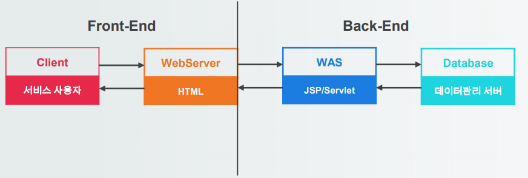
  - Web Server
    - 사용자에게 HTML 페이지나 jpg, png같은 이미지를 HTTP 프로토콜을 통해 웹브라우저에 제공하는 서버로, 내부의 내용이 이미 만들어져 있는 정적적인 요소들을 화면에 보여주는 역할을 한다.
    <table>
      <tr align=center>
        <th>종류</th>
        <th>설명</th>
      </tr>
      <tr>
        <td align=center>Apache</td>
        <td>Apache Software Foundation에서 만든 서버로 HTTP 통신에 대한 여러 라이브러리를 제공</td>
      </tr>
      <tr>
        <td align=center>Windows IIS</td>
        <td>Windows OS에서 제공하는 웹 서버로, 높은 수준의 보안성과 성능을 제공</td>
      </tr>
      <tr>
        <td align=center>NGINX</td>
        <td>무료 오픈 소스 서버로, 사용자 요청을 스레드가 아닌 확장성이 있는 이벤트 기반 설계를 통해 필요한 리소스만 할당하여 사용</td>
      </tr>
    </table>
  - WAS
    - Web Application Server의 약자로, 사용자가 요청한 서비스의 결과를 스크립트 언어 등으로 가공하여 생성한 동적인 페이지를 사용자에게 보여주는 역할
    <table>
      <tr align=center>
        <th>종류</th>
        <th>설명</th>
      </tr>
      <tr>
        <td align=center>toncat</td>
        <td>Apache Software Foundation에서 Servlet과 JSP를 통한 동적인 웹문서를 처리하기 위해 만든 웹 어플리케이션 서버</td>
      </tr>
      <tr>
        <td>wildfly</td>
        <td>JBOSS라고도 불리며, 톰캣이 제공하는 SErvlet Container뿐만 아니라, EJB Container를 별도로 제공하여 폭넓은 서비스를 구현</td>
      </tr>
      <tr>
        <td align=center>jeus</td>
        <td>국산 WAS로 대용량 데이터 트랜잭션을 고성능으로 처리하며 개발 및 운영에 관한 기술지원이 뛰어남</td>
      </tr>
    </table>
  - WAS에서 사용하는 언어
    <table>
      <tr align=center>
        <th>종류</th>
        <th>설명</th>
      </tr>
      <tr>
        <td align=center>jsp<br>(Java Server Pages)</td>
        <td>SUN사의 JAVA를 기반으로 웹 환경에 맞게 개발된 동적 웹 프로그래밍 언어</td>
      </tr>
      <tr>
        <td align=center>php<br>(Projessional<br>Hypertext<br>Preprocessor)</td>
        <td>Rasmus Lerdorf가 개발한 동적 웹페이지 생성 스크립트 언어<br>C, C++, Perl, Java등의 언어를 기반으로 하여 만들어 졌고, C언어 문법과 유사</td>
      </tr>
      <tr>
        <td align=center>asp<br>(Active Server Pages)</td>
        <td>Micro Soft에서 개발한 동적 웹 페이지 생성 스크립트 언어</td>
      </tr>
    </table>
  - Web Server VS WAS
    <table>
      <tr align=center>
        <th>구분</th>
        <th>장점</th>
        <th>단점</th>
      </tr>
      <tr>
        <td align=center>Web Server</td>
        <td>- 요청에 대한 결과 페이지만 전송하기 떄문에 처리속도가 빠름<br>- HTML같은 단순 문서로만 구성되어 있어 구현이 쉬움</td>
        <td>- 만들어진 정보만 보여주기 때문에 서비스가 한정적<br>- 문서의 내용이 변경될 경우 직접 수정</td>
      </tr>
      <tr>
        <td align=center>WAS</td>
        <td>- 여러 데이터 활용이 가능하여 다양한 서비스 제공 가능<br>- 문서의 내용이 변경될 경우 직접 수정하지 않음</td>
        <td>- 데이터를 처리하여 결과를 전송해야 하기 때문에 처리속도가 느림<br>- 서비스에 해당하는 소스를 직접 작성해야 하기 때문에 구현이 어려움</td>
      </tr>
    </table>
- 개발 환경 구축
  1. 현재 자바 버전 확인
      - Window -> Preferences -> Java -> Installed JREs -> jre 1.8 확인
  2. 아파치-톰캣 서버 버전 별 지원 정보 확인
      - http://tomcat.apache.org/ -> Which version?
  3. 아파치-톰캣 서버 다운로드
      - Tocat 8 -> 8.5.xx -> zip 파일 다운로드
  4. 아파치-톰캣 서버 설치
      - 다운로드한 zip 파일을 원하는 폴더에 압축 풀기
  5. 이클립스 필요 항목 추가
      - window -> show view -> Navigator
      - window -> show view -> others -> Package Explorer
      - window -> show view -> Servers
      - window -> show view -> others -> Problems
      - window -> show view -> Console
      - window -> Perspective -> Customize Perspective -> Shortcuts -> Java
      - window -> Perspective -> Customize Perspective -> Shortcuts -> web
  6. 문자 set 설정
      - JDBC때 진행했던 것과 동일
  7. 아파치 톰캣 서버 구성
      - window -> preferences -> Servers -> Runtime Environments -> Add
      - 다운받은 톰캣 버전 구성
      - Browse 후 압축 푼 아파치 톰캣 폴더 선택
      - 등록정보 확인 후 Apply and Close
  8. 아파치 톰캣 서버 등록
      - Servers -> 마우스 우클릭 -> New -> Server
      - 톰캣 버전 선택
      - Server Name은 볼 이름을 지정
      - Server runtime Environmnet 이전에 구성한 서버 목록이 뜸. 현재 1개지만 여러 개인 경우 여러개.
  9. 아파치 톰캣 서버 설정
      - 내가 사용할 port번호 지정
      - 여러 개 서버 운영 시 port번호 겹치지 않게 설정
      - 파일 업로드 시 경로지정을 위한 설정 checkbox를 반드시 check해줄 것
  10. 아파치 톰캣 서버 실행 테스트
      - 서버 실행 후 Server startup 메시지 확인
- Sevlet
  - 정의
    - Server + Applet의 합성어
    - JAVA 언어를 이용하여 사용자의 요청을 받아 처리하고 그 결과를 다시 사용자에게 전홍하는 역할의 Class 파일
    - 웹에서 동적인 페이지를 JAVA로 구현한 서버측 프로그램
  - Servlet 설계 규약
    1. 모든 서블릿은 javax.servlet.Servlet 인터페이스를 상속 받아 구현한다.
    2. 서블릿을 구현 시 Servlet 인터페이스와 ServletConfig 인터페이스를 javax.servlet.GenericServlet에 구현한다.
    3. HTTP 프로토콜을 사용하는 서블릿은 javax.servlet.http.HttpServlet클래스를 상속받는데 HttpServlet클래스는 javax.servletGenericServlet을 상속하여 구현된 클래스다.
    4. 서블릿의 Exception을 처리하기 위해서는 javax.servlet.ServletException을 상속 받아야 한다.
  - Servlet 동작 구조
    - Servlet 컨테이너 : 웹 서버 또는 응용 프로그램 서버의 일부로, 웹 서버에서 온 요청을 받아서 서블릿 class를 관리하는 역할(생명주기)을 한다. 컨테이너의 서블릿에 대한 설정은 Deployment Descriptor(web.xml)파일을 이용한다.  
    
  - 배포 서술자(Deployment Desciptor)
    - 어플리케이션에 대한 전체 설정정보를 가지고 있는 파일로 이 정보를 가지고 웹 컨테이너가 서블릿을 구동
    - xml 파일로 태그로 이루어져 있음
    - 어플리케이션 폴더의 WEB-INF폴더에 web.xml 파일
  - 설정정보
    - Servlet 정의 / Servlet 초기화 파라미터
    - Session 설정 파라미터
    - Servlet/jsp 매핑 / MIME type 매핑
    - 보안설정
    - Welcome file list 설정
    - 에러페이지, 리소스, 환경변수 설정
  - web.xml 파일 주요 태그
    <table>
      <tr align=center>
        <th>태그</th>
        <th>설명</th>
      </tr>
      <tr>
        <td align=center>web-app</td>
        <td>루트속성, 문법식별자 및 버전의 정보를 속성값으로 설정</td>
      </tr>
      <tr>
        <td align=center>context-param</td>
        <td>웹 어플리케이션에서 공유하기 위한 파라미터 설정</td>
      </tr>
      <tr>
        <td align=center>mime-mapping</td>
        <td>특정 파일 다운로드시 파일이 깨지는 현상을 방지하기 위한 설정</td>
      </tr>
      <tr>
        <td align=center><strong>servlet<br>servlet-class<br>sevlet-mapping</strong></td>
        <td>서블릿 매핑</td>
      </tr>
      <tr>
        <td align=center><strong>welcome-file-list</strong></td>
        <td>시작페이지 설정</td>
      </tr>
      <tr>
        <td align=center><strong>filter</strong></td>
        <td>필터정보 등록</td>
      </tr>
      <tr>
        <td align=center>error-page</td>
        <td>에러발생시 안내페이지 설정</td>
      </tr>
    </table>
  - 서블릿 매핑
    - client가 servlet에 접근할 때 원본 클래스명이 아닌 다른 명칭으로 접근시 사용 접근명칭과 클래스명을 매핑해주는 것
    - web.xml을 이용하는 방법 : web.xml에 태그를 이용하여 매핑 정보를 등록
    - @annotation을 이용하는 방법 : 해당 서블릿 클래스 상단에 @annotation을 이용하여 매핑정보 등록
  - web.xml을 이용한 방법
    ```
    <servlet>
      <servlet-name>mapping 명칭</servlet-name>
      <servlet-class>실제 클래스 명칭 </servlet-class>
    </servlet>
    <servlet-mapping>
      <servlet-name>mapping 명칭</servlet-name>
      <url-pattern>사용자 접근 명칭</url-pattern>
    </servlet-mapping>
    ```
  - @annotation을 이용한 방법
    ```
    @web-servlet(“매핑명칭”)
    public class 서블릿명칭 extends HttpServlet{
      Servlet 클래스 내용
    }
    
    - @annotation을 이용한 방식은 Servlet 파일 생성 시 바로 지정이 가능하고 편리하여 더 많이 사용
    ```
  - server.xml
    - WAS 서버에 대한 설정을 변경할 수 있는 파일
    - 설정 정보
      1. Context Path 설정(서버 내 애플리케이션 설정)
      2. 어플리케이션 포트 설정
      3. default 접속 경로 설정
      4. 특정 이벤트 설정
  - Context Path
    - 어플리케이션에 접근하는 경로
    - 어플리케이션의 root 경로(최상위 경로)
    - 하나의 WAS에 여러 프로젝트를 이용하여 다양한 어플리케이션을 사용이 가능한데 이를 구별해 주는 역할
  - 접속 방법
    ```
    http://서버아이피:[포트번호]/[Context Path]/Servlet 매핑 값
    ```
    - 포트 번호 80을 사용하는 경우 포트번호 생략가능(그 외 포트는 포트번호 입력)
    - 사용하는 어플리케이션이 1개인 경우 Context Path 또한 생략 가능하게 설정 가능
  - 서블릿 라이프 사이클
    1. 첫번째 요청인 경우, 객체를 생성하며 init() 메소드 호출
    2. 이후 작업이 실행 될 때마다 HTTP Type에 따른 doGet(), doPost() 메소드 호출
    3. 최종적으로 서블릿이 서비스 되지 않을 때(서버가 꺼질 때) destroy() 메소드 호출  
    ※ destroy() 메소드는 보통 서버가 종료되었을 때, 내용이 변경되어 재컴파일 될 때 호출  
    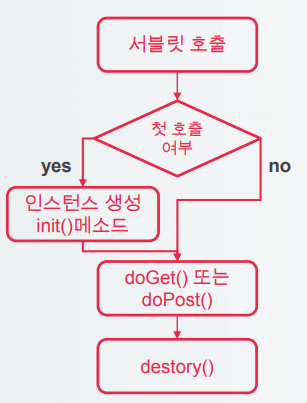
- Servlet
  - 동작 순서
    1. 전송 값에 한글이 있을 경우를 대비하여 인코딩 처리 
      ```
      request.setCharacterEncoding("utf-8");
      ```  
    2. 웹에서 보내준 데이터를 꺼내서 변수에 저장  
      ```  
      String test = request.getParameter("test");
      String test3 = request.getParameter("test3");
      System.out.println(test + "/" + test3);
      ```  
    3. 비지니스 로직 처리(Service 호출)  
    4. 처리 결과 내보내기(Response)  
      ```
      response.setContentType("text/html; charset=utf-8");
      PrintWriter out = response.getWriter();
      out.println("<html><head><title>result</title></head>");
      out.println("<body>");
      out.println("<h1>서블릿 호출 완료</h1>");
      out.println("</body></html>");
      ```

### 2.54 54일차(2020-04-23)
- Servlet 객체/메소드
  - 사용자 데이터 전송 방식
    1. get 방식 
        - URL 창 "?"뒤에 데이터를 입력하는 방법(쿼리 스트링)으로 전송
        - 전송할 데이터가 여러개인 경우 &를 이용하여 여러개 전송
        - 데이터 검색에 많이 사용되며, 데이터 크기에 한계가 있으며, 보안에 취약
    2. post 방식
        - HTTP 헤더의 내용으로 보내는 방식으로 데이터 크기에 제한이 없고, 보안이 뛰어남
        - 데이터 크기에 제한이 없기에 파일 업로드를 할 때는 post를 써야 한다.
  - 사용자 데이터 전송 수신 메소드
    1. doGet()
        - client에서 데이터를 get방식으로 전송하게 되면 호출되는 메소드
    2. doPost()
        - client에서 데이터를 post방식으로 전송하게 되면 호출되는 메소드
  - HttpServletRequest(interface)
    - Http Servlets을 위한 요청정보(requst infomation)를 제공
    - 인터페이스 구현은 컨테이너가 설정하며, 메소드만 사용
    - javax.servlet.ServletRequest를 상속
    <table>
      <tr align=center>
        <th>메소드</th>
        <th>설명</th>
      </tr>
      <tr>
        <td align=center>getParameter(String)</td>
        <td>client가 보내준 값이 저장된 명칭이 매개변수와 같은 명칭에 저장된 값을 불러오는 메소드</td>
      </tr>
      <tr>
        <td align=center>getParameterNames()</td>
        <td>client가 보내준 값을 저장한 명칭을 불러오는 메소드</td>
      </tr>
      <tr>
        <td align=center>getParameterValues(String)</td>
        <td>client가 보내준 값이 여러 개일 경우 그 값을 배열로 불러오는 메소드</td>
      </tr>
      <tr>
        <td align=center>getParameterMap()</td>
        <td>client가 보내준 값 전체를 Map방식으로 불러오는 메소드</td>
      </tr>
      <tr>
        <td align=center>setAttribute(String,Object)</td>
        <td>request 객체에 전달하고 싶은 값을 String 이름으로 Object객체로 저장하는 메소드</td>
      </tr>
      <tr>
        <td align=center>getAttribute(String)</td>
        <td>매개변수와 동일한 객체 속성 값을 불러오는 메소드</td>
      </tr>
      <tr>
        <td align=center>removeAttribute(String)</td>
        <td>request 객체에 저장되어 매개변수와 동일한 속성값을 삭제하는 메소드</td>
      </tr>
      <tr>
        <td align=center>setCharacterEncoding(String)</td>
        <td>전송 받은 request 객체의 값들의 CharacterSet을 설정해 주는 메소드</td>
      </tr>
      <tr>
        <td align=center>getRequestDispatcher(String)</td>
        <td>컨테이너내에서 request,response 객체를 전송하여 처리할 컴포넌트(jsp파일 등)를 불러오는 메소드로 forward() 메소드와 같이 사용</td>
      </tr>
    </table>
  - HttpServletResponse(interface)
    - 요청에 대한 처리결과를 작성하기 위해 사용하는 객체
    - 인터페이스 구현은 컨테이너가 설정하며, 메소드만 사용
    - javax.servlet.ServletResponse를 상속
    <table>
      <tr align=center>
        <th>메소드</th>
        <th>설명</th>
      </tr>
      <tr>
        <td align=center>setContentType(String)</td>
        <td>응답으로 작성하는 페이지의 MIME type을 정하는 메소드</td>
      </tr>
      <tr>
        <td align=center>setCharacterEncoding(String)</td>
        <td>응답하는 데이터의 CharacterSet을 지정해주는 메소드</td>
      </tr>
      <tr>
        <td align=center>getWriter()</td>
        <td>문자를 페이지에 전송하기 위한 Stream을 가져오는 메소드</td>
      </tr>
      <tr>
        <td align=center>getOutputStream()</td>
        <td>byte 단위로 페이지에 전송을 위한 Stream을 가져오는 메소드</td>
      </tr>
      <tr>
        <td align=center>sendRedirect(String)</td>
        <td>client가 매개변수의 페이지를 다시 서버에 요청하게 하는 메소드</td>
      </tr>
    </table>
- JSP
  - 개요
    - 동적인 웹페이지를 java 언어를 이용하여 html, xml 기반으로 작성할 수 있는 기술
    - Servlet은 수정시 재컴파일(서버재시작)을 해야 하지만 jsp는 동적으로 컴파일 하기 때문에 재컴파일 없이 유연하게 작업 가능
  - Servlet과 JSP 비교
    <table>
      <tr align=center>
        <th>구분</th>
        <th>Servlet</th>
        <th>JSP</th>
      </tr>
      <tr>
        <td align=center>형태</td>
        <td>Java 코드에 HTML 코드를 삽입</td>
        <td>HTML 코드에 Java 코드를 삽입</td>
      </tr>
      <tr>
        <td align=center>특징</td>
        <td>Business 로직 처리에 적합</td>
        <td>화면 로직 처리에 적합</td>
      </tr>
      <tr>
        <td align=center>예시</td>
        <td>out.println(“<html>”);</td>
        <td><% for(int i=0;i<10;i++) { %></td>
      </tr>
    </table>
  - JSP 실행 방식
    - client가 jsp 파일을 요청하면 서블릿화 한 후 다시 컴파일하여 응답  
    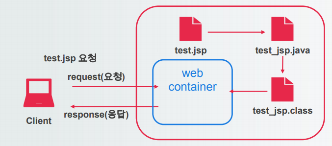
  - JSP 특징
    - JSP 파일이 변경되지 않는다면 '.jsp' 파일에 대한 컴파일은 다시 일어나지 않는다.
    - JSP 파일이 변경될 때마다, Web Container는 translation, compile, load, initialization 과정을 수행
    - JSP 파일의 배포 환경(위치)은 HTML과 동일
- JSP Elements
  - JSP Element 표기법
    <table>
      <tr align=center>
        <th>메소드</th>
        <th>설명</th>
      </tr>
      <tr align=center>
        <td>Comments tag</td>
        <td><%-- 주석내용 --%></td>
      </tr>
      <tr align=center>
        <td>Directive tag</td>
        <td><%@ 지시자 %></td>
      </tr>
      <tr align=center>
        <td>Declaration tag</td>
        <td><%! 선언문 %></td>
      </tr>
      <tr align=center>
        <td>Scriptlet tag</td>
        <td><% 코드 %></td>
      </tr>
      <tr align=center>
        <td>Expression tag</td>
        <td><%= 표현식 %></td>
      </tr>
    </table>
  - Comments tag
    ```
    1. HTML 주석
    <!-- HTML 주석 -->
    2. JSP 주석
    <%-- JSP 주석 -->
    3. Java 주석
    //, /*~*/
    ```
  - Directive tag
    - JSP 페이지 전체에 영향을 미치는 정보를 기술할 때 사용
    ```
    <%@ 지시자 속성="값" %>
    ```
    - 지시자 종류
    ```
    <%@ page import="java.io.*" %>
    - jsp 페이지에 대한 설정 정보를 컨테이너에 알려주는 지시자
    - 여러 개 사용 가능하지만 import를 제외하고는 한페이지당 1개만 선언
    
    <%@ include file="header.html" %>
    - 페이지 내부에 다른 jsp, html 페이지를 불러오는 지시자
    
    <%@ taglib uri="경로" prefix="a" %>
    - jsp 내부에서 EL, Action Tag Library, JSTL를 사용할 때 사용
    ```
  - Declaration tag
    - Servlet 클래스의 멤버변수/메소드에 해당하는 코드를 작성할 때 사용
    ```
    <%! public static final String PI = 3.14; %>
    <%! private int count; %>
    <%!
      public String test(){
        return “testName”;
      }
    %>
    ```
  - Scriptlet tag
    - _jspService 메소드의 로컬변수와 코드를 작성할 때 사용
    ```
    //로컬 변수 선언
    <% int i = 0; %>
    // 자바 코드 내용 기술
    <% if (i > 10) { %>
      <p>10 보다 큽니다.</p>
    <% } else { %>
      <p>10 보다 작습니다.</p>
    <% } %>
    ```
  - Expression tag
    - Servlet 코드에서 out.print의 역할을 수행
    ```
    <p> 현재 시간은 <%=new java.util.Date() %> 입니다.
    
    - ;이 들어가지 않는다.
    ```
- JSP 내장 객체
  - 정의
    - JSP에서 기본적으로 제공하는 객체들로 request, response, out 등 Scriptlet tag와 Expression tag에서 사용할 수 있도록 암시적으로 선언된 객체
  - JSP 내장객체의 종류
    <table>
      <tr align=center>
        <th>내장 객체</th>
        <th>설명</th>
      </tr>
      <tr>
        <td align=center>request</td>
        <td>HttpServletRequest 객체 참조 변수</td>
      </tr>
      <tr>
        <td align=center>resopnse</td>
        <td>HttpServletResponse 객체 참조 변수</td>
      </tr>
      <tr>
        <td align=center>out</td>
        <td>JspWriter 객체 참조 변수</td>
      </tr>
      <tr>
        <td align=center>session</td>
        <td>HttpSession 객체 참조 변수</td>
      </tr>
      <tr>
        <td align=center>application</td>
        <td>ServletContext 객체 참조 변수</td>
      </tr>
      <tr>
        <td align=center>page</td>
        <td>현재 JSP 페이지에 대한 참조 변수</td>
      </tr>
      <tr>
        <td align=center>exception</td>
        <td>발생 하는 Throwable 객체에 대한 참조 변수</td>
      </tr>
    </table>
  - JSP 내장객체의 영역(scope)
    <table>
      <tr align=center>
        <th>내장 객체</th>
        <th>설명</th>
      </tr>
      <tr>
        <td align=center>page</td>
        <td>하나의 JSP페이지를 처리할 때 사용되는 영역(한 페이지)</td>
      </tr>
      <tr>
        <td align=center>request</td>
        <td>하나의 요청을 처리할 때 사용되는 영역(다음 페이지)</td>
      </tr>
      <tr>
        <td align=center>session</td>
        <td>하나의 브라우저와 관련된 영역</td>
      </tr>
      <tr>
        <td align=center>application</td>
        <td>하나의 웹 어플리케이션과 관련된 영역</td>
      </tr>
    </table>
  - JSP 내장객체의 영역(scope)  
    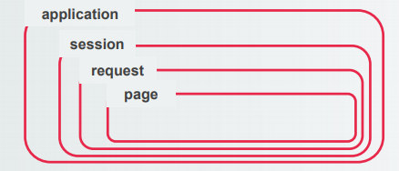
    <table>
      <tr align=center>
        <th>내장 객체</th>
        <th>설명</th>
      </tr>
      <tr>
        <td align=center>page</td>
        <td>하나의 JSP페이지를 처리할 때 사용되는 영역</td>
      </tr>
      <tr>
        <td align=center>request</td>
        <td>하나의 요청을 처리할 때 사용되는 영역</td>
      </tr>
      <tr>
        <td align=center>session</td>
        <td>하나의 브라우저와 관련된 영역</td>
      </tr>
      <tr>
        <td align=center>application</td>
        <td>하나의 웹 어플리케이션과 관련된 영역</td>
      </tr>
    </table>
  - request 객체 주요 메소드
    <table>
      <tr align=center>
        <th>메소드명</th>
        <th>설명</th>
      </tr>
      <tr>
        <td align=center>getParameter(name)</td>
        <td>name 파라미터의 값을 리턴한다.</td>
      </tr>
      <tr>
        <td align=center>getParameterValues(name)</td>
        <td>name 파라미터의 값을 배열 형태로 리턴한다.(checkbox)</td>
      </tr>
      <tr>
        <td align=center>getParameterNames()</td>
        <td> 요청에 포함된 파라미터 이름들을 리턴한다.</td>
      </tr>
      <tr>
        <td align=center>getMethod()</td>
        <td>현재 요청 방식을 리턴한다(GET, POST)</td>
      </tr>
      <tr>
        <td align=center>getSession()</td>
        <td>현재 세션 객체를 리턴한다.</td>
      </tr>
      <tr>
        <td align=center>setCharacterEncoding()</td>
        <td>클라이언트에서 서버로 전달된 값을 지정한 문자셋으로 변경한다.</td>
      </tr>
    </table>
  - response 객체 주요 메소드
    <table>
      <tr align=center>
        <th>메소드명</th>
        <th>설명</th>
      </tr>
      <tr>
        <td align=center>sendRedirect(url)</td>
        <td>응답 결과를 요청으로 하여 지정된 url에 재전송 한다.</td>
      </tr>
      <tr>
        <td align=center>setStatus(int statuscode)</td>
        <td>응답으로 전송될 상태 코드를 설정한다.</td>
      </tr>
      <tr>
        <td align=center>sendError(int statuscode)</td>
        <td>에러가 발생할 경우 응답 헤더에 상태 코드를 설정한다.</td>
      </tr>
      <tr>
        <td align=center>setContentType(String)</td>
        <td>서버에서 클라이언트로 전달될 값의 데이터 타입을 설정한다.</td>
      </tr>
    </table>
    
### 2.55 55일차(2020-04-24)
- JSP 지시자 태그
  - page 지시자 태그 사용법
    - 여러 개의 page 구문을 사용할 수 있지만, import 속성을 제외하고는 한 페이지에 한번씩만 선언할 수 있다.
    - page 지시자는 JSP파일 어느 위치에 와도 상관 없으나, 가장 첫 부분에 사용하는 것이 좋다.
    ```
    <%@ page import="java.io.*" %>
    <%@ page contentType="text/html" %>
    ```
  - import
    - 변환될 서블릿 클래스에 필요한 자바 클래스의 import 문을 정의한다.
    - java.lang, javax.servlet, javax.servlet.http, javax.servlet.jsp는 기본적으로 import 되어있다.
    - 여러 package import 시 ',' 기호를 이용하여 구분한다.
  - contentType
    - MIME 타입과 문자 인코딩을 설정한다.
    ```
    <%@ page import="java.io.*" %>
    <%@ page contentType="text/html:charset=utf8" %>
    ```
  - isErrorPage
    - 현재 페이지가 JSP 오류 처리용 페이지인지를 정의한다.
    - 값은 true or false(default)이다.
    - true인 경우, exception 내장 객체를 사용할 수 있다.
    ```
    <%@ page isErrorPage="true" %>
    ```
  - errorPage
    - 해당 JSP 페이지가 발생시키는 모든 runtime exception을 처리할 다른 JSP페이지를 지정한다.
    ```
    <%@ page errorPage="/error/errorForm.jsp" %>
    ```
  - include 지시자 태그
    - include 지시자 태그를 사용하면 다른 페이지(JSP,HTML)를 포함할 수 있다.
    ```
    <%@ page include file="페이지 경로" %>
    <%@ page include file="footer" %>
    ```
- JSP Exception 처리
  - 처리 방법
    - JSP페이지에서 발생하는 Exception을 처리하기 위해서는 별도의 예외처리 페이지를 지정한다.
    - 하나의 JSP 페이지에 대한 예외처리는 하나만 지정할 수 있기 때문에 예외마다 다른 예외 처리는 불가능하다.
    ```
    - 예외가 발생할 페이지
    <%@page errorPage="/error/exceptionPage.jsp" %>
    
    - 예외를 처리할 페이지
    <%@page isErrorPage="true" %>
    ```  
    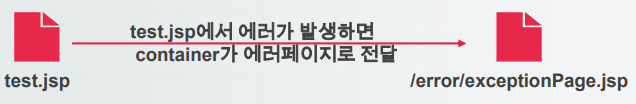
    
### 2.56 56일차(2020-04-27)
- Action Tag
  - JSP Action Tag
    - XML 기술을 이용하여 기존의 JSP 문법을 확장하는 메커니즘을 제공하는 태그
    - 웹 브라우저에서 실행되는 것이 아니라 웹 컨테이너에서 실행되고 결과만 브라우저 출력
    <table>
      <tr align=center>
        <th></th>
        <th>표준 액션 태그</th>
        <th>커스텀 액션 태그</th>
      </tr>
      <tr>
        <td align=center>사용법</td>
        <td>- JSP 페이지에서 바로 사용<br>- 태그 앞에 jsp 접두어가 붙음</td>
        <td>- 별도의 라이브러리 설치 필요<br>- 라이브러리 선언에 맞는 접두어가 붙음</td>
      </tr>
      <tr>
        <td align=center>예시</td>
        <td>jsp:include page="header.jsp"</td>
        <td>c:set var="cnt" value="0"</td>
      </tr>
    </table>  
    - 접두어란 태그 이름 앞에 XXX: 형식으로 제공하는 태그의 그룹을 지정하는 것  
    - 예시를 사용할 때는 양 옆에 "<"와 "/>"를 넣을것  
  - 표준 액션 태그
    - JSP에서 기본으로 제공하는 태그
    <table>
      <tr align=center>
        <th>태그 이름</th>
        <th>설명</th>
      </tr>
      <tr>
        <td align=center>jsp:include</td>
        <td>현재 페이지에 특정 페이지를 포함 할 때 사용</td>
      </tr>
      <tr>
        <td align=center>jsp:forward</td>
        <td>현재 페이지 접근 시 특정 페이지로 이동 시킬 때 사용</td>
      </tr>
      <tr>
        <td align=center>jsp:param</td>
        <td>jsp:incpude, jsp:forward의 하위 요소로 사용되며, 해당 페이지에 전달할 값을 기록할 때 사용</td>
      </tr>
      <tr>
        <td align=center>jsp:useBean</td>
        <td>JavaBean 객체를 사용하기 위한 태그</td>
      </tr>
      <tr>
        <td align=center>jsp:setProperty</td>
        <td>Java 객체 사용 시 Setter 역할과 동일</td>
      </tr>
      <tr>
        <td align=center>jsp:getProperty</td>
        <td>Java 객체 사용 시 Getter 역할과 동일</td>
      </tr>
    </table>
  - jsp:include
    - "<%@ include file=파일명 %>"과 쓰임새가 동일하나, jsp 파일이 java 파일로 변환될 때 삽입되는 "<%@ include %>"와 달리 jsp:include는 jsp파일이 java 파일로 바뀌고 컴파일이 완료되어 런타임 시 삽입 된다.
    ```
    <jsp:include page="파일명" />
    
    <jsp:include page="./header.jsp" />
    ```
  - jsp:forward
    - 하나의 JSP 페이지에서 다른 JSP 페이지로 요청 처리를 전달할 때 사용
    - 전달하는 페이지에서 request, response 객체가 같이 전달되며 URL은 변경되지 않음
    ```
    <jsp:forward page="파일명" />
    <% if(str.equals("A")) { %>
      <jsp:forward page="A_Page.jsp" />
    <% } else { %>
      <jsp:forward page="B_Page.jsp" />
    <% } %>
    ```
  - jsp:useBean
    - java class를 창조하여 빈 객체를 생성하고, setProperty와 getProperty를 통해 값을 저장, 조회할 수 있으며, 이미 같은 이름의 객체가 생성된 경우 기존 객체를 참조
    ```
    <jsp:useBean id="객체명" class="패키지명.클래스명" scope="범위"/>
    <jsp:useBean id="m" class="model.vo.Member" scope="request">
      <jsp:setProperty name="m" property="memberName" value="홍길동" />
    </jsp:useBean>
    ```
- EL
  - 정의
    - JSP 2.0 버전에서 추가된 것으로 "<%= %>", "out.print()"와 같이 JSP에 쓰이는 JAVA 코드를 간결하게 사용하는 방법으로, 화면에 표현하고자 하는 코드를 "${value}"의 형식으로 표현하여 작성하는 것
    ```
    <%= request.getParameter("name") %>
    
    ${param.name}
    ```
  - EL 연산자 기호
    <table align=center>
      <tr>
        <th>종류</th>
        <th>일반 연산자</th>
        <th>EL 기호 연산자</th>
      </tr>
      <tr>
        <td>덧셈,뺄셈 </td>
        <td>+, -</td>
        <td>+, -</td>
      </tr>
      <tr>
        <td>곱셈,나눗셈</td>
        <td>*, /</td>
        <td>*, div</td>
      </tr>
      <tr>
        <td>나머지 연산</td>
        <td>%</td>
        <td>mod</td>
      </tr>
      <tr>
        <td>and, or 연산</td>
        <td>&&, || </td>
        <td>and, or</td>
      </tr>
      <tr>
        <td>! 연산</td>
        <td>!</td>
        <td>not</td>
      </tr>
      <tr>
        <td>~ 보다 작다</td>
        <td>></td>
        <td>lt(less than)</td>
      </tr>
      <tr>
        <td>~ 보다 크다</td>
        <td><</td>
        <td>gt(greater than)</td>
      </tr>
      <tr>
        <td>작거나 같다</td>
        <td>>=</td>
        <td>le(less or equal)</td>
      </tr>
      <tr>
        <td>크거나 같다</td>
        <td><= </td>
        <td>ge(greater or equal)</td>
      </tr>
      <tr>
        <td>~와 같다</td>
        <td>==</td>
        <td>eq(equal)</td>
      </tr>
      <tr>
        <td>~와 다르다</td>
        <td>!=</td>
        <td>ne(not equal)</td>
      </tr>
      <tr>
        <td>null 값 처리</td>
        <td>value == null</td>
        <td>empty</td>
      </tr>
    </table>
  - EL 내장 객체
    <table>
      <tr align=center>
        <th>객체명</th>
        <th>설명</th>
      </tr>
      <tr>
        <td align=center>pageScope</td>
        <td>page 영역의 객체에 접근</td>
      </tr>
      <tr>
        <td align=center>requestScope</td>
        <td>request 영역의 객체에 접근</td>
      </tr>
      <tr>
        <td align=center>sessionScope</td>
        <td>session 영역의 객체에 접근</td>
      </tr>
      <tr>
        <td align=center>applicationScope</td>
        <td>application 영역의 객체에 접근</td>
      </tr>
      <tr>
        <td align=center>param</td>
        <td>전달된 파라미터 값을 받아올 때 사용</td>
      </tr>
      <tr>
        <td align=center>paramValues</td>
        <td>전달된 파라미터들을 배열로 받아올 때 사용</td>
      </tr>
      <tr>
        <td align=center>header</td>
        <td>사용자의 특정 헤더 정보를 받아올 때 사용</td>
      </tr>
      <tr>
        <td align=center>headerValues</td>
        <td>사용자의 헤더 정보를 배열로 받아올 때 사용</td>
      </tr>
      <tr>
        <td align=center>cookie</td>
        <td>${cookie.key명}으로 쿠기값을 조회</td>
      </tr>
      <tr>
        <td align=center>iniParam</td>
        <td>초기 파라미터를 조회</td>
      </tr>
      <tr>
        <td align=center>pageContext</td>
        <td>pageContext 경로를 조회</td>
      </tr>
    </table>
- JSTL
  - 정의
    - JSP Standard Tag Library의 약자
    - JSP에서 사용하는 커스텀 태그로, 공통으로 사용하는 코드의 집합을 사용하기 쉽게 태그화하여 표준으로 제공한것
  - 사용방법
    1. 라이브러 등록
    2. 선언
    ```
    <%@ taglib uri="http://java.sun.com/jsp/jstl/core" prefiex="c" %>
    ```
    3. 사용
    ```
    <c:out value="${welcome}"/>
    ```
  - JSTL 태그 종류
    <table>
      <tr align=center>
        <th>종류</th>
        <th>포기법</th>
      </tr>
      <tr>
        <td align=center>Core Tags</td>
        <td>- 변수와 url, 조건문, 반복문 등의 로직과 관련된 JSTL 문법 제공<br>- &#60;%@ taglib uri="http://java.sun.com/jsp/jstl/core" prefix="c" %&#62;</td>
      </tr>
      <tr>
        <td align=center>Formatting<br>Tags</td>
        <td>- 메시지 형식이나 숫자, 날짜 형식과 관련된 포맷 방식을 제공<br>- &#60;%@ taglib url="http://java.sun.com/jsp./jstl/fmt" prefix=“fmt” %&#62;</td>
      </tr>
      <tr>
        <td align=center>Function Tags</td>
        <td>- trim, substring과 같은 문자열 처리 함수를 제공<br>- &#60;%@ taglib url="http://java.sun.com/jsp./jstl/function" prefix=“fn” %&#62;</td>
      </tr>
      <tr>
        <td align=center>XML Tags</td>
        <td>- 데이터의 XML 파싱 처리 등 XML 문서를 다루는 함수를 제공<br>- &#60;%@ taglib url="http://java.sun.com/jsp./jstl/xml" prefix="x" %&#62;</td>
      </tr>
      <tr>
        <td align=center>SQL Tags</td>
        <td>- 페이지 내에서 DB를 연동하고, 쿼리를 실행할 수 있는 함수 제공<br>- &#60;%@ taglib url="http://java.sun.com/jsp./jstl/sql" prefix="sql" %&#62;</td>
      </tr>
    </table>
- core tags
  - <c:set>
    - 변수를 선언하고 그 변수에 초기값을 대입하는 기능의 태그
    - 자바 변수 선언 방식과 유사
    - scope 속성을 이용하여 속성 저장 가능(설정하지 않는 경우 page임)
    ```
    <c:set var="num" value=“100” scope="request" />
    ```
  - <c:set> 사용법
    - 변수 타입을 별도로 선언하지 않음
    - 초기값을 반드시 입력
    - <c:set>으로 선언한 변수는 EL식 안에서 사용가능
    - <c:set>으로 선언한 변수는 스크립틀릿 요소에서는 사용 불가
    - 스크립틀릿에서 선언된 변수는 <c:set>에서 사용 가능
    ```
    <% int num1=10, num2=20; %>
    
    <c:set var="sum" value="<%= num1+num2 %>" />
    
    ${sum}
    ```
  - <c:remove>
    - <c:set>을 이용해서 선언한 변수는 page, request, session, application영역에 속성으로 저장되기 때문에 이를 삭제하기 위한 태그
    ```
    <c:remove var="num" scope="request" />
    ```
  - <c:out>
    - <c:out>태그는 데이터를 출력할 때 사용하는 태그
    - <, >, & 특수문자를 자동으로 이스케이프 시퀀스(escape sequence)로 처리  
      ※ default : true
    ```
    <c:out value="글씨를 진하게 하려면<b>찐</b> 태그를 사용하면 됨" escapeXml=“false” />
    <c:out value="글씨를 진하게 하려면<b>찐</b> 태그를 사용하면 됨" escapeXml=“true” />
    ```
  - <c:if>
    - 자바의 if문과 비슷한 역할
    - <c:if>태그에서 조건식은 test라는 속성의 값으로 지정하며 반드시 EL 형식
    ```
    <c:if test="${num1 > num2}">
      num1이 더 큽니다!
    </c:if>
    ```
  - <c:choose>
    - 자바의 switc문과 비슷한 역할을 하는 태그
    - <c:when>, <c:otherwise> 태그와 함께 사용되는데, 각각 switch문의 case와 default절과 비슷한 역할을 수행
    ```
    <c:choose>
      <c:when test="${num == 0}">
        num은 0 입니다.
      </c:when>
      <c:when test="${num == 1}">
        num은 1 입니다.
      </c:when>
      <c:otherwise>
        num은 0도 1도 아닙니다.
      </c:otherwise>
    </c:choose>
    ```
  - <c:forEach>
    - 자바의 for, for~eachans에 해당하는 기능을 제공  
    <table>
      <tr align=center>
        <th>속성</th>
        <th>설명</th>
      </tr>
      <tr>
        <td align=center>items</td>
        <td>반복할 객체 명(Collection 객체)</td>
      </tr>
      <tr>
        <td align=center>begin</td>
        <td>반복이 시작할 요소 번호(0 ~ n)</td>
      </tr>
      <tr>
        <td align=center>end</td>
        <td>반복이 끝나는 요소 번호</td>
      </tr>
      <tr>
        <td align=center>step</td>
        <td>반복할 횟수 번호</td>
      </tr>
      <tr>
        <td align=center>var</td>
        <td>현재 반복 횟수에 해당하는 변수의 이름</td>
      </tr>
      <tr>
        <td align=center>varStatus</td>
        <td>현재 반복에 해당하는 객체의 요소</td>
      </tr>
    </table>
    - varStatus 속성
      <table>
        <tr align=center>
          <th>속성</th>
          <th>설명</th>
        </tr>
        <tr>
          <td align=center>current</td>
          <td>현재 반복 횟수</td>
        </tr>
        <tr>
          <td align=center>index</td>
          <td>반반복 라운드의 제로기반 인덱스(0 ~ n-1)</td>
        </tr>
        <tr>
          <td align=center>count</td>
          <td>반복 라운드의 1기반 인덱스(1 ~ n)</td>
        </tr>
        <tr>
          <td align=center>first</td>
          <td>- 현재 라운드가 반복을 통한 첫번째임을 의미</td>
        </tr>
        <tr>
          <td align=center>last</td>
          <td>현재 라운드가 반복을 통한 마지막 번째임을 의미</td>
        </tr>
      </table>
    
    - <c:forEach> 사용  
    ```
    <c:forEach items="${bookList}" var="book" varStatus="status">
      <tr>
        <td><c:out value="${status.count}" /></td>
        <td><c:out value="${book.name}" /></td>
      </tr>
    </c:forEach>
    ```  
  - <c:forTokens>
    - 문자열에 포함된 구분자를 통해 토큰을 분리해서 반복 처리
    - items 속성에는 토큰을 포함하는 문자열, delims속성에는 토큰 구분자를 기술
    ```
    <c:forTokens items="yellow blue pink" var="color" delims=" ">
      ${color} <br>
    </c:forTokens>
    ```
  - <c:url>
    - url 경로를 생성하고, 해당 url의 param속성을 선언하여 쿼리스트링을 정의할 수 있는 태그
    - 쿼리스트링을 미리 정의하여 제어
    ```
    <c:url var="url" value="/jstl1.jsp">
      <c:param name="name" value="abc" />
    </c:url>
    
    <a href="${url}">JSTL페이지로 이동</a>
    
    ※ <a href="/jstl1.jsp?name=abc">JSTL페이지로 이동</a>과 동일
    ```

### 2.57 57일차(2020-04-28)
- 페이징 처리 시 필요한 값
  1. 사용자한테 받아야 하는 값
      - 요청한 페이지 번호 : int reqPage
  2. 개발자가 결정해야 하는 값
      - 한 페이지당 게시물 수 : int numPerPage
      - 한번에 표시할 페이지 수 : int pageNaviSize
      - 페이지 표현 방식(1~5 : 1 2 3 4 5, 6~10 : 6 7 8 9 10) : reqPage에 종속됨
  3. DB에서 조회해올 값
      - 해당 페이지의 게시물 List
      - 전체 게시물 수 : totalPage
  ```
  SELECT *
  FROM(
    SELECT ROWNUM AS RNUM, N.*
    FROM (
      SELECT * FROM NOTICE ORDER BY NOTICE_NO DESC
    ) N
  ) WHERE RNUM BETWEEN 1 AND 10;
  ```

### 2.58 58일차(2020-04-29)
- 게시판 입력시 주의사항
  - form 태그에 enctype=multipart/form-data입력 필수
  - enctype을 설정하면 모든 데이터가 null로 입력됨
  - 파일업로드
    1. 파일 업로드 경로 지정
    ```
    String root = getServletContext().getRealPath("/");	//WebContent폴더를 호출
    String saveDirectory = root + "upload/notice";
    ```
    2. 업로드 파일 크기 지정
    ```
    int maxSize = 10 * 1024 * 1024;
    ```
    3. request를 MultipartRequest객체로 변경
    ```
    MultipartRequest mRequest = new MultipartRequest(request, 
      saveDirectory, maxSize, "utf-8", new DefaultFileRenamePolicy());
    
    - 매개변수 종류 
      1. 변환할 request
      2. 저장할 폴더 위치
      3. 파일의 최대 크기
      4. 인코딩
      5. 중복 파일 발견시 처리 방법
    ```
    4. 오리지널 파일 이름과 실제 저장되는 파일의 이름을 각각 저장
    ```
    n.setFilename(mRequest.getOriginalFileName("filename"));
    n.setFilepath(mRequest.getFilesystemName("filename"));
    ```
  - 파일다운로드
    1. 경로설정
    ```
    String root = getServletContext().getRealPath("/");
		String saveDirectory = root + "upload/notice/";
    ```
    2. 스트림 생성
    ```
    - 파일과 연결하는 스트림
    FileInputStream fis = new FileInputStream(saveDirectory + filepath);
    BufferedInputStream bis = new BufferedInputStream(fis);
    
    -파일을 내보내기 위한 스트림
    ServletOutputStream sos = response.getOutputStream();
    BufferedOutputStream bos = new BufferedOutputStream(sos);
    ```
    3. 브라우저 종류에 따른 파일 이름 셋팅
    ```
    String resFilname = "";
		//브라우저가 IE인지 확인
    boolean bool = 
      request.getHeader("user-agent").indexOf("MSIE") != -1 || 
      request.getHeader("user-agent").indexOf("Trident") != -1;
      
    if (bool) {//IE인 경우
      resFilname = URLEncoder.encode(filename, "UTF-8");
      resFilname = resFilname.replace("\\\\", "%20");
    } else {//나머지 브라우저인 경우
      resFilname = new String(filename.getBytes("UTF-8"), "ISO-8859-1");
    }
    ```
    4. 파일 다운로드를 위한 HTTP Header 설정
    ```
    response.setContentType("application/octet-stream");
    response.setHeader("Content-Disposition", "attachment; filename=" +resFilname);
    ```
    5. 파일 전송
    ```
    int read = -1;
    while((read = bis.read()) != -1) {
      bos.write(read);
    }
    ```
  - 게시글 수정 중 파일 처리
    1. 파일 상태를 위한 if 및 input[type=hidden] 태그 추가
    ```
    <!-- 데이터 삭제 상태를 저장하기 위한 status --!>
    <input type="hidden" name="status" value="stay">
    <!-- 파일이 업로드 된 경우 --!>
    <c:if test="${not empty n.filename }">
      
      <input type="file" name="filename" id="file" style="display: none;">
      <span class="delFile">${n.filename }</span>
      <button type="button" id="fileDelBtn" class="btn btn-primary btn-sm delFile">파일삭제</button>
      <!-- 파일이 업로드 된 경우 기존 파일의 이름과 경로를 저장한다 --!>
      <input type="hidden" name="oldFilename" value="${n.filename }">
      <input type="hidden" name="oldFilepath" value="${n.filepath }">
    </c:if>
    
    <!-- 파일이 업로드 되지 않은 경우 --!>
    <c:if test="${empty n.filename }">
      <input type="file" name="filename">
    </c:if>
    ```
    2. 파일 삭제 버튼을 눌렀을 때 동작 script 작성
    ```
    <script>
    $(function() {
      $("#fileDelBtn").click(function() {
        $(".delFile").hide();
        $("#file").show();
        $("input[name=status]").val("delete");
      });
    });
    </script>
    ```
    3. Servlet에서 새 파일이 들어오지 않은 상태에서의 기존 값 유지
    ```
    /*새 파일이 들어오지 않은 상태에서는 기존 값을 유지를 해야 함.
    새 파일이 들어오지 않은 상태는 filename의 값이 null인 경우이다.
    이런 경우 기존 값을 유지하지 않으면 DB에 null이 자동으로 들어가게 된다.
    이를 해결하기 위해 새파일이 들어오지 않았다면 filename과 filepath를 기존 값으로 되돌린다.*/
    if(n.getFilename() == null) {
      if (status.equals("stay")) {
        n.setFilename(oldFilename);
        n.setFilepath(oldFilepath);
      }
    }
    
    - DB Update는 위의 기존값 유지 처리를 먼저 한다.
    ```
    4. Servlet에 파일 삭제 행위를 하고 난 후의 처리
    ```
    //status가 delete로 바뀐 경우 즉, 파일 삭제 버튼을 누른 경우 기존 파일을 삭제하는 작업을 한다.
    if (status.equals("delete")) {
      File delFile = new File(saveDirectory + oldFilepath);
      delFile.delete();
    }
    ```

### 2.59 59일차(2020-04-30)

### 2.60 60일차(2020-05-01)
- 기획보고서
  1. 프로젝트 명/팀 이름
  2. 프로젝트 명 소개
  3. 팀 소개/역할분담
  4. 기획 의도
  5. 유사 사이트 분석
  6. 개발 목표 및 설계 주안점
  7. 개발 환경
  8. 주요 기능 및 기능 상세
  9. 작업 일정
- UI 설계 보고서
  - 정의
    - 구현할 기능
  - 다이어그램
    1. 플로우 차트
    2. 와이어 프레임
    3. 유스케이스
  - ERD
    - 정의
      -Entity
- 클래스 설계 보고서
  1. 클래스 다이어그램
  2. 시퀀스 다이어그램
- 최종 발표 보고서
  - 정의
    - 프로젝트 진행 중 작성한 보고서들을 요약하여 첨부하고,
  
### 2.61 61일차(2020-05-04)
- 게시글 댓글
  1. 테이블 생성
  ```
  CREATE TABLE NOTICE_COMMENT (
    NOTICE_COMMENT_NO NUMBER PRIMARY KEY,
    NOTICE_COMMENT_LEVEL NUMBER DEFAULT 1,
    NOTICE_COMMENT_WRITER VARCHAR2(20),
    NOTICE_COMMENT_CONTENT VARCHAR2(1000),
    NOTICE_REF NUMBER,
    NOTICE_COMMENT_REF NUMBER,
    NOTICE_COMMENT_DATE DATE DEFAULT SYSDATE,
    CONSTRAINT FK_NOTICE_COMMENT_WRITER FOREIGN KEY(NOTICE_COMMENT_WRITER) 
    REFERENCES MEMBER(MEMBER_ID) ON DELETE SET NULL,
    CONSTRAINT FK_NOTICE_REF FOREIGN KEY(NOTICE_REF)
    REFERENCES NOTICE(NOTICE_NO) ON DELETE CASCADE,
    CONSTRAINT FK_NOTICE_COMMENT_REF FOREIGN KEY(NOTICE_COMMENT_REF)
    REFERENCES NOTICE_COMMENT(NOTICE_COMMENT_NO) ON DELETE CASCADE
  );
  
  - NOTICE_COMMENT_NO : 댓글 번호.
  - NOTICE_COMMENT_LEVEL : 댓글, 대댓글 구분용. 댓글의 댓글일 경우 레벨2.
  - NOTICE_COMMENT_WRITER : 작성자. 외래키로 MEMBER 테이블의 MEMBER_ID를 가져온다.
  - NOTICE_COMMENT_CONTENT : 댓글 내용.
  - NOTICE_REF : 게시글 번호. 외래키로 NOITCE 테이블의 NOTICE_NO를 가져온다.
  - NOTICE_COMMENT_REF : 어떤 댓글의 대댓글인지 확인하는데 사용한다. 자기 자신 테이블의 NO를 가져온다.
  - NOTICE_COMMENT_DATE : 댓글 작성일.
  ```
  2. 댓글용 시퀀스 생성
  ```
  CREATE SEQUENCE SEQ_NOTICE_COMMENT;
  ```

### 2.62 62일차(2020-05-06)
- Filter
  - 정의
    - 클라이언트와 서버 사이에서 request와 response 객체를 필터가 먼저 받아 사전/사후작업 등 공통적으로 필요한 부분을 처리하는 것
    - 웹 브라우저가 필요한 서블릿을 호출할 경우, 필터가 대신 호출되어 전달받은 정보를 수정하고 서블릿에게 넘기는 일종의 경유지 역할을 수행
  - Filter Interface의 메소드
    - init(FilterConfig config) : 웹 컨테이너가 필터를 호출할 경우 해당 메소드가 호출되어 필터 객체를 생성하며 초기화한다.(생성자)
    - doFilter(ServletRequest request, ServletResponse response, FilterChain chain) : 필터가 수행될 때 구동하는 메소드로, 요청 객체와 응답 객체를 사용해 일련의 작업을 수행한 뒤, chain을 통해 가공된 값을 목적지로 전송한다.
    - destroy() : 역할이 끝난 필터는 웹 컨테이너에 의해 해당 메소드를 호출하고 소멸된다.
    - 필터는 Filter Interface를 implements하여 구현한 클래스를 web.xml에 등록하여 사용
  - Filter 작성
    ```
    pacakge common.filter;
    
    public class CharsetEncodingFilter implements Filter {
      public void init(FilterConfig fConfig) throws ServletException {
      }
      
      public void destroy() {
      
      }
      
      public void doFilter(SevletRequest req, ServletResponse res, FilterChain chain)
          throws IOEception, ServletException {
          
        req.setCharacterEncoding("utf-8");
        chain.doFilter(req, res);
      }
    }
    ```
  - Filter 등록
    - web.xml에서 등록한다.
    - 패키지명부터 클래스명까지 다 입력해야 함
    ```
    <filter>
      <filter-name>EncodingFilter</filter-name>
      <filter-class>common.filter.CharsetEncodingFilter</filter-class>
    </filter>
    <filter-mapping>
      <filter-name>EncodingFilter</filter-name>
      <url-pattern>/*</url-pattern>
    </filter-mapping>
    ```
- ajax
  - 정의
    - 서버로부터 데이터를 가져와 전체 페이지를 새로 고치지 않고 일부만 로드할 수 있게 하는 기법으로 비동기식 요청을 보내는데 필요한 기술
    - AJAX : Asynchronous JavaScript And XML
  - ajax의 장단점
    - 장점
      1. 비동기식 방식으로 웹서버의 응답을 기다리지 않고 데이터를 빠르게 처리
      2. 페이지 리로딩 없이 처리
    - 단점
      1. 한 페이지에 지속적으로 사용 시 리소스가 쌓여 페이지가 느려짐
      2. 스크립트로 되어 있어 에러 발생 시 디버깅이 어려움
  - 동기식 처리모델
    - 페이지가 로드되는 동안 브라우저는 script문이 실행되면 그 실행이 종료될 때 까지 기다렸다가 종료되면 나머지 페이지를 로드하는 방식
  - 비동기식 처리모델
    - 페이지가 로드되는 동안 브라우저는 먼저 서버데이터 요청 script문을 실행한 후 나머지 페이지를 계속 로드하고 페이지와 상호작용을 처리하며, script요청 데이터를 기다리지 않는다. 그리고 요청 데이터가 도착하면 그때 이벤트가 발생하면서 지정된 함수가 호출되어 실행되는 방식
- Javascript ajax
  - XMLHttpRequest
    - 비동기식으로 서버에 요청(Request)을 보내기 위한 객체로 요청 및 응답을 처리
    - 속성
    <table>
      <tr align=center>
        <th>속성명</th>
        <th>내용</th>
      </tr>
      <tr>
        <td align="center">onreadystatechange</td>
        <td>readyState속성이 변경될 때 호출되는 메소드를 저장하는 변수</td>
      </tr>
      <tr>
        <td align="center">readyState</td>
        <td>객체의 상태를 저장하는 변수</td>
      </tr>
      <tr>
        <td align="center">responseText</td>
        <td>응답 결과를 문자열로 저장하는 변수</td>
      </tr>
      <tr>
        <td align="center">responseXML</td>
        <td>응답 결과를 XML data로 저장하는 변수</td>
      </tr>
      <tr>
        <td align="center">status</td>
        <td>전송/응답 결과를 저장하는 변수(코드값)</td>
      </tr>
      <tr>
        <td align="center">statusText</td>
        <td>전송/응답 결과를 저장하는 변수(문자열)</td>
      </tr>
    </table>
    - readyState 속성 값
    <table>
      <tr align=center>
        <th>속성명</th>
        <th>내용</th>
      </tr>
      <tr>
        <td align="center">0</td>
        <td>요청이 시작되지 않은 상태 / open메소드가 호출되지 않음</td>
      </tr>
      <tr>
        <td align="center">1(loading)</td>
        <td>서버와 접속된 상태 / send메소드가 호출되지 않음</td>
      </tr>
      <tr>
        <td align="center">2(loaded)</td>
        <td>send메소드가 호출되고 헤더는 도착하지 않은 상태</td>
      </tr>
      <tr>
        <td align="center">3(interactive)</td>
        <td>일부 데이터를 받은 상태</td>
      </tr>
      <tr>
        <td align="center">4(completed)</td>
        <td>요청을 완료하고 응답하는 상태</td>
      </tr>
    </table>
    - status 속성 값
    <table>
      <tr align=center>
        <th>속성명</th>
        <th>내용</th>
      </tr>
      <tr>
        <td align="center">200(OK) </td>
        <td>요청 성공</td>
      </tr>
      <tr>
        <td align="center">404(Not Found)(loading)</td>
        <td>페이지 없음</td>
      </tr>
      <tr>
        <td align="center">500(Internal Server Error)(loaded)</td>
        <td>서버 오류 발생</td>
      </tr>
    </table>
  - 처리절차
    1. srcipt문에 요청을 위한 XMLHttpRequest 객체 생성
    ```
    - IE7 이상, safari, firefox, opera, chrome
    var httpReqeuest = new XMLHttpRequest();
    
    - IE6
    var httpRequest = new ActiveXObject(Microsoft.XMLHTTP);
    ```
    2. 서버의 응답을 처리하는 함수 설정
    ```
    - XMLHttpRequest 객체 생성 후 속성값에 함수를 저장
    
    var httpRequest = new XMLHttpRequest();
    httpRequest.onreadystatuschange = 실행할 함수명;
    
    또는
    
    httpRequest.onreadystatuschange = function(){
      처리로직
    }
    ```
    3. 요청 대상 설정/요청 처리
    ```
    - XMLHttpRequest 객체 생성 후 open 메소드로 요청대상 설정
    var httpRequest = new XMLHttpRequest();
    
    // 요청 대상 설정
    httpRequest.open( 전송방법, 요청페이지, 동기식/ 비동기식설정);

    // 요청 처리
    httpRequest.send(“param 값”);
    
    - send시 시 param 값은 post 인경우에는 필수, get 인경우에는 요청페이지에서 서 처리 가능
    ```
    4. 응답 처리
    ```
    - XML HttpRequest 객체 생성 후 속성값으로 응답 처리(text)
    var httpRequest = new XMLHttpRequest();
    
    httpRequest.onreadystatechange = function(){
      if(httpRequest.readyState == 4){// 요청이 완료되었고 
        if(httpRequest.status==200){// 정상적으로 결과가 수신되었을 때
          // 서버에서 보내준 데이터를 자바스크립트 변수에 저장
          
          var value = httpRequest.responseText;
          // 서버에서 보내준 데이터를 이용하여 HTML 페이지 변경
        }
      }
    }
    
    - XMLHttpRequest 객체 생성 후 후 속성값으로 응답 처리(XML)
    var httpRequest = new XMLHttpRequest();

    httpRequest.onreadystatechange = function(){
      if(httpRequest.readyState == 4){// 요청이 완료되었고
        if(httpRequest.status==200){// 정상적으로 결과가 수신되었을 때
          // 서버에서 보내준 데이터를 자바스크립트 변수에 저장
          var value = httpRequest.responseXML;
          
          //XML 에서 원하는 데이터만 추출하는 법
          var xml = value.getElementsByTagName("태그명");
        }
      }
    }
    ```
- JSON과 XML
  - JSON : JavaScript Object Notation 의 약자로 자바스크립트 객체를 표현하기 위한 표기법으로 각언어별로 객체 표현방법이 달라서 통일하기 위해 사용 형식
  ```
  {key1:value1, key2:value2, key3:value3}
  ```
  - XML : Extensible Markup Language의 약자로 HTML과 매우 비슷한 문자 기반의 마크업 언어로 사람과 기계가 동시에 읽기 편한 구조로 되어 있음
  ```
  <태그명1>값1</태그명1>
  <태그명2>값2</태그명3>
  <태그명3>값3</태그명3>
  ```
- jQuery ajax
  - $.ajax()를 이하여 처리
    1. url 속성을 통해 전송할 url 주소 설정
    2. data 속성을 통해 전달할 데이터 설정
    3. 성공, 실패 시 시 처리할 로직을 함수로 선언
    4. 반드시 처리할 로직을 선언
  - $.ajax()의 주요 속성
    <table>
      <tr align=center>
        <th>속성명</th>
        <th>내용</th>
      </tr>
      <tr>
        <td align="center">url</td>
        <td>데이터를 전송할 URL의 주소 설정</td>
      </tr>
      <tr>
        <td align="center">data</td>
        <td>서버에 전송할 데이터를 key:value 형식으로 설정(js객체)</td>
      </tr>
      <tr>
        <td align="center">datatype</td>
        <td>서버가 리턴하는 데이터의 타입 설정(text,xml,json,html)</td>
      </tr>
      <tr>
        <td align="center">type</td>
        <td>서버로 전송하는 형식 지정(GET, POST)</td>
      </tr>
      <tr>
        <td align="center">success</td>
        <td>통신 성공했을 때 처리할 로직을 함수로 작성</td>
      </tr>
      <tr>
        <td align="center">error</td>
        <td>통신 실패했을 때 처리할 로직을 함수로 작성</td>
      </tr>
      <tr>
        <td align="center">complete</td>
        <td>통신 시 반드시 실행할 로직을 함수로 작성</td>
      </tr>
    </table>
  - $.ajax()를 이용한 처리
    ```
    $.ajax({
      url : "/test",              //1. 전달할 servlet url mapping
      data : {id: "idid"},        //2. 전달할 데이터
      type : "get",               //3. 전달 방식 지정
      success : function(data){   //4-1. 성공 시 처리할 함수
        //서버에서 보내준 데이터는 매개변수인 data로 받음
        ...
      },
      error : function(){         //4-2. 실패 시 처리할 함수
        ...
      },
      complete : function(){      //5. 반드시 처리할 절차
        ...
      }
    )}
    ```

### 2.63 63일차(2020-05-07)

### 2.64 64일차(2020-05-08)
- UML(Unified Modeling Language)
  - 정의
    - 소프트웨어 공학에서 사용되는 표준화된 범용 모델링 언어로 소프트웨어 개념을 다이어그램으로 그리기 위해 사용하는 시각적 표기법
  - UML의 필요성
    1. 의사소통하기 좋다.
    2. 대규모 프로젝트 구조의 로드맵을 만들 때 유용하다.
    3. 개발할 시스템 구축에 대한 기초를 마련할 수 있다.
    4. 백엔드 문서용으로 사용하기 좋다. -> 진행하던 프로젝트를 다른 팀이 맡을 경우 유용
  - UML의 종류
    <table>
      <tr align=center>
        <th>종류</th>
        <th>설명</th>
      </tr>
      <tr>
        <td align=center>클래스 다이어그램</td>
        <td>시스템을 구성하는 클래스</td>
      </tr>
      <tr>
        <td align=center>객체 다이어그램</td>
        <td>시스템 실행 중 어느 시간의 객체와 관계를 보여줌(특정 시점의 메모리 상태를 표현)</td>
      </tr>
      <tr>
        <td align=center>패키지 다이어그램</td>
        <td>패키지들과 그들 사이의 의존성을 보여줌으로 시스템의 큰 구조를 표현</td>
      </tr>
      <tr>
        <td align=center>유스케이스 다이어그램</td>
        <td>Actor와 시스템이 수행하는 활동간의 관계를 표시하며, 시스템의 기능적인 요구사항을 설명하기 위한 도구</td>
      </tr>
      <tr>
        <td align=center>시퀀스 다이어그램</td>
        <td>시간 흐름에 따른 객체 사이의 상호작용을 표현</td>
      </tr>
    </table>
    - 명시된 것 이외에도 다양한 UML 다이어그램이 존재함
- 클래스 다이어그램
  - 정의
    - 동일한 속성과 행위를 수행하는 객체의 집합
    - 객체를 생성하는 설계도
  - 클래스 다이어그램 기본 구조  
    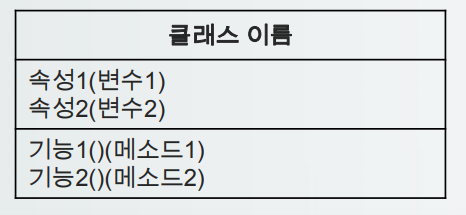
  - 클래스 다이어그램의 접근제어 지시자 표시
    <table>
      <tr align=center>
        <th>접근제어지시자</th>
        <th>표시</th>
        <th>설명</th>
      </tr>
      <tr>
        <td align=center>public</td>
        <td align=center>+</td>
        <td>어떤 클래스의 객체에서든 접근 가능</td>
      </tr>
      <tr>
        <td align=center>private</td>
        <td align=center>-</td>
        <td>해당 클래스 내부에서만 접근 가능</td>
      </tr>
      <tr>
        <td align=center>protected</td>
        <td align=center#>#</td>
        <td>동일한 패키지에 있거나 상속관계에 있는 경우 접근 가능</td>
      </tr>
      <tr>
        <td align=center>default</td>
        <td align=center>~</td>
        <td>동일한 패키지에 있는 클래스의 객체에서만 접근 가능</td>
      </tr>
    </table>
  - 클래스 사이의 관계 표현
    - 클래스 사이의 여러 종류의 관계선을 이용하여 표현
    <table>
      <tr align=center>
        <th>관계명</th>
        <th>선종류</th>
        <th>설명</th>
      </tr>
      <tr>
        <td align=center>Dependency</td>
        <td align=center>-----------------></td>
        <td>클래스간의 지역변수에서 참조하는 관계</td>
      </tr>
      <tr>
        <td align=center>Aggregation</td>
        <td align=center>─────────◇</td>
        <td>클래스간의 지역변수에서 참조하고 는 관계로 두 클래스의<br> 라이프사이클이 다를 때</td>
      </tr>
      <tr>
        <td align=center>Composition</td>
        <td align=center>─────────◆</td>
        <td>클래스간의 지역변수에서 참조하고 는 관계로 두 클래스의<br> 라이프사이클이 같을 때</td>
      </tr>
      <tr>
        <td align=center>Generalization</td>
        <td align=center>─────────▷</td>
        <td>클래스 상속 관계를 의미</td>
      </tr>
      <tr>
        <td align=center>Realization</td>
        <td align=center>-----------------▷</td>
        <td>상속관계를 의미하지만 interface의 implements를 의미</td>
      </tr>
    </table>
    
    - Dependency : 한 클래스가 다른 클래스의 멤버를 참조 할 때 사용  
    ```
      public Class Member{
        private String id;
        public void func1(){
          System.out.println(id);
        }
      }

      public Class A{
        public void func2(){
          Member m = new Member();
          m.func1();
        }
      }
    ```
    - Aggregation 관계 : A 클래스 내부에 B 클래스 변수가 있는 경우 매개변수를 통해 B 클래스 객체를 연결하는 경우 두 클래스 객체간의 라이프 사이클이 달라지게 되고 이러한 관계가 Aggregation 관계이다.
    ```
      public Class Member{
        private String id;
        public void func1(){
          System.out.println(id);
        }
      }

      public Class A{
        private Member m;
        public A(Member m1){
          m = m1;
        }
      }
    ```
    - Composition 관계 : A 클래스 내부에 B 클래스 변수가 있는 경우 생성자를 통해 B 클래스 객체를 생성하는 경우 라이프 사이클이 동일한데 이 관계가 Composition이다.
    ```
      public Class Member{
        private String id;
        public void func1(){
          System.out.println(id);
        }
      }

      public Class A{
        private Member m;
        public A(){
          m = new Member();
        }
      }
    ```
    - Generailztion 관계 : 한 클래스가 다른 클래스를 상속하는 관계
    ```
      public Class Member{
        private String id;
        public void func1(){
          System.out.println(id);
        }
      }

      public Class A extends Member{
        public void func2(){
          ...
        }
      }
    ```
    - Realization 관계 : 상속해서 구현해야 하는 인터페이스를 의미한다.(implements)
    ```
      public interface Member{
        public void func1();
      }

      public Class A implements Member{
        @Override
        public void func1(){
          ...
        }
      }
    ```
- 유스케이스 다이어그램
  - 정의
    - Actor와 시스템이 수행하는 활동간의 관계를 표시하며 시스템의 기능적인 요구사항을 설명하기 위한 도구
  - 유스케이스 다이어그램 구성요소
    <table>
      <tr align=center>
        <th>구성요소</th>
        <th>설명</th>
      </tr>
      <tr>
        <td align=center>Actor</td>
        <td>시스템 외부에 있으면서 시스템과 상호 작용을 하는 사람 또는 시스템</td>
      </tr>
      <tr>
        <td align=center>System</td>
        <td>만들고자 하는 어플리케이션</td>
      </tr>
      <tr>
        <td align=center>Usecase</td>
        <td>시스템이 엑터에게 제공해야 하는 기능의 집합</td>
      </tr>
      <tr>
        <td align=center>Relation</td>
        <td>액터와 유스케이스 사이의 의미 있는 관계</td>
      </tr>
    </table>
  - Actor
    - 시스템의 외부에 있고 시스템과 상호작용을 하는 사람 또는 시스템
    - 원과 선을 조합하여 사람 모양으로 표현하고 아래 또는 위에 역할 작성
  - System
    - 만들고자 하는 프로그램
    - 유스케이스들을 둘러싼 사각형 틀로 시스템 명칭을 안쪽 상단에 작성
  - Uscase
    - 시스템이 액터에게 제공해야 하는 기능
    - 사용자 입장에사 바라본 시스템의 기능
    - 타원으로 표시하고 안쪽에 유스케이스 명을 작성한다.
  - Relation - 연간관계
    - 유스케이스와 엑터간의 상호작용이 있음을 표현
    - 사용자가 글을 등록한다는 기능과 상호작용이 있다는 것을 의미
  - Relation - 의존관계1(include)
    - 포함관계(include)는 하나의 유스케이스가 다른 유스케이스의 실행을 전제로 할 때 형성되는 관계로, 해당 유스케이스를 실행하기위해 반드시 실행되어야 하는 경우 적용
    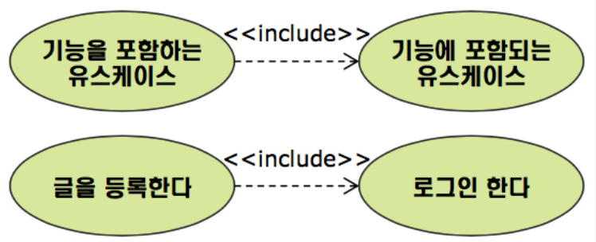
  - Relation - 의존관계2(extend)
    - 확장관계(extend)는 확장 대상 유스케이스를 수행할 때 특정 조건에 따라 확장 기능 유스케이스를 수행하는 경우 적용
    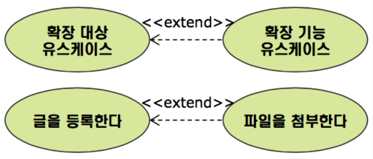
  - Relation - Generalization
    - 일반화 관계(Generalization)는 유사한 유스케이스 또는 액터를 모아 추상화한 유스케이스 또는 액터와 연결시켜 그룹을 만들어 이해도를 높이기 위함
    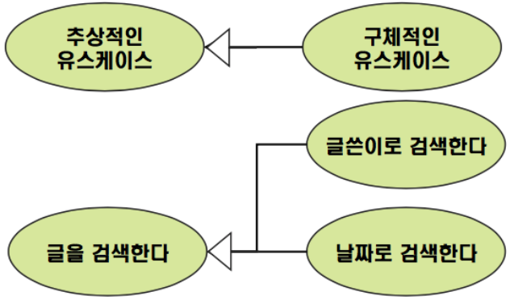
  - 유스케이스 다이어그램 작성 순서
    1. 액터 식별
        - 액터는 시스템에 관련이 있는 사용자의 역할과 외부 시스템으로 식별 가능
    2. 유스케이스 식별
        - 액터가 요구하는 서비스, 정보를 유스케이스로 식별할 수 있고 액터가 시스템과 상호작용 하는 행위를 유스케이스로도 나타낼 수 있다.
    3. 관계 정의
        - 액터간, 유스케이스간 일반화, 연관관계를 정의하고, 포함, 확장관계를 정의한다.
- 유스케이스 정의서
  - 정의
    - 유스케이스 다이어그램을 보완하기 위한 산출물로 유스케이스 다이어그램이 시스템의 기능을 표현한다면 각각의 유스케이스에 대해서 해당 유스케이스가 어떻게 수행되는지를 표현한다.
  - 유스케이스 정의서 포함항목
    1. 유스케이스명 : 액터가 시스템을 통해 달성할 목적을 명확하게 표현
    2. 액터명 : 시스템에서 수행하는 역할 이름
    3. 개요 : 유스케이스를 수행하는 개요
    4. 사전조건 : 올바르게 동작하기 위해 사전에 충족되어야 하는 조건
    5. 사후조건 : 유스케이스가 실행된 후 만족해야 하는 조건 기술
    6. 기본흐름 : 시스템과 엑터 사이에 목적을 달성하기 위한 기본적인 상호흐름을 기술하며, 오류나 예외가 발생하지 않는 것을 전제로 작성
    7. 대체흐름 : 기본흐름으로 부터 경우에 따라 선택적으로 실행되고, 다시 기본흐름으로 돌아오거나, 예외가 발생한 경우 이를 처리하는 흐름 기술
  
### 2.65 65일차(2020-05-11)
- 5/11 ~ 5/22일 세미 프로젝트
- 프로젝트 링크 : https://github.com/xorb5693/Semi_MMM

### 2.75 75일차(2020-05-25)
- FRAMEWORK
  - 정의
    - 개발자가 소프트웨어를 개발함에 있어 코드를 구현하는 개발 시간을 줄이고, 코드의 재사용성을 증가시키기 위해 일련의 클래스 묶음이나 뼈대, 틀을 제공하는 라이브러리를 구현해 놓은 것
  - FRAMEWORK의 특징
    - 개발자가 따라야 하는 가이드를 제공
    - 개발할 수 있는 범위가 정해져 있음
    - 개발자를 위한 다양한 도구, 플러그인을 지원
    <table>
      <tr align="center">
        <th>장점</th>
        <th>단점</th>
      </tr>
      <tr>
        <td>- 개발 시간을 줄일 수 있음<br>- 정형화 되어 있어 일정 수준 이상의 품질을 기대할 수 있음<br>- 유지보수가 쉬움</td>
        <td>- 너무 의존하는 경우 개발자들의 능력이 떨어져 스스로 직접 개발하는 것이 어려워 짐<br>- 습득에 걸리는 시간이 필요함</td>
      </tr>
    </table>
  - Framework 종류
    <table>
      <tr align="center">
        <th>구분</th>
        <th>설명</th>
        <th>종류</th>
      </tr>
      <tr>
        <td align="center">영속성<br>프레임워크</td>
        <td>데이터의 저장, 조회, 변경, 삭제를 다르는 클래스 및 설정 파일들을<br>라이브러리화 하여 구현한 프레임워크</td>
        <td>- Mybatis<br>- Hibernate</td>
      </tr>
      <tr>
        <td align="center">자바<br>프레임워크</td>
        <td>JAVA EE를 통한 웹 어플리케이션 개발에 초점을 맞추어 필요한 <br>요소들을 모듈화 하여 제공하는 프렘임워크</td>
        <td>- spring<br>- 전자정부표준<br>- Struts</td>
      </tr>
      <tr>
        <td align="center">화면 구현<br>프레임워크</td>
        <td>Front-End를 보다 쉽게 구현할 수 있게 틀을 제공하는 프레임워크</td>
        <td>- Bootstrap<br>- Foundation<br>- MDL</td>
      </tr>
      <tr>
        <td align="center">기능 및 지원<br>프레임워크</td>
        <td>특정 기능이나 업무 수행에 도움을 줄 수 있는 기능을 제공하는<br>프레임워크</td>
        <td>- Log4j<br>- JUnit5</td>
      </tr>
    </table>
- Mybatis
  - 정의
    - 데이터의 입력, 조회, 수정, 삭제(CRUD)를 보다 편하게 사용하기 위해 xml로 구조화된 Mapper 설정 파일을 통해서 JDBC를 구현한 영속성 프레임워크
  - ibatis와 Mybatis
    - Apache Project에서 ibatis를 운영하던 팀이 2010년 5월 9일 Google 팀으로 이동하면서 Mybatis로 이름을 변경
    - Mybatis는 기존 ibatis의 한계점이었던 동적 쿼리와 어노테이션 처리를 보강하여 더 나은 기능을 제공
    - ibatis는 현재비활성화 상태이며, 기존에 ibatis로 만들어진 어플리케이션의 지원을 위해 라이브러리만 제공 중
  - Mybatis 라이브러리 다운 및 연동 사이트
    - https://github.com/mybatis/mybatis-3
  - Mybatis에서 사용하는 XML 파일
    <table>
      <tr align="center">
        <th>mybatis-config.xml</th>
        <th>mapper.xml</th>
      </tr>
      <tr>
        <td>- Mybatis를 이용하기 위한 설정들이 저장되어 있는 파일<br>- xml 파일 상단에 mybatis-config 파일이라는 선언<br><br><br>&#60;?xml version="1.0" encoding="utf-8"?&#62;<br>&#60;!DOCTYPE configuration PUBLIC "-//mybatis.org//DTD Config 3.0//EN" "http://mybatis.org/dtd/mybatis-3-config.dtd"&#62;</td>
        <td>- 실제 Database에서 수행할 query문들을 저장하는 파일<br>- xml 파일 상단에 mybatis-mapper 파일이라는 선언<br><br><br>&#60;?xml version="1.0" encoding="utf-8"?&#62;<br>&#60;!DOCTYPE mapper PUBLIC "-//mybatis.org//DTD Mapper 3.0//EN" "http://mybatis.org/dtd/mybatis-3-mapper.dtd"&#62;</td>
      </tr>
    </table>
  - mybatis-config.xml 사용 
    <table>
      <tr align="center">
        <th>태그명</th>
        <th>설명</th>
      </tr>
      <tr>
        <td align="center">&#60;configuration&#62;</td>
        <td>최상위 태그로 내부에 필요한 설정들을 작성</td>
      </tr>
      <tr>
        <td align="center">Example</td>
        <td>&#60;configuration&#62;<br>&nbsp;&nbsp;&nbsp;&nbsp;...<br>&#60;/configuration&#62;</td>
      </tr>
      <tr>
        <td align="center">&#60;settings&#62;</td>
        <td>Mybatis 구동 시 선언할 설정들을 작성</td>
      </tr>
      <tr>
        <td align="center">Example</td>
        <td>&#60;settings&#62;<br>&nbsp;&nbsp;&nbsp;&nbsp;&#60;!-- Null 값이 발생할 경우 빈칸이 아닌 null로 인식하라 --&#62;<br>&nbsp;&nbsp;&nbsp;&nbsp;&#60;setting name="jdbcTypeForNull" value="NULL"/&#62;<br>&#60;/settings&#62;</td>
      </tr>
      <tr>
        <td align="center">&#60;typeAliases&#62;</td>
        <td>Mybatis에서 사용할 자료형의 별칭을 선언</td>
      </tr>
      <tr>
        <td align="center">Example</td>
        <td>&#60;typeAliases&#62;<br>&nbsp;&nbsp;&nbsp;&nbsp;&#60;!-- type에는 패키지 명까지 전부 기술해주어야 한다. --&#62;<br>&nbsp;&nbsp;&nbsp;&nbsp;&#60;typeAlias type="member.model.vo.Member" alias="Member" /&#62;<br>&#60;/typeAliases&#62;</td>
      </tr>
      <tr>
        <td align="center">&#60;mappers&#62;</td>
        <td>사용하고자 하는 쿼리가 정의된 mapper 파일을 등록</td>
      </tr>
      <tr>
        <td align="center">Example</td>
        <td>&#60;mappers&#62;<br>&nbsp;&nbsp;&nbsp;&nbsp;&#60;mapper resource="member/model/mapper/membermapper.xml" /&#62;<br>&nbsp;&nbsp;&nbsp;&nbsp;&#60;mapper resource=“notice/model/mapper/notice-mapper.xml" /&#62;<br>&nbsp;&nbsp;&nbsp;&nbsp;&#60;mapper resource=“board/model/mapper/board-mapper.xml" /&#62;<br>&#60;/mappers&#62;</td>
      </tr>
      <tr>
        <td align="center">&#60;environments&#62;</td>
        <td>Mybatis에서 연동할 Database 정보를 등록</td>
      </tr>
      <tr>
        <td align="center">Example</td>
        <td>&#60;environments default="development"&#62;<br>&nbsp;&nbsp;&nbsp;&nbsp;&#60;!-- environment id를 구분하여 연결할 DB를 여러 개 구성할 수도 있다 --&#62;<br>&nbsp;&nbsp;&nbsp;&nbsp;&#60;environment id="development"&#62;<br>&nbsp;&nbsp;&nbsp;&nbsp;&nbsp;&nbsp;&nbsp;&nbsp;&#60;transactionManager type="JDBC" /&#62;<br>&nbsp;&nbsp;&nbsp;&nbsp;&nbsp;&nbsp;&nbsp;&nbsp;dataSource type="POOLED"&#62;<br>&nbsp;&nbsp;&nbsp;&nbsp;&nbsp;&nbsp;&nbsp;&nbsp;&nbsp;&nbsp;&nbsp;&nbsp;&#60;property name="driver"<br>&nbsp;&nbsp;&nbsp;&nbsp;&nbsp;&nbsp;&nbsp;&nbsp;&nbsp;&nbsp;&nbsp;&nbsp;&nbsp;&nbsp;&nbsp;&nbsp;value="oracle.jdbc.driver.OracleDriver" /&#62;<br>&nbsp;&nbsp;&nbsp;&nbsp;&nbsp;&nbsp;&nbsp;&nbsp;&nbsp;&nbsp;&nbsp;&nbsp;&#60;property name="url"<br>&nbsp;&nbsp;&nbsp;&nbsp;&nbsp;&nbsp;&nbsp;&nbsp;&nbsp;&nbsp;&nbsp;&nbsp;&nbsp;&nbsp;&nbsp;&nbsp;value="jdbc:oracle:thin:@127.0.0.1:1521:xe" /&#62;<br>&nbsp;&nbsp;&nbsp;&nbsp;&nbsp;&nbsp;&nbsp;&nbsp;&nbsp;&nbsp;&nbsp;&nbsp;&#60;property name="username" value="student" /&#62;<br>&nbsp;&nbsp;&nbsp;&nbsp;&nbsp;&nbsp;&nbsp;&nbsp;&nbsp;&nbsp;&nbsp;&nbsp;&#60;property name="password" value="student" /&#62;<br>&nbsp;&nbsp;&nbsp;&nbsp;&nbsp;&nbsp;&nbsp;&nbsp;&#60;/dataSource&#62;<br>&nbsp;&nbsp;&nbsp;&nbsp;&#60;/environment&#62;<br>&#60;/environments&#62;</td>
      </tr>
      <tr>
        <td align="center">&#60;transactionManager&#62;</td>
        <td>트랜잭션 관리를 누가 할 것인가에 대한 설정<br>JDBC : JDBC commit과 rollback을 처리하기 위해 connection을 가지고 온다(직접 처리)<br>MANAGED : commit과 rollback을 하지 않고, 대신 컨테이너가 트랜잭션을 관리하고 커넥션을 닫아주는 설정</td>
      </tr>
      <tr>
        <td align="center">&#60;dataSource&#62;</td>
        <td>데이터 베이스 연결을 관리하는 설정<br>POOLED : Connection 객체를 pool영역에 저장해 두고 이후 Connection 객체를 생성할 때 이를 재사용 한다.<br>UNPOOLED : Connection 객체를 별도로 저장하지 않고, 객체 호출 시 매번 새로 생성하여 사용</td>
      </tr>
    </table>

### 2.76 76일차(2020-05-26)
- Dynamic Query
  - 정의
    - 일반적으로 검색 기능이나 다중 입력 처리 등을 수행해야 할 경우 SQL을 실행하는 DAO를 여러번 호출하여 실행하였지만 Mybais에서는 이를 동적으로 제어할 수 있는 구문을 제공하여 좀 더 쉽게 쿼리를 구현할 수 있도록 기능을 제공
  - 동적쿼리 지원 구문
    1. if
    2. choose(when, otherwise)
    3. trim
    4. foreach
  - 동적쿼리 if
    - 동적 쿼리를 구현할 때 가장 기본적으로 사용되는 구문
    - 특정 조건을 만족할 경우 안의 구문을 쿼리에 포함시킴
    - 필요로 하는 조건이 1개 이상일 경우 if구문을 여러 개 사용 가능
    ```
    <if test="조건식">
      ...
    </if>
    ```
  - 동적쿼리 choose
    - 자바의 if-else 혹은 switch 구문과 유사하며 주어진 구문 중 한가지만 수행하고 할 때 사용
    - when은 if문과 흡사하며, otherwise는 else 또는 default와 흡사
    ```
    <choose>
      <when test="조건식1">
        실행문1
      </when>
      <when test="조건식2">
        실행문2
      </when>
      <otherwise>
        그외 경우 실행문
      </otherwise>
    </choose>
    ```
  - 동적쿼리 trim
    - 쿼리 구문의 특정 부분을 없앨 때 사용
    - 태그 안의 내용이 완성될 때 처음 시작할 단어와 시작 시 제거해야 할 단어를 명시
    ```
    <trim prefix="where" prefixOverrides="AND|OR">
      ...
    </trim>
    ```
  - 동적쿼리 foreach
    - 동적 쿼리를 구현할 때 collection에 대한 반복 처리를 제공
    - foreach 속성
      <table>
        <tr align="center">
          <th>속성명</th>
          <th>설명</th>
        </tr>
        <tr>
          <td align="center">item</td>
          <td>반복 될 때 접근 가능한 객체 변수</td>
        </tr>
        <tr>
          <td align="center">index</td>
          <td>반복되는 횟수를 가리키는 변수</td>
        </tr>
        <tr>
          <td align="center">collection</td>
          <td>반복에 쓰일 collection(array, list, map)</td>
        </tr>
        <tr>
          <td align="center">open</td>
          <td>첫 반복 시 여는 문자열</td>
        </tr>
        <tr>
          <td align="center">separator</td>
          <td>반복되는 객체를 나열할 때 구분하기 위한 구분자</td>
        </tr>
        <tr>
          <td align="center">close</td>
          <td>마지막 반복 시 포함할 닫는 문자열</td>
        </tr>
      </table>
    ```
    <select id="searchKeyword" resultType="board">
      SELECT * FROM BOARD
      WHERE BOARD_TITLE IN
      <foreach item="keyword" collection="array" open="(" separator="," close=")">
        #{keyword}
      </foreach>
    </select>
    ```

### 2.77 77일차(2020-05-27)

### 2.78 78일차(2020-05-28)
- SPRING
  - MAVEN
    - 자바용 프로젝트 관리 도구로, project object model(POM) XML 문서를 통해 해당 프로젝트의 버전 정보 및 라이브러리 정보들을 통합하여 관리하는 프레임워크
  - 라이브러리 종속성
    - 일반적인 프로젝트는 개발자가 필요한 라이브러리를 직접 찾아서 추가해야 하지만, MAVEN을 사용하면 pom.xml 문서에 사용하고자 하는 라이브러리를 등록하여 자동으로 프로젝트에 추가되게 하여 라이브러리 관리의 편리성을 제공
  - pom.xml
    - Project Object Model이라는 뜻으로 하나의 프로젝트에 사용하는 자바 버전, 라이브러리, 플러그인 구성을 통합하여 관리할 수 있게 각 설정 정보를 XML 파일에 문서화 한 것
  - 정의
    - 자바 플랫폼을 위한 오픈소스 애플리케이션 프레임워크로서 스프링(Spring)이라고 부르며, 동적인 웹사이트를 개발하기 위한 여러가지 서비스를 제공하고 있으며, 대한민국 공공기관의 웹서비스 개발 시 사용을 권장하고 있는 전자정부 표준 프레임워크의 기반 기술로 사용되고 있음
  - Spring 공식 사이트 : https://spring.io/
  - Spring 특징
    1. DI(Dependancy Injection/의존성 주입) : 설정 파일이나 어노테이션을 통해 각 객체간 의존 관계를 설정하여 개발자가 직접 의존하는 객체를 생성할 필요가 없음
    2. Spring AOP(관점지향 프로그래밍) : DataBase의 트랜잭션 처리나 로깅처리와 같이 여러 모듈에서 공통으로 필요로 하는 기능의 경우 해당 기능을 분리하여 관리함
    3. Spring JDBC : Mybatis나 Hibernate 등의 데이터베이스를 처리하는 영속성 프레임워크와 연결할 수 있는 인터페이스를 제공
    4. Spring MVC : MVC 디자인 패턴을 통해 웹 어플리케이션의 Model, View, Controller 사이의 의존 관계를 DI 컨테이너에서 관리하여 개발자가 아닌 서버가 객체들을 관리하는 어플리케이션을 구축할 수 있음
- Spring IoC, DI
  - IoC
    - Inversion of Control의 약자로 제어의 역행이라는 의미
    - 프로그램을 구동하는데 필요한 객체 생성에 대한 생성, 변경 등의 관리를 개발자가 아닌 프로그램을 구동하는 컨테이너에서 직접 관리하는 것
    - 스프링은 IoC 구조를 통해 구동 시 필요한 객체의 생성부터 생명주기까지 해당 객체에 대한 관리를 직접 수행
  - IoC 컨테이너의 역할
    - 객체의 생명주기와 의존성 관리
      1. 생명주기 : 생성 -> 초기화 -> 사용 -> 소멸
      2. 의존성 : 개발자가 직접 객체를 생성할 수 있지만 해당 권한을 컨테이너에 맡김으로써 소스코드 구현의 시간을 단축
  - IoC 컨테이너와 Bean 객체
    <table>
      <tr align="center">
        <th>컨테이너</th>
        <th>설명</th>
      </tr>
      <tr>
        <td align="center">Bean</td>
        <td>- 스프링이 IoC방식으로 관리하는 객체<br>- 스프링이 직접 생성과 제어를 담당하는 객체</td>
      </tr>
      <tr>
        <td align="center">BeanFactory</td>
        <td>- 자바 빈 객체의 등록 및 관리<br>- getBean() 메소드를 통해 객체를 가져옴</td>
      </tr>
      <tr>
        <td align="center">ApplicationContext</td>
        <td>- BeanFactory의 확장 개념<br>- Spring의 각종 부가 서비스를 제공<br>- 일반적인 IoC컨테이너를 의미</td>
      </tr>
      <tr>
        <td align="center">GenericXml<br>ApplicationContext</td>
        <td>- ApplicationContext를 구현한 클래스<br>- 일반적인 XML형태의 문서를 읽어 컨테이너 역할을 수행</td>
      </tr>
    </table>
  - Spring DL
    - 의존성 검색이란 뜻으로 컨테이너가 제공하는 API 함수로 필요한 Bean을 검색해서 사용하는 방식
  - Spring DI
    - 의존성 주입이란 뜻으로 IoC 구현의 핵심 기술이며, 사용하는 객체를 직접 생성하는 것이 아니라 컨테이너가 빈의 설정정보를 읽어와 자동으로 해당 객체를 연결하는 것
    - 개발자가 작성해야 할 코드가 단순해짐
    - 각 객체 간의 종속관계(결합도)를 해소 할 수 있음
  - 결합도(객체 간의 종속 관계)
    - 한 클래스에서 필드 객체를 생성할 때 발생하는 두 객체간의 관계를 말하며, 각 객체간의 내용이 수정될 경우 영향을 미치는 정도
    - A Class와 B Class가 있다.
    - A Class 작성시 B Class 객체의 메소드를 이용하여 기능을 작성하는 경우, B Class의 생성자나, 메소드가 변경되는 경우 A Class의 일부 정보도 반드시 수정해야 하는 상황이 발생하는데, 이를 '두 객체간 결합도가 강하다'라고 표현한다.
  - Spring DI 종류
    1. Setter 메소드를 통한 의존성 주입
        - 의존성을 주입받는 setter 메소드를 만들고 이를 통해 의존성을 주입
    2. 생성자를 통한 의존성 주입
        - 필요한 의존성을 포함하는 클래스에 생성자를 만들고, 이를 통해 의존성을 주입
    3. 메소드를 통한 의존성 주입
        - 의존성을 입력 받는 일반 메소드를 만들고 이를 통해 의존성을 주입
  - Spring DI 종류 - setter 메소드를 통한 의존성 주입
    - seeter 메소드를 통한 의존관계가 있는 bean을 주입하려면 property 태그 사용
    ```
    <bean id ="객체이름" class="클래스 풀네임">
      <property name="name" value="OOO"/>
      <property name="name" ref="OOO"/>
    </bean>
    
    - id 속성은 객체의 이름을 의미(자바코드 : Student student)
    - class 속성은 해당 클래스의 패키지명을 포함한 풀네임
    - name 속성은 클래스에 선언한 변수의 이름(String name, School school)
    - value 속성은 해당 변수에 대입할 값(객체타입이 아닌 일반 값)
    - ref 속성은 객체 타임의 변수에 bean을 주입
    
    <bean id="school1" class="student.model.vo.School"/>
    <bean id="student" class="student.model.vo.Student"/>
      <property name="name" value="홍길동"/>
      <property name="school" ref="school1"/>
    </bean>
    
    => 자바 코드 변환
    Schoole school = new School();
    Student student = new Student();
    student.setName("홍길동");
    student.setSchool(school1);
    ```
  - Spring DI 종류 - 생성자를 통한 의존성 주입
    - setter 메소드를 통한 의존관계가 있는 bean을 주입하려면 &#60;constructor-arg&#62;태그 사용
    ```
    <bean id="객체이름" class="클래스 풀네임">
      <constructor-arg index="0" value="OOO"/>
      <constructor-arg name="name" ref="OOO"/>
    </bean>
    
    - name 속성은 생성자에 전달하는 매개변수의 변수명으로 설정
    - 생성자 매개변수 순서에 따라 index 속성을 통해서도 접근 가능
    
    <bean id="school1" class="student.model.vo.School" />

    - name을 이용한 방식
    <bean id="student" class="student.model.vo.Student">
      <constructor-arg name="name" value="홍길동"/>
      <constructor-arg name="school" ref="school1"/>
    </bean>

    - index를 이용한 방식
      <bean id="student" class="student.model.vo.Student">
        <constructor-arg index="0" value="홍길동"/>
        <constructor-arg index="1" ref="school1"/>
    </bean>

    => 자바 코드 변환
    School school1 = new School();
    Student student = new Student("홍길동", school1);
    ```
- DI Annotation
  - 정의
    - 대부분의 프레임워크가 그렇듯 Spring Framework 역시 XML 파일 설정이 매우 중요
    - XML 파일의 과도한 설정을 하게 되면 부담스러워 짐
    - XML 방식 이외에도 Annotation 방식의 설정을 지원
    - bean으로 사용될 클래스에 특별한 Annotation을 부여하고 Spring 컨테이너가 이 Annotation을 통해 자동으로 bean을 등록하는 방식으로, 빈 스캐닝(bean scanning)을 통한 자동인 bean 등록기능이라고 함
  - DI Annotation의 장/단점
    <table>
      <tr align="center">
        <th>장점</th>
        <th>단점</th>
      </tr>
      <tr>
        <td>- XML 문서 생성과 관리에 따른 수고를 덜어주고 개발 속도를 향상시킴<br>- 개발자 간 XML 설정 파일의 충돌을 최소화</td>
        <td>- 어플리케이션에 등록될 bean이 어떤 것들이 있고, bean들 간의 의존관계가 어떻게 되는지 한눈에 파악할 수 없음</td>
      </tr>
    </table>
  - bean 등록 Annotation
    <table>
      <tr align="center">
        <th>Annotation</th>
        <th>설명</th>
      </tr>
      <tr>
        <td align="center">@Component</td>
        <td>-객체를 나타내는 일반적인 타입으로 bean태그 역할</td>
      </tr>
      <tr>
        <td align="center">@Controller</td>
        <td>- Presentation Layer Annotation으로 view에서 전달된 웹 요청과 응답을 처리하는 클래스에 사용(Servlet)</td>
      </tr>
      <tr>
        <td align="center">@Service</td>
        <td>- Service Layer Annotation으로 비지니스 로직을 가진 클래스에 사용(Service)</td>
      </tr>
      <tr>
        <td align="center">@Repository</td>
        <td>- Persistence Layer Annotation으로 영속성(파일, DB)을 가진 클래스에 사용(DAO)</td>
      </tr>
    </table>
    - @Controller, @Service, @Repository는 특정한 객체의 역할에 대한 @Component의 구체화된 형태
  - bean 의존 관계 주입 Annotation
    <table>
      <tr align="center">
        <th>Annotation</th>
        <th>설명</th>
      </tr>
      <tr>
        <td align="center">@Autowirde</td>
        <td>- 주로 변수 위에 설정하여 해당 타입 객체를 컨테이너에서 찾아서 자동으로 주입</td>
      </tr>
      <tr>
        <td align="center">@Inject</td>
        <td>- @Autowired와 동일한 기능 지원<br>- @Autowired Spring 전용, @Inject는 Java전용</td>
      </tr>
      <tr>
        <td align="center">@Qualifier</td>
        <td>- @Autowired와 같이 사용되며, 특정 객체의 이름을 이용하여 의존성을 주입할 때 사용<br>- Autowired를 하려는 상황에 해당 타입의 객체가 컨테이너에 2개 이상 존재하는 경우 어떤 객체를 주입할지 결정할 수 없어 에러가 발생하는데 이를 해결함</td>
      </tr>
      <tr>
        <td align="center">@Resource</td>
        <td>- @Autowired와 Qualifier의 기능을 결합한 Annotation</td>
      </tr>
    </table>
  - &#60;context:component-scan&#62; 태그
    - Spring 설정 파일에 애플리케이션에서 사용할 &#60;bean&#62;을 등록하지 않고 Annotation을 통해 자동으로 생성하기 위해 사용하는 태그
    - 특정 패키지 내부의 클래스들 중 @Component Annotation이 설정된 클래스들을 자동으로 객체 생성
    ```
    <context:component-scan base-package="kr.or.iei.member" />
    
    - kr.or.iei.member.controller -> 스캔대상
    - kr.or.iei.member.model.vo -> 스캔대상
    - kr.or.iei.board.controller -> 스캔대상 아님
    - kr.or.iei.board.model.service -> 스캔대상 아님
    ```
- Spring MVC
  - MVC Model 기본 흐름
    - VIEW - Controller - Model - Conteroller - VIEW  
    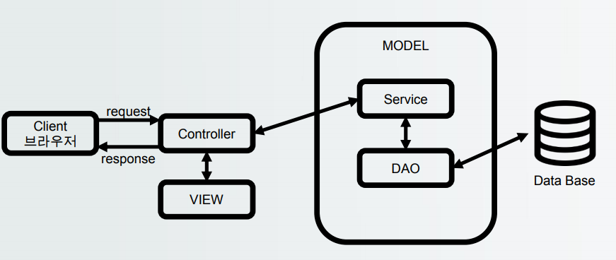
  - Spring MVC Model
    - Spring MVC는 View, Controller, Model 부분을 유지보수 및 확장성을 고려하여 설계
    <table>
      <tr align="center">
        <th>Spring MVC 요소</th>
        <th>설명</th>
      </tr>
      <tr>
        <td align="center">DispatcherServlet</td>
        <td>- 유일한 Servlet 클래스로서 HTTP 프로토콜을 통해 들어오는 모든 요청을 가장<br> 먼저 처리하는 Front Controller</td>
      </tr>
      <tr>
        <td align="center">HandlerMapping</td>
        <td>- 클라이언트 요청을 어떤 Controller가 처리할 지 URL Mapping값을 가지고 있음</td>
      </tr>
      <tr>
        <td align="center">Controller</td>
        <td>- 실질적인 클라이언트 요청을 처리</td>
      </tr>
      <tr>
        <td align="center">ViewResolver</td>
        <td>- Controller가 반환한 View 이름으로 실행 될 jsp 경로를 가지고 있음</td>
      </tr>
      <tr>
        <td align="center">View</td>
        <td>- 실제 클라이언트들에게 보여질 페이지</td>
      </tr>
    </table>
    
    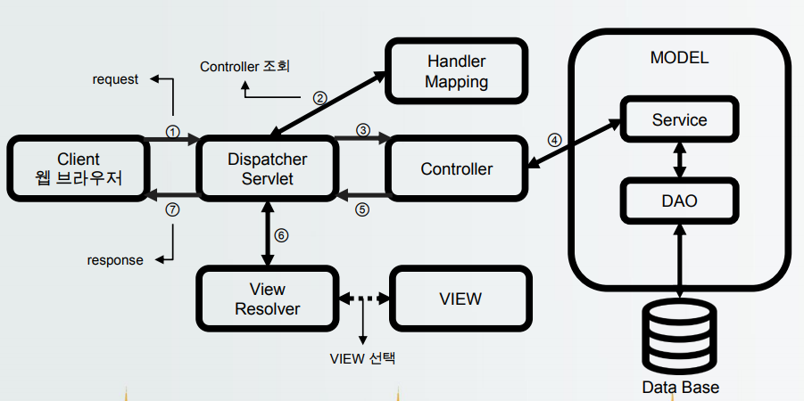
  - Spring MVC 프로젝트 폴더 구조
    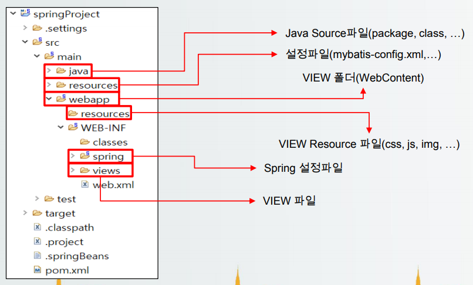

### 2.79 79일차(2020-05-29)
- Spring 설치
  1. 압축해제
      - spring-tool-suite-3.9.12.RELEASE-e4.15.0-win32-x86_64.zip 압축 해제(sts-bundle)
      - apache-maven-3.5.3-bin.zip 압축 해제(apache-maven-3.5.3)
  2. apache-maven-3.5.3 폴더 안에 repository 폴더 생성
  3. conf - settings.xml파일 열기
      - <local 검색 -> localRepository 태그 복사 주석 밖에 붙여넣기, 태그 내용 삭제
      - 2에서 만든 repository 폴더 주소 태그 내용에 복사 붙여넣기
  4. sts-bundle 폴더 아래 sts-3.9.12.RELEASE 폴더 아래 STS.ini 파일 열기
      - org.springsource.sts.ide 아래 -vm C드라이브 Java 폴더 jre의 bin 폴더 경로 복사 붙여넣기\javaw.exe
  5. STS.exe 실행 후 기존 이클립스와 동일하게 workspace 생성
  6. Window - Preferences - Maven - User Settings
      - User Settings에 3에서 설정한 settings.xml 설정
  7. Window - Preferences - Team - Ignored Resources
      - Add Pattern - "*/target/*" 추가
  8. Servers 옆 boot dashboard 제거
  9. Encoding UTF-8 설정하기
  10. Server - Runtime Environment 있던 서버 삭제하고 기존 Apache 서버 등록, 서버 생성
  11. Spring Project는 Spring Legacy Project로 생성
  12. Project Name 설정 후 Spring MVC Project 선택 후 NEXT
  13. 도메인 주소 등록. 도메인은 뒤에서부터 입력(naver.com -> com.naver)
  14. prom.xml - overview 선택
      - java-version을 1.8로 변경
      - org.springframework-version을 5.0.6.RELEASE로 변경
  15. 프로젝트 우클릭 - Preference - Project Facets
      - Java - 1.8 변경
      - 우측 Runtime에서 아파치 서버 선택
  16. 프로젝트 - src - main - webapp 밑에 jsp 파일 생성(기존 webcontent)
  17. 서버 더블 클릭 - Modules - Path "/"로 변경
- 라이브러리 추가
  - porm.xml에 태그를 추가하면 자동으로 추가
  ```
  <!-- commons-dbcp -->
    <dependency>
      <groupId>commons-dbcp</groupId>
      <artifactId>commons-dbcp</artifactId>
      <version>1.4</version>
  </dependency>
  ```
  - 설치한 라이브러리
    - commons-dbcp 
    - spring-jdbc
- applicationContext.xml
  - src/main/resource 폴더 아래 생성
  - Spring Bean Configuration File 선택
  - bean 체크박스 선택 후 아래 박스 제일 아래 버전 체크박스 선택
  - context 체크박스 선택 후 아래 박스 제일 아래 버전 체크박스 선택
  - p 체크박스 선택
- Spring MVC 자동 설정
  - web.xml
    - servlet 태그 아래 classpath:applicationContext.xml 등록
    ```
    <servlet>
      <servlet-name>appServlet</servlet-name>
      <servlet-class>org.springframework.web.servlet.DispatcherServlet</servlet-class>
      <init-param>
        <param-name>contextConfigLocation</param-name>
        <param-value>/WEB-INF/spring/appServlet/servlet-context.xml
        classpath:applicationContext.xml
        </param-value>
        </init-param>
      <load-on-startup>1</load-on-startup>
    </servlet>
    ```
    - servlet-mapping 태그 아래 url-pattern 수정
    ```
    <servlet-mapping>
      <servlet-name>appServlet</servlet-name>
      <url-pattern>*.do</url-pattern>
    </servlet-mapping>
    ```
    - 필터 추가
    ```
    <filter>
      <filter-name>characterEncoding</filter-name>
      <filter-class>org.springframework.wep.filter.CharacterEncodingFilter</filter-class>
      <init-param>
        <param-name>encoding</param-name>
        <param-value>utf-8</param-value>
      </init-param>
    </filter>
    <filter-mapping>
      <filter-name>characterEncoding</filter-name>
      <url-pattern>*.do</url-pattern>
    </filter-mapping>
    ```
- JDBCTemplate 등록
  ```
  <bean id="dataSource" class="org.apache.commons.dbcp.BasicDataSource">
    <property name="driverClassName" value="oracle.jdbc.driver.OracleDriver"/>
    <property name="url" value="jdbc:oracle:thin:@localhost:1521:xe"/>
    <property name="username" value="MYBATIS"/>
    <property name="password" value="1234"/>
  </bean>
	
  <bean id="jdbcTemplate" class="org.springframework.jdbc.core.JdbcTemplate">
    <property name="dataSource" ref="dataSource"/>
  </bean>
  ```
- 페이지 이동
  - 직접이동일 경우 : "redirect:/"입력

### 2.80 80일차(2020-06-01)
- Spring에서의 ajax
  - 기본적으로 다른건 동일하나 ajax를 사용하기 위해서는 컨트롤러 메소드 위에 @ResponseBody를 추가해야 한다.
  - 해당 데이터를 직접 전송한다는 의미의 태그이다.
  - 한글 인코딩을 위해서는 @RequestMapping태그에 produces="text/html; charset=utf-8" 추가한다.
- Spring에서의 mybatis 등록
  ```
  <bean id="sqlSession" class="org.mybatis.spring.SqlSessionFactoryBean">
    <property name="dataSource" ref="dataSource"/>
    <property name="configLocation" value="classpath:mybatis-config.xml"/>
    <property name="mapperLocations" value="classpath:/mapper/**/*SQL.xml"></property>
  </bean>
  
  <bean id="sqlSessionTemplate" class="org.mybatis.spring.SqlSessionTemplate">
    <constructor-arg index="0" ref="sqlSession"/>
  </bean>
  ```
  - mybatis : 3.4.0
  - mybatis-spring : 1.3.0

### 2.81 81일차(2020-06-02)
- Spring AOP
  - 정의
    - Spring AOP란, 관점지향 프로그래밍의 약자로 일반적으로 사용하는 클래스(Service, DAO)에서 중복되는 공통 코드 부분(ex. commit, rollback, logging..)을 별도의 영역으로 분리해 내고, 코드가 실행되기 전이나 이 후의 시점에 해당 코드를 붙여 넣음으로써 소스코드의 중복을 줄이고, 필요할 때마다 가져다 쓸 수 있게 객체화 하는 기술  
    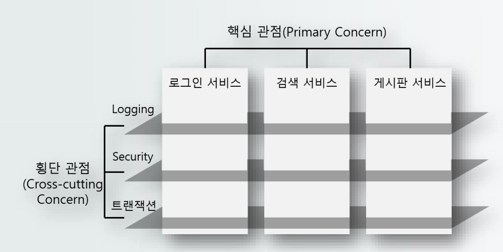  
    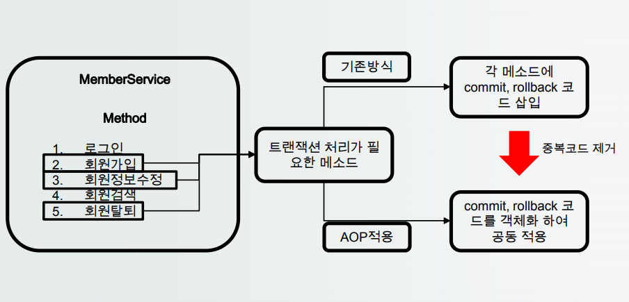
  - Spring AOP 용어
    <table>
      <tr align="center">
        <th>용어</th>
        <th>설명</th>
      </tr>
      <tr>
        <td align="center">Joinoint</td>
        <td>- 클라이언트가 호출하는 모든 비지니스 메소드<br>- 일반적으로 Srvice의 모든 클래스</td>
      </tr>
      <tr>
        <td align="center">Pointcut</td>
        <td>- 필터링 된 조인 포인트<br>- Joinpoint 중 공통기능을 적용할 선택된 메소드</td>
      </tr>
      <tr>
        <td align="center">Advice</td>
        <td>- Pointcut에 적용할 공통 기능의 코드</td>
      </tr>
      <tr>
        <td align="center">Aspect or Advisor</td>
        <td>- Pointcut + Advice = Aspect<br>- 어떤 Pointcut에 어떤 Advice를 적용할지 결정<br>- Advisor는 Aspect와 같지만 몇몇 특수한 경우에 사용(트랜잭션 처리)</td>
      </tr>
    </table>
  - Spring AOP - Pointcut 표현식
    - Joinpoin 중 Advice 적용을 원하는 메소드를 필터링 할 때 사용하는 표현식
    <table>
      <tr align="center">
        <th>Pointcut 표현식</th>
        <th>execution(* member.model.service.. *Service.*(..)</th>
      </tr>
      <tr>
        <td align="center">*</td>
        <td>- 메소드 리턴 타입</td>
      </tr>
      <tr>
        <td align="center">member.model.service </td>
        <td>- 패키지 경로</td>
      </tr>
      <tr>
        <td align="center">*Service</td>
        <td>- 클래스명(Service로 끝나는 모든 클래스)</td>
      </tr>
      <tr>
        <td align="center">*</td>
        <td>- 메소드 명</td>
      </tr>
      <tr>
        <td align="center">(..)</td>
        <td>- 매개변수</td>
      </tr>
    </table>
    
    <table>
      <tr align="center">
        <th>형식</th>
        <th>예</th>
        <th>설명</th>
      </tr>
      <tr>
        <td align="center" rowspan="3">리턴 타입</td>
        <td align="center">*</td>
        <td>- 모든 리턴 타입 허용</td>
      </tr>
      <tr>
        <td align="center">void</td>
        <td>- 리턴 타입이 void인 메소드만 선택</td>
      </tr>
      <tr>
        <td align="center">!void</td>
        <td>- 리턴 타입이 void가 아닌 메소드만 선택</td>
      </tr>
      <tr>
        <td align="center" rowspan="3">패키지</td>
        <td align="center">org.kh.test</td>
        <td>- 정확하게 org.kh.test 패키지만 선택</td>
      </tr>
      <tr>
        <td align="center">org.kh.test..</td>
        <td>- org.kh.test패키지 및 모든 하위 패키지 선택</td>
      </tr>
      <tr>
        <td align="center">org.kh.test.*vice </td>
        <td>- 패키지명이 org.kh.test로 시작하면서 마지막 패키지 이름임 vice로 끝나는 패키지</td>
      </tr>
      <tr>
        <td align="center" rowspan="3">클래스</td>
        <td align="center">MemberService</td>
        <td>- 정확하게 MemberService 클래스만 선택</td>
      </tr>
      <tr>
        <td align="center">*Service</td>
        <td>- 클래스 이름이 Service로 끝나는 클래스만 선택</td>
      </tr>
      <tr>
        <td align="center">MemberService+</td>
        <td>- 클래스 이름 뒤에‘+’가 붙으면 해당 클래스로 부터 파생된 모든 자식클래스를 선택<br>- 인터페이스 뒤에 ‘+’가 붙으면 해당 인터페이스를 implement한 모든 클래스 선택</td>
      </tr>
      <tr>
        <td align="center" rowspan="2">메소드</td>
        <td align="center">*(..)</td>
        <td>- 가장 기본 설정으로 모든 메소드 선택</td>
      </tr>
      <tr>
        <td align="center">*Member(..)</td>
        <td>- 메소드 이름이 Member로 끝나는 모든 메소드 선택</td>
      </tr>
      <tr>
        <td align="center" rowspan="6">매개변수</td>
        <td align="center">(..)</td>
        <td>- 가장 기본 설정으로 매개변수 타입과 개수에 제약이 없음을 의미</td>
      </tr>
      <tr>
        <td align="center">(*)</td>
        <td>- 반드시 1개의 매개변수를 가지는 메소드</td>
      </tr>
      <tr>
        <td align="center">(member.vo.Member)</td>
        <td>- 매개변수로 Member를 가지는 메소드 선택, 이때 클래스의 패키지 경로를 포함해야함</td>
      </tr>
      <tr>
        <td align="center">(!member.vo.Member)</td>
        <td>- 매개변수로 Member를 가지지 않는 메소드를 선택</td>
      </tr>
      <tr>
        <td align="center">(Integer,..)</td>
        <td>- 한 개 이상의 매개변수를 가지되, 첫번째 매개변수 타입이 Integer인 메소드</td>
      </tr>
      <tr>
        <td align="center">(Integer,*)</td>
        <td>- 반드시 2 개의 매개변수를 가지되, 첫번째 매개변수 타입이 Integer인 메소드</td>
      </tr>
    </table>
  - Spring AOP - Advice 동작 시점
    - Pointcut(선택된 비지니스 메소드)이 수행될 때 Advice를 동작 시킬 시점
    <table>
      <tr align="center">
        <th>용어</th>
        <th>설명</th>
      </tr>
      <tr>
        <td align="center">Before</td>
        <td>- 비지니스 메소드 실행 전 동작</td>
      </tr>
      <tr>
        <td align="center">After Returning</td>
        <td>- 비지니스 메소드가 성공적으로 리턴 되면 동작</td>
      </tr>
      <tr>
        <td align="center">After Throwing</td>
        <td>- 비즈니스 메소드 실행 중 예외가 발생하면 동작</td>
      </tr>
      <tr>
        <td align="center">After</td>
        <td>- 비즈니스 메소드 실행 된 후 무조건 동작(에러,성공 상관없음)</td>
      </tr>
      <tr>
        <td align="center">Around</td>
        <td>- 메소드 호출 자체를 가로채 비즈니스 메소드 실행 전후에 처리할 로직을 삽입 가능</td>
      </tr>
    </table>
  - Spring AOP - JoinPoint Interface
    - JoinPoint는 Spring AOP 혹은 AspectJ에서 AOP의 부가 기능을 지닌 코드가 적용되는 지점을 뜻하며, Advice는 org.aspectj.lang.KoinPoint 타입의 파라미터를 어드바이스 메소드의 첫번째 매개변수로 선언해야 한다.
    - 단, Around의 경우 JoinPoint의 하위 클래스인 ProceedingKoinPoint 타입의 파라미터를 필수적으로 선언해야 한다.
  - Spring AOP - JoinPoint Interface 메소드
    <table>
      <tr align="center">
        <th>메소드</th>
        <th>설명</th>
      </tr>
      <tr>
        <td align="center">getArgs()</td>
        <td>- 메소드의 매개 변수를 반환</td>
      </tr>
      <tr>
        <td align="center">getSignature()</td>
        <td>- 대상 객체 메소드의 설명(메소드 명, 리턴 타입 등) 반환</td>
      </tr>
    </table>
  - Spring AOP - Signatur 객체 메소드
    <table>
      <tr align="center">
        <th>메소드</th>
        <th>설명</th>
      </tr>
      <tr>
        <td align="center">getName() </td>
        <td>- 클라이언트가 호출한 메소드 이름 리턴</td>
      </tr>
      <tr>
        <td align="center">toLongString()</td>
        <td>- 클라이언트가 호출한 메소드의 리턴 타입, 이름, 매개변수를 리턴</td>
      </tr>
      <tr>
        <td align="center">toShortString()</td>
        <td>- 클라이언트가 호출한 메소드 시그니처를 축약한 문자열로 리턴</td>
      </tr>
    </table>
  - Spring AOP – ProceedingJoinPoint 메소드
    - ProceedingJoinPoint 인터페이스는 JoinPoint를 상속한 인터페이스로 JoinPoint가 가진 모든 메소드를 지원하고, 추가적으로 proceed()메소드를 제공
    - 단, ProceedingJoinPoint는 Around에서만 사용!(다른 시점에서는 JoinPoint사용)
    <table>
      <tr align="center">
        <th>메소드</th>
        <th>설명</th>
      </tr>
      <tr>
        <td align="center">proceed()</td>
        <td>- proceed() 메소드는 비즈니스 메소드를 수행하는 메소드로 Object 타입 객체를 리턴 하는데 이 Object 객체가 비즈니스 메소드 수행 후 리턴 하는 객체<br>- 다른 advice는 proceed()메소드가 필요 없지만, Around의 경우 비즈니스 로직 수행 전/후 로직을 모두 처리하기 때문에 비즈니스 메소드를 수행하는 proceed() 메소드가 필요하여 반드시 ProceedingJoinPoint 인터페이스가 필요</td>
      </tr>
    </table>
- AOP 적용하기
  - pom.xml을 이용한 라이브러리 추가
    - AspectJ Weaver : AOP에서 advice의 핵심 기능에 적용하는 설정파일
    ```
    <!-- AspectJweaver -->
    <dependency>
      <groupId>org.aspectj</groupId>
      <artifactId>aspectjweaver</artifactId>
      <version>1.8.8</version>
    </dependency>
    ```
  - xml 파일에서 aop 설정 추가
    - aop에서 제공하는 엘리먼트들을 사용하기 위한 namespace 추가
  - AOP 설정 적용
    1. AroundLog 클래스를 testAop라는 id로 bean 생성(AOP로 적용할 기능을 작성한 클래스)
    2. &#60;aop:config&#62; : AOP 설정정보임을 나타냄
    3. &#60;aop:aspect&#62; : aspect를 설정 → testAop를 이용하여 기능을 적용
    4. &#60;aop:around&#62; : around 적용
        - pointcut : 적용할 비즈니스 메소드를 선택 할 포인트컷 표현식(적용 할 메소드 선택)
        - method : testAop객체 중 기능이 작성되어 있는 메소드명 선택
  - Spring AOP – Advice 정의하는 태그
    <table>
      <tr align="center">
        <th>메소드</th>
        <th>설명</th>
      </tr>
      <tr>
        <td align="center">&#60;aop:before&#62;</td>
        <td>- 메소드 실행 전에 적용되는 어드바이스 정의</td>
      </tr>
      <tr>
        <td align="center">&#60;aop:around&#62;</td>
        <td>- 메소드 호출 이전, 이후, 예외 발생등 모든시점에 적용 가능한 어드바이스 정의</td>
      </tr>
      <tr>
        <td align="center">&#60;aop:around&#62;</td>
        <td>- 메소드가 정상적으로 실행되는지 또는 예외를 발생시키는지 여부에 관계없이 실행되는 어드바이스 정의</td>
      </tr>
      <tr>
        <td align="center">&#60;aop:after-returning&#62;</td>
        <td>- 메소드가 정상 실행된 후 적용되는 어드바이스 정의</td>
      </tr>
      <tr>
        <td align="center">&#60;aop-throwing&#62;</td>
        <td>- 메소드가 예외를 발생시킬 때 적용되는 어드바이스 정의</td>
      </tr>
    </table>
  - Annotation을 이용한 AOP 설정
    1. 클래스 선언부에 @Aspect 어노테이션 정의
    2. 해당 클래스를 객체생성해야 사용이 가능하므로 @Component 어노테이션도 함께 정의
    3. xml파일에 annotation 설정 입력(&#60;aop:aspectj-autoproxy/&#62;)
  - Spring AOP - Advice 정의하는 어노테이션
    <table>
      <tr align="center">
        <th>용어</th>
        <th>설명</th>
      </tr>
      <tr>
        <td align="center">@Before("pointcut")</td>
        <td>- 타겟 객체의 메소드가 실행되기 전에 실행되는 어드바이스<br>- JoinPoint를 통해 파라미터 정보 참조 가능</td>
      </tr>
      <tr>
        <td align="center">@After("pointcut")</td>
        <td>- 타겟 객체 메소드가 실행되고나면 성공여부와 관계없이 모두 호출되는 어드바이스로, 반환값을 받을 수 없다.</td>
      </tr>
      <tr>
        <td align="center">@Around("pointcut")</td>
        <td>- 타겍 객체의 메소드 호출 전과 후에 실행될 코드를 구현할 어드바이스<br>- ProceedingJoinPoint를 통해 파라미터와, 반환값 모두 참조 가능</td>
      </tr>
      <tr>
        <td align="center">@AfterReturning<br>("pointcut", returning="")</td>
        <td>- 타겟 객체의 메소드가 정상 실행을 마친 후 호출되는 어드바이스<br>- 리턴값을 참조할 때는 returning 속성에 리턴값을 저장할 변수명을 지정</td>
      </tr>
      <tr>
        <td align="center">@AfterThrowing<br>("pointcut", throwing="")</td>
        <td>- 타겟 객체의 메소드가 예외가 발생하면 호출되는 어드바이스<br>- 발생된 예외를 참조할 때는 throwing 속성에 발생한 예외를 저장할 변수 이름을 지정</td>
      </tr>
    </table>
- Hash 알고리즘
  - 암호화 알고리즘
  - 특징
    - 단방향(One-Way, 복호화 불가능) : 암호화는 하되 복호화는 제공하지 않음
    - compression : 다양한 길이의 데이터를 입력해도 고정길이로 출력
    - 효율성 : 평문에서 암호화하는 과정이 빠름
    - collision-free : 메세지가 고유하면 해시값도 고유
  - 종류
    - MD-5
    - SHA : SHA-1, SHA-2(SHA-224, SHA-256, SHA-384, SHA-512 등)

### 2.82 82일차(2020-06-03)
- CORS(Cross-Origin Resources Sharing)
  - 정의
    - 동일한 출처가 아니어도 다른 출처의 자원을 요청하여 쓸 수 있게 허용하는 구조
    - 기본적으로 막혀있다.
- @Scheduled
  - cron
    - 옵션 포함 총 7개의 필드로 구성됨
    - &#42;  &#42;  &#42;  &#42;  &#42;   &#42;   [*]
    - 초 분 시 일 월 요일 [년도]
    - 각 필드를 공백으로 구분함
    - 초 : 0~59, -(범위), *(모든), /(간격)
    - 분 : 0~59, -, *, /
    - 시 : 0~23, -, *, /
    - day of month : 1~31, -, *, ?, /, L, W
    - month : 1&#126;12, or JAN&#126;DEC, -, *, /
    - day of week : 1(일요일)~7, SUN-SAT, -, *, ?, L, #
    - year : 1970~2099, -, *, /
    - 간격 : 0/10 * * * * * - 1초부터 시작해서 10초마다
    - ? : 해당 항목 사용하지 않음(해당 날짜 사용하지 않음)
    - L : 해당월 가장 마지막 날(day of month), 해당주 마지막 요일(토요일 day of week)
    - &#35; : n번째 X요일
    - W : 가장 가까운 평일
    ```
    * * * 13W * * 
    - 13일 기준 가장 가까운 평일
    
    * * * LW * *
    - 해당 마지막 평일
    
    * * * * * 4#2
    - 2번째 주 수요일
    
    * * * * * 6#4
    - 4번째주 금요일
    
    0 0 12 * * *
    - 매일 12:00:00에 작동
    
    0 15 10 * * *
    - 매일 10:15:00에 작동
    
    0 * 14 * * *
    - 매일 14:00:00~14:59:00동안 매분 작동
    
    0 0/5 14 * * *
    - 매일 14:00:00~14:59:00동안 5분마다 작동
    
    0 0/5 14,18 * * *
    - 매일 14:00:00:~14:59:00동안과 18:00:00~18:59:00동안 5분마다 작동
    
    0 50 7 ? * MON-FRI
    - 월~금 07:50:00에 작동
    
    0 0 10 ? * 6L
    - 매달 마지막 금요일 10:00:00에 작동
    
    0 /1 * * * * 
    - 매분마다 작동
    
    0 /10 * * * *
    - 10분마다 작동
    ```
  - 매개변수 사용시 에러
  - 스케쥴 관련 Annotation 사용 선언이 필요
  ```
  <task:annotation-driven/>
  ```
- xml 파일 
  - pom.xml : 라이브러리 관리(라이브러리 추가/삭제)
  - web.xml : 서버가 실행될때 설정
  - applicationContext.xml : spring에서 사용할 설정(bean 객체 생성, annotation 사용 선언, component-scan)
  - mybatis-config.xml : mybatis 설정(null, 별칭alias 설정)
  - mapper.xml : 동작할 쿼리문

### 2.83 83일차(2020-06-04)
- WebSocket 통신
  1. 라이브러리 추가
  ```
  <!-- spring-websocket -->
  <dependency>
    <groupId>org.springframework</groupId>
    <artifactId>spring-websocket</artifactId>
    <version>${org.springframework-version}</version>
  </dependency>
  ```
  2. TextWebSocketHandler 상속
  ```
  public class MyHandler extends TextWebSocketHandler {
    ...
  }
  ```
  3. ArrayList, HashMap 생성
  ```
  private ArrayList<WebSocketSession> members;
  private HashMap<String, WebSocketSession> map;

  public MyHandler() {
    members = new ArrayList<WebSocketSession>();
    map = new HashMap<String, WebSocketSession>();
  }
  ```
  4. 메소드 오버라이드
  ```
  //소켓이 생성되어 연결되었을 때 실행되는 메소드
  @Override
  public void afterConnectionEstablished(WebSocketSession session) throws Exception {
  
    System.out.println("연결 성공!!");
    members.add(session);//신규 접속자 정보 저장
  }
	
  //메세지를 수신하면 동작하는 메소드
  //실제 동작하는 내용이 들어감
  @Override
  protected void handleTextMessage(WebSocketSession session, TextMessage message) throws Exception {
    System.out.println(message.getPayload());
		
    //소켓으로 받은 메세지를 JSON 타입으로 변경하여 사용
    JsonParser parser = new JsonParser();
		
    JsonElement element = parser.parse(message.getPayload());
    String type = element.getAsJsonObject().get("type").getAsString();
		
    if (type.equals("register")) {
      String memberId = element.getAsJsonObject().get("memberId").getAsString();
      map.put(memberId, session);
    } else {
      String target = element.getAsJsonObject().get("target").getAsString();
      String msg = element.getAsJsonObject().get("msg").getAsString();
      WebSocketSession ws = map.get(target);
			
      //해당 접속자가 접속한 경우
      if (ws != null) {
        ws.sendMessage(new TextMessage(msg));
      }
    }
	}
	
  //연결이 끊겼을 때 동작하는 메소드
  @Override
  public void afterConnectionClosed(WebSocketSession session, CloseStatus status) throws Exception {
  	
    System.out.println("연결 종료!!");
    members.remove(session);
  }
  ```
  5. application.xml namespace 추가 : websocket
  6. 웹소켓 설정 추가
  ```
  <!-- 웹소켓 설정 -->
  <websocket:handlers>
    <websocket:mapping handler="myHandler" path="/chat.do"/>
    <websocket:handshake-interceptors>
      <bean class="org.springframework.web.socket.server.support.HttpSessionHandshakeInterceptor"></bean>
    </websocket:handshake-interceptors>
  </websocket:handlers>
  ```
  7. 페이지 생성
  ```
  <%@ page language="java" contentType="text/html; charset=UTF-8"
    pageEncoding="UTF-8"%>
  <%@ taglib uri="http://java.sun.com/jsp/jstl/core" prefix="c" %>
  <!DOCTYPE html>
  <html>
  <head>
  <meta charset="UTF-8">
  <title>Insert title here</title>
  <script type='text/javascript' src='http://code.jquery.com/jquery-3.3.1.js'></script>
  </head>
  <body>
    <textarea rows="5" cols="30" id="msgArea"></textarea>
    <br>
    메세지 : <input type="text" id="chatMsg"><br>
    상대 아이디 : <input type="text" id="target"><br>
    <button id="sendBtn">전송</button>
    <script>
      var ws;
      var memberId = "${sessionScope.member.memberId}";
      
      function connect() {
        ws = new WebSocket("ws://localhost/chat.do");
        ws.onopen = function() {
				  console.log("웹소켓 연결 생성");
          
          var msg = {
            type: "register",
            memberId: memberId
          }
          
          ws.send(JSON.stringify(msg));
        };
			
        ws.onmessage = function() {
          var msg = e.data;
          var chat = $("#msgArea").val() + "\n상대방 : " + msg;
          $("#msgArea").val(chat);
        };
			
        ws.onclose = function() {
          console.log("연결종료");
        };
      }
      
      $(function() {
        connect();
        $("#sendBtn").click(function() {
          var chat = $("#chatMsg").val();
          var msg = $("msgArea").val() + "\n나 : " + chat;
          $("#msgArea").val(msg);
          $("#chatMsg").val("");

          var sendMsg = {
            type: "chat",
            target: $("#target").val(),
            msg: chat
          }

          ws.send(JSON.stringify(sendMsg));
        });
      });
    </script>
  </body>
  </html>
  ```
  8. 스크립트 추가

### 2.84 84일차(2020-06-05)

### 2.85 85일차(2020-06-08)
- 임베디드 시스템
  - 정의
    - 내장형 시스템이라고 하며, 기계나 기타 제어가 필요한 시스템에 대해 제어를 위한 특정 기능을 수행하는 컴퓨터 시스템으로 장치 내에 존재하는 전자시스템을 의미
  - 임베디드 시스템 특징
    1. 운영체제 경량성 : 고속, 경량 동작과 단순 운영을 목표로 하기 때문에, 일반적인 시스템과 달리 최소한의 Computing Power만을 사용하며, 단순한 OS가 많이 활용
    2. 개별환경 독립성 : 임베디드 소프트웨어는 경량 운영체제에서 동작하기 때문에 컴파일러 등의 building 환경이 모두 제거되어 있다.
    3. -
- 아두이노
  - 정의
    - 오픈소스를 기반으로한 대표적인 프로세서와 메모리를 갖춘 소형 컴퓨터(마이크로컨트롤러)
  - 아두이노 특징
    1. 단일 보드 마이크로 컨트롤러
    2. 통합 개발환경 제공
    3. 2005년 이탈리아에서 시작
    4. 방대한 참고자료와 라이브러리가 존재
  - 아두이노 보드 종류
    1. 아두이노 UNO 보드 : 표준 보드
    2. 아두이노 Nano : UNO의 소형화 버전
    3. 아두이노 Mega2560 : UNO의 확장버전
    4. 아두이노 pro/pro mini : UNO의 초소형화 버전
  - 아두이노 쉴드
    - 아두이노 UNO보드 혹은 기타 보드 위에 층층이 쌓아서 사용가능한 기능 확장용 보드들을 지칭(ex. WIFI 쉴드, Ethernet 쉴드)
  - 아두
  - 브레드 보드
    - 프로토타입 보드의 일종으로 플라스틱 틀 아래에 전류가 흐를 수 있는 라인이 배치된 것으로 기존 PCB 보드나 만능 기판과 다르게 납땜이 필요하지 않아 수정과 재사용이 용이하다.
  - 아두이노 개발과정
    1. 아두이노와 각종 장치들(LED, 센서, 모터 등등) 연결
    2. 아두이노 개발환경(IDE)을 실행
    3. 소스코드 작성(스케치, sketch)
    4. 컴파일 및 업로드
    5. 아두이노 동작 확인
    6. 디버깅, 3~5 반복

### 2.86 86일차(2020-06-09)

### 2.87 87일차(2020-06-10)

### 2.88 88일차(2020-06-11)

### 2.89 89일차(2020-06-12)
- 아두이노의 입력과 출력
  - actuator(엑츄에이터)
    - 아두이노이 프로그래밍에 의해 어떠한 움직임이나 활동을 할 수 있게 하는 것 ex) led, lcd, 모터 등등
  - sensor(센서)
    - 주위 환경에 대한 정보를 확인한 뒤 전기적 신호를 이용해 아두이노로 정보를 입력하는 전자 부품 ex) 온도 센서, 습도 센서
  - Serial Monitor
    - PC와 아두이노가 데이터를 주고받기 위해 사용하는 툴로, 주로
  - Serial 함수
    - 아두이노 소스에서 Serial 통신을 위해 사용하는 함수
- LCD
  - 설명
    - 액정 표시장치로 저전력으로 작동하는장점이 있지만, 시야갹이
  - LCD 사용 방법
    1. 라이브러리 추가 다운로드
        - 라이브
  - LiquidCrystal_I2C 객체의 주요 메소드

### 2.90 90일차(2020-06-15)
- IoT
  - 정의
    - IoT(Internet of Things)란 각종 사물에 센서와 통신 기능을 내장하여 인터넷에 연결하는 기술로 유선/무선 통신을 통해 각종 사물을 연결하는 기술
  - 아두이노를 통한 IoT
    1. Ethernet : LAN(Loacl Area Network)을 위해 개발된 근거리 유선 네트워크 통신망 기술로 CSMA/CD 프로토콜을 이용하여 통신하며 IEEE 802.3에 표준으로 정의되어 있음
    2. WiFi
- 아두이노 블루투스
  - Bluethoot의 Master/Slave
    - 블루투스는 근거리에 전자기기 간에 선없이 연결되어 통신하는 기술
    - 전자기기가 연결되기 위해서는 한쪽에서 신호를 내보내고 다른 한쪽에서 해당 신호에 동기화가 되어야 함
    - 블루투스의 경우 Master 기기가 생성하는 주파수에 Slave 기기를 동기화 시키는 개념
    - 연결의 주체를 Master가 가지고 있음
    - 연결이 된 이후에는 제한없이 양방향 통신이 가능
  - SoftwareSerial 함수
  - Bluetoot의 AT Command(HC-06 모듈 기준)
- 아두이노 WiFi
  - WiFiEsp 라이브러리 사용

### 2.91 91일차(2020-06-16)
- 애플리케이션(응용 프로그램) 설계
  - 언어 선택, DB선택, Framework, WebServer 등 선택
  - Web/WAS
    1. WebServer : 웹 브라우저의 요청을 받아서 html파일, 이미지, 자바스크립트 등의 정적인 컨텐츠를 제공
    2. WAS(Web Application Server) : 서버에서 어플리케이션이 동작할 수 있는 환경을 제공, 동적인 컨텐츠 제공이 가능(웹 서버와의 차이점).
  - 모듈 : 전체 프로그램의 기능 중 특정 기능을 처리할 수 있는 실행코드를 의미. 자체적으로 컴파일이 가능하고 다른 프로그램에서 재사용이 가능
  - 모듈화 : 프로그램이 효율적으로 관리될 수 있도록 시스템을 분해하고 추상화함으로써 소프트웨어제품의 성능을 향상시키거나 수정 및 재사용, 유지 관리를 용이하게 하는 기법
  - 공통모듈 : 여러 기능 및 프로그램에서 공통적으로 사용할 수 있는 모듈
  - 결합도/응집도
    1. 결합도 : 모듈과 모듈 간의 어느정도 관련성이 있는지 나태내며, 관련이 적을수록 모듈의 독립성이 높아 영향이 적어짐
    2. 응집도 : 모듈 내부에서 구성요소간에 밀접한 관계를 맺고 있는 정도, 응집도는 높을수록 필요한 요소들로 구성되어 있다
  - 코드 : 특정 데이터를 사용 목적에 따라 그룹으로 분류 및 나열하고 특정 자료의 선별 및 추출작업을 용이하게 하기 위해 부여한 숫자, 문자, 기호
  - 코드의 기능
    1. 식별 : 각 데이터간의 성격에 따라 구분
    2. 분류 : 특정 기준이나 동일한 유형에 대한 그룹화
    3. 배열 : 의미를 부여하여 나열
    4. 기타 : 표준화, 간소화, 연상, 암호화, 오류 검출
  - 가용성/이중화
    1. 가용성 : 서버와 네트워크, 프로그램 등의 정보 시스템이 정상적으로 사용이 가능한 정도
    2. 이중화 : 복수의 시스템이나 장치 등을 활용함으로써 하나의 시스템에 장애가 발생하는 경우에도 정상적인 서비스가 제공될 수 있도록 가용성을 극대화 하기 위한 기술
  - lombok
    - 생성자/getter/setter 자동 생성 라이브러리
    - 설치 방법
      1. pom.xml에 lombok 설치
      ```
      <dependency>
        <groupId>org.projectlombok</groupId>
        <artifactId>lombok</artifactId>
        <version>1.16.20</version>
        <scope>provided</scope>
      </dependency>
      ```
      2. maven에서 설치되는 library가 저장된 폴더 이동 : org/projectlombok/lombok/1.16.20
      3. lombok-1.16.20.jar 실행
      4. Install/Update 선택
      5. getter, setter, 생성자를 만들 VO에 @Data Annotation 추가
    - 라이브러리 .jar 파일의 연결 프로그램이 알집 혹은 반디집으로 설정된 경우
    ```
    - cmd 창에서 해당 라이브러리가 설치된 폴더로 이동 후 실행
    java -jar lombok-1.16.20.jar
    ```
- 애플리케이션 테스트 : 개발이 진행이 되면 배포전에 테스트를 완료해야 배포 가능
  - 프로젝트 수행단계에 따른 테스트 진행순서
    1. 단위 테스트 : 테스트가 가능한 단위로 작게 분리된 소프트웨어 내에서 결함을 찾고 검증하는 테스트 활동
    2. 통합 테스트 : 컴포넌트 간 인터페이스를 테스트하고 운영체제, 파일 시스템, 하드웨어 또는 시스템 간 인터페이스와 같은 각각 다른부분과 상호 연동이 정상적으로 작동하는지 여부를 테스트하는 것
    3. 시스템 테스트 : 통합된 단위 시스템의 기능이 시스템에서 정상적으로 수행되는지를 테스트하는 것으로 성능 및 장애 테스트가 여기에 포함
        - 기능적 요구사항 / 비기능적 요구사항
          1. 기능적 요구사항 : 요구사항 명세서, 비지니스 절차, 유스케이스 등 명세서 기반의 블랙박스 테스트
          2. 비기능적 요구사항 : 성능 테스트, 회복 테스트, 보안 테스트, 내부 시스템의 메뉴 구조, 네비게이션 구조 등 구조적 요소에 대한 화이트박스 테스트 수행
        - 블랙박스 테스트 / 화이트박스 테스트
          1. 블랙박스 테스트 : 애플리케이션 내부 구조나 작동원리는 모르는 상태에서 동작을 검사(사용자 관점)
          2. 화이트박스 테스트 : 애플리케이션 내부 구조나 작동원리를 검사하는 테스트(개발자 관점)
    4. 인수 테스트 : 일반적으로 최종 사용자와 업무에 따른 이해 관계자 등이 테스트를 수행함으로써 개발된 제품에 대해 운영여부를 결정하는 테스트로, 실제 업무 적용 전에 수행
        - 사용자 인수 테스트 : 비지니스 사용자가 시스템 사용의 적절성 여부를 확인
        - 운영자의 인수 테스트 : 시스템 관리자가 시스템 인수 시 수행하는 테스트 활동 백업/복원, 사용자 관리, 점검 등을 확인
        - 계약 인수 테스트 : 계약상의 인수/검수 조건을 준수하는지 여부 확인
        - 규정 인수 테스트 : 정부 지침, 법규, 규정 등 규정에 맞게 개발하였는지 확인
        - 알파 테스트 : 개발하는 조직 내 잠재 고객에 의해 테스트 수행
        - 베타 테스트 : 실제 환경에서 고객에 의해 테스트 수행
  - 테스트 기반에 따른 테스트의 종류
    1. 구조 기반 테스트 : 소프트웨어 내부 논리의 흐름에 따른 테스트 케이스 작성 및 결함 발견활동
    2. 명세 기반 테스트 : 사용자 요구사항 분석시에 주어진 명세를 빠뜨리지 않고 테스트 케이스화
    3. 경험 기반 테스트 : 유사 소프트웨어나 기술서의 테스터의 경험, 직관, 기술 능력을 바탕으로 하는 테스트 기법
  - 테스트 자동화
    - 사람이 반복적으로 수행하던 테스트 절차를 자동화 도구를 활용하여 준비, 구현, 수행, 분석 등을 스크립트 형태로 구현함으로써 시간과 인력 투입의 부담을 최소하 하면서 운영중인 시스템의 모니터링 또는 UI가 없는 서비스의 경우에도 정밀한 테스트가 가능하도록 하는 것
  - 테스트 도구의 장점
    1. 테스트 데이터의 재입력과 재구성 같은 반복작업의 자동화를 통해서 테스트 인력과 시간을 최소화
    2. 향상된 요구사항 정의 성능 및 스트레스 테스트, 품질 측정의 최적화
    3. 빌드확인, 회귀, 다중 플랫봄 호환성, 소프트웨어 구성, 기본 테스트 등 향상된 테스트 품질 보정
  - 테스트 종료 기준
    1. 작성된 모든 단위 시험 케이스가 성공으로 기록되거나, 몇몇 단위 시험 케이스가 통과되지 않았지만 그 영향이 제한적으로 판단되는 경우
    2. 중대한 결함이 만족스럽게 조치되었고 테스트 팀의 재테스트 결과, 발생한 결함이 조치되었다고 판단되는 경우
    3. 수정되지 않은 결함이 존재하더라도, 전체 결함의 검토 결과 그러한 결함이 제한적인 것으로 확인되는 경우
  - Spring 테스트 방법
    1. junit 라이브러리 버전 4.12로 변경
    2. spring-test 라이브러리 추가
      ```
      <dependency>
        <groupId>org.springframework</groupId>
        <artifactId>spring-test</artifactId>
        <version>${org.springframework-version}</version>
        <scope>test</scope>
      </dependency>
      ```
    3. servlet 버전 변경
      ```
      <dependency>
        <groupId>javax.servlet</groupId>
        <artifactId>javax.servlet-api</artifactId>
        <version>3.1.0</version>
        <scope>provided</scope>
      </dependency>
      ```
    4. 테스트 전 임시 주석 처리
      ```
      src/main/webapp/WEB-INF/spring/appServlet/servlet-context.xml 파일
      <resources mapping="/resources/**" location="/resources/" /> 주석 처리
      ```
    5. 테스트용 java 파일 추가
        - src/test/java 밑에 테스트할 컨트롤러의 패키지와 동일하게 패키지 생성
        - 테스트할 컨트롤러 java 파일과 동일한 이름 뒤에 Test만 추가하여 생성
    6. 라이브러리 추가
        - 프로젝트 우클릭 -> Build Path -> Add Library -> JUnit -> 버전 4 선택
    7. 프로젝트 업데이트
        - 프로젝트 우클릭 -> Maven -> Update Project -> 프로젝트 선택
    8. 이클립스 버그 수정
        - 프로젝트 우클릭 -> Proferties -> Deployment Assembly -> Add -> Java Build Path Entries -> Maven Dependencies
    9. java 파일 Annotation 추가
      ```
      @RunWith(SpringJUnit4ClassRunner.class) //스프링에서 단위테스트를 하기 위한 선언문
      @WebAppConfiguration                    //WebApplicationConetxt @Autowired하기 위한 선언
      @ContextConfiguration({"file:src/main/webapp/WEB-INF/spring/root-context.xml"
                            , "file:src/main/webapp/WEB-INF/spring/appServlet/servelet-context.xml"})
      //필요한 context 파일 경로 지정
      public class MemberControllerTest {
        //로그를 출력하기 위한 객체 생성
        //org.slf4j.Logger;
        //org.slf4j.LoggerFactory;
        private static final Logger logger = LoggerFactory.getLogger(MemberControllerTest.class);
        
        @Autowired
        private WebApplicationContext wac;
        
        //가상의 요청과 응답을 처리하기 위한 객체 선언
        private MockMvc mockMvc;
	
        @Before
        public void setUp() {
          //MockMvc 객체 생성
          this.mockMvc = MockMvcBuilders.webAppContextSetup(this.wac).build();
          logger.info("MockMvc 객체 생성 완료!!");
        }

        @After
        public void after() {
          logger.info("테스트 다 끝남!!!!!!!!!!!");
        }
        
        @Test
        public void testMemberLogin() {
          logger.info("테스트 시작!!");

          try {
            mockMvc.perform(post("/kh/member/login.kh") //perform 메소드로 URL 맵핑
                    .param("memberId", "user01")
                    .param("memberPw", "1234"))         //param 메소드로 데이터 전달
                    .andDo(print())                     //실행을 하고 print를 통해서 처리된 내용을 출력
                    .andExpect(status().isOk());        //에러 없이 정상적인 상태(status 200)가 되도록 검증
            logger.info("테스트 성공!!");
          } catch (Exception e) {
            logger.error("테스트 수행 중 예외 발생 : " + e.getMessage());
          }
        }
      }
      ```
    10. 테스트하기
        - 테스트용 java 파일 우클릭 -> Run As -> JUnit Test

### 2.92 92일차(2020-06-17)

### 2.93 93일차(2020-06-18)

### 2.94 94일차(2020-06-19)

### 2.95 95일차(2020-06-22)

### 2.96 96일차(2020-06-23)

### 2.97 97일차(2020-06-24)
- 6/24 ~  파이널 프로젝트
- 프로젝트 링크 : https://github.com/xorb5693/KH_Final_Project

## 3. 이클립스 기능
- 단축키
  - ctrl + shift + F : 자동 줄맞춤
  - F3 : 확인하고 싶은 메소드가 있다면 그곳에 커서를 클릭하고 F3키 클릭 => 다른 클래스에 존재하더라도 찾아감
  - ctrl + space : 누르면 자동 완성 기능
  - ctrl + Shift + o : 자동 import
  - (alt + Shift + s) + C : 기본 생성자 등록
  - (alt + Shift + s) + O : 매개변수 생성자 등록
  - (alt + Shift + s) + R : getter, setter 등록
  - F2 : 에러난 곳에서 커서를 올린 후 F2 => 에러 메시지 선택 가능
  
## 4. Java
- 메소드
  - String.toLowerCase() : 문자열 내의 대문자를 소문자로 바꿔주는 메소드
  - String.toUpperCase() : 문자열 내의 소문자를 대문자로 바꿔주는 메소드
- String
  - new를 이용한 경우와 ""를 이용해 넣은 경우는 다르게 작동을 한다.
  - '=='의 경우 다른 클래스는 문제 없지만 String만은 특이한 경우이기에 ""로 입력을 한 경우 같다고 출력이 된다.
- java.lang
  - java.lang 밑에 있는 클래스는 import를 하지 않아도 자동으로 import가 됨
- System.err
  - System.err은 자동으로 멀티 스레드를 만들기에 출력을 할 경우 순서가 바뀌는 경우가 있다.
- Integer.parseInt(String str, int num)
  - num에 따라 각 진수별로 변환이 가능하다. num에 16을 입력하면 16진수로 변환

## 5. DB 명령어
- show user : 현재 접속중인 사용자

## 6. 테이블 설계
- 학생들 관리할 테이블
  1. 학생번호 : STU_NO/NUMBER/PRIMARY KEY
  2. 이름 : NAME/VARCHAR2(20)/NN
  3. 나이 : AGE/NUMBER/NN CHECK 0 초과
  4. 성별 : GENDER/CHAR(3)/CHECK '남', '여'
  5. 전화번호 : PHONE/CHAR(13)/DEFAULT '010-0000-0000'
  6. 주소 : ADDR/VARCHAR2(500)/NN
- 게시판
  1. 게시물 번호 : BOARD_NO/NUMBER/PRIMARY KEY
  2. 게시물 제목 : BOARD_TITLE/VARCHAR2(300)/NN
  3. 게시물 내용 : BOARD_CONTENT/VARCHAR2(3000)/NN
  4. 게시물 작성자 : BOARD_WRITER/NUMBER/FORIGN KEY
  5. 작성일 : WIRTE_DATE/DATE/DEFAULT SYSDATE
  
## 7. DB 연결 단계
1. 드라이버 등록
2. Connection 객체 생성
3. Statemnt 객체 생성 -> PreparedStatement 객체 생성 후 위치홀더에 값을 대입
4. 쿼리문 요청 후 결과 받기 -> 쿼리문 실행 및 
5. 결과처리
6. 자원 반환

## 8. 사이트
- 테이블 정의 사이트
  - AQueryTool : https://aquerytool.com/
  - ERDCloud : https://www.erdcloud.com/
- 이미지 맵 제작 사이트
  - Online Image Map Editor : http://maschek.hu/imagemap/imgmap/
- 선택자 테스트 사이트
  - CSS Diner : http://flukeout.github.io/
- 픽셀 크기 계산 사이트
  - PXtoEM.com : http://pxtoem.com/
- 색상 조합 사이트
  - LOL Colors : https://www.webdesignrankings.com/resources/lolcolors/
- 구글 제공 폰트 사이트
  - Google Fonts : https://fonts.google.com/
- 색상 선택 사이트
  - WebFX Color Picker : https://www.webfx.com/web-design/color-picker/
- front-end 코드 사이트
  - W3Schools : https://www.w3schools.com/
  - W3Schools-CSS : https://www.w3schools.com/css/default.asp
  - W3Schools-HTML : https://www.w3schools.com/html/default.asp
  - W3Schools-JavaScript : https://www.w3schools.com/js/default.asp
- json을 보기 쉽겨 변환해주는 사이트
  - Json Parser Online : http://json.parser.online.fr/
- Maven 라이브러리 등록 사이트
  - Maven Repository: Search/Browse/Explore : https://mvnrepository.com/
